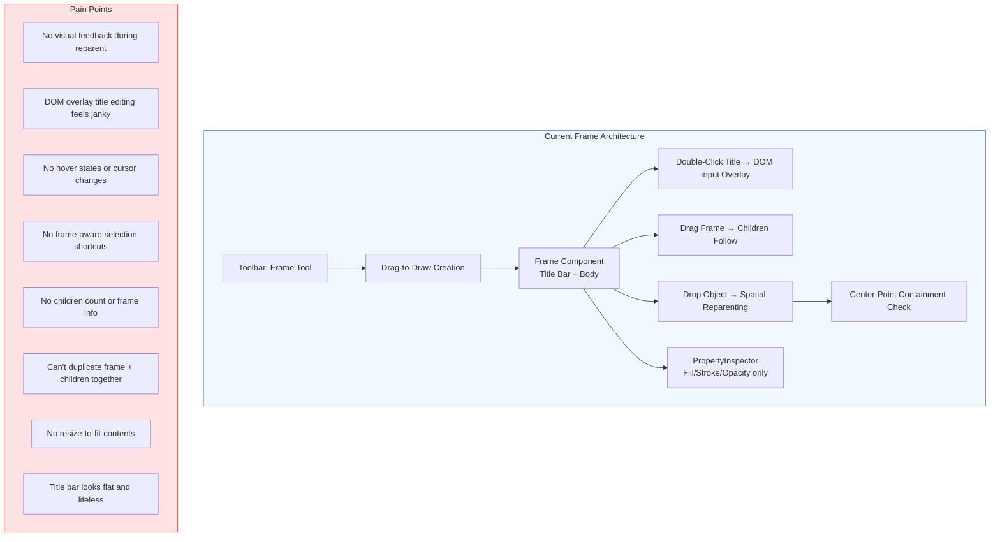
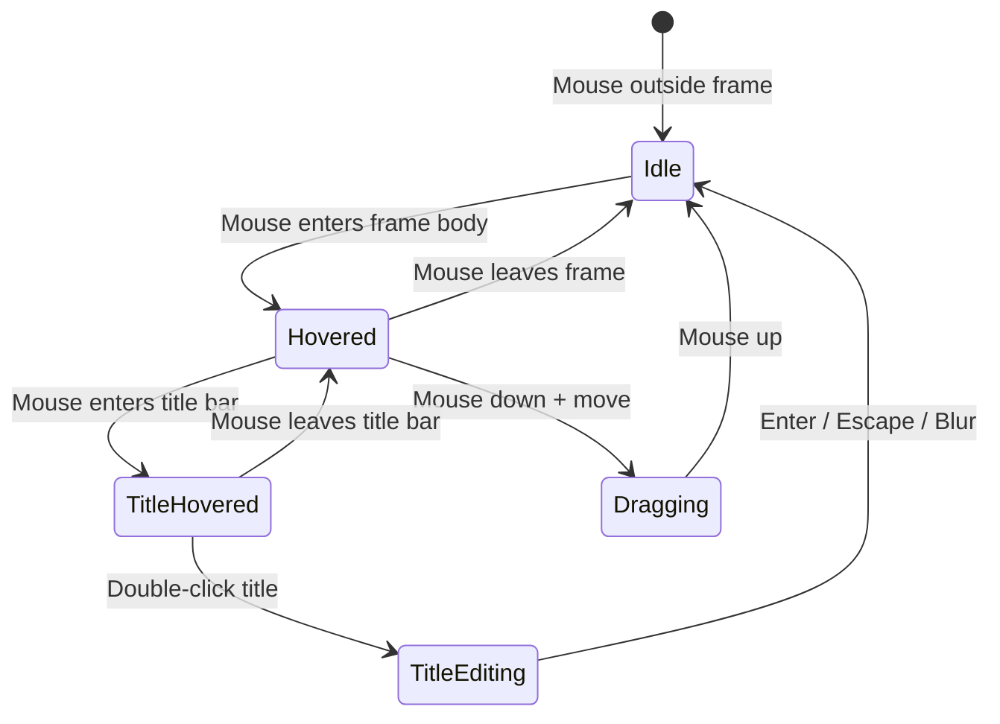
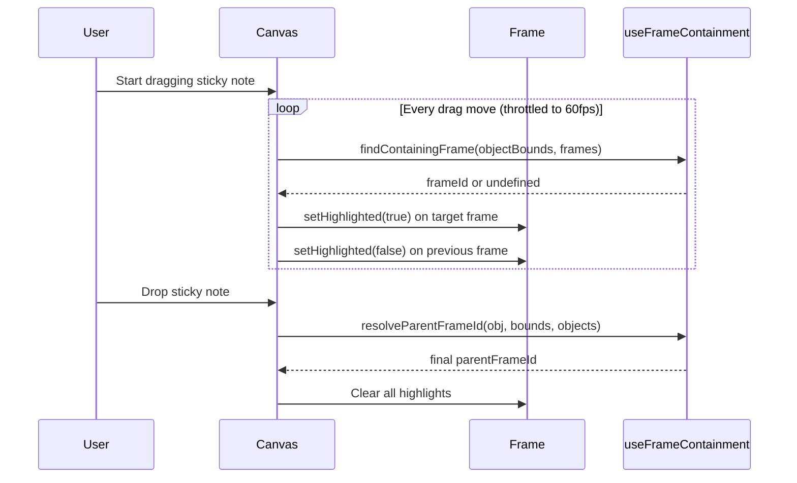
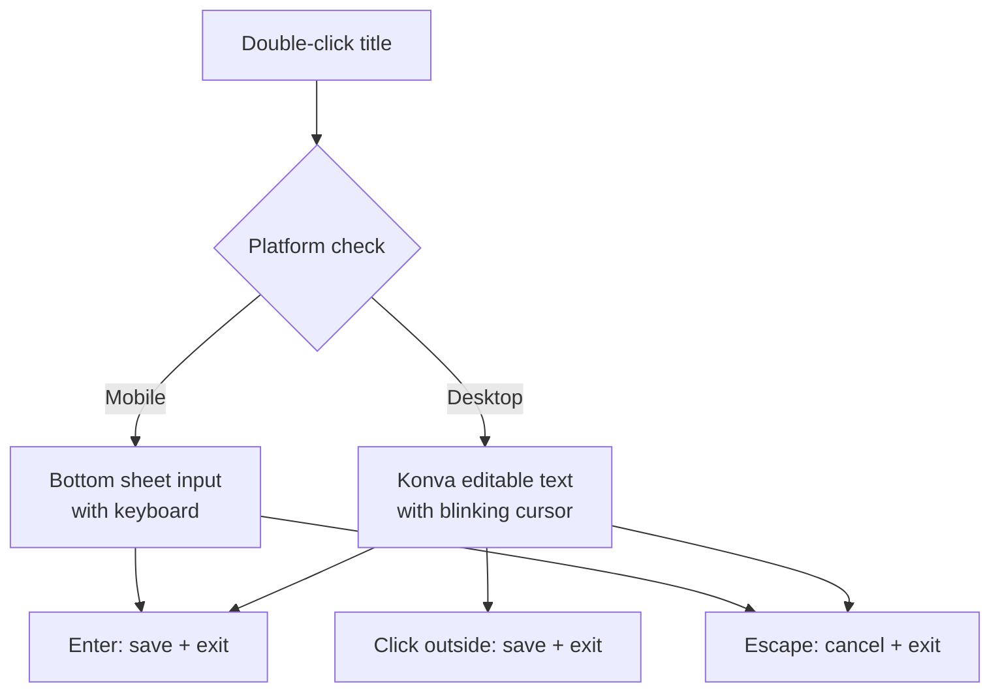
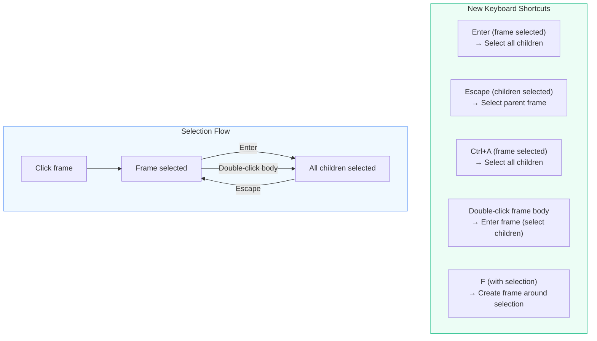
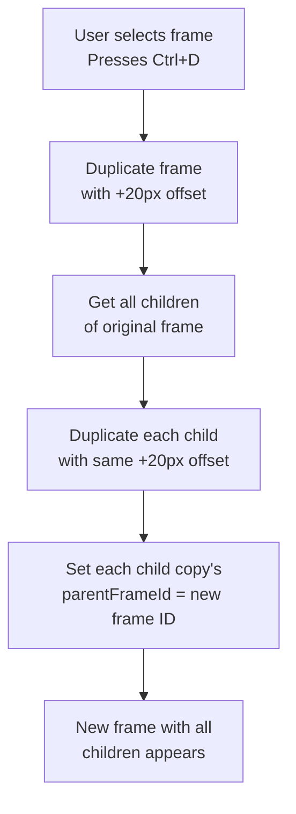
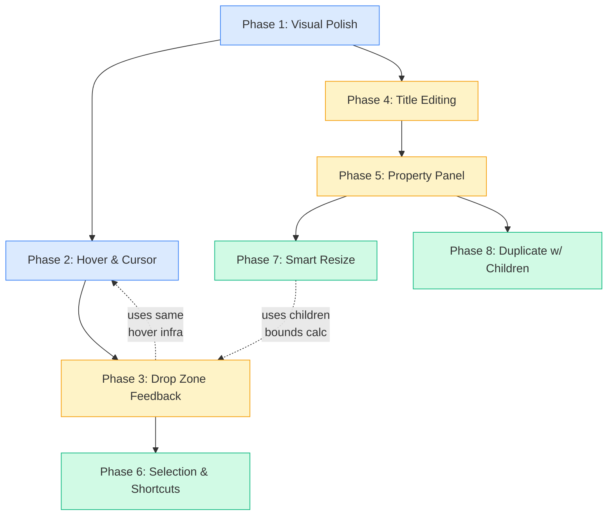

# Frame Tool UX Overhaul Plan

**Goal:** Transform the Frame tool from a functional-but-clunky container into a polished, intuitive grouping experience that feels as good as Figma or FigJam.

**Current state:** The Frame tool works — you can create, rename, drag, resize, delete, and reparent children. But every interaction has friction: no visual feedback during reparenting, clunky title editing, no frame-aware selection shortcuts, no hover cues, and the property panel treats frames like generic shapes.

---

## Architecture Overview



---

## The Plan: 8 Phases

```mermaid
graph LR
    P1["Phase 1<br/>Visual Polish"] --> P2["Phase 2<br/>Hover & Cursor"]
    P2 --> P3["Phase 3<br/>Drop Zone Feedback"]
    P3 --> P4["Phase 4<br/>Title Editing"]
    P4 --> P5["Phase 5<br/>Property Panel"]
    P5 --> P6["Phase 6<br/>Selection & Shortcuts"]
    P6 --> P7["Phase 7<br/>Smart Resize"]
    P7 --> P8["Phase 8<br/>Duplicate with Children"]

    style P1 fill:#dbeafe,stroke:#3b82f6
    style P2 fill:#dbeafe,stroke:#3b82f6
    style P3 fill:#fef3c7,stroke:#f59e0b
    style P4 fill:#fef3c7,stroke:#f59e0b
    style P5 fill:#fef3c7,stroke:#f59e0b
    style P6 fill:#d1fae5,stroke:#10b981
    style P7 fill:#d1fae5,stroke:#10b981
    style P8 fill:#d1fae5,stroke:#10b981
```



**Legend:** Blue = visual/cosmetic (low risk), Yellow = interaction changes (medium risk), Green = new features (higher risk)

---

## Phase 1: Visual Polish

**Goal:** Make the frame look premium without changing any behavior.

### Current vs Proposed

```
CURRENT                              PROPOSED
┌──────────────────────────┐         ┌──────────────────────────┐
│  Frame                   │ flat    │ ▸ Design System    (3)   │ title with icon,
├──────────────────────────┤ header  ├──────────────────────────┤ child count badge,
│                          │ dashed  │                          │ subtle gradient
│      (dashed border,     │ border  │                          │ on title bar
│       no personality)    │         │                          │
│                          │         │                          │
└──────────────────────────┘         └──────────────────────────┘
                                      softer border, subtle
                                      background pattern
```

### Changes

| File | Change | Detail |
|------|--------|--------|
| `Frame.tsx` | Title bar gradient | Replace flat `#f1f5f9` with subtle gradient (`#f8fafc` → `#f1f5f9`). Use Konva `fillLinearGradientStartPoint`/`EndPoint`. |
| `Frame.tsx` | Child count badge | Show `(N)` after title text when frame has children. Derive from store selector `selectFrameChildren(id)`. |
| `Frame.tsx` | Collapse icon | Add a small `▸` / `▾` chevron before the title text (render-only for now, expand/collapse is Phase 7+). |
| `Frame.tsx` | Softer body stroke | Change default dash from `[4, 4]` to `[8, 4]` — longer dashes feel less "construction zone". Reduce default stroke opacity. |
| `Frame.tsx` | Selection glow | When selected, add a subtle outer glow (Konva shadow with `blur: 8, opacity: 0.3`) instead of just changing stroke color. |
| `Frame.tsx` | Corner radius bump | Increase from 6px → 8px for a softer, more modern feel. |

### Verification
- Visual regression: screenshot before/after
- No behavior changes — all existing tests pass

---

## Phase 2: Hover & Cursor Feedback

**Goal:** The frame should feel alive — hover states, cursor changes, and visual affordances.



### Changes

| File | Change | Detail |
|------|--------|--------|
| `Frame.tsx` | Hover detection | Add `onMouseEnter` / `onMouseLeave` on the Group. Set `isHovered` local state. |
| `Frame.tsx` | Hover visual | On hover: title bar lightens slightly (`#f8fafc`), body stroke changes to `rgba(148, 163, 184, 0.6)` → `rgba(148, 163, 184, 1.0)`. Subtle but noticeable. |
| `Frame.tsx` | Title bar cursor | On title bar hover: set stage cursor to `text` (signals "double-click to edit"). On body hover: `move` cursor. |
| `Frame.tsx` | Resize edge cursors | When near frame edges (within 8px), set cursor to appropriate resize cursor (`nw-resize`, `ne-resize`, etc.). Coordinate with `TransformHandler`. |
| `Frame.tsx` | Tooltip on title | On title hover, after 800ms delay, show a tooltip: "Double-click to rename". Only shown once per session (localStorage flag). |

### Verification
- Manual test: hover frame body → stroke brightens
- Manual test: hover title → cursor changes to text cursor
- Manual test: hover edge → cursor changes to resize
- No performance regression (hover state is local, no store writes)

---

## Phase 3: Drop Zone Visual Feedback

**Goal:** When dragging an object, show which frame it will land in BEFORE dropping.

This is the single biggest UX improvement. Currently, reparenting happens silently on drag-end with zero visual feedback.



### Changes

| File | Change | Detail |
|------|--------|--------|
| `BoardCanvas.tsx` | Track hover-target frame during drag | In `onDragMove` handler for non-frame objects, call `findContainingFrame()` with current drag bounds. Store result as `dropTargetFrameId` state. Throttle to 16ms (60fps). |
| `BoardCanvas.tsx` | Pass `isDropTarget` prop to Frame | New boolean prop. True when this frame's ID matches `dropTargetFrameId`. |
| `Frame.tsx` | Drop target visual | When `isDropTarget === true`: title bar gets primary color tint (`rgba(59, 130, 246, 0.15)`), body border becomes solid (not dashed), stroke color becomes primary blue, subtle pulsing animation via Konva `Tween` or `Animation`. |
| `Frame.tsx` | "Drop here" label | When `isDropTarget`, show a small centered label in the body: "Drop to add" in muted text. Disappears on drop. |
| `BoardCanvas.tsx` | Clear on drag end | Set `dropTargetFrameId` to `null` on any drag end. |
| `useFrameContainment.ts` | No changes | Existing `findContainingFrame` already does exactly what we need. |

### Visual Spec

```
NORMAL FRAME                         DROP TARGET FRAME
┌──────────────────────────┐         ┌──────────────────────────┐
│  Design System     (3)   │         │  Design System     (3)   │ ← blue tint
├╌╌╌╌╌╌╌╌╌╌╌╌╌╌╌╌╌╌╌╌╌╌╌╌┤         ├──────────────────────────┤ ← solid border
│                          │         │                          │
│                          │         │      Drop to add         │ ← centered hint
│                          │         │                          │
└╌╌╌╌╌╌╌╌╌╌╌╌╌╌╌╌╌╌╌╌╌╌╌╌┘         └──────────────────────────┘
  dashed border                        solid blue border
```

### Verification
- Drag sticky toward frame → frame highlights before drop
- Drag sticky away → highlight clears
- Drag between two overlapping frames → smaller frame highlights (correct containment)
- Drop → reparenting works exactly as before
- Performance: throttled check, no jank on 50+ objects

---

## Phase 4: Title Editing Overhaul

**Goal:** Replace the janky DOM input overlay with an inline editing experience that feels native.

### Current Problems
1. DOM `<input>` created/destroyed on every edit — causes flash
2. Input positioned via `position: fixed` + manual transform math — drifts on zoom/pan
3. Single-line only — no multiline frame descriptions
4. No visual transition — frame title just disappears and an input appears
5. `className='sticky-note-edit-overlay'` reuses sticky note styles (wrong)

### Proposed: In-Place Konva Text Editing



### Changes

| File | Change | Detail |
|------|--------|--------|
| `Frame.tsx` | Replace DOM overlay approach | Instead of creating/appending a `<input>` to `document.body`, use a Konva `<Text>` node that becomes editable. On double-click: make the title Text node receive keyboard input via a hidden textarea technique (same pattern Konva's `TextPath` editing uses). |
| `Frame.tsx` | Edit mode visual | When editing: title bar background becomes white, text gets a subtle cursor blink (CSS animation on the hidden textarea, reflected to Konva), and a 1px bottom border appears under the text to signal edit mode. |
| `Frame.tsx` | Click-outside dismiss | Use `Stage.on('click')` listener during edit to detect clicks outside the title. Save and dismiss. |
| `Frame.tsx` | Keyboard handling | Enter → save. Escape → cancel (revert to previous text). Tab → save and select next frame's title (if any). |
| `Frame.tsx` | Clean up `attachOverlayRepositionLifecycle` | Remove the overlay reposition lifecycle — no longer needed since editing is canvas-native. |
| `lib/canvasTextEditOverlay.ts` | Audit usage | If only Frame used this pattern, consider removing the file. If StickyNote also uses it, leave it for now. |

### Alternative: Improved DOM Overlay
If the Konva-native approach proves too complex, improve the existing DOM overlay:
- Add enter/exit CSS transitions (`opacity: 0 → 1`, `transform: scale(0.98) → scale(1)`)
- Use a proper React portal instead of `document.body.appendChild`
- Add `frame-title-edit-overlay` CSS class with correct font metrics
- Use `ResizeObserver` to keep overlay aligned during canvas transforms

### Verification
- Double-click title → edit mode activates smoothly
- Type new title → text updates in real-time
- Enter → saves, returns to view mode
- Escape → cancels, reverts to previous title
- Zoom while editing → text stays aligned
- Pan while editing → text stays aligned
- Mobile: bottom sheet appears correctly

---

## Phase 5: Frame-Specific Property Panel

**Goal:** When a frame is selected, show frame-specific controls instead of generic shape properties.

### Current vs Proposed

```
CURRENT (generic)                    PROPOSED (frame-specific)
┌──────────────────────┐             ┌──────────────────────────┐
│ 1 object selected    │             │ Frame: Design System     │
│                      │             ├──────────────────────────┤
│ Fill  [____] [■]     │             │ Title  [Design System__] │
│ Stroke [____] [■]    │             │                          │
│ Stroke width [__]    │             │ Appearance               │
│ Opacity ────●── 100% │             │ Fill  [____] [■]         │
│                      │             │ Border [____] [■]  [2px] │
│                      │             │ Corner radius [8]        │
│                      │             │ Opacity ────●── 100%     │
│                      │             │                          │
│                      │             │ Contents                 │
│                      │             │ 3 children               │
│                      │             │ [Select All] [Resize     │
│                      │             │               to Fit]    │
└──────────────────────┘             └──────────────────────────┘
```

### Changes

| File | Change | Detail |
|------|--------|--------|
| `PropertyInspector.tsx` | Frame-specific section | When selection is a single frame, render a `FrameProperties` sub-component instead of the generic property grid. |
| `PropertyInspector.tsx` (new section) | Title input | Inline text input for the frame title — editable directly from the panel without double-clicking on canvas. Debounced save (300ms). |
| `PropertyInspector.tsx` (new section) | Children summary | Show child count with a "Select All Children" button. Clicking it sets `selectedIds` to all `parentFrameId === frameId` objects. |
| `PropertyInspector.tsx` (new section) | "Resize to Fit" button | Calculates bounding box of all children + padding, resizes frame to fit. |
| `PropertyInspector.tsx` (new section) | Corner radius input | Numeric input for corner radius (default 8). Stored as new field on `IBoardObject`. |
| `types/board.ts` | Add `cornerRadius?: number` | Optional field, defaults to 8 if undefined. |
| `PropertyInspector.tsx` | Section headers | Group properties under "Appearance" and "Contents" headers with subtle separators. |

### Verification
- Select frame → panel shows frame-specific controls
- Edit title in panel → updates on canvas in real-time
- Click "Select All Children" → all children selected
- Click "Resize to Fit" → frame resizes to contain all children with 20px padding
- Multi-select (frame + other) → falls back to generic properties

---

## Phase 6: Selection & Keyboard Shortcuts

**Goal:** Make frame interactions keyboard-driven for power users.



### Changes

| File | Change | Detail |
|------|--------|--------|
| `BoardCanvas.tsx` | Enter → select children | When a single frame is selected and Enter is pressed, set `selectedIds` to all children of that frame. |
| `BoardCanvas.tsx` | Escape → select parent | When selected objects all share the same `parentFrameId`, pressing Escape selects the parent frame instead of clearing selection. |
| `BoardCanvas.tsx` | Double-click frame body | Currently does nothing on body. Make it select all children (same as Enter). |
| `BoardCanvas.tsx` | F with selection → frame around | When objects are selected and F is pressed, create a new frame that bounds all selected objects (with 20px padding). Reparent all selected objects to the new frame. |
| `BoardCanvas.tsx` | Ctrl+A inside frame | When a frame is selected, Ctrl+A selects all its children instead of all canvas objects. |
| `Toolbar.tsx` | Update tooltip | Update Frame tooltip: "Frame (F) — select objects first to frame them" |

### Verification
- Select frame → Enter → children selected
- Select children → Escape → parent frame selected
- Select 3 stickies → F → frame created around them, stickies reparented
- Inside frame context → Ctrl+A → only frame children selected

---

## Phase 7: Smart Resize

**Goal:** Frame can auto-resize to fit contents, and shows resize affordances.

### Changes

| File | Change | Detail |
|------|--------|--------|
| `Frame.tsx` | Min size constraints | Enforce minimum 100x80 during resize. Prevent resizing smaller than children bounding box. |
| `Frame.tsx` | Auto-resize on child add | When a child is reparented into the frame and falls outside current bounds, expand frame to fit (with 20px padding). Animate the expansion with Konva `Tween` (200ms ease-out). |
| `Frame.tsx` | Resize handles on hover | Show subtle resize dots at corners and edge midpoints on hover (even when not selected). 6px circles, semi-transparent, become opaque on hover. |
| `useFrameContainment.ts` | `getChildrenBounds()` | New function: compute the bounding box of all children of a frame. Returns `{ x, y, width, height }`. |
| `BoardCanvas.tsx` | "Fit to Contents" (context menu) | Right-click frame → "Fit to Contents" option. Resizes frame to children bounding box + 20px padding. |

### Verification
- Drop object outside frame bounds → frame expands smoothly
- Right-click → "Fit to Contents" → frame shrinks/grows to fit
- Try to resize frame smaller than children → constrained
- Resize animation is smooth (60fps)

---

## Phase 8: Duplicate Frame with Children

**Goal:** Duplicating or copy/pasting a frame brings all its children along.

### Current behavior
Duplicate strips `parentFrameId` from children. Children are NOT duplicated with the frame. Users must manually re-select and duplicate children, then drag them into the new frame.

### Proposed behavior



### Changes

| File | Change | Detail |
|------|--------|--------|
| `useCanvasOperations.ts` | Frame-aware duplicate | When duplicating a frame: (1) duplicate the frame, (2) get all children, (3) duplicate each child with same offset, (4) set `parentFrameId` on child copies to new frame's ID. |
| `useCanvasOperations.ts` | Frame-aware copy/paste | Same logic for paste. When pasting a frame, include its children in the paste payload. |
| `useCanvasOperations.ts` | Selection after duplicate | After duplicating frame + children, select only the new frame (not the children). |

### Verification
- Duplicate frame with 3 children → new frame appears with 3 children
- Copy frame → paste → frame + children pasted together
- Children have correct `parentFrameId` pointing to new frame
- Children positions are offset correctly relative to new frame

---

## Implementation Priority & Dependencies

```mermaid
gantt
    title Frame UX Overhaul - Implementation Order
    dateFormat X
    axisFormat %s

    section Foundation
    Phase 1 - Visual Polish           :p1, 0, 3
    Phase 2 - Hover & Cursor          :p2, 3, 5

    section Core UX
    Phase 3 - Drop Zone Feedback      :p3, 5, 9
    Phase 4 - Title Editing           :p4, 5, 8
    Phase 5 - Property Panel          :p5, 8, 11

    section Power Features
    Phase 6 - Selection & Shortcuts   :p6, 9, 12
    Phase 7 - Smart Resize            :p7, 11, 14
    Phase 8 - Duplicate w/ Children   :p8, 11, 13
```



### Dependency Graph



---

## Files Touched Per Phase

| Phase | Files Modified | Files Created |
|-------|---------------|--------------|
| 1 | `Frame.tsx`, `objectsStore.ts` | — |
| 2 | `Frame.tsx` | — |
| 3 | `BoardCanvas.tsx`, `Frame.tsx` | — |
| 4 | `Frame.tsx` | `lib/konvaTextEdit.ts` (if Konva-native approach) |
| 5 | `PropertyInspector.tsx`, `types/board.ts` | `components/canvas/FrameProperties.tsx` |
| 6 | `BoardCanvas.tsx`, `Toolbar.tsx` | — |
| 7 | `Frame.tsx`, `useFrameContainment.ts`, `BoardCanvas.tsx` | — |
| 8 | `useCanvasOperations.ts` | — |

---

## Risk Assessment

| Phase | Risk | Mitigation |
|-------|------|-----------|
| 1 | Low | Pure visual changes, no behavior impact |
| 2 | Low | Local state only, no store writes |
| 3 | Medium | Drag performance — throttle containment checks to 16ms, skip if drag delta < 5px |
| 4 | Medium | Konva text editing is tricky — have DOM overlay fallback ready |
| 5 | Low | Additive UI, doesn't break existing property inspector |
| 6 | Medium | Keyboard shortcuts may conflict — audit existing bindings first |
| 7 | Medium | Auto-resize could fight with user intent — make it opt-in via button, not automatic |
| 8 | Low | Well-defined logic, existing patterns in codebase |

---

## Success Metrics

After all 8 phases, the Frame tool should feel like:

1. **Discoverable** — hover states and cursors tell you what's possible without reading docs
2. **Responsive** — drop zone highlighting gives instant feedback during drag
3. **Efficient** — keyboard shortcuts (Enter/Escape/F) eliminate unnecessary clicking
4. **Informative** — child count, property panel, and selection context keep you oriented
5. **Complete** — duplicate/paste brings children along, resize-to-fit keeps frames tidy
6. **Smooth** — transitions and animations make every interaction feel polished

The bar: a new user should be able to create a frame, drag objects into it, rename it, and move it with its contents — all without any instruction.
