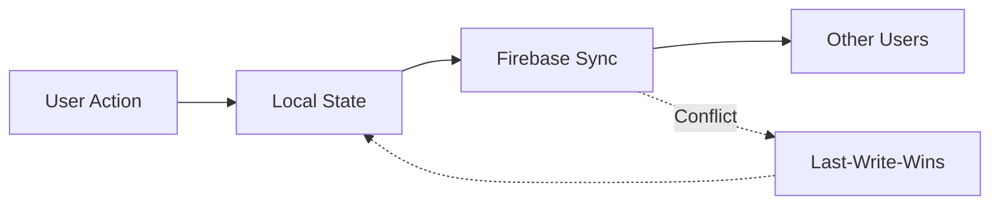

# CollabBoard

A real-time collaborative whiteboard application inspired by Miro, enabling multiple users to brainstorm, map ideas, and run workshops simultaneously. Built with an AI-first development approach.


## Features

### Core Whiteboard

- **Infinite Canvas** — Smooth pan and zoom at 60 FPS
- **Sticky Notes** — Create, edit text, and change colors
- **Shapes** — Rectangles, circles, and lines with customizable colors
- **Connectors** — Lines and arrows linking objects together
- **Text Elements** — Standalone text labels
- **Frames** — Group and organize content areas
- **Transforms** — Move, resize, and rotate objects
- **Selection** — Single and multi-select (shift-click, drag-to-select)
- **Operations** — Delete, duplicate, copy/paste

### Real-Time Collaboration

- **Multiplayer Cursors** — See other users' cursors with name labels in real-time
- **Presence Awareness** — Know who's currently on the board
- **Instant Sync** — Object changes appear for all users (<100ms latency)
- **Conflict Resolution** — Last-write-wins with optimistic updates
- **Resilience** — Graceful disconnect/reconnect handling
- **Persistence** — Board state survives all users leaving and returning

### AI Board Agent

Natural language commands to manipulate the board:

- **Creation** — "Add a yellow sticky note that says 'User Research'"
- **Manipulation** — "Move all pink sticky notes to the right side"
- **Layout** — "Arrange these sticky notes in a grid"
- **Complex** — "Create a SWOT analysis template with four quadrants"

## Tech Stack

| Layer | Technology |
| ------- | ------------ |
| **Backend** | Firebase (Firestore, Realtime DB, Auth) |
| **Frontend** | React 19 + Vite + Bun + TypeScript |
| **UI Components** | Shadcn/ui + Tailwind CSS v4 |
| **Canvas** | Konva.js |
| **AI Integration** | Groq (free tier, default) or Kimi 2.5 via Nvidia API |
| **Deployment** | Netlify |
| **Testing** | Vitest + Playwright |
| **Linting** | ESLint + Prettier |

## Prerequisites

- [Bun](https://bun.sh/) v1.0+ (recommended) or Node.js v20+
- [Git](https://git-scm.com/)
- Firebase account
- Groq API key (free at [console.groq.com](https://console.groq.com)) or Nvidia API key (for Kimi 2.5)

## Setup

### 1. Clone the Repository

```bash
git clone https://github.com/MichaelHabermas/CollabBoard.git
cd CollabBoard
```

### 2. Install Dependencies

```bash
bun install
```

### 3. Configure Environment Variables

Create a `.env` file in the project root:

```env
# Firebase Configuration
VITE_FIREBASE_API_KEY=your_api_key
VITE_FIREBASE_AUTH_DOMAIN=your_project.firebaseapp.com
VITE_FIREBASE_PROJECT_ID=your_project_id
VITE_FIREBASE_STORAGE_BUCKET=your_project.appspot.com
VITE_FIREBASE_MESSAGING_SENDER_ID=your_sender_id
VITE_FIREBASE_APP_ID=your_app_id
VITE_FIREBASE_DATABASE_URL=https://your_project.firebaseio.com

# AI: Groq (recommended, free) or NVIDIA. Production: set GROQ_API_KEY or NVIDIA_API_KEY in Netlify.
VITE_AI_PROVIDER=groq
VITE_GROQ_API_KEY=your_groq_api_key
# VITE_NVIDIA_API_KEY=your_nvidia_api_key
```

### 4. Firebase Setup

1. Create a new project at [Firebase Console](https://console.firebase.google.com/)
2. Enable **Authentication** (Email/Password and Google providers)
3. Create a **Firestore Database** in production mode
4. Create a **Realtime Database** for presence/cursors
5. Copy your config values to the `.env` file

### 5. Start Development Server

```bash
bun run dev
```

The app will be available at `http://localhost:5173`

## Usage

### Getting Started

1. **Sign Up / Login** — Create an account or sign in with Google
2. **Create a Board** — Start a new whiteboard or join an existing one
3. **Invite Collaborators** — Share the board link with teammates
4. **Start Creating** — Use the toolbar to add sticky notes, shapes, and more

### Keyboard Shortcuts

| Action | Shortcut |
| ------- | ---------- |
| Pan | Click + Drag (on empty space) |
| Zoom | Scroll wheel |
| Select | Click on object |
| Multi-select | Shift + Click / Drag selection box |
| Delete | Delete / Backspace |
| Duplicate | Ctrl/Cmd + D |
| Copy | Ctrl/Cmd + C |
| Paste | Ctrl/Cmd + V |

### AI Commands

Open the AI chat panel and type natural language commands:

```bash
"Add a blue sticky note with 'Meeting Notes'"
"Create a 3x3 grid of sticky notes"
"Move all rectangles to the left"
"Build a user journey map with 5 stages"
"Create a retrospective board with three columns"
```

## Project Structure

```bash
CollabBoard/
├── src/
│   ├── modules/
│   │   ├── auth/        # Authentication logic
│   │   ├── sync/        # Real-time synchronization
│   │   ├── canvas/      # Konva.js canvas rendering
│   │   ├── ai/          # AI agent integration
│   │   └── ui/          # UI utilities
│   ├── components/      # React components
│   └── types/           # TypeScript type definitions
├── docs/
│   └── research/        # Design documents and research
├── public/              # Static assets
└── tests/               # Test files
```

## Scripts

```bash
# Development
bun run dev          # Start dev server
bun run build        # Build for production
bun run preview      # Preview production build

# Testing
bun run test         # Run unit tests
bun run test:e2e     # Run end-to-end tests
bun run test:coverage # Run tests with coverage

# Linting
bun run lint         # Run ESLint
bun run format       # Format with Prettier
```

## Architecture

CollabBoard follows a modular architecture with SOLID principles:

- **Single Responsibility** — Each module handles one concern
- **Open-Closed** — Extend via interfaces without modifying core
- **Liskov Substitution** — Substitutable objects (e.g., shapes)
- **Interface Segregation** — Minimal, focused interfaces
- **Dependency Inversion** — Dependencies injected via constructors

### Data Flow



## Performance Targets

| Metric | Target |
| ------- | ------- |
| Frame rate | 60 FPS during pan, zoom, manipulation |
| Object sync latency | <100ms |
| Cursor sync latency | <50ms |
| Object capacity | 500+ objects |
| Concurrent users | 5+ without degradation |

## Contributing

1. Fork the repository
2. Create a feature branch from `dev`: `git checkout -b feature/your-feature`
3. Make your changes with descriptive commits
4. Write tests for new functionality
5. Run tests and linting: `bun run test && bun run lint`
6. Submit a pull request to `dev`

## License

This project is licensed under the MIT License — see the [LICENSE](LICENSE) file for details.

## Acknowledgments

- [Miro](https://miro.com/) for inspiration
- [Konva.js](https://konvajs.org/) for the canvas library
- [Firebase](https://firebase.google.com/) for real-time infrastructure
- [Shadcn/ui](https://ui.shadcn.com/) for beautiful UI components
