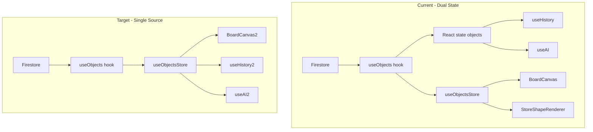

# State Management Improvements — Orchestration Plan

## Document Overview

This plan implements the ranked improvements from the Firestore/Zustand deep-dive report. It unifies board object state into a single source of truth (Zustand), standardizes high-frequency update paths, adds pagination and incremental sync for large boards, and reduces unnecessary O(n) work so the app meets performance and collaboration goals.

### Key Objectives

- **Single source of truth:** Zustand (`useObjectsStore`) is the canonical store for board objects; useHistory and useAI read from it. No duplicate React state in useObjects.
- **Consistent update path:** One `queueObjectUpdate(id, updates)` used by PropertyInspector, drag handlers, and other high-freq callers; every path updates Zustand and queues Firestore writes the same way.
- **Scalability:** Paginated initial load and delta subscriptions for large boards (e.g. 500+ objects); avoid full-list iterations where a change set suffices.
- **Orchestrated execution:** Follow the [orchestrate skill](.claude/skills/orchestrate/SKILL.md) with waves, worktrees, E2E-first where applicable, and review loops. All work tracked in [.claude/tasks.md](.claude/tasks.md).
- Support real-time collaboration with low-latency updates.
- Ensure modular design following SOLID principles:
  - **Single Responsibility Principle (SRP)**: Each class/module handles one concern (e.g., state management vs. rendering).
  - **Open-Closed Principle (OCP)**: Extendable without modifying core classes (e.g., via interfaces for repositories).
  - **Liskov Substitution Principle (LSP)**: Subclasses (e.g., FirestoreRepo) interchangeable with base interfaces.
  - **Interface Segregation Principle (ISP)**: Small, focused interfaces (e.g., IBoardRepository only exposes CRUD methods).
  - **Dependency Inversion Principle (DIP)**: High-level modules depend on abstractions (e.g., BoardManager injects repository interface).

### Assumptions

- Existing architecture: React-Konva canvas, Zustand stores, Firebase Firestore persistence, useObjects as subscription + CRUD orchestrator.
- [docs/CONSTITUTION.md](docs/CONSTITUTION.md) is inviolable: Articles I–VIII (original) plus Articles IX–XIX (state management amendment). See the [reviewer checklist](docs/STATE-MGMT-REVIEWER-CHECKLIST.md) for per-PR compliance.
- Epic 4 in [STATE-IMPROVEMENT-PLAN](docs/STATE-IMPROVEMENT-PLAN.md) defines pagination/delta and type-guard hardening; this plan aligns with Epic 4 Sub-Tasks 3–4 and extends into state unification.
- Existing app uses Konva.js for rendering.
- Firebase project is set up (Firestore and RTDB enabled).
- TypeScript is used for implementation.
- App supports zooming, panning, and basic shapes (rect, circle, text, line).

### Scope

- **In:** Unifying to Zustand as single source; standardizing queueObjectUpdate; pagination and delta sync in useObjects; optimizing applyIncrementalChanges and BoardCanvas conversions; applyChanges in objectsStore; aligning createObjectsBatch with createObject.
- **Out:** New shape types, new Firebase products, auth changes, or changes that violate the Constitution.

### Success Metrics

- `bun run validate` and `bun run release:gate` pass.
- Performance: <500ms sync, 1000-element batch <3s (existing metrics).
- No regression in undo/redo, AI tools, or real-time collaboration.

---

## Context

This plan follows the [orchestrate skill](.claude/skills/orchestrate/SKILL.md) and [STATE-IMPROVEMENT-PLAN](docs/STATE-IMPROVEMENT-PLAN.md) Epic 4 structure. Tasks are added to [.claude/tasks.md](.claude/tasks.md); execution order respects dependencies between waves.

---

## Architecture (Current vs Target)

---

## Epics and Breakdown (Waves)

Tasks are executed in wave order. Each wave has a goal, user stories, features, and a task table with checkboxes. Mark tasks done by changing `[ ]` to `[x]` in the Done column.

### Wave 1 — Quick Wins (No Dependencies)

**Goal:** Fix connector-creation consistency and establish a single high-frequency update path so that PropertyInspector and text/drag handlers never bypass the store or write inconsistently to Firestore.

**User Stories:**

- As a developer, I want `createObjectsBatch` to use the same optional-field logic as `createObject` so that connectors and batch-created shapes have consistent fields and no creation bugs.
- As a developer, I want one `queueObjectUpdate(id, updates)` used everywhere for high-frequency edits so that Zustand and Firestore stay in sync and history/AI never see stale state.

**Features:**

- Align batch creation with single-object creation in objectService (conditional assignment for text, stroke, fromObjectId, toObjectId, fromAnchor, toAnchor, cornerRadius).
- Single `queueObjectUpdate(id, updates)` used by PropertyInspector, useObjectDragHandlers.handleTextChange, and other high-freq callers; remove PropertyInspector’s direct `queueUpdate` and `useObjectsStore.updateObject` bypass.

**Sub-Tasks (task table below):** S1 (align createObjectsBatch), S2 (standardize high-frequency update path).

| Done | ID     | Title                                      | Tier   | Role        | Description                                                                                                                                                                                                                                                                                           |
| ---- | ------ | ------------------------------------------ | ------ | ----------- | ----------------------------------------------------------------------------------------------------------------------------------------------------------------------------------------------------------------------------------------------------------------------------------------------------- |
| [x]  | **S1** | Align createObjectsBatch with createObject | haiku  | quick-fixer | In [objectService.ts](src/modules/sync/objectService.ts), make `createObjectsBatch` use the same optional-field logic as `createObject` (conditional assignment for text, stroke, fromObjectId, toObjectId, fromAnchor, toAnchor, cornerRadius). Prevents connector creation bugs.                    |
| [x]  | **S2** | Standardize high-frequency update path     | sonnet | architect   | Introduce single `queueObjectUpdate(id, updates)` used by PropertyInspector, useObjectDragHandlers.handleTextChange, and any other high-freq callers. Ensure it updates Zustand + queueWrite consistently. Remove PropertyInspector's direct `queueUpdate` and `useObjectsStore.updateObject` bypass. |

### Wave 2 — Epic 4 Alignment (Parallel)

**Goal:** Support large boards with paginated initial load and delta subscriptions, and reduce O(n) work in applyIncrementalChanges so that sync and UI stay fast as object count grows.

**User Stories:**

- As a user with a large board (500+ objects), I want initial load to be paginated so that the app becomes interactive quickly.
- As a developer, I want incremental changes applied via a change set over a working map so that we avoid mapping over the full object list on every update.

**Features:**

- Paginated fetch (`fetchObjectsPaginated`) for initial load when count exceeds threshold (e.g. 500); `subscribeToDeltaUpdates` for incremental sync after paginated load; `subscribeToObjectsWithChanges` fallback for small boards (Epic 4 Sub-Tasks 3–4).
- Refactor `applyIncrementalChanges` to build `nextObjects` from `workingById` + change set instead of mapping over full `prevObjects`.

**Sub-Tasks (task table below):** S3 (wire pagination), S4 (optimize applyIncrementalChanges).

| Done | ID     | Title                            | Tier   | Role      | Description                                                                                                                                                                                                                                                                                            |
| ---- | ------ | -------------------------------- | ------ | --------- | ------------------------------------------------------------------------------------------------------------------------------------------------------------------------------------------------------------------------------------------------------------------------------------------------------ |
| [x]  | **S3** | Wire pagination for large boards | sonnet | architect | In [useObjects.ts](src/hooks/useObjects.ts), use `fetchObjectsPaginated` for initial load when object count exceeds threshold (e.g. 500). Use `subscribeToDeltaUpdates` for incremental sync after paginated load. Add `subscribeToObjectsWithChanges` fallback for small boards. Epic 4 Sub-Task 3–4. |
| [x]  | **S4** | Optimize applyIncrementalChanges | sonnet | architect | In [useObjects.ts](src/hooks/useObjects.ts), refactor `applyIncrementalChanges` to build `nextObjects` from `workingById` + change set instead of mapping over full `prevObjects`. Reduces O(n) iterations for large boards.                                                                           |

### Wave 3 — Major Refactor (Depends on S2)

**Goal:** Make Zustand the single source of truth per Constitution Article I: remove React state `objects` from useObjects; useHistory and useAI read from useObjectsStore (or thin wrapper). useObjects retains only subscription wiring, CRUD handlers, and optimistic update orchestration. Consolidate incremental store updates to reduce index rebuilds.

**User Stories:**

- As a developer, I want useHistory and useAI to read from the same store as the canvas so that undo/redo and AI tools never operate on stale or divergent state.
- As a developer, I want applyChanges(changes) in the store so that adds/updates/deletes are applied in one store update and we avoid multiple index rebuilds.

**Features:**

- Remove React state `objects` from useObjects; useHistory and useAI read from useObjectsStore or thin wrapper; useObjects keeps subscription wiring, CRUD handlers, optimistic update orchestration.
- Add `applyChanges(changes)` to objectsStore that handles adds/updates/deletes in one store update; useObjects calls it instead of separate deleteObjects + setObjects.

**Sub-Tasks (task table below):** S5 (unify to Zustand), S6 (consolidate incremental store updates).

| Done | ID     | Title                                      | Tier   | Role      | Description                                                                                                                                                                                                                                                                                                 |
| ---- | ------ | ------------------------------------------ | ------ | --------- | ----------------------------------------------------------------------------------------------------------------------------------------------------------------------------------------------------------------------------------------------------------------------------------------------------------- |
| [ ]  | **S5** | Unify to Zustand as single source of truth | opus   | architect | Remove React state `objects` from useObjects. Make useHistory and useAI read from `useObjectsStore` (or thin wrapper). useObjects keeps only: subscription wiring, CRUD handlers, optimistic update orchestration. Zustand becomes canonical per Constitution Article I. Depends on S2 (standardized path). |
| [ ]  | **S6** | Consolidate incremental store updates      | sonnet | architect | Add `applyChanges(changes)` to [objectsStore.ts](src/stores/objectsStore.ts) that handles adds/updates/deletes in one store update. useObjects calls it instead of separate `deleteObjects` + `setObjects`. Reduces index rebuilds. Can be done with or after S5.                                           |

### Wave 4 — Optimizations (Depends on S5)

**Goal:** After unification, avoid O(n) conversions in BoardCanvas and hooks by passing objectsRecord or derived structure and using selectors where possible.

**User Stories:**

- As a developer, I want BoardCanvas and hooks to receive the object record or derived structure so that we avoid `Object.values(objectsRecord)` on every update and keep render cost predictable.

**Features:**

- BoardCanvas and hooks receive `objectsRecord` or derived structure; avoid full-array conversion on every update; use selectors where possible.

**Sub-Tasks (task table below):** S7 (reduce O(n) conversions in BoardCanvas).

| Done | ID     | Title                                  | Tier   | Role      | Description                                                                                                                                                                                              |
| ---- | ------ | -------------------------------------- | ------ | --------- | -------------------------------------------------------------------------------------------------------------------------------------------------------------------------------------------------------- |
| [ ]  | **S7** | Reduce O(n) conversions in BoardCanvas | sonnet | architect | After S5, BoardCanvas and hooks receive `objectsRecord` or derived structure. Avoid `Object.values(objectsRecord)` on every update. Pass record to consumers that need it; use selectors where possible. |

---

## Phase 1: Decompose — Task Summary

Tasks above are added to [.claude/tasks.md](.claude/tasks.md). Execution order: Wave 1 → Wave 2 (S3, S4 parallel) → Wave 3 (after S2) → Wave 4 (after S5).

---

## Phase 2: E2E First

For user-visible behavior, write acceptance tests before implementation:

| Task   | E2E Focus                                                                                     |
| ------ | --------------------------------------------------------------------------------------------- |
| **S2** | Property change (color, text) propagates to store and Firestore; no stale state in history/AI |
| **S3** | Large board (e.g. 600 objects) loads in batches; incremental updates merge correctly          |
| **S5** | Undo/redo, AI tools, and canvas rendering all reflect same state after edits                  |

**Process:** Create worktree `test-<feature>`, spawn tester agent to write Playwright/E2E tests, merge test branch before implementation.

---

## Phase 3: Parallel Execute

**Max 3 concurrent agents.**

1. **First batch:** S1 (quick-fixer), S2 (architect), S3 (architect) — S1 and S3 are independent; S2 blocks S5.
2. **Second batch:** S4 (architect) — independent.
3. **Third batch:** S5 (architect) — after S2 done.
4. **Fourth batch:** S6, S7 — after S5 done.

---

## Phase 4: Review Loop

For each task marked `review` in tasks.md:

1. Spawn **reviewer** agent (sonnet)
2. Reviewer runs `bun run validate` and reads diff
3. Approve → merge worktree, mark done
4. Reject → feedback in tasks.md → re-spawn agent (max 3 retries)
5. 3 rejections → escalate to user

---

## Phase 5: Merge and Validate

1. Merge completed worktrees: `bun run scripts/worktree-manager.ts merge <name>`
2. Run `bun run release:gate` from main worktree
3. If gate fails → create fix tasks, loop to Phase 3

---

## Key Files

| File                                                                                       | Changes                                                                         |
| ------------------------------------------------------------------------------------------ | ------------------------------------------------------------------------------- |
| [src/hooks/useObjects.ts](src/hooks/useObjects.ts)                                         | Remove React state (S5), pagination (S3), optimize applyIncrementalChanges (S4) |
| [src/stores/objectsStore.ts](src/stores/objectsStore.ts)                                   | Add applyChanges (S6)                                                           |
| [src/modules/sync/objectService.ts](src/modules/sync/objectService.ts)                     | Align createObjectsBatch (S1)                                                   |
| [src/components/canvas/PropertyInspector.tsx](src/components/canvas/PropertyInspector.tsx) | Use queueObjectUpdate (S2)                                                      |
| [src/hooks/useObjectDragHandlers.ts](src/hooks/useObjectDragHandlers.ts)                   | Use queueObjectUpdate for text (S2)                                             |
| [src/hooks/useHistory.ts](src/hooks/useHistory.ts)                                         | Read from Zustand (S5)                                                          |
| [src/hooks/useAI.ts](src/hooks/useAI.ts)                                                   | Read from Zustand (S5)                                                          |
| [src/components/canvas/BoardCanvas.tsx](src/components/canvas/BoardCanvas.tsx)             | Remove deprecated objects prop, optimize conversions (S7)                       |

---

## Risks and Mitigations

- **S5 (Unify):** Large refactor; do after S2 to reduce surface area. E2E tests guard behavior.
- **S3 (Pagination):** Firestore composite index required for `where('updatedAt', '>', ts) + orderBy('updatedAt')`. Document in migration notes.
- **Constitution:** Article V forbids deleting Zustand stores; we extend, not remove. Article I requires single canonical store — S5 achieves this.

---

## Success Criteria

- `bun run validate` passes
- `bun run release:gate` passes
- Performance: <500ms sync, 1000-element batch <3s (existing metrics)
- No regression in undo/redo, AI tools, or real-time collaboration

---

## Implementation Roadmap

1. **Decompose:** Ensure all waves (S1–S7) are represented in [.claude/tasks.md](.claude/tasks.md) with correct dependencies and roles.
2. **E2E first:** For S2, S3, S5 create test worktrees and add Playwright/E2E tests before implementation.
3. **Execute in batches:** First batch (S1, S2, S3) → second (S4) → third (S5) → fourth (S6, S7). Max 3 concurrent agents.
4. **Review:** For each task in `review`, spawn reviewer; approve → merge worktree and mark done; reject → feedback and retry (max 3).
5. **Merge and validate:** Merge worktrees via worktree-manager; run `bun run release:gate`; if gate fails, create fix tasks and return to execution.

