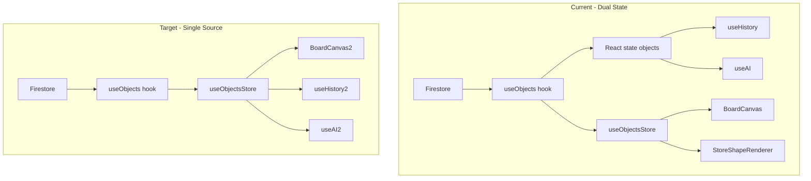

# State Management Improvements — Orchestration Plan

## Context

This plan implements the ranked improvements from the Firestore/Zustand deep-dive report. It follows the [orchestrate skill](.claude/skills/orchestrate/SKILL.md) and [STATE-IMPROVEMENT-PLAN](docs/STATE-IMPROVEMENT-PLAN.md) Epic 4 structure.

## Architecture (Current vs Target)

---

## Phase 1: Decompose — Task Breakdown

Tasks will be added to [.claude/tasks.md](.claude/tasks.md). Execution order respects dependencies.

### Wave 1 — Quick Wins (No Dependencies)

| Done   | ID     | Title                                      | Tier   | Role        | Description                                                                                                                                                                                                                                                                                           |
| ------ | ------ | ------------------------------------------ | ------ | ----------- | ----------------------------------------------------------------------------------------------------------------------------------------------------------------------------------------------------------------------------------------------------------------------------------------------------- |
| [ ]    | **S1** | Align createObjectsBatch with createObject | haiku  | quick-fixer | In [objectService.ts](src/modules/sync/objectService.ts), make `createObjectsBatch` use the same optional-field logic as `createObject` (conditional assignment for text, stroke, fromObjectId, toObjectId, fromAnchor, toAnchor, cornerRadius). Prevents connector creation bugs.                    |
| [ ]    | **S2** | Standardize high-frequency update path     | sonnet | architect   | Introduce single `queueObjectUpdate(id, updates)` used by PropertyInspector, useObjectDragHandlers.handleTextChange, and any other high-freq callers. Ensure it updates Zustand + queueWrite consistently. Remove PropertyInspector's direct `queueUpdate` and `useObjectsStore.updateObject` bypass. |

### Wave 2 — Epic 4 Alignment (Parallel)

| Done   | ID     | Title                            | Tier   | Role      | Description                                                                                                                                                                                                                                                                                            |
| ------ | ------ | -------------------------------- | ------ | --------- | ------------------------------------------------------------------------------------------------------------------------------------------------------------------------------------------------------------------------------------------------------------------------------------------------------ |
| [ ]    | **S3** | Wire pagination for large boards | sonnet | architect | In [useObjects.ts](src/hooks/useObjects.ts), use `fetchObjectsPaginated` for initial load when object count exceeds threshold (e.g. 500). Use `subscribeToDeltaUpdates` for incremental sync after paginated load. Add `subscribeToObjectsWithChanges` fallback for small boards. Epic 4 Sub-Task 3–4. |
| [ ]    | **S4** | Optimize applyIncrementalChanges | sonnet | architect | In [useObjects.ts](src/hooks/useObjects.ts), refactor `applyIncrementalChanges` to build `nextObjects` from `workingById` + change set instead of mapping over full `prevObjects`. Reduces O(n) iterations for large boards.                                                                           |

### Wave 3 — Major Refactor (Depends on S2)

| Done   | ID     | Title                                      | Tier   | Role      | Description                                                                                                                                                                                                                                                                                                 |
| ------ | ------ | ------------------------------------------ | ------ | --------- | ----------------------------------------------------------------------------------------------------------------------------------------------------------------------------------------------------------------------------------------------------------------------------------------------------------- |
| [ ]    | **S5** | Unify to Zustand as single source of truth | opus   | architect | Remove React state `objects` from useObjects. Make useHistory and useAI read from `useObjectsStore` (or thin wrapper). useObjects keeps only: subscription wiring, CRUD handlers, optimistic update orchestration. Zustand becomes canonical per Constitution Article I. Depends on S2 (standardized path). |
| [ ]    | **S6** | Consolidate incremental store updates      | sonnet | architect | Add `applyChanges(changes)` to [objectsStore.ts](src/stores/objectsStore.ts) that handles adds/updates/deletes in one store update. useObjects calls it instead of separate `deleteObjects` + `setObjects`. Reduces index rebuilds. Can be done with or after S5.                                           |

### Wave 4 — Optimizations (Depends on S5)

| Done   | ID     | Title                                  | Tier   | Role      | Description                                                                                                                                                                                              |
| ------ | ------ | -------------------------------------- | ------ | --------- | -------------------------------------------------------------------------------------------------------------------------------------------------------------------------------------------------------- |
| [ ]    | **S7** | Reduce O(n) conversions in BoardCanvas | sonnet | architect | After S5, BoardCanvas and hooks receive `objectsRecord` or derived structure. Avoid `Object.values(objectsRecord)` on every update. Pass record to consumers that need it; use selectors where possible. |

---

## Phase 2: E2E First

For user-visible behavior, write acceptance tests before implementation:

| Task   | E2E Focus                                                                                     |
| ------ | --------------------------------------------------------------------------------------------- |
| **S2** | Property change (color, text) propagates to store and Firestore; no stale state in history/AI |
| **S3** | Large board (e.g. 600 objects) loads in batches; incremental updates merge correctly          |
| **S5** | Undo/redo, AI tools, and canvas rendering all reflect same state after edits                  |

**Process:** Create worktree `test-<feature>`, spawn tester agent to write Playwright/E2E tests, merge test branch before implementation.

---

## Phase 3: Parallel Execute

**Max 3 concurrent agents.**

1. **First batch:** S1 (quick-fixer), S2 (architect), S3 (architect) — S1 and S3 are independent; S2 blocks S5.
2. **Second batch:** S4 (architect) — independent.
3. **Third batch:** S5 (architect) — after S2 done.
4. **Fourth batch:** S6, S7 — after S5 done.

---

## Phase 4: Review Loop

For each task marked `review` in tasks.md:

1. Spawn **reviewer** agent (sonnet)
2. Reviewer runs `bun run validate` and reads diff
3. Approve → merge worktree, mark done
4. Reject → feedback in tasks.md → re-spawn agent (max 3 retries)
5. 3 rejections → escalate to user

---

## Phase 5: Merge and Validate

1. Merge completed worktrees: `bun run scripts/worktree-manager.ts merge <name>`
2. Run `bun run release:gate` from main worktree
3. If gate fails → create fix tasks, loop to Phase 3

---

## Key Files

| File                                                                                       | Changes                                                                         |
| ------------------------------------------------------------------------------------------ | ------------------------------------------------------------------------------- |
| [src/hooks/useObjects.ts](src/hooks/useObjects.ts)                                         | Remove React state (S5), pagination (S3), optimize applyIncrementalChanges (S4) |
| [src/stores/objectsStore.ts](src/stores/objectsStore.ts)                                   | Add applyChanges (S6)                                                           |
| [src/modules/sync/objectService.ts](src/modules/sync/objectService.ts)                     | Align createObjectsBatch (S1)                                                   |
| [src/components/canvas/PropertyInspector.tsx](src/components/canvas/PropertyInspector.tsx)   | Use queueObjectUpdate (S2)                                                      |
| [src/hooks/useObjectDragHandlers.ts](src/hooks/useObjectDragHandlers.ts)                   | Use queueObjectUpdate for text (S2)                                             |
| [src/hooks/useHistory.ts](src/hooks/useHistory.ts)                                         | Read from Zustand (S5)                                                          |
| [src/hooks/useAI.ts](src/hooks/useAI.ts)                                                   | Read from Zustand (S5)                                                          |
| [src/components/canvas/BoardCanvas.tsx](src/components/canvas/BoardCanvas.tsx)             | Remove deprecated objects prop, optimize conversions (S7)                       |

---

## Risks and Mitigations

- **S5 (Unify):** Large refactor; do after S2 to reduce surface area. E2E tests guard behavior.
- **S3 (Pagination):** Firestore composite index required for `where('updatedAt', '>', ts) + orderBy('updatedAt')`. Document in migration notes.
- **Constitution:** Article V forbids deleting Zustand stores; we extend, not remove. Article I requires single canonical store — S5 achieves this.

---

## Success Criteria

- `bun run validate` passes
- `bun run release:gate` passes
- Performance: <500ms sync, 1000-element batch <3s (existing metrics)
- No regression in undo/redo, AI tools, or real-time collaboration
