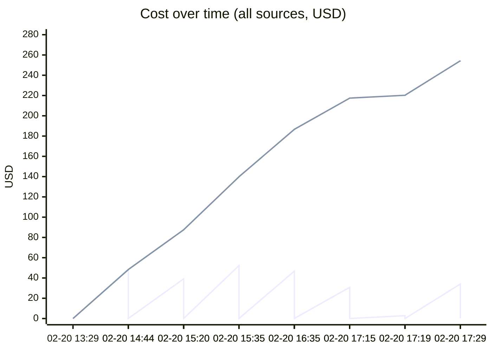
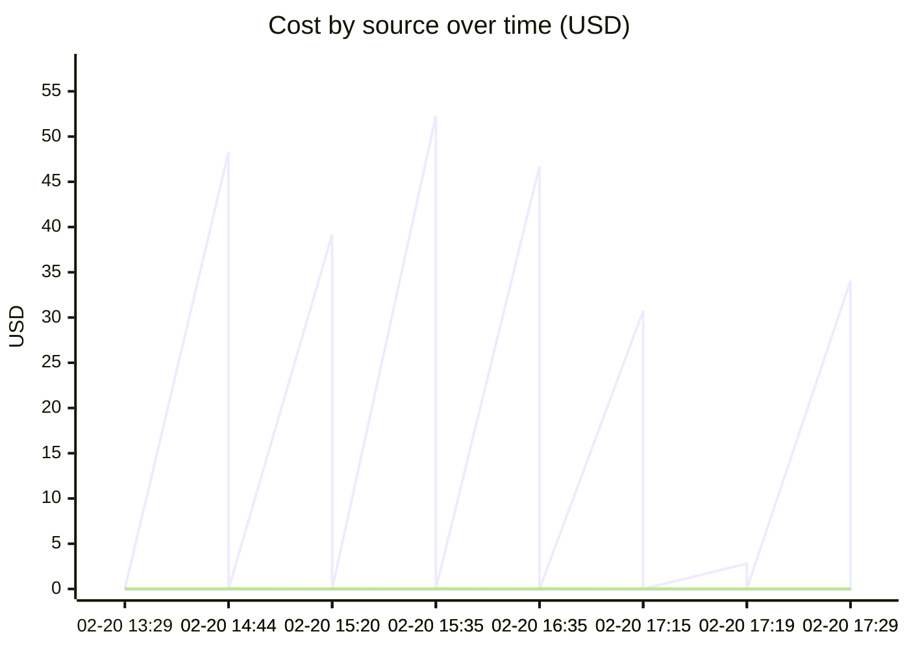

# Unified AI Usage Tracker

> Auto-updated cumulative usage from Claude, Cursor, runtime proxy, scripts, and MCP signals.

## Grand Total

| Metric | Value |
|--------|-------|
| Events | 56 |
| Requests | 2325 |
| Total tokens | 448.77M |
| Input tokens | 120.8k |
| Output tokens | 50.7k |
| Cache read | 435.44M |
| Cache create | 13.16M |
| Estimated cost | $898.4171 |

## Segmented Totals by Source

| Source | Events | Requests | Total tokens | Input | Output | Cost |
|--------|--------|----------|--------------|-------|--------|------|
| Claude | 28 | 28 | 448.77M | 120.8k | 50.7k | $897.2686 |
| MCP tools | 28 | 2297 | 0 | 0 | 0 | $1.1485 |

## Estimation Quality

| Source | Exact | Best effort | Unavailable |
|--------|-------|-------------|-------------|
| Claude | 0 | 28 | 0 |
| MCP tools | 0 | 28 | 0 |

## Daily Summary

| Date | Events | Tokens | Cost |
|------|--------|--------|------|
| 2026-02-20 | 56 | 448.77M | $898.4171 |

## Usage over time

## Recent Events

| Time | Source | Provider | Model | In | Out | Cost | Method |
|------|--------|----------|-------|----|-----|------|--------|
| 2026-02-20 22:29 | MCP tools | claude | mcp-tooling | 0 | 0 | $0.0460 | best_effort |
| 2026-02-20 22:29 | Claude | anthropic | claude-opus-4-6,<synthetic> | 50.6k | 1.2k | $34.0588 | best_effort |
| 2026-02-20 22:19 | MCP tools | claude | mcp-tooling | 0 | 0 | $0.0050 | best_effort |
| 2026-02-20 22:19 | Claude | anthropic | claude-opus-4-6 | 28 | 114 | $2.8004 | best_effort |
| 2026-02-20 22:15 | MCP tools | claude | mcp-tooling | 0 | 0 | $0.0355 | best_effort |
| 2026-02-20 22:15 | Claude | anthropic | claude-opus-4-6 | 179 | 1.2k | $30.7421 | best_effort |
| 2026-02-20 21:35 | MCP tools | claude | mcp-tooling | 0 | 0 | $0.0580 | best_effort |
| 2026-02-20 21:35 | Claude | anthropic | claude-opus-4-6 | 2.6k | 2.1k | $46.7208 | best_effort |
| 2026-02-20 20:35 | MCP tools | claude | mcp-tooling | 0 | 0 | $0.0540 | best_effort |
| 2026-02-20 20:35 | Claude | anthropic | claude-opus-4-6 | 8.9k | 1.5k | $52.2465 | best_effort |
| 2026-02-20 20:20 | MCP tools | claude | mcp-tooling | 0 | 0 | $0.0430 | best_effort |
| 2026-02-20 20:20 | Claude | anthropic | claude-opus-4-6 | 194 | 1.3k | $39.1799 | best_effort |
| 2026-02-20 19:44 | MCP tools | claude | mcp-tooling | 0 | 0 | $0.0560 | best_effort |
| 2026-02-20 19:44 | Claude | anthropic | claude-opus-4-6,<synthetic> | 476 | 2.2k | $48.3031 | best_effort |
| 2026-02-20 18:29 | MCP tools | claude | mcp-tooling | 0 | 0 | $0.0005 | best_effort |
| 2026-02-20 18:29 | Claude | anthropic | claude-opus-4-6 | 10 | 40 | $0.6770 | best_effort |
| 2026-02-20 18:22 | MCP tools | claude | mcp-tooling | 0 | 0 | $0.2005 | best_effort |
| 2026-02-20 18:22 | Claude | anthropic | claude-opus-4-6 | 8.1k | 5.4k | $168.2038 | best_effort |
| 2026-02-20 18:20 | MCP tools | claude | mcp-tooling | 0 | 0 | $0.0170 | best_effort |
| 2026-02-20 18:20 | Claude | anthropic | claude-sonnet-4-6 | 93 | 18.4k | $1.9080 | best_effort |

---
*Last updated: 2026-02-20 22:29:09 UTC*
