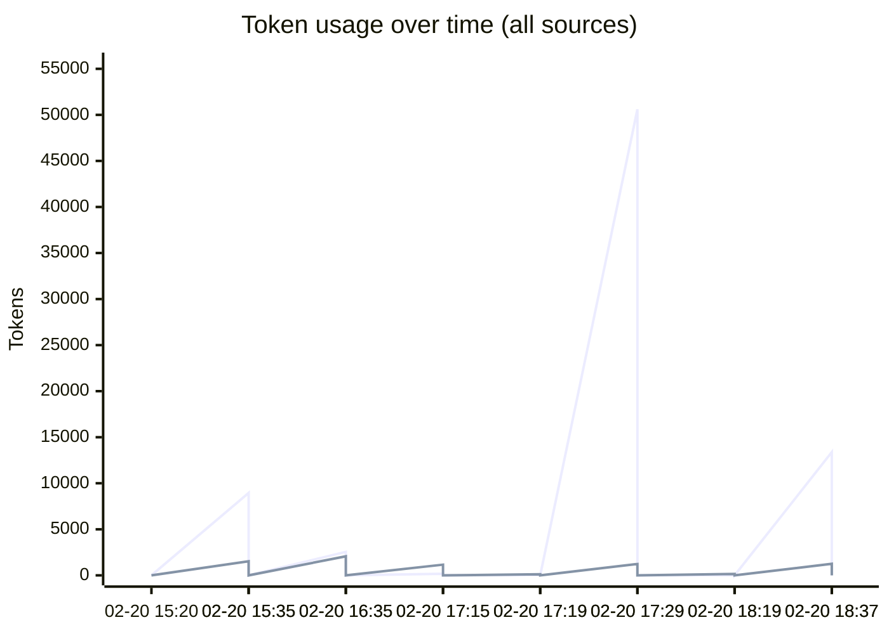
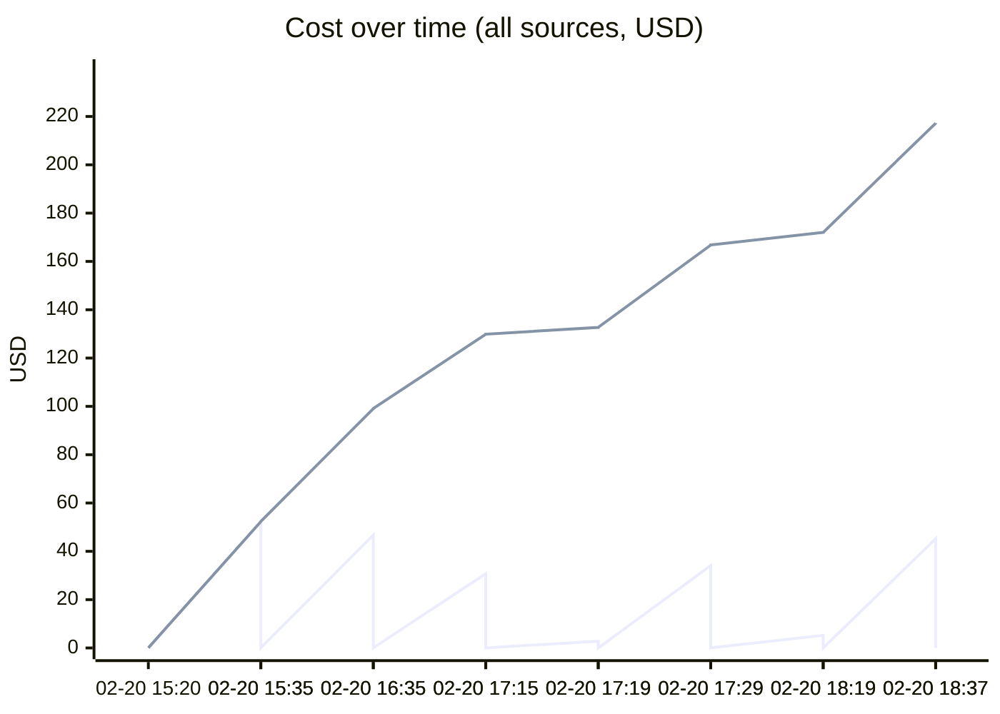
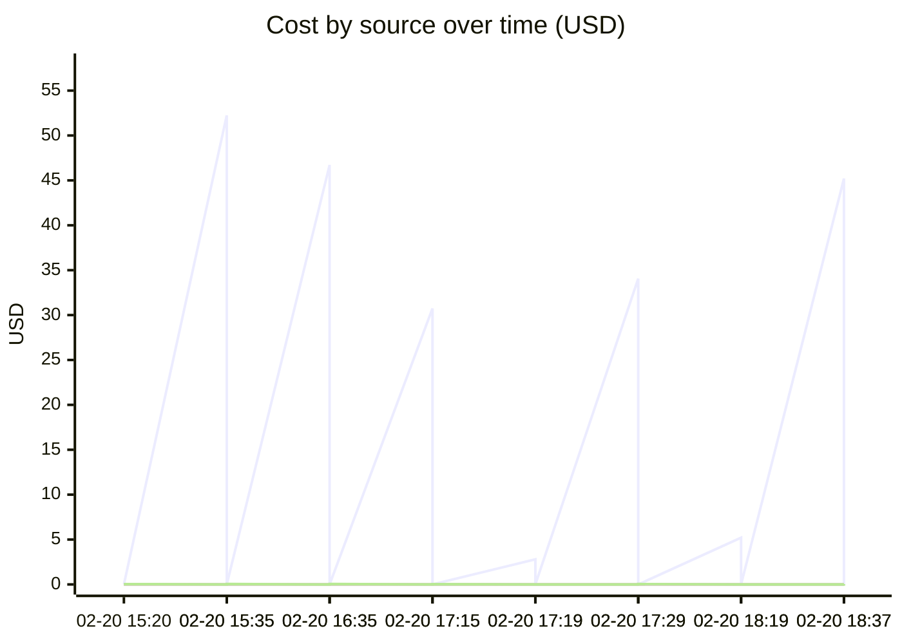

# Unified AI Usage Tracker

> Auto-updated cumulative usage from Claude, Cursor, runtime proxy, scripts, and MCP signals.

## Grand Total

| Metric | Value |
|--------|-------|
| Events | 60 |
| Requests | 2409 |
| Total tokens | 465.78M |
| Input tokens | 134.2k |
| Output tokens | 52.1k |
| Cache read | 451.02M |
| Cache create | 14.58M |
| Estimated cost | $948.8639 |

## Segmented Totals by Source

| Source | Events | Requests | Total tokens | Input | Output | Cost |
|--------|--------|----------|--------------|-------|--------|------|
| Claude | 30 | 30 | 465.78M | 134.2k | 52.1k | $947.6744 |
| MCP tools | 30 | 2379 | 0 | 0 | 0 | $1.1895 |

## Estimation Quality

| Source | Exact | Best effort | Unavailable |
|--------|-------|-------------|-------------|
| Claude | 0 | 30 | 0 |
| MCP tools | 0 | 30 | 0 |

## Daily Summary

| Date | Events | Tokens | Cost |
|------|--------|--------|------|
| 2026-02-20 | 60 | 465.78M | $948.8639 |

## Usage over time

## Recent Events

| Time | Source | Provider | Model | In | Out | Cost | Method |
|------|--------|----------|-------|----|-----|------|--------|
| 2026-02-20 23:37 | MCP tools | claude | mcp-tooling | 0 | 0 | $0.0370 | best_effort |
| 2026-02-20 23:37 | Claude | anthropic | claude-opus-4-6 | 13.4k | 1.3k | $45.2001 | best_effort |
| 2026-02-20 23:19 | MCP tools | claude | mcp-tooling | 0 | 0 | $0.0040 | best_effort |
| 2026-02-20 23:19 | Claude | anthropic | claude-opus-4-6 | 38 | 157 | $5.2058 | best_effort |
| 2026-02-20 22:29 | MCP tools | claude | mcp-tooling | 0 | 0 | $0.0460 | best_effort |
| 2026-02-20 22:29 | Claude | anthropic | claude-opus-4-6,<synthetic> | 50.6k | 1.2k | $34.0588 | best_effort |
| 2026-02-20 22:19 | MCP tools | claude | mcp-tooling | 0 | 0 | $0.0050 | best_effort |
| 2026-02-20 22:19 | Claude | anthropic | claude-opus-4-6 | 28 | 114 | $2.8004 | best_effort |
| 2026-02-20 22:15 | MCP tools | claude | mcp-tooling | 0 | 0 | $0.0355 | best_effort |
| 2026-02-20 22:15 | Claude | anthropic | claude-opus-4-6 | 179 | 1.2k | $30.7421 | best_effort |
| 2026-02-20 21:35 | MCP tools | claude | mcp-tooling | 0 | 0 | $0.0580 | best_effort |
| 2026-02-20 21:35 | Claude | anthropic | claude-opus-4-6 | 2.6k | 2.1k | $46.7208 | best_effort |
| 2026-02-20 20:35 | MCP tools | claude | mcp-tooling | 0 | 0 | $0.0540 | best_effort |
| 2026-02-20 20:35 | Claude | anthropic | claude-opus-4-6 | 8.9k | 1.5k | $52.2465 | best_effort |
| 2026-02-20 20:20 | MCP tools | claude | mcp-tooling | 0 | 0 | $0.0430 | best_effort |
| 2026-02-20 20:20 | Claude | anthropic | claude-opus-4-6 | 194 | 1.3k | $39.1799 | best_effort |
| 2026-02-20 19:44 | MCP tools | claude | mcp-tooling | 0 | 0 | $0.0560 | best_effort |
| 2026-02-20 19:44 | Claude | anthropic | claude-opus-4-6,<synthetic> | 476 | 2.2k | $48.3031 | best_effort |
| 2026-02-20 18:29 | MCP tools | claude | mcp-tooling | 0 | 0 | $0.0005 | best_effort |
| 2026-02-20 18:29 | Claude | anthropic | claude-opus-4-6 | 10 | 40 | $0.6770 | best_effort |

---
*Last updated: 2026-02-20 23:37:21 UTC*
