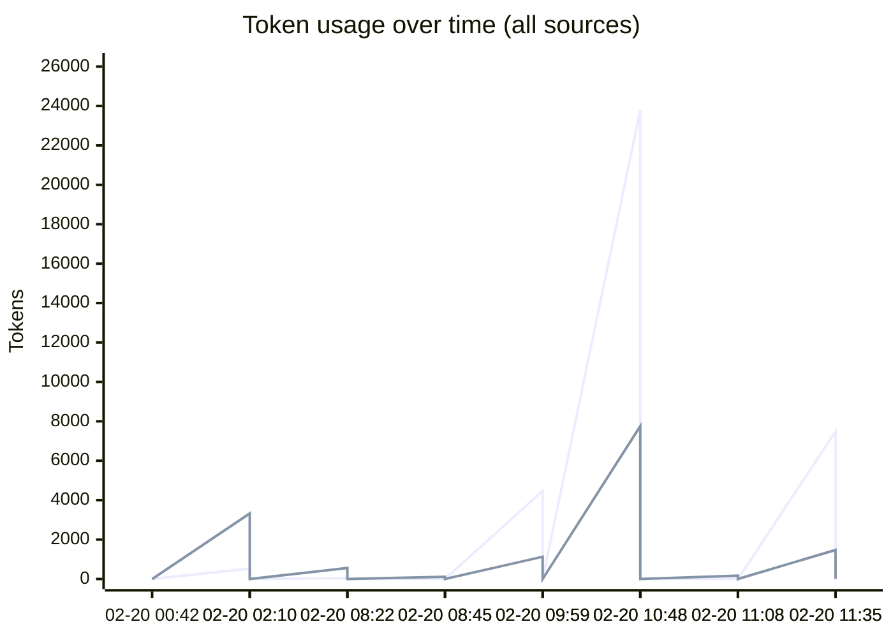
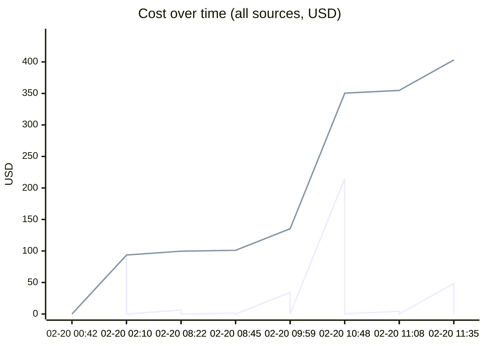
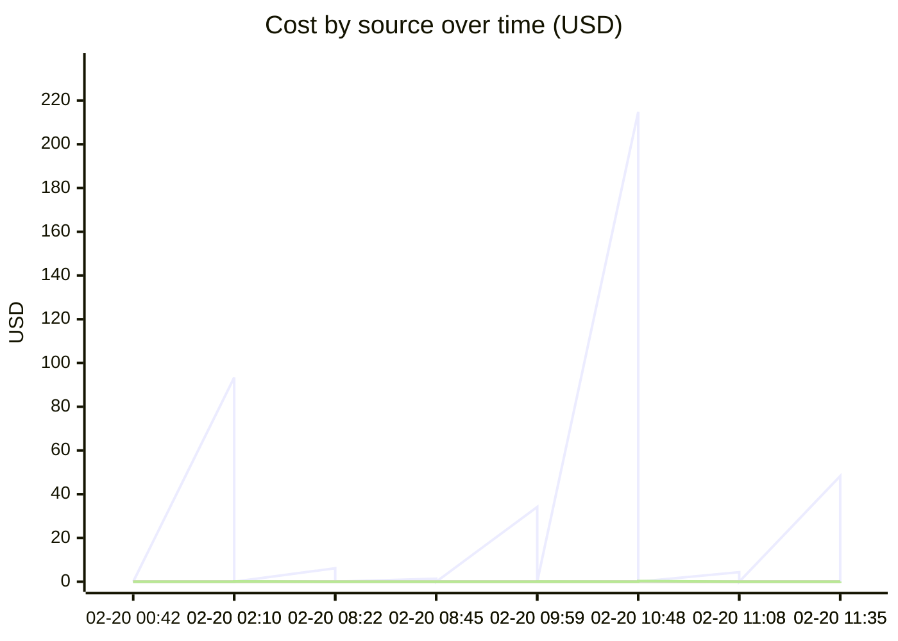

# Unified AI Usage Tracker

> Auto-updated cumulative usage from Claude, Cursor, runtime proxy, scripts, and MCP signals.

## Grand Total

| Metric | Value |
|--------|-------|
| Events | 26 |
| Requests | 1327 |
| Total tokens | 250.25M |
| Input tokens | 56.8k |
| Output tokens | 16.9k |
| Cache read | 243.16M |
| Cache create | 7.01M |
| Estimated cost | $498.9840 |

## Segmented Totals by Source

| Source | Events | Requests | Total tokens | Input | Output | Cost |
|--------|--------|----------|--------------|-------|--------|------|
| Claude | 13 | 13 | 250.25M | 56.8k | 16.9k | $498.3270 |
| MCP tools | 13 | 1314 | 0 | 0 | 0 | $0.6570 |

## Estimation Quality

| Source | Exact | Best effort | Unavailable |
|--------|-------|-------------|-------------|
| Claude | 0 | 13 | 0 |
| MCP tools | 0 | 13 | 0 |

## Daily Summary

| Date | Events | Tokens | Cost |
|------|--------|--------|------|
| 2026-02-20 | 26 | 250.25M | $498.9840 |

## Usage over time

## Recent Events

| Time | Source | Provider | Model | In | Out | Cost | Method |
|------|--------|----------|-------|----|-----|------|--------|
| 2026-02-20 16:35 | MCP tools | claude | mcp-tooling | 0 | 0 | $0.0475 | best_effort |
| 2026-02-20 16:35 | Claude | anthropic | claude-opus-4-6 | 7.5k | 1.5k | $48.3012 | best_effort |
| 2026-02-20 16:08 | MCP tools | claude | mcp-tooling | 0 | 0 | $0.0055 | best_effort |
| 2026-02-20 16:08 | Claude | anthropic | claude-opus-4-6 | 23 | 167 | $4.3809 | best_effort |
| 2026-02-20 15:48 | MCP tools | claude | mcp-tooling | 0 | 0 | $0.2900 | best_effort |
| 2026-02-20 15:48 | Claude | anthropic | claude-opus-4-6 | 23.8k | 7.8k | $214.8100 | best_effort |
| 2026-02-20 14:59 | MCP tools | claude | mcp-tooling | 0 | 0 | $0.0505 | best_effort |
| 2026-02-20 14:59 | Claude | anthropic | claude-opus-4-6 | 4.5k | 1.1k | $34.1975 | best_effort |
| 2026-02-20 13:45 | MCP tools | claude | mcp-tooling | 0 | 0 | $0.0020 | best_effort |
| 2026-02-20 13:45 | Claude | anthropic | claude-opus-4-6 | 20 | 111 | $1.3798 | best_effort |
| 2026-02-20 13:22 | MCP tools | claude | mcp-tooling | 0 | 0 | $0.0110 | best_effort |
| 2026-02-20 13:22 | Claude | anthropic | claude-opus-4-6 | 50 | 558 | $6.1390 | best_effort |
| 2026-02-20 07:10 | MCP tools | claude | mcp-tooling | 0 | 0 | $0.1205 | best_effort |
| 2026-02-20 07:10 | Claude | anthropic | claude-opus-4-6 | 526 | 3.3k | $93.4174 | best_effort |
| 2026-02-20 05:42 | MCP tools | claude | mcp-tooling | 0 | 0 | $0.0085 | best_effort |
| 2026-02-20 05:42 | Claude | anthropic | claude-opus-4-6 | 38 | 106 | $5.4417 | best_effort |
| 2026-02-20 05:12 | MCP tools | claude | mcp-tooling | 0 | 0 | $0.0875 | best_effort |
| 2026-02-20 05:12 | Claude | anthropic | claude-opus-4-6 | 302 | 1.8k | $59.9457 | best_effort |
| 2026-02-20 05:03 | MCP tools | claude | mcp-tooling | 0 | 0 | $0.0015 | best_effort |
| 2026-02-20 05:03 | Claude | anthropic | claude-opus-4-6 | 15 | 36 | $1.9398 | best_effort |

---
*Last updated: 2026-02-20 16:35:02 UTC*
