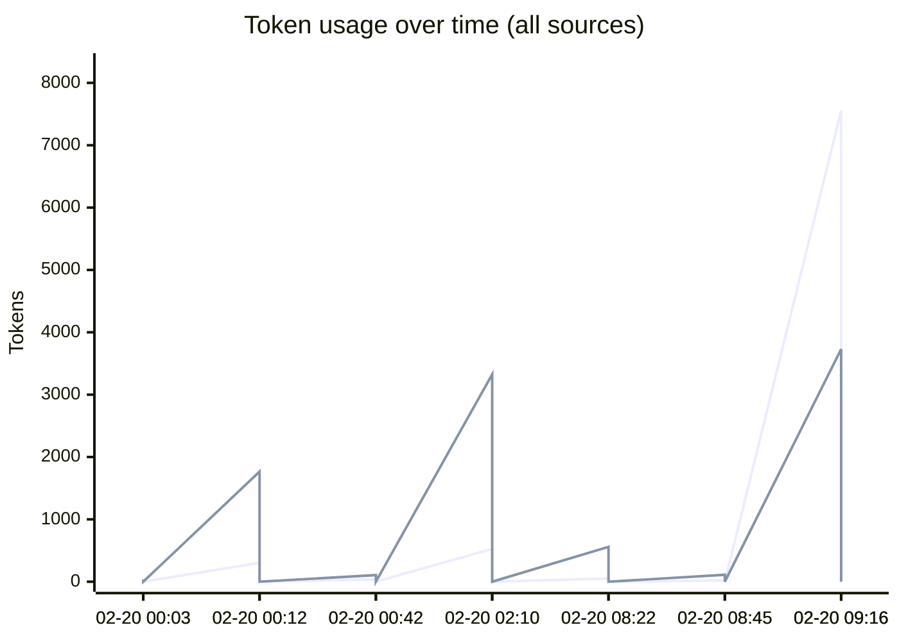
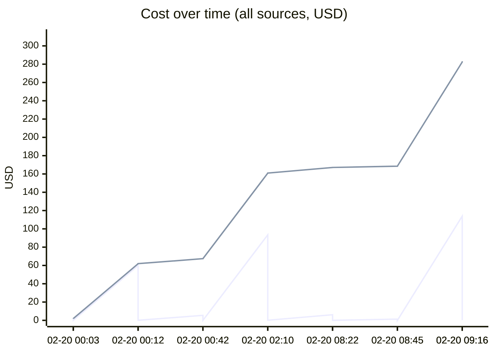
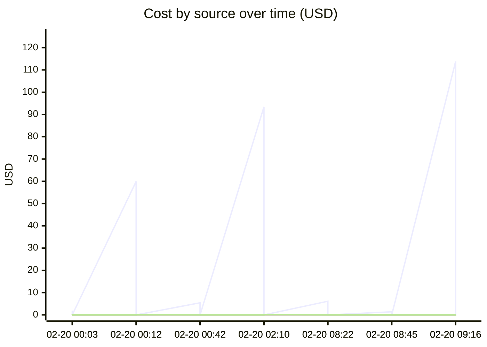

# Unified AI Usage Tracker

> Auto-updated cumulative usage from Claude, Cursor, runtime proxy, scripts, and MCP signals.

## Grand Total

| Metric | Value |
|--------|-------|
| Events | 21 |
| Requests | 843 |
| Total tokens | 159.84M |
| Input tokens | 28.6k |
| Output tokens | 10.2k |
| Cache read | 155.73M |
| Cache create | 4.07M |
| Estimated cost | $311.5793 |

## Segmented Totals by Source

| Source | Events | Requests | Total tokens | Input | Output | Cost |
|--------|--------|----------|--------------|-------|--------|------|
| Claude | 11 | 11 | 159.84M | 28.6k | 10.2k | $311.1633 |
| MCP tools | 10 | 832 | 0 | 0 | 0 | $0.4160 |

## Estimation Quality

| Source | Exact | Best effort | Unavailable |
|--------|-------|-------------|-------------|
| Claude | 0 | 11 | 0 |
| MCP tools | 0 | 10 | 0 |

## Daily Summary

| Date | Events | Tokens | Cost |
|------|--------|--------|------|
| 2026-02-20 | 21 | 159.84M | $311.5793 |

## Usage over time

## Recent Events

| Time | Source | Provider | Model | In | Out | Cost | Method |
|------|--------|----------|-------|----|-----|------|--------|
| 2026-02-20 14:16 | MCP tools | claude | mcp-tooling | 0 | 0 | $0.1525 | best_effort |
| 2026-02-20 14:16 | Claude | anthropic | claude-opus-4-6 | 9 | 30 | $0.7002 | best_effort |
| 2026-02-20 14:16 | Claude | anthropic | claude-opus-4-6 | 7.6k | 3.7k | $113.8257 | best_effort |
| 2026-02-20 13:45 | MCP tools | claude | mcp-tooling | 0 | 0 | $0.0020 | best_effort |
| 2026-02-20 13:45 | Claude | anthropic | claude-opus-4-6 | 20 | 111 | $1.3798 | best_effort |
| 2026-02-20 13:22 | MCP tools | claude | mcp-tooling | 0 | 0 | $0.0110 | best_effort |
| 2026-02-20 13:22 | Claude | anthropic | claude-opus-4-6 | 50 | 558 | $6.1390 | best_effort |
| 2026-02-20 07:10 | MCP tools | claude | mcp-tooling | 0 | 0 | $0.1205 | best_effort |
| 2026-02-20 07:10 | Claude | anthropic | claude-opus-4-6 | 526 | 3.3k | $93.4174 | best_effort |
| 2026-02-20 05:42 | MCP tools | claude | mcp-tooling | 0 | 0 | $0.0085 | best_effort |
| 2026-02-20 05:42 | Claude | anthropic | claude-opus-4-6 | 38 | 106 | $5.4417 | best_effort |
| 2026-02-20 05:12 | MCP tools | claude | mcp-tooling | 0 | 0 | $0.0875 | best_effort |
| 2026-02-20 05:12 | Claude | anthropic | claude-opus-4-6 | 302 | 1.8k | $59.9457 | best_effort |
| 2026-02-20 05:03 | MCP tools | claude | mcp-tooling | 0 | 0 | $0.0015 | best_effort |
| 2026-02-20 05:03 | Claude | anthropic | claude-opus-4-6 | 15 | 36 | $1.9398 | best_effort |
| 2026-02-20 04:38 | MCP tools | claude | mcp-tooling | 0 | 0 | $0.0225 | best_effort |
| 2026-02-20 04:38 | Claude | anthropic | claude-opus-4-6 | 107 | 328 | $16.9902 | best_effort |
| 2026-02-20 02:26 | MCP tools | claude | mcp-tooling | 0 | 0 | $0.0075 | best_effort |
| 2026-02-20 02:26 | Claude | anthropic | claude-opus-4-6 | 20.0k | 146 | $9.9826 | best_effort |
| 2026-02-20 01:16 | MCP tools | claude | mcp-tooling | 0 | 0 | $0.0025 | best_effort |

---
*Last updated: 2026-02-20 14:16:21 UTC*
