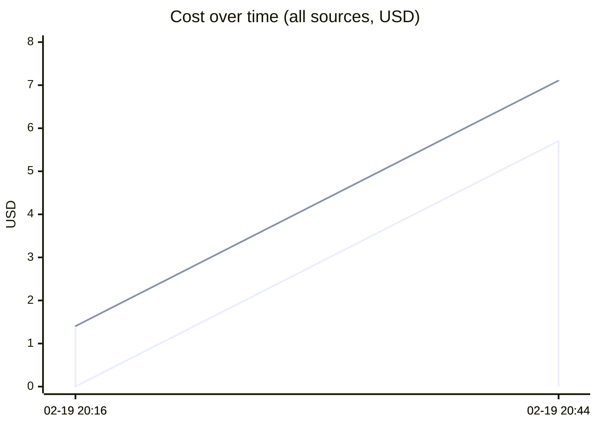

# Unified AI Usage Tracker

> Auto-updated cumulative usage from Claude, Cursor, runtime proxy, scripts, and MCP signals.

## Grand Total

| Metric | Value |
|--------|-------|
| Events | 4 |
| Requests | 15 |
| Total tokens | 1.51M |
| Input tokens | 20.0k |
| Output tokens | 65 |
| Cache read | 1.23M |
| Cache create | 264.6k |
| Estimated cost | $7.1122 |

## Segmented Totals by Source

| Source | Events | Requests | Total tokens | Input | Output | Cost |
|--------|--------|----------|--------------|-------|--------|------|
| Claude | 2 | 2 | 1.51M | 20.0k | 65 | $7.1057 |
| MCP tools | 2 | 13 | 0 | 0 | 0 | $0.0065 |

## Estimation Quality

| Source | Exact | Best effort | Unavailable |
|--------|-------|-------------|-------------|
| Claude | 0 | 2 | 0 |
| MCP tools | 0 | 2 | 0 |

## Daily Summary

| Date | Events | Tokens | Cost |
|------|--------|--------|------|
| 2026-02-20 | 4 | 1.51M | $7.1122 |

## Usage over time

## Recent Events

| Time | Source | Provider | Model | In | Out | Cost | Method |
|------|--------|----------|-------|----|-----|------|--------|
| 2026-02-20 01:44 | MCP tools | claude | mcp-tooling | 0 | 0 | $0.0040 | best_effort |
| 2026-02-20 01:44 | Claude | anthropic | claude-opus-4-6 | 20.0k | 31 | $5.7048 | best_effort |
| 2026-02-20 01:16 | MCP tools | claude | mcp-tooling | 0 | 0 | $0.0025 | best_effort |
| 2026-02-20 01:16 | Claude | anthropic | claude-opus-4-6 | 12 | 34 | $1.4010 | best_effort |

---
*Last updated: 2026-02-20 01:44:07 UTC*
