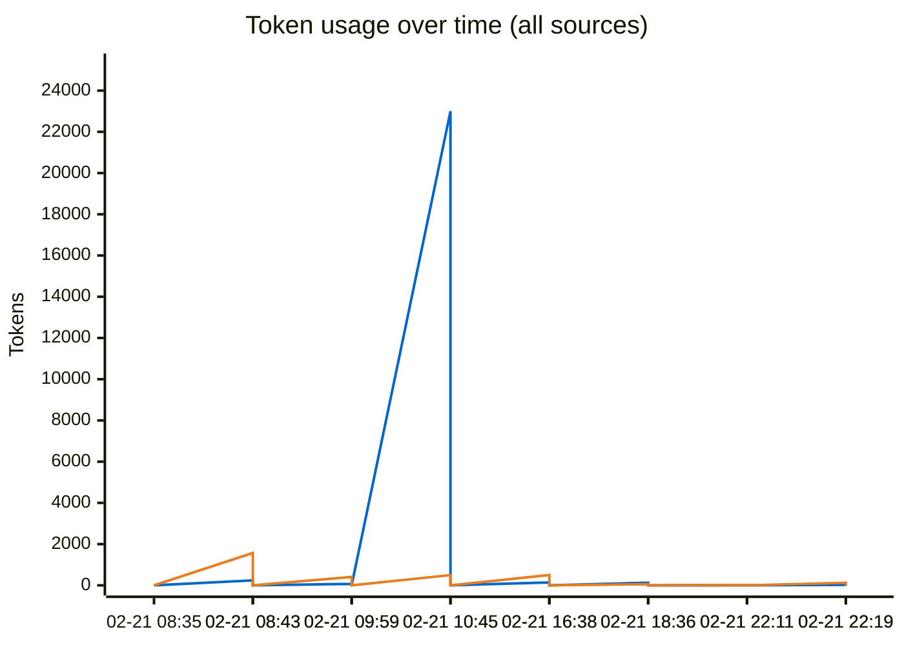
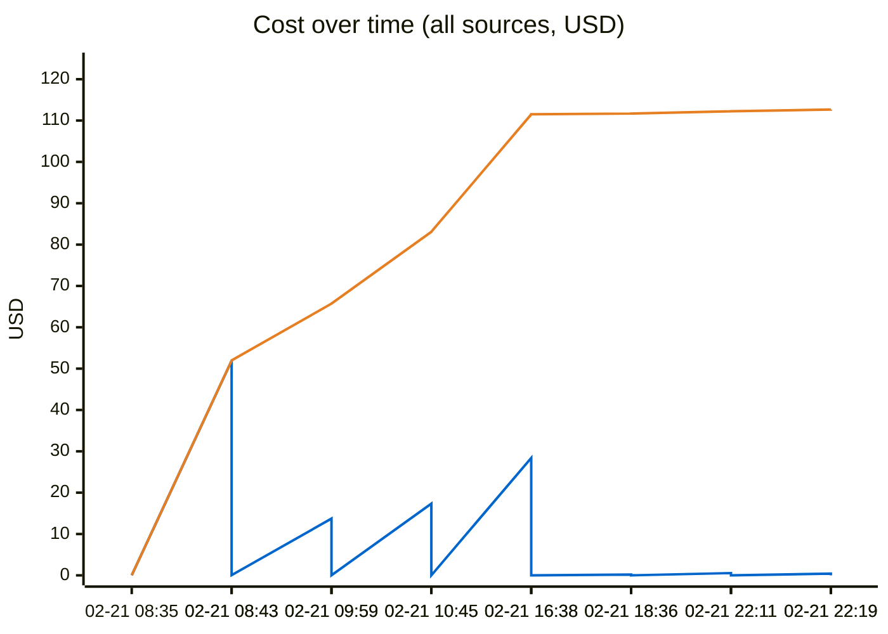
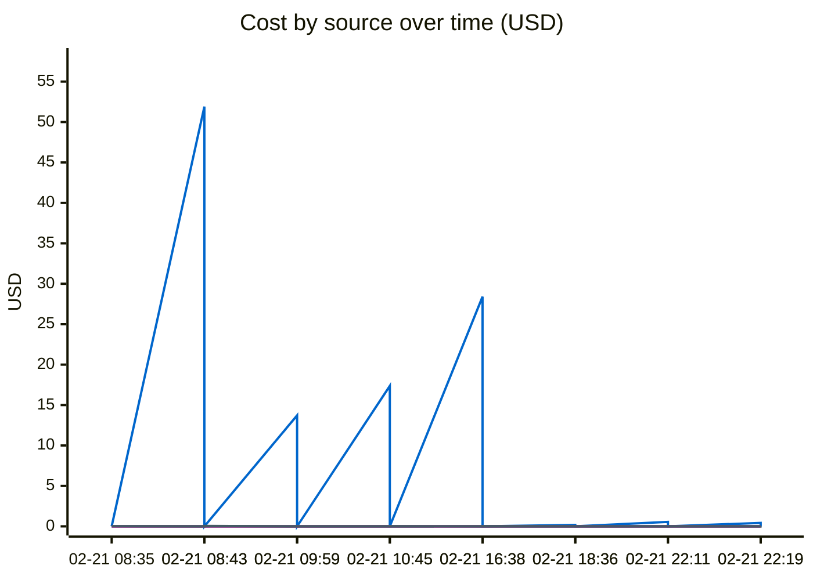

# Unified AI Usage Tracker

> Auto-updated cumulative usage from Claude, Cursor, runtime proxy, scripts, and MCP signals.

## Grand Total

| Metric | Value |
|--------|-------|
| Events | 88 |
| Requests | 3120 |
| Total tokens | 602.70M |
| Input tokens | 184.2k |
| Output tokens | 61.5k |
| Cache read | 579.81M |
| Cache create | 22.64M |
| Estimated cost | $1250.5017 |

## Segmented Totals by Source

| Source | Events | Requests | Total tokens | Input | Output | Cost |
|--------|--------|----------|--------------|-------|--------|------|
| Claude | 44 | 44 | 602.70M | 184.2k | 61.5k | $1248.9637 |
| MCP tools | 44 | 3076 | 0 | 0 | 0 | $1.5380 |

## Estimation Quality

Cost estimation: all events use **approximate** pricing (no provider-exact data).

## Daily Summary

| Date | Events | Tokens | Cost |
|------|--------|--------|------|
| 2026-02-22 | 4 | 1.28M | $0.9794 |
| 2026-02-21 | 26 | 148.99M | $332.4640 |
| 2026-02-20 | 58 | 452.44M | $917.0583 |

## Usage over time

- **First line (blue):** Input — tokens sent to the model (prompt + cache).
- **Second line (orange):** Output — tokens generated by the model.

Same time axis; scales can differ.

- **First line (blue):** Cost — USD per event (spikes).
- **Second line (orange):** Cumulative — running total USD over time (staircase).

*Which line is which (order in chart):*
- **1st (blue):** Claude — Claude Code usage.
- **2nd (orange):** Cursor — Cursor IDE usage.
- **3rd (purple):** Runtime proxy — app AI proxy.
- **4th (violet):** Scripts — script-invoked calls.
- **5th (dark gray):** MCP — MCP tool usage.

Each line = USD cost at that time; zeros = no spend from that source then.

## Recent Events

Events from **all sources**: **Source** = where the call came from (Claude Code, Cursor IDE, MCP tools, **runtime proxy**, scripts). **Runtime proxy** = in-app AI (local or deployed) — when the app sends requests through this project's AI proxy, those show up here and are also sent to Langfuse. **Provider** / **Model** = API or model when known. **Method** = how cost was derived: `exact`, `best_effort` (approximate), or `unavailable`.

| Time | Source | Provider | Model | In | Out | Cost | Method |
|------|--------|----------|-------|----|-----|------|--------|
| 2026-02-22 03:19 | MCP tools | claude | mcp-tooling | 0 | 0 | $0.0030 | best_effort |
| 2026-02-22 03:19 | Claude | anthropic | claude-sonnet-4-6 | 25 | 127 | $0.4235 | best_effort |
| 2026-02-22 03:11 | MCP tools | claude | mcp-tooling | 0 | 0 | $0.0005 | best_effort |
| 2026-02-22 03:11 | Claude | anthropic | claude-sonnet-4-6 | 6 | 18 | $0.5525 | best_effort |
| 2026-02-21 23:36 | MCP tools | claude | mcp-tooling | 0 | 0 | $0.0015 | best_effort |
| 2026-02-21 23:36 | Claude | anthropic | claude-haiku-4-5-20251001 | 126 | 54 | $0.1797 | best_effort |
| 2026-02-21 21:38 | MCP tools | claude | mcp-tooling | 0 | 0 | $0.0155 | best_effort |
| 2026-02-21 21:38 | Claude | anthropic | claude-opus-4-6,<synthetic>,claude-haiku-4-5-20251001 | 140 | 501 | $28.3955 | best_effort |
| 2026-02-21 15:45 | MCP tools | claude | mcp-tooling | 0 | 0 | $0.0140 | best_effort |
| 2026-02-21 15:45 | Claude | anthropic | claude-opus-4-6 | 23.0k | 496 | $17.3608 | best_effort |
| 2026-02-21 14:59 | MCP tools | claude | mcp-tooling | 0 | 0 | $0.0100 | best_effort |
| 2026-02-21 14:59 | Claude | anthropic | claude-opus-4-6,claude-haiku-4-5-20251001,<synthetic> | 73 | 407 | $13.7222 | best_effort |
| 2026-02-21 13:43 | MCP tools | claude | mcp-tooling | 0 | 0 | $0.0595 | best_effort |
| 2026-02-21 13:43 | Claude | anthropic | claude-opus-4-6 | 238 | 1.6k | $51.9066 | best_effort |
| 2026-02-21 13:35 | MCP tools | claude | mcp-tooling | 0 | 0 | $0.0275 | best_effort |
| 2026-02-21 13:35 | Claude | anthropic | claude-opus-4-6,<synthetic> | 128 | 599 | $26.1021 | best_effort |
| 2026-02-21 06:17 | MCP tools | claude | mcp-tooling | 0 | 0 | $0.0540 | best_effort |
| 2026-02-21 06:17 | Claude | anthropic | claude-opus-4-6 | 213 | 1.6k | $40.7930 | best_effort |
| 2026-02-21 05:42 | MCP tools | claude | mcp-tooling | 0 | 0 | $0.0110 | best_effort |
| 2026-02-21 05:42 | Claude | anthropic | claude-opus-4-6 | 58 | 378 | $7.6646 | best_effort |

---
*Last updated: 2026-02-22 04:05:00 UTC*
