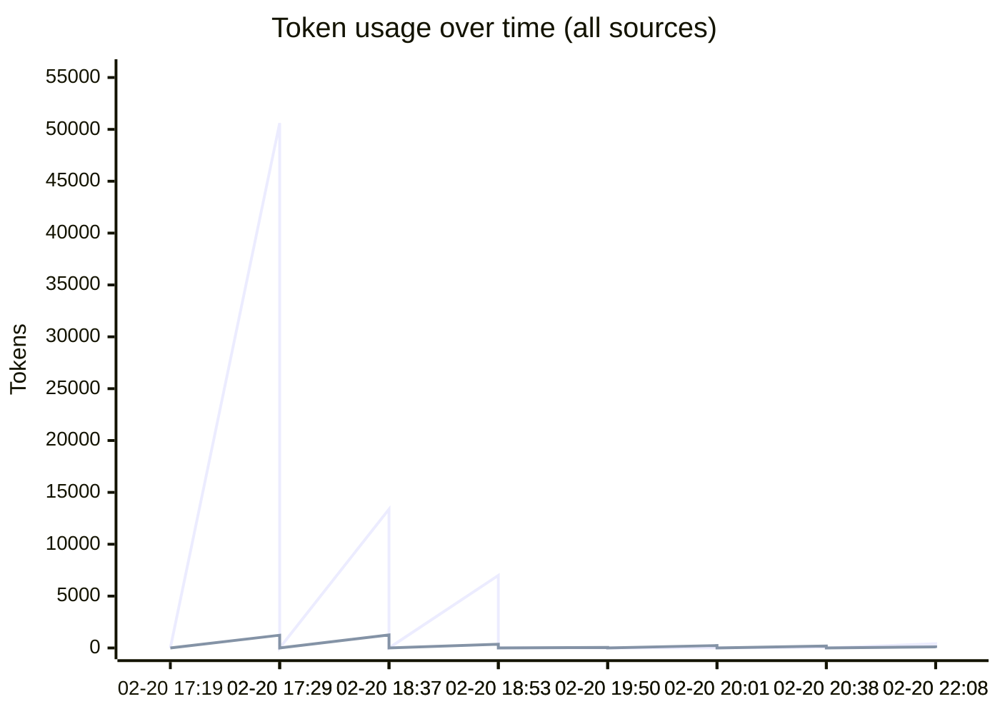
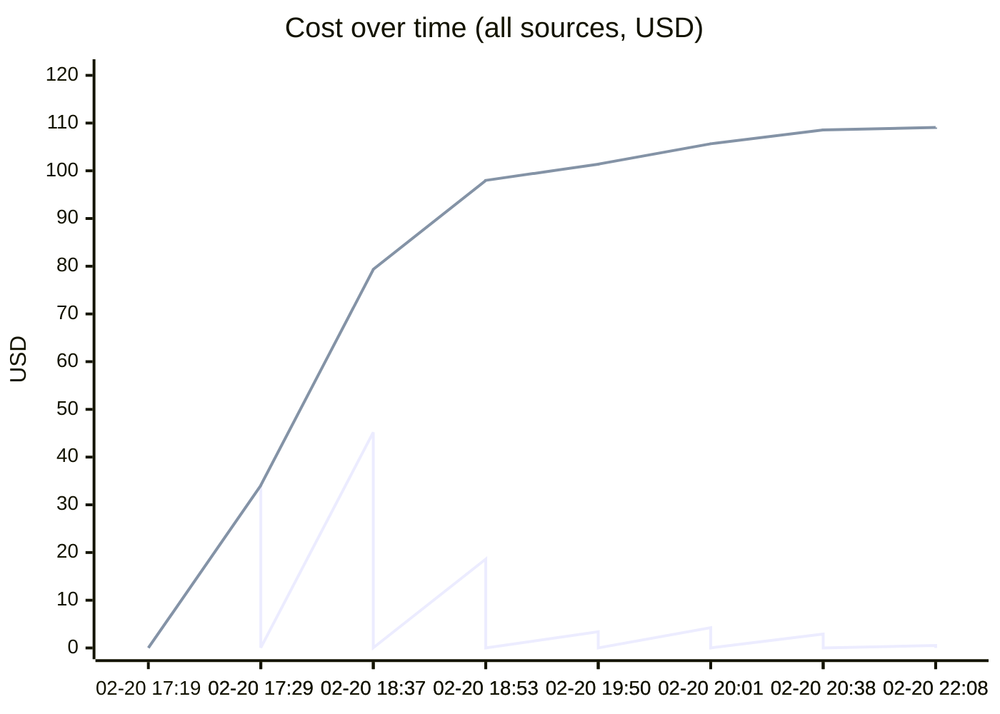
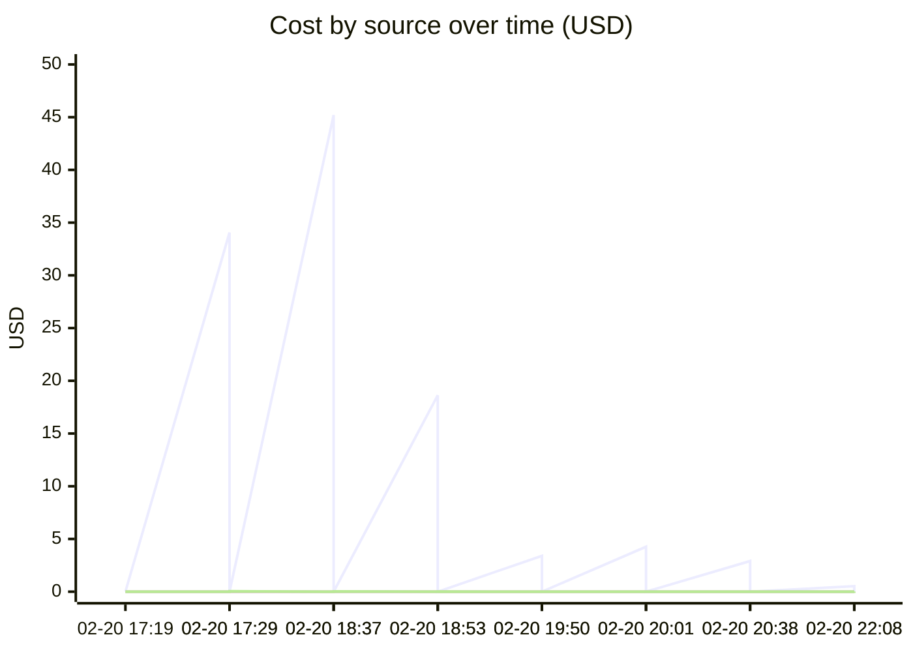

# Unified AI Usage Tracker

> Auto-updated cumulative usage from Claude, Cursor, runtime proxy, scripts, and MCP signals.

## Grand Total

| Metric | Value |
|--------|-------|
| Events | 68 |
| Requests | 2472 |
| Total tokens | 475.84M |
| Input tokens | 141.7k |
| Output tokens | 52.9k |
| Cache read | 459.71M |
| Cache create | 15.93M |
| Estimated cost | $973.4035 |

## Segmented Totals by Source

| Source | Events | Requests | Total tokens | Input | Output | Cost |
|--------|--------|----------|--------------|-------|--------|------|
| Claude | 34 | 34 | 475.84M | 141.7k | 52.9k | $972.1845 |
| MCP tools | 34 | 2438 | 0 | 0 | 0 | $1.2190 |

## Estimation Quality

| Source | Exact | Best effort | Unavailable |
|--------|-------|-------------|-------------|
| Claude | 0 | 34 | 0 |
| MCP tools | 0 | 34 | 0 |

## Daily Summary

| Date | Events | Tokens | Cost |
|------|--------|--------|------|
| 2026-02-21 | 8 | 7.51M | $11.1081 |
| 2026-02-20 | 60 | 468.33M | $962.2954 |

## Usage over time

## Recent Events

| Time | Source | Provider | Model | In | Out | Cost | Method |
|------|--------|----------|-------|----|-----|------|--------|
| 2026-02-21 03:08 | MCP tools | claude | mcp-tooling | 0 | 0 | $0.0115 | best_effort |
| 2026-02-21 03:08 | Claude | anthropic | claude-haiku-4-5-20251001 | 402 | 103 | $0.5177 | best_effort |
| 2026-02-21 01:38 | MCP tools | claude | mcp-tooling | 0 | 0 | $0.0045 | best_effort |
| 2026-02-21 01:38 | Claude | anthropic | claude-opus-4-6,claude-haiku-4-5-20251001 | 76 | 195 | $2.9062 | best_effort |
| 2026-02-21 01:01 | MCP tools | claude | mcp-tooling | 0 | 0 | $0.0060 | best_effort |
| 2026-02-21 01:01 | Claude | anthropic | claude-opus-4-6 | 36 | 235 | $4.2616 | best_effort |
| 2026-02-21 00:50 | MCP tools | claude | mcp-tooling | 0 | 0 | $0.0005 | best_effort |
| 2026-02-21 00:50 | Claude | anthropic | claude-opus-4-6,claude-haiku-4-5-20251001 | 31 | 45 | $3.4002 | best_effort |
| 2026-02-20 23:53 | MCP tools | claude | mcp-tooling | 0 | 0 | $0.0110 | best_effort |
| 2026-02-20 23:53 | Claude | anthropic | claude-opus-4-6 | 7.0k | 363 | $18.6302 | best_effort |
| 2026-02-20 23:37 | MCP tools | claude | mcp-tooling | 0 | 0 | $0.0370 | best_effort |
| 2026-02-20 23:37 | Claude | anthropic | claude-opus-4-6 | 13.4k | 1.3k | $45.2001 | best_effort |
| 2026-02-20 22:29 | MCP tools | claude | mcp-tooling | 0 | 0 | $0.0460 | best_effort |
| 2026-02-20 22:29 | Claude | anthropic | claude-opus-4-6,<synthetic> | 50.6k | 1.2k | $34.0588 | best_effort |
| 2026-02-20 22:19 | MCP tools | claude | mcp-tooling | 0 | 0 | $0.0050 | best_effort |
| 2026-02-20 22:19 | Claude | anthropic | claude-opus-4-6 | 28 | 114 | $2.8004 | best_effort |
| 2026-02-20 22:15 | MCP tools | claude | mcp-tooling | 0 | 0 | $0.0355 | best_effort |
| 2026-02-20 22:15 | Claude | anthropic | claude-opus-4-6 | 179 | 1.2k | $30.7421 | best_effort |
| 2026-02-20 21:35 | MCP tools | claude | mcp-tooling | 0 | 0 | $0.0580 | best_effort |
| 2026-02-20 21:35 | Claude | anthropic | claude-opus-4-6 | 2.6k | 2.1k | $46.7208 | best_effort |

---
*Last updated: 2026-02-21 03:08:18 UTC*
