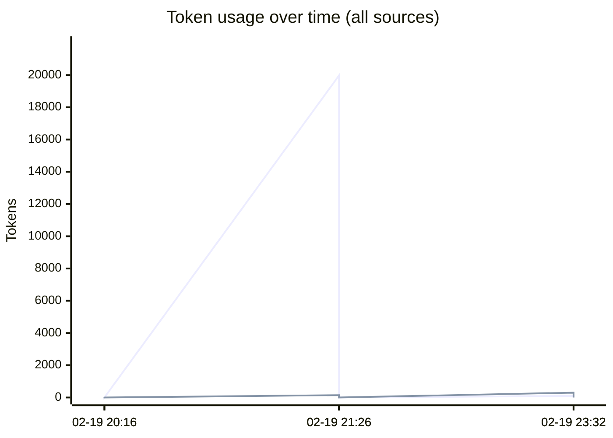
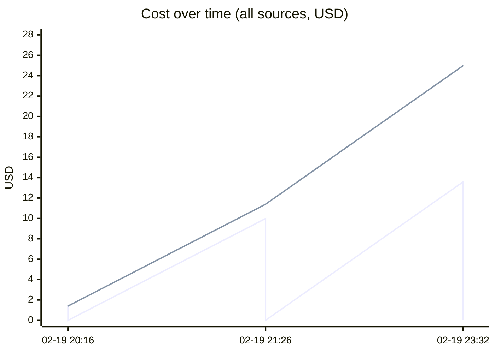
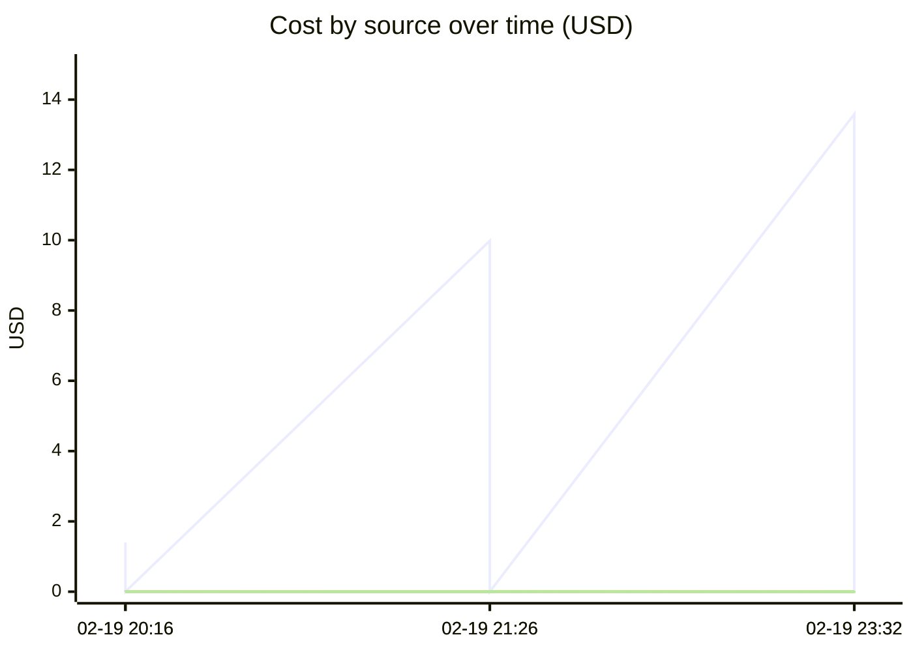

# Unified AI Usage Tracker

> Auto-updated cumulative usage from Claude, Cursor, runtime proxy, scripts, and MCP signals.

## Grand Total

| Metric | Value |
|--------|-------|
| Events | 6 |
| Requests | 66 |
| Total tokens | 9.21M |
| Input tokens | 20.1k |
| Output tokens | 479 |
| Cache read | 8.56M |
| Cache create | 628.6k |
| Estimated cost | $25.0016 |

## Segmented Totals by Source

| Source | Events | Requests | Total tokens | Input | Output | Cost |
|--------|--------|----------|--------------|-------|--------|------|
| Claude | 3 | 3 | 9.21M | 20.1k | 479 | $24.9701 |
| MCP tools | 3 | 63 | 0 | 0 | 0 | $0.0315 |

## Estimation Quality

| Source | Exact | Best effort | Unavailable |
|--------|-------|-------------|-------------|
| Claude | 0 | 3 | 0 |
| MCP tools | 0 | 3 | 0 |

## Daily Summary

| Date | Events | Tokens | Cost |
|------|--------|--------|------|
| 2026-02-20 | 6 | 9.21M | $25.0016 |

## Usage over time

## Recent Events

| Time | Source | Provider | Model | In | Out | Cost | Method |
|------|--------|----------|-------|----|-----|------|--------|
| 2026-02-20 04:32 | MCP tools | claude | mcp-tooling | 0 | 0 | $0.0215 | best_effort |
| 2026-02-20 04:32 | Claude | anthropic | claude-opus-4-6 | 99 | 299 | $13.5865 | best_effort |
| 2026-02-20 02:26 | MCP tools | claude | mcp-tooling | 0 | 0 | $0.0075 | best_effort |
| 2026-02-20 02:26 | Claude | anthropic | claude-opus-4-6 | 20.0k | 146 | $9.9826 | best_effort |
| 2026-02-20 01:16 | MCP tools | claude | mcp-tooling | 0 | 0 | $0.0025 | best_effort |
| 2026-02-20 01:16 | Claude | anthropic | claude-opus-4-6 | 12 | 34 | $1.4010 | best_effort |

---
*Last updated: 2026-02-20 04:32:22 UTC*
