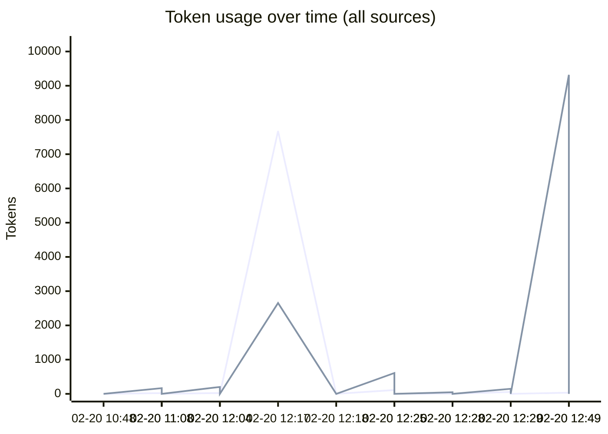
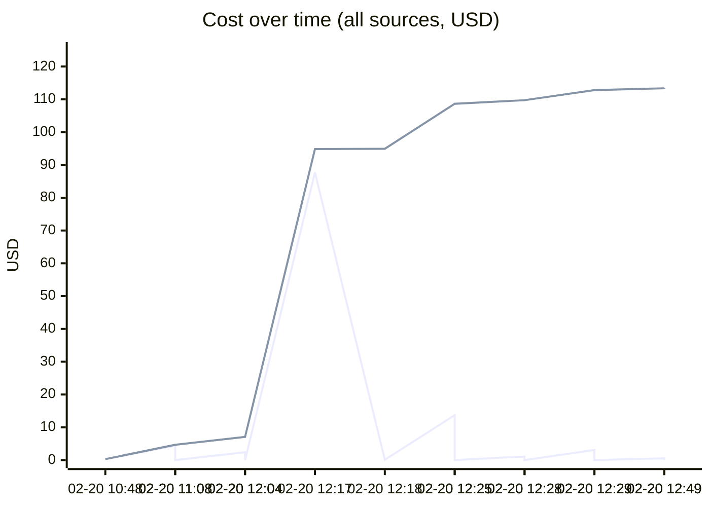
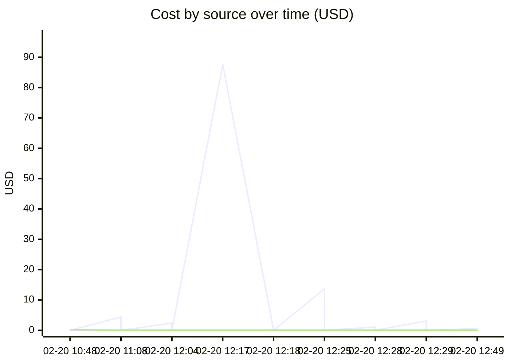

# Unified AI Usage Tracker

> Auto-updated cumulative usage from Claude, Cursor, runtime proxy, scripts, and MCP signals.

## Grand Total

| Metric | Value |
|--------|-------|
| Events | 36 |
| Requests | 1475 |
| Total tokens | 279.11M |
| Input tokens | 57.2k |
| Output tokens | 28.4k |
| Cache read | 270.95M |
| Cache create | 8.07M |
| Estimated cost | $559.3294 |

## Segmented Totals by Source

| Source | Events | Requests | Total tokens | Input | Output | Cost |
|--------|--------|----------|--------------|-------|--------|------|
| Claude | 18 | 18 | 279.11M | 57.2k | 28.4k | $558.6009 |
| MCP tools | 18 | 1457 | 0 | 0 | 0 | $0.7285 |

## Estimation Quality

| Source | Exact | Best effort | Unavailable |
|--------|-------|-------------|-------------|
| Claude | 0 | 18 | 0 |
| MCP tools | 0 | 18 | 0 |

## Daily Summary

| Date | Events | Tokens | Cost |
|------|--------|--------|------|
| 2026-02-20 | 36 | 279.11M | $559.3294 |

## Usage over time

## Recent Events

| Time | Source | Provider | Model | In | Out | Cost | Method |
|------|--------|----------|-------|----|-----|------|--------|
| 2026-02-20 17:49 | MCP tools | claude | mcp-tooling | 0 | 0 | $0.0065 | best_effort |
| 2026-02-20 17:49 | Claude | anthropic | claude-sonnet-4-6 | 34 | 9.3k | $0.5530 | best_effort |
| 2026-02-20 17:29 | MCP tools | claude | mcp-tooling | 0 | 0 | $0.0025 | best_effort |
| 2026-02-20 17:29 | Claude | anthropic | claude-opus-4-6 | 57 | 148 | $3.0749 | best_effort |
| 2026-02-20 17:28 | MCP tools | claude | mcp-tooling | 0 | 0 | $0.0005 | best_effort |
| 2026-02-20 17:28 | Claude | anthropic | claude-opus-4-6 | 8 | 46 | $1.0889 | best_effort |
| 2026-02-20 17:25 | MCP tools | claude | mcp-tooling | 0 | 0 | $0.0115 | best_effort |
| 2026-02-20 17:25 | Claude | anthropic | claude-opus-4-6 | 112 | 609 | $13.7153 | best_effort |
| 2026-02-20 17:18 | MCP tools | claude | mcp-tooling | 0 | 0 | $0.0940 | best_effort |
| 2026-02-20 17:17 | Claude | anthropic | claude-opus-4-6 | 7.7k | 2.7k | $87.7363 | best_effort |
| 2026-02-20 17:04 | MCP tools | claude | mcp-tooling | 0 | 0 | $0.0040 | best_effort |
| 2026-02-20 17:04 | Claude | anthropic | claude-opus-4-6 | 25 | 201 | $2.4067 | best_effort |
| 2026-02-20 16:08 | MCP tools | claude | mcp-tooling | 0 | 0 | $0.0055 | best_effort |
| 2026-02-20 16:08 | Claude | anthropic | claude-opus-4-6 | 23 | 167 | $4.3809 | best_effort |
| 2026-02-20 15:48 | MCP tools | claude | mcp-tooling | 0 | 0 | $0.2900 | best_effort |
| 2026-02-20 15:48 | Claude | anthropic | claude-opus-4-6 | 23.8k | 7.8k | $214.8100 | best_effort |
| 2026-02-20 14:59 | MCP tools | claude | mcp-tooling | 0 | 0 | $0.0505 | best_effort |
| 2026-02-20 14:59 | Claude | anthropic | claude-opus-4-6 | 4.5k | 1.1k | $34.1975 | best_effort |
| 2026-02-20 13:45 | MCP tools | claude | mcp-tooling | 0 | 0 | $0.0020 | best_effort |
| 2026-02-20 13:45 | Claude | anthropic | claude-opus-4-6 | 20 | 111 | $1.3798 | best_effort |

---
*Last updated: 2026-02-20 17:49:26 UTC*
