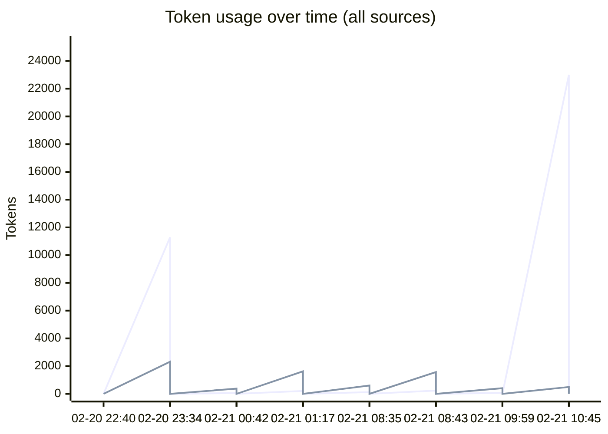
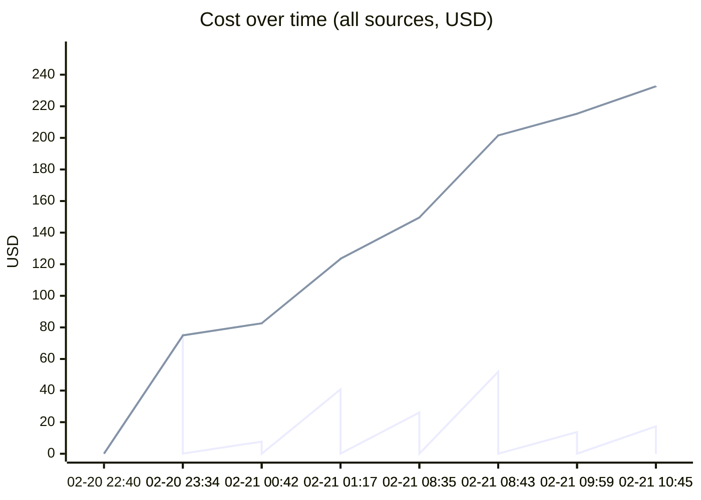
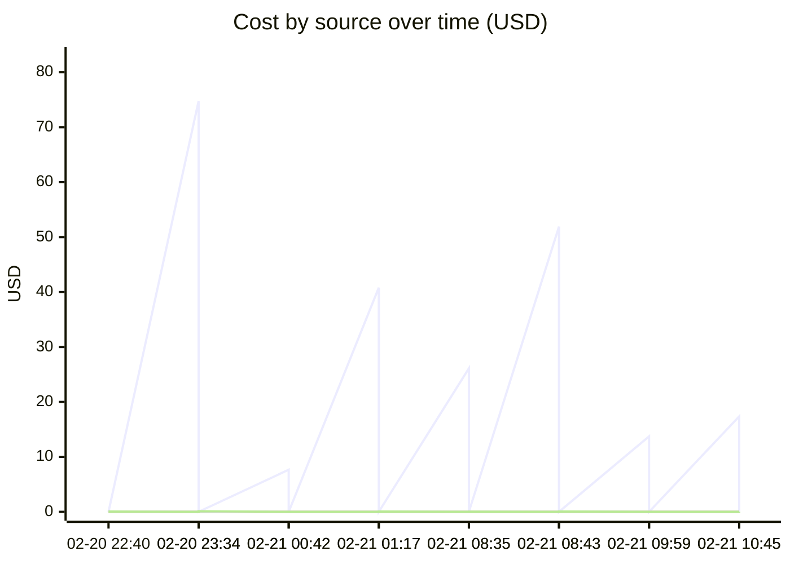

# Unified AI Usage Tracker

> Auto-updated cumulative usage from Claude, Cursor, runtime proxy, scripts, and MCP signals.

## Grand Total

| Metric | Value |
|--------|-------|
| Events | 80 |
| Requests | 3075 |
| Total tokens | 594.42M |
| Input tokens | 183.9k |
| Output tokens | 60.8k |
| Cache read | 573.05M |
| Cache create | 21.12M |
| Estimated cost | $1220.9301 |

## Segmented Totals by Source

| Source | Events | Requests | Total tokens | Input | Output | Cost |
|--------|--------|----------|--------------|-------|--------|------|
| Claude | 40 | 40 | 594.42M | 183.9k | 60.8k | $1219.4126 |
| MCP tools | 40 | 3035 | 0 | 0 | 0 | $1.5175 |

## Estimation Quality

| Source | Exact | Best effort | Unavailable |
|--------|-------|-------------|-------------|
| Claude | 0 | 40 | 0 |
| MCP tools | 0 | 40 | 0 |

## Daily Summary

| Date | Events | Tokens | Cost |
|------|--------|--------|------|
| 2026-02-21 | 22 | 141.98M | $303.8718 |
| 2026-02-20 | 58 | 452.44M | $917.0583 |

## Usage over time

## Recent Events

| Time | Source | Provider | Model | In | Out | Cost | Method |
|------|--------|----------|-------|----|-----|------|--------|
| 2026-02-21 15:45 | MCP tools | claude | mcp-tooling | 0 | 0 | $0.0140 | best_effort |
| 2026-02-21 15:45 | Claude | anthropic | claude-opus-4-6 | 23.0k | 496 | $17.3608 | best_effort |
| 2026-02-21 14:59 | MCP tools | claude | mcp-tooling | 0 | 0 | $0.0100 | best_effort |
| 2026-02-21 14:59 | Claude | anthropic | claude-opus-4-6,claude-haiku-4-5-20251001,<synthetic> | 73 | 407 | $13.7222 | best_effort |
| 2026-02-21 13:43 | MCP tools | claude | mcp-tooling | 0 | 0 | $0.0595 | best_effort |
| 2026-02-21 13:43 | Claude | anthropic | claude-opus-4-6 | 238 | 1.6k | $51.9066 | best_effort |
| 2026-02-21 13:35 | MCP tools | claude | mcp-tooling | 0 | 0 | $0.0275 | best_effort |
| 2026-02-21 13:35 | Claude | anthropic | claude-opus-4-6,<synthetic> | 128 | 599 | $26.1021 | best_effort |
| 2026-02-21 06:17 | MCP tools | claude | mcp-tooling | 0 | 0 | $0.0540 | best_effort |
| 2026-02-21 06:17 | Claude | anthropic | claude-opus-4-6 | 213 | 1.6k | $40.7930 | best_effort |
| 2026-02-21 05:42 | MCP tools | claude | mcp-tooling | 0 | 0 | $0.0110 | best_effort |
| 2026-02-21 05:42 | Claude | anthropic | claude-opus-4-6 | 58 | 378 | $7.6646 | best_effort |
| 2026-02-21 04:34 | MCP tools | claude | mcp-tooling | 0 | 0 | $0.1145 | best_effort |
| 2026-02-21 04:34 | Claude | anthropic | claude-haiku-4-5-20251001,claude-opus-4-6,<synthetic> | 11.3k | 2.3k | $74.7590 | best_effort |
| 2026-02-21 03:40 | MCP tools | claude | mcp-tooling | 0 | 0 | $0.0565 | best_effort |
| 2026-02-21 03:40 | Claude | anthropic | claude-opus-4-6 | 20.9k | 1.9k | $60.6375 | best_effort |
| 2026-02-21 01:38 | MCP tools | claude | mcp-tooling | 0 | 0 | $0.0045 | best_effort |
| 2026-02-21 01:38 | Claude | anthropic | claude-opus-4-6,claude-haiku-4-5-20251001 | 76 | 195 | $2.9062 | best_effort |
| 2026-02-21 01:01 | MCP tools | claude | mcp-tooling | 0 | 0 | $0.0060 | best_effort |
| 2026-02-21 01:01 | Claude | anthropic | claude-opus-4-6 | 36 | 235 | $4.2616 | best_effort |

---
*Last updated: 2026-02-21 15:45:37 UTC*
