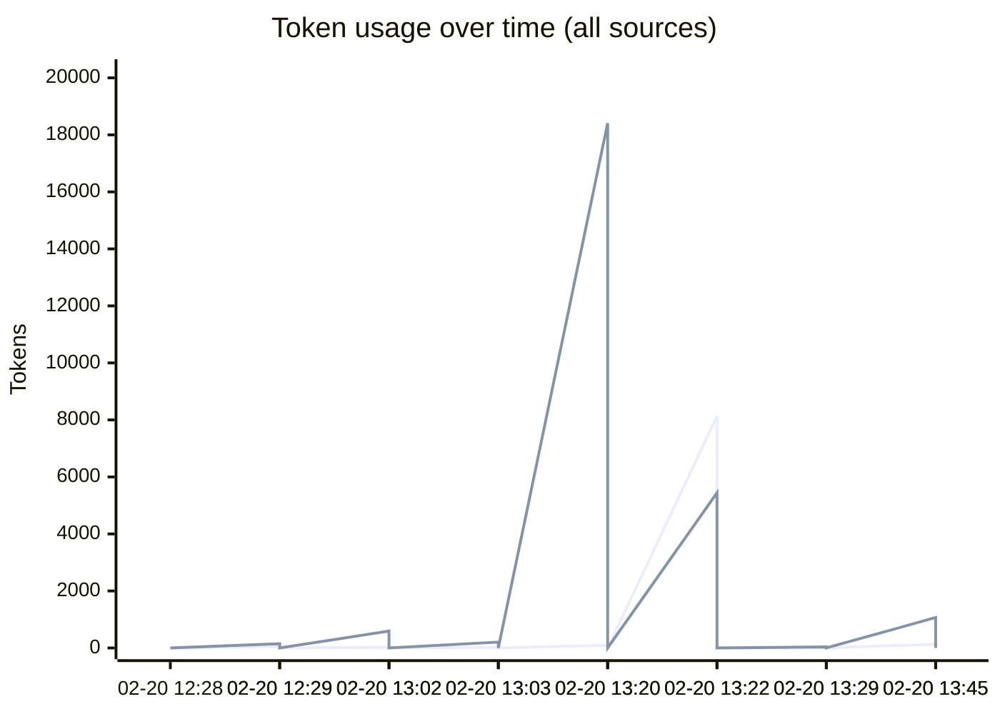
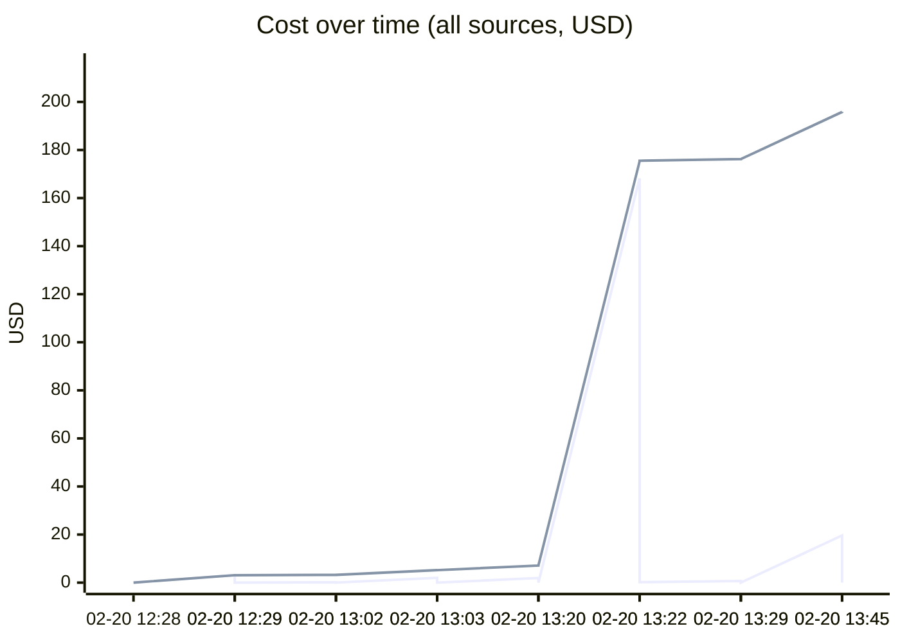
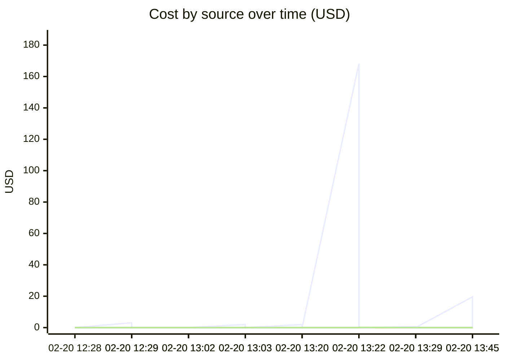

# Unified AI Usage Tracker

> Auto-updated cumulative usage from Claude, Cursor, runtime proxy, scripts, and MCP signals.

## Grand Total

| Metric | Value |
|--------|-------|
| Events | 44 |
| Requests | 1776 |
| Total tokens | 335.80M |
| Input tokens | 57.9k |
| Output tokens | 42.2k |
| Cache read | 326.23M |
| Cache create | 9.47M |
| Estimated cost | $663.7118 |

## Segmented Totals by Source

| Source | Events | Requests | Total tokens | Input | Output | Cost |
|--------|--------|----------|--------------|-------|--------|------|
| Claude | 22 | 22 | 335.80M | 57.9k | 42.2k | $662.8348 |
| MCP tools | 22 | 1754 | 0 | 0 | 0 | $0.8770 |

## Estimation Quality

| Source | Exact | Best effort | Unavailable |
|--------|-------|-------------|-------------|
| Claude | 0 | 22 | 0 |
| MCP tools | 0 | 22 | 0 |

## Daily Summary

| Date | Events | Tokens | Cost |
|------|--------|--------|------|
| 2026-02-20 | 44 | 335.80M | $663.7118 |

## Usage over time

## Recent Events

| Time | Source | Provider | Model | In | Out | Cost | Method |
|------|--------|----------|-------|----|-----|------|--------|
| 2026-02-20 18:45 | MCP tools | claude | mcp-tooling | 0 | 0 | $0.0260 | best_effort |
| 2026-02-20 18:45 | Claude | anthropic | claude-opus-4-6 | 132 | 1.1k | $19.6177 | best_effort |
| 2026-02-20 18:29 | MCP tools | claude | mcp-tooling | 0 | 0 | $0.0005 | best_effort |
| 2026-02-20 18:29 | Claude | anthropic | claude-opus-4-6 | 10 | 40 | $0.6770 | best_effort |
| 2026-02-20 18:22 | MCP tools | claude | mcp-tooling | 0 | 0 | $0.2005 | best_effort |
| 2026-02-20 18:22 | Claude | anthropic | claude-opus-4-6 | 8.1k | 5.4k | $168.2038 | best_effort |
| 2026-02-20 18:20 | MCP tools | claude | mcp-tooling | 0 | 0 | $0.0170 | best_effort |
| 2026-02-20 18:20 | Claude | anthropic | claude-sonnet-4-6 | 93 | 18.4k | $1.9080 | best_effort |
| 2026-02-20 18:03 | MCP tools | claude | mcp-tooling | 0 | 0 | $0.0040 | best_effort |
| 2026-02-20 18:03 | Claude | anthropic | claude-opus-4-6 | 22 | 204 | $1.9817 | best_effort |
| 2026-02-20 18:02 | MCP tools | claude | mcp-tooling | 0 | 0 | $0.0010 | best_effort |
| 2026-02-20 18:02 | Claude | anthropic | claude-sonnet-4-6 | 25 | 594 | $0.1351 | best_effort |
| 2026-02-20 17:29 | MCP tools | claude | mcp-tooling | 0 | 0 | $0.0025 | best_effort |
| 2026-02-20 17:29 | Claude | anthropic | claude-opus-4-6 | 57 | 148 | $3.0749 | best_effort |
| 2026-02-20 17:28 | MCP tools | claude | mcp-tooling | 0 | 0 | $0.0005 | best_effort |
| 2026-02-20 17:28 | Claude | anthropic | claude-opus-4-6 | 8 | 46 | $1.0889 | best_effort |
| 2026-02-20 17:25 | MCP tools | claude | mcp-tooling | 0 | 0 | $0.0115 | best_effort |
| 2026-02-20 17:25 | Claude | anthropic | claude-opus-4-6 | 112 | 609 | $13.7153 | best_effort |
| 2026-02-20 17:04 | MCP tools | claude | mcp-tooling | 0 | 0 | $0.0040 | best_effort |
| 2026-02-20 17:04 | Claude | anthropic | claude-opus-4-6 | 25 | 201 | $2.4067 | best_effort |

---
*Last updated: 2026-02-20 18:45:42 UTC*
