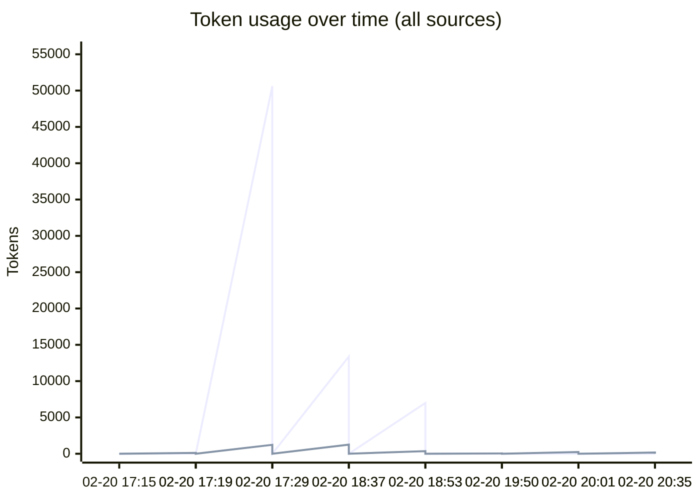
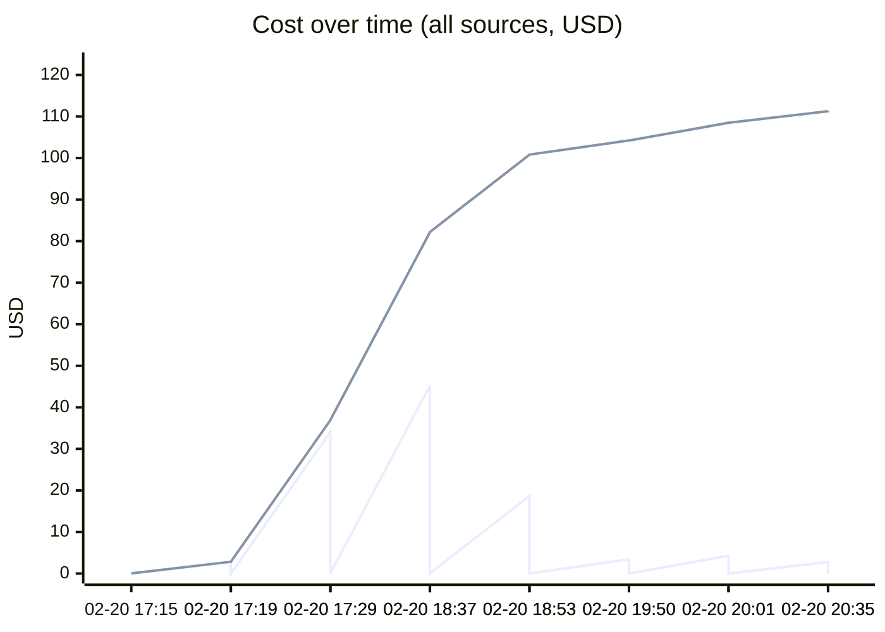
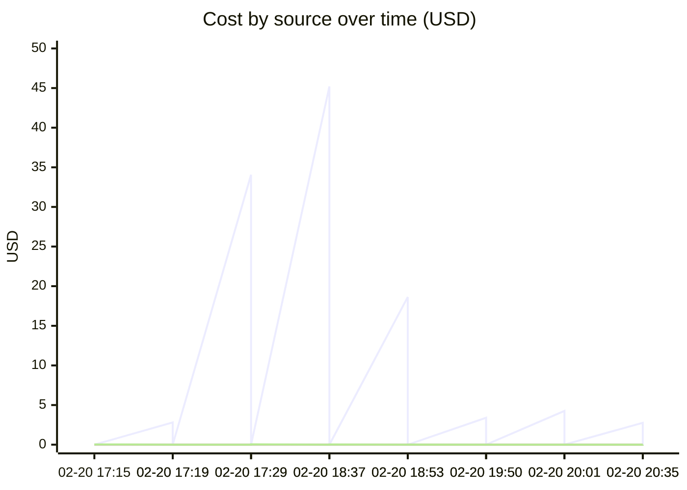

# Unified AI Usage Tracker

> Auto-updated cumulative usage from Claude, Cursor, runtime proxy, scripts, and MCP signals.

## Grand Total

| Metric | Value |
|--------|-------|
| Events | 66 |
| Requests | 2446 |
| Total tokens | 471.51M |
| Input tokens | 141.3k |
| Output tokens | 52.8k |
| Cache read | 455.72M |
| Cache create | 15.59M |
| Estimated cost | $972.7319 |

## Segmented Totals by Source

| Source | Events | Requests | Total tokens | Input | Output | Cost |
|--------|--------|----------|--------------|-------|--------|------|
| Claude | 33 | 33 | 471.51M | 141.3k | 52.8k | $971.5254 |
| MCP tools | 33 | 2413 | 0 | 0 | 0 | $1.2065 |

## Estimation Quality

| Source | Exact | Best effort | Unavailable |
|--------|-------|-------------|-------------|
| Claude | 0 | 33 | 0 |
| MCP tools | 0 | 33 | 0 |

## Daily Summary

| Date | Events | Tokens | Cost |
|------|--------|--------|------|
| 2026-02-21 | 6 | 3.18M | $10.4365 |
| 2026-02-20 | 60 | 468.33M | $962.2954 |

## Usage over time

## Recent Events

| Time | Source | Provider | Model | In | Out | Cost | Method |
|------|--------|----------|-------|----|-----|------|--------|
| 2026-02-21 01:35 | MCP tools | claude | mcp-tooling | 0 | 0 | $0.0035 | best_effort |
| 2026-02-21 01:35 | Claude | anthropic | claude-opus-4-6 | 24 | 165 | $2.7648 | best_effort |
| 2026-02-21 01:01 | MCP tools | claude | mcp-tooling | 0 | 0 | $0.0060 | best_effort |
| 2026-02-21 01:01 | Claude | anthropic | claude-opus-4-6 | 36 | 235 | $4.2616 | best_effort |
| 2026-02-21 00:50 | MCP tools | claude | mcp-tooling | 0 | 0 | $0.0005 | best_effort |
| 2026-02-21 00:50 | Claude | anthropic | claude-opus-4-6,claude-haiku-4-5-20251001 | 31 | 45 | $3.4002 | best_effort |
| 2026-02-20 23:53 | MCP tools | claude | mcp-tooling | 0 | 0 | $0.0110 | best_effort |
| 2026-02-20 23:53 | Claude | anthropic | claude-opus-4-6 | 7.0k | 363 | $18.6302 | best_effort |
| 2026-02-20 23:37 | MCP tools | claude | mcp-tooling | 0 | 0 | $0.0370 | best_effort |
| 2026-02-20 23:37 | Claude | anthropic | claude-opus-4-6 | 13.4k | 1.3k | $45.2001 | best_effort |
| 2026-02-20 22:29 | MCP tools | claude | mcp-tooling | 0 | 0 | $0.0460 | best_effort |
| 2026-02-20 22:29 | Claude | anthropic | claude-opus-4-6,<synthetic> | 50.6k | 1.2k | $34.0588 | best_effort |
| 2026-02-20 22:19 | MCP tools | claude | mcp-tooling | 0 | 0 | $0.0050 | best_effort |
| 2026-02-20 22:19 | Claude | anthropic | claude-opus-4-6 | 28 | 114 | $2.8004 | best_effort |
| 2026-02-20 22:15 | MCP tools | claude | mcp-tooling | 0 | 0 | $0.0355 | best_effort |
| 2026-02-20 22:15 | Claude | anthropic | claude-opus-4-6 | 179 | 1.2k | $30.7421 | best_effort |
| 2026-02-20 21:35 | MCP tools | claude | mcp-tooling | 0 | 0 | $0.0580 | best_effort |
| 2026-02-20 21:35 | Claude | anthropic | claude-opus-4-6 | 2.6k | 2.1k | $46.7208 | best_effort |
| 2026-02-20 20:35 | MCP tools | claude | mcp-tooling | 0 | 0 | $0.0540 | best_effort |
| 2026-02-20 20:35 | Claude | anthropic | claude-opus-4-6 | 8.9k | 1.5k | $52.2465 | best_effort |

---
*Last updated: 2026-02-21 01:35:41 UTC*
