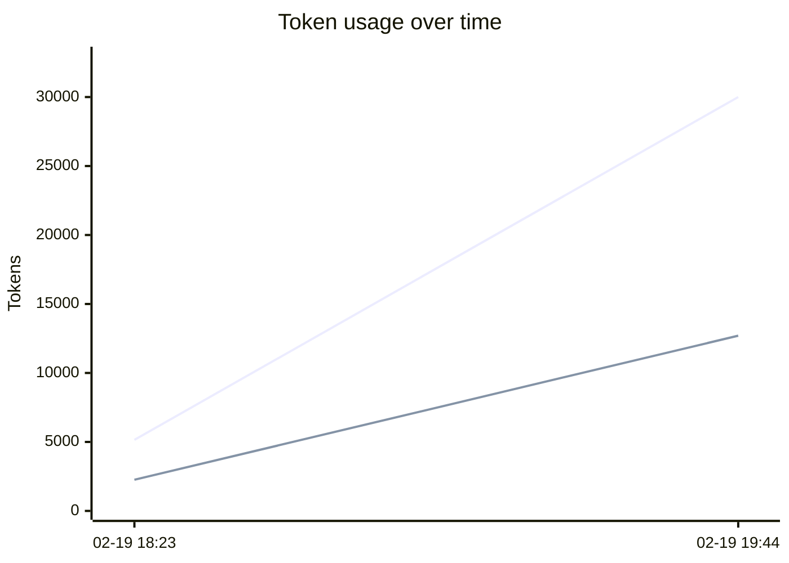
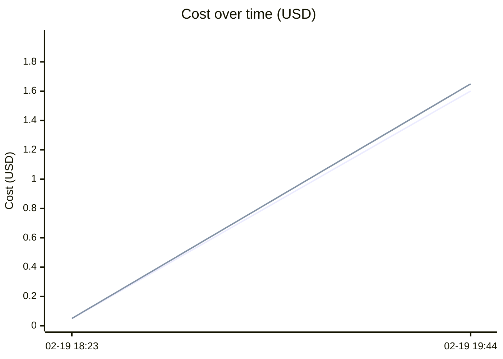

# Usage Tracker

> Auto-updated by Claude Code / Cursor stop hook

## Totals

| Metric | Value |
|--------|-------|
| Sessions | 2 |
| Total tokens | 151.2k |
| Input tokens | 35.1k |
| Output tokens | 15.0k |
| Cache read | 97.9k |
| Cache create | 3.2k |
| Estimated cost | $1.6498 |

## Daily Summary

| Date | Sessions | Tokens | Cost |
|------|----------|--------|------|
| 2026-02-20 | 1 | 140.7k | $1.6012 |
| 2026-02-19 | 1 | 10.5k | $0.0485 |

## Usage over time

## Recent Sessions

| Time | Model(s) | In | Out | Cache | Cost |
|------|----------|----|-----|-------|------|
| 2026-02-20 00:44 | claude-opus | 30.0k | 12.7k | 98.0k | $1.6012 |
| 2026-02-19 23:23 | claude-sonnet, claude-haiku | 5.2k | 2.3k | 3.1k | $0.0485 |

---
*Last updated: 2026-02-20 00:44:07 UTC*
