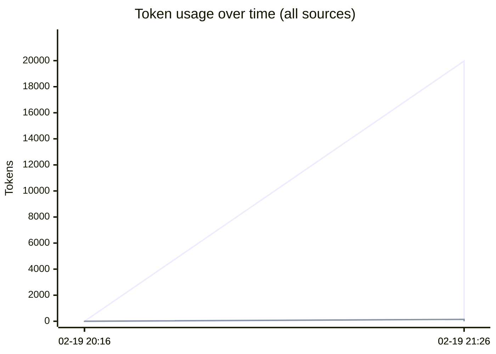
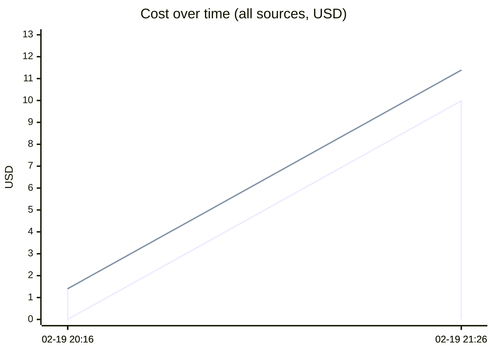
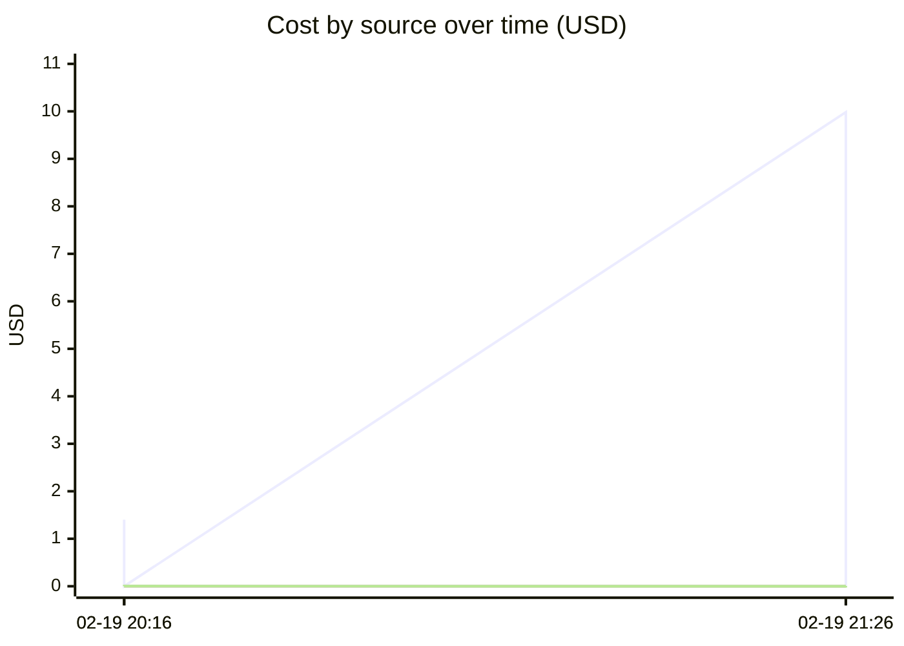

# Unified AI Usage Tracker

> Auto-updated cumulative usage from Claude, Cursor, runtime proxy, scripts, and MCP signals.

## Grand Total

| Metric | Value |
|--------|-------|
| Events | 4 |
| Requests | 22 |
| Total tokens | 2.56M |
| Input tokens | 20.0k |
| Output tokens | 180 |
| Cache read | 2.12M |
| Cache create | 420.7k |
| Estimated cost | $11.3936 |

## Segmented Totals by Source

| Source | Events | Requests | Total tokens | Input | Output | Cost |
|--------|--------|----------|--------------|-------|--------|------|
| Claude | 2 | 2 | 2.56M | 20.0k | 180 | $11.3836 |
| MCP tools | 2 | 20 | 0 | 0 | 0 | $0.0100 |

## Estimation Quality

| Source | Exact | Best effort | Unavailable |
|--------|-------|-------------|-------------|
| Claude | 0 | 2 | 0 |
| MCP tools | 0 | 2 | 0 |

## Daily Summary

| Date | Events | Tokens | Cost |
|------|--------|--------|------|
| 2026-02-20 | 4 | 2.56M | $11.3936 |

## Usage over time

## Recent Events

| Time | Source | Provider | Model | In | Out | Cost | Method |
|------|--------|----------|-------|----|-----|------|--------|
| 2026-02-20 02:26 | MCP tools | claude | mcp-tooling | 0 | 0 | $0.0075 | best_effort |
| 2026-02-20 02:26 | Claude | anthropic | claude-opus-4-6 | 20.0k | 146 | $9.9826 | best_effort |
| 2026-02-20 01:16 | MCP tools | claude | mcp-tooling | 0 | 0 | $0.0025 | best_effort |
| 2026-02-20 01:16 | Claude | anthropic | claude-opus-4-6 | 12 | 34 | $1.4010 | best_effort |

---
*Last updated: 2026-02-20 02:26:27 UTC*
