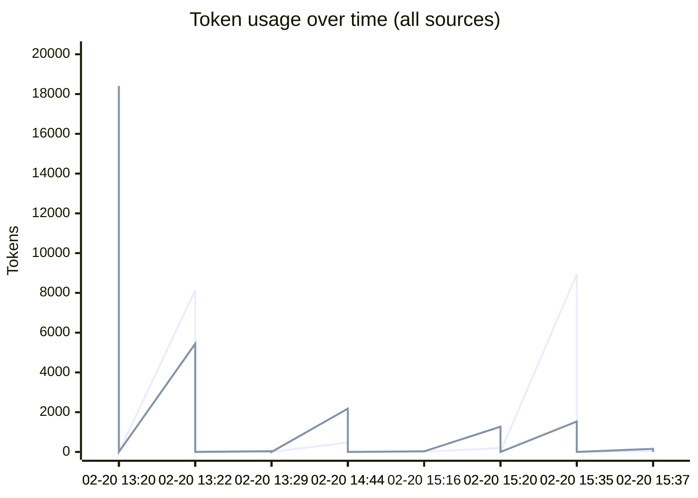
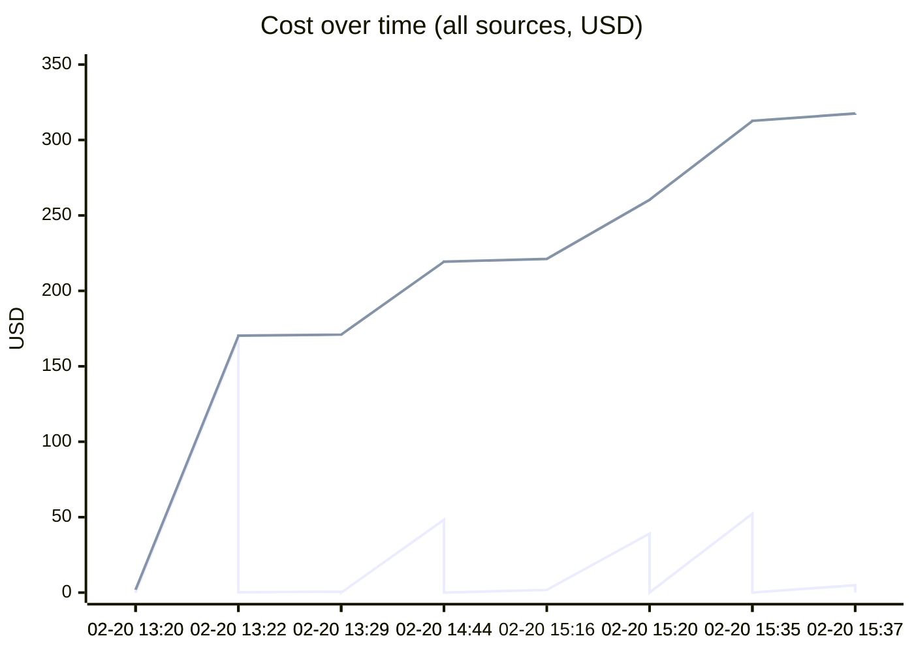
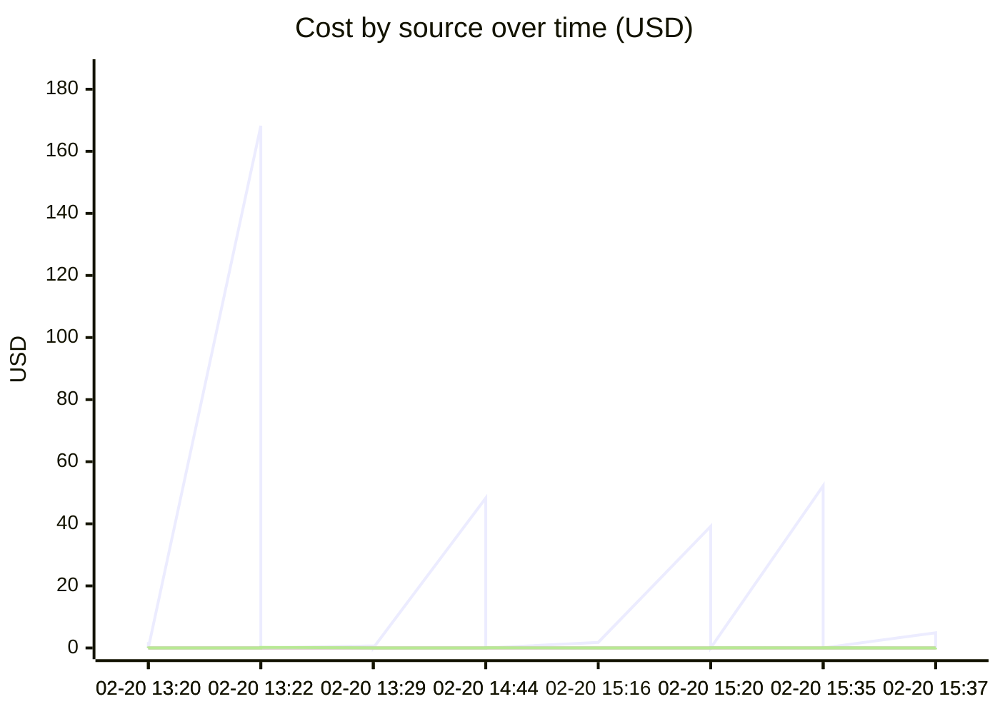

# Unified AI Usage Tracker

> Auto-updated cumulative usage from Claude, Cursor, runtime proxy, scripts, and MCP signals.

## Grand Total

| Metric | Value |
|--------|-------|
| Events | 51 |
| Requests | 2040 |
| Total tokens | 393.27M |
| Input tokens | 67.5k |
| Output tokens | 46.3k |
| Cache read | 381.36M |
| Cache create | 11.80M |
| Estimated cost | $790.6147 |

## Segmented Totals by Source

| Source | Events | Requests | Total tokens | Input | Output | Cost |
|--------|--------|----------|--------------|-------|--------|------|
| Claude | 26 | 26 | 393.27M | 67.5k | 46.3k | $789.6077 |
| MCP tools | 25 | 2014 | 0 | 0 | 0 | $1.0070 |

## Estimation Quality

| Source | Exact | Best effort | Unavailable |
|--------|-------|-------------|-------------|
| Claude | 0 | 26 | 0 |
| MCP tools | 0 | 25 | 0 |

## Daily Summary

| Date | Events | Tokens | Cost |
|------|--------|--------|------|
| 2026-02-20 | 51 | 393.27M | $790.6147 |

## Usage over time

## Recent Events

| Time | Source | Provider | Model | In | Out | Cost | Method |
|------|--------|----------|-------|----|-----|------|--------|
| 2026-02-20 20:37 | MCP tools | claude | mcp-tooling | 0 | 0 | $0.0030 | best_effort |
| 2026-02-20 20:37 | Claude | anthropic | claude-opus-4-6 | 34 | 158 | $4.8762 | best_effort |
| 2026-02-20 20:35 | MCP tools | claude | mcp-tooling | 0 | 0 | $0.0540 | best_effort |
| 2026-02-20 20:35 | Claude | anthropic | claude-opus-4-6 | 8.9k | 1.5k | $52.2465 | best_effort |
| 2026-02-20 20:20 | MCP tools | claude | mcp-tooling | 0 | 0 | $0.0430 | best_effort |
| 2026-02-20 20:20 | Claude | anthropic | claude-opus-4-6 | 194 | 1.3k | $39.1799 | best_effort |
| 2026-02-20 20:16 | Claude | anthropic | claude-opus-4-6 | 9 | 30 | $1.7851 | best_effort |
| 2026-02-20 19:44 | MCP tools | claude | mcp-tooling | 0 | 0 | $0.0560 | best_effort |
| 2026-02-20 19:44 | Claude | anthropic | claude-opus-4-6,<synthetic> | 476 | 2.2k | $48.3031 | best_effort |
| 2026-02-20 18:29 | MCP tools | claude | mcp-tooling | 0 | 0 | $0.0005 | best_effort |
| 2026-02-20 18:29 | Claude | anthropic | claude-opus-4-6 | 10 | 40 | $0.6770 | best_effort |
| 2026-02-20 18:22 | MCP tools | claude | mcp-tooling | 0 | 0 | $0.2005 | best_effort |
| 2026-02-20 18:22 | Claude | anthropic | claude-opus-4-6 | 8.1k | 5.4k | $168.2038 | best_effort |
| 2026-02-20 18:20 | MCP tools | claude | mcp-tooling | 0 | 0 | $0.0170 | best_effort |
| 2026-02-20 18:20 | Claude | anthropic | claude-sonnet-4-6 | 93 | 18.4k | $1.9080 | best_effort |
| 2026-02-20 18:03 | MCP tools | claude | mcp-tooling | 0 | 0 | $0.0040 | best_effort |
| 2026-02-20 18:03 | Claude | anthropic | claude-opus-4-6 | 22 | 204 | $1.9817 | best_effort |
| 2026-02-20 18:02 | MCP tools | claude | mcp-tooling | 0 | 0 | $0.0010 | best_effort |
| 2026-02-20 18:02 | Claude | anthropic | claude-sonnet-4-6 | 25 | 594 | $0.1351 | best_effort |
| 2026-02-20 17:29 | MCP tools | claude | mcp-tooling | 0 | 0 | $0.0025 | best_effort |

---
*Last updated: 2026-02-20 20:37:29 UTC*
