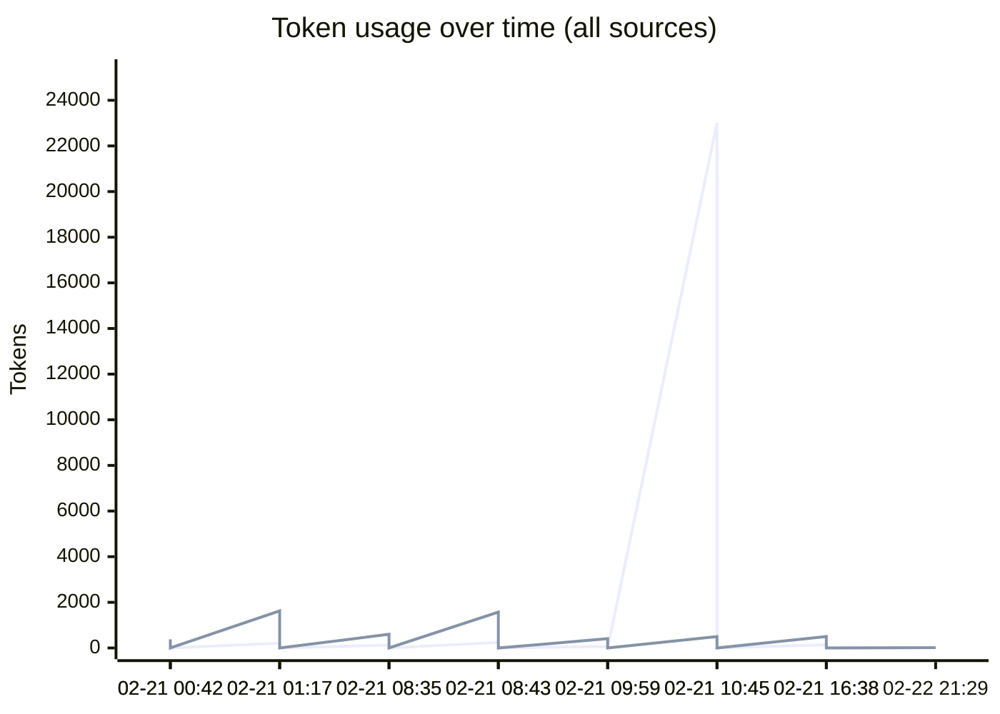
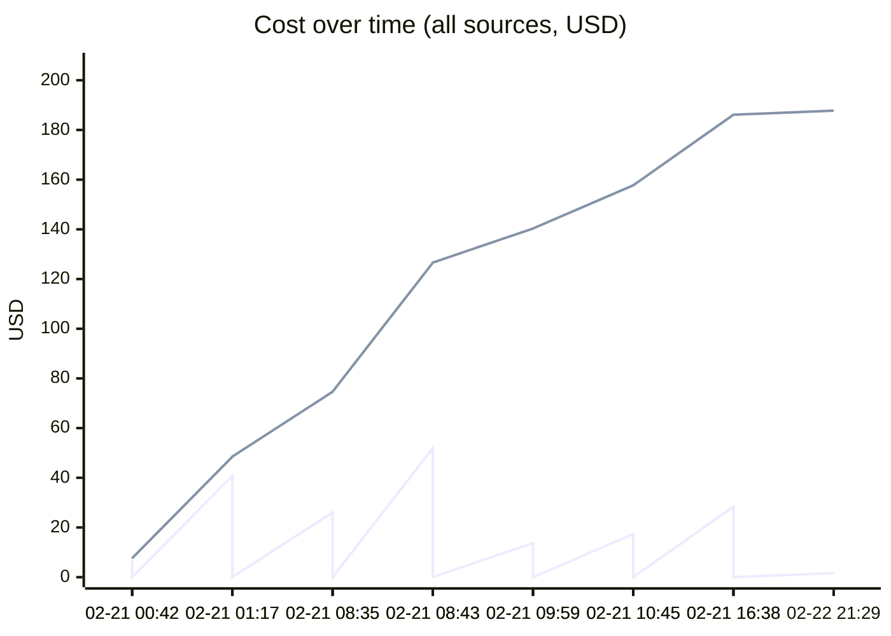
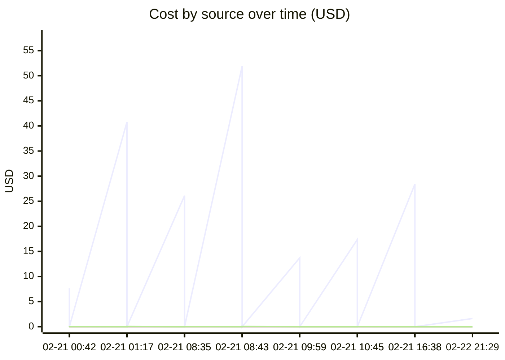

# Unified AI Usage Tracker

> Auto-updated cumulative usage from Claude, Cursor, runtime proxy, scripts, and MCP signals.

## Grand Total

| Metric | Value |
|--------|-------|
| Events | 83 |
| Requests | 3108 |
| Total tokens | 601.13M |
| Input tokens | 184.0k |
| Output tokens | 61.3k |
| Cache read | 578.41M |
| Cache create | 22.47M |
| Estimated cost | $1250.9677 |

## Segmented Totals by Source

| Source | Events | Requests | Total tokens | Input | Output | Cost |
|--------|--------|----------|--------------|-------|--------|------|
| Claude | 42 | 42 | 601.13M | 184.0k | 61.3k | $1249.4347 |
| MCP tools | 41 | 3066 | 0 | 0 | 0 | $1.5330 |

## Estimation Quality

| Source | Exact | Best effort | Unavailable |
|--------|-------|-------------|-------------|
| Claude | 0 | 42 | 0 |
| MCP tools | 0 | 41 | 0 |

## Daily Summary

| Date | Events | Tokens | Cost |
|------|--------|--------|------|
| 2026-02-23 | 1 | 540.9k | $1.6266 |
| 2026-02-21 | 24 | 148.15M | $332.2828 |
| 2026-02-20 | 58 | 452.44M | $917.0583 |

## Usage over time

```mermaid
xychart-beta
    title "Token usage over time (all sources)"
    x-axis ["02-21 00:42", "02-21 00:42", "02-21 01:17", "02-21 01:17", "02-21 08:35", "02-21 08:35", "02-21 08:43", "02-21 08:43", "02-21 09:59", "02-21 09:59", "02-21 10:45", "02-21 10:45", "02-21 16:38", "02-21 16:38", "02-22 21:29"]
    y-axis "Tokens" 0 --> 25302
    line "Input" [58, 0, 213, 0, 128, 0, 238, 0, 73, 0, 23001, 0, 140, 0, 27]
    line "Output" [378, 0, 1624, 0, 599, 0, 1570, 0, 407, 0, 496, 0, 501, 0, 12]
```

```mermaid
xychart-beta
    title "Cost over time (all sources, USD)"
    x-axis ["02-21 00:42", "02-21 00:42", "02-21 01:17", "02-21 01:17", "02-21 08:35", "02-21 08:35", "02-21 08:43", "02-21 08:43", "02-21 09:59", "02-21 09:59", "02-21 10:45", "02-21 10:45", "02-21 16:38", "02-21 16:38", "02-22 21:29"]
    y-axis "USD" 0 --> 207
    line "Cost" [7.664612999999999, 0.011, 40.793046749999995, 0.054, 26.10212775, 0.0275, 51.90656625, 0.059500000000000004, 13.722154249999999, 0.01, 17.360798250000002, 0.014, 28.395460900000003, 0.0155, 1.62661275]
    line "Cumulative" [7.6646, 7.6756, 48.4687, 48.5227, 74.6248, 74.6523, 126.5589, 126.6184, 140.3405, 140.3505, 157.7113, 157.7253, 186.1208, 186.1363, 187.7629]
```

```mermaid
xychart-beta
    title "Cost by source over time (USD)"
    x-axis ["02-21 00:42", "02-21 00:42", "02-21 01:17", "02-21 01:17", "02-21 08:35", "02-21 08:35", "02-21 08:43", "02-21 08:43", "02-21 09:59", "02-21 09:59", "02-21 10:45", "02-21 10:45", "02-21 16:38", "02-21 16:38", "02-22 21:29"]
    y-axis "USD" 0 --> 58
    line "Claude" [7.664612999999999, 0, 40.793046749999995, 0, 26.10212775, 0, 51.90656625, 0, 13.722154249999999, 0, 17.360798250000002, 0, 28.395460900000003, 0, 1.62661275]
    line "Cursor" [0, 0, 0, 0, 0, 0, 0, 0, 0, 0, 0, 0, 0, 0, 0]
    line "Runtime proxy" [0, 0, 0, 0, 0, 0, 0, 0, 0, 0, 0, 0, 0, 0, 0]
    line "Scripts" [0, 0, 0, 0, 0, 0, 0, 0, 0, 0, 0, 0, 0, 0, 0]
    line "MCP" [0, 0.011, 0, 0.054, 0, 0.0275, 0, 0.059500000000000004, 0, 0.01, 0, 0.014, 0, 0.0155, 0]
```

## Recent Events

| Time | Source | Provider | Model | In | Out | Cost | Method |
|------|--------|----------|-------|----|-----|------|--------|
| 2026-02-23 02:29 | Claude | anthropic | claude-sonnet-4-6,claude-opus-4-6 | 27 | 12 | $1.6266 | best_effort |
| 2026-02-21 21:38 | MCP tools | claude | mcp-tooling | 0 | 0 | $0.0155 | best_effort |
| 2026-02-21 21:38 | Claude | anthropic | claude-opus-4-6,<synthetic>,claude-haiku-4-5-20251001 | 140 | 501 | $28.3955 | best_effort |
| 2026-02-21 15:45 | MCP tools | claude | mcp-tooling | 0 | 0 | $0.0140 | best_effort |
| 2026-02-21 15:45 | Claude | anthropic | claude-opus-4-6 | 23.0k | 496 | $17.3608 | best_effort |
| 2026-02-21 14:59 | MCP tools | claude | mcp-tooling | 0 | 0 | $0.0100 | best_effort |
| 2026-02-21 14:59 | Claude | anthropic | claude-opus-4-6,claude-haiku-4-5-20251001,<synthetic> | 73 | 407 | $13.7222 | best_effort |
| 2026-02-21 13:43 | MCP tools | claude | mcp-tooling | 0 | 0 | $0.0595 | best_effort |
| 2026-02-21 13:43 | Claude | anthropic | claude-opus-4-6 | 238 | 1.6k | $51.9066 | best_effort |
| 2026-02-21 13:35 | MCP tools | claude | mcp-tooling | 0 | 0 | $0.0275 | best_effort |
| 2026-02-21 13:35 | Claude | anthropic | claude-opus-4-6,<synthetic> | 128 | 599 | $26.1021 | best_effort |
| 2026-02-21 06:17 | MCP tools | claude | mcp-tooling | 0 | 0 | $0.0540 | best_effort |
| 2026-02-21 06:17 | Claude | anthropic | claude-opus-4-6 | 213 | 1.6k | $40.7930 | best_effort |
| 2026-02-21 05:42 | MCP tools | claude | mcp-tooling | 0 | 0 | $0.0110 | best_effort |
| 2026-02-21 05:42 | Claude | anthropic | claude-opus-4-6 | 58 | 378 | $7.6646 | best_effort |
| 2026-02-21 04:34 | MCP tools | claude | mcp-tooling | 0 | 0 | $0.1145 | best_effort |
| 2026-02-21 04:34 | Claude | anthropic | claude-haiku-4-5-20251001,claude-opus-4-6,<synthetic> | 11.3k | 2.3k | $74.7590 | best_effort |
| 2026-02-21 03:40 | MCP tools | claude | mcp-tooling | 0 | 0 | $0.0565 | best_effort |
| 2026-02-21 03:40 | Claude | anthropic | claude-opus-4-6 | 20.9k | 1.9k | $60.6375 | best_effort |
| 2026-02-21 01:38 | MCP tools | claude | mcp-tooling | 0 | 0 | $0.0045 | best_effort |

---
*Last updated: 2026-02-23 02:29:11 UTC*
