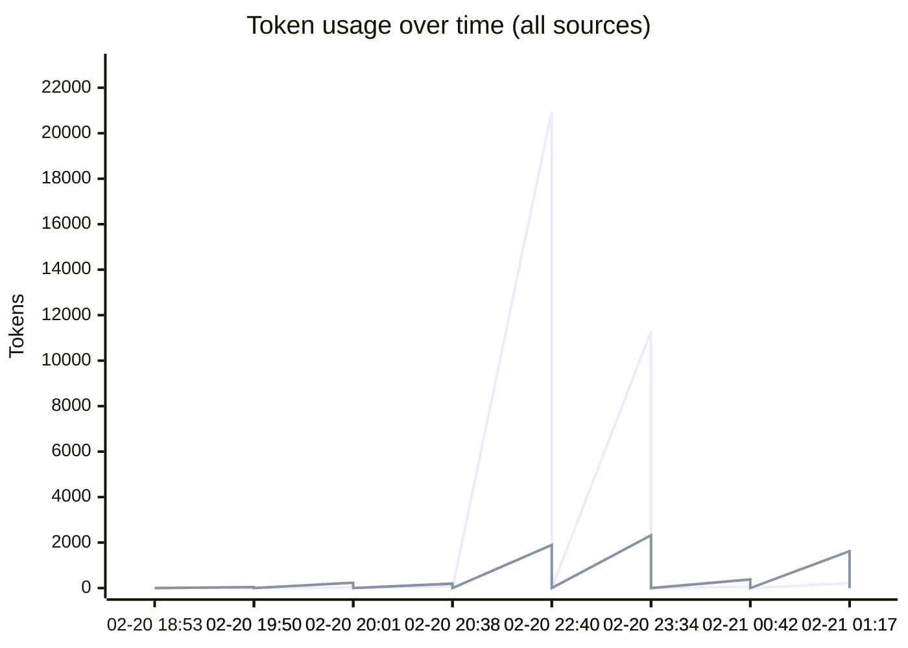
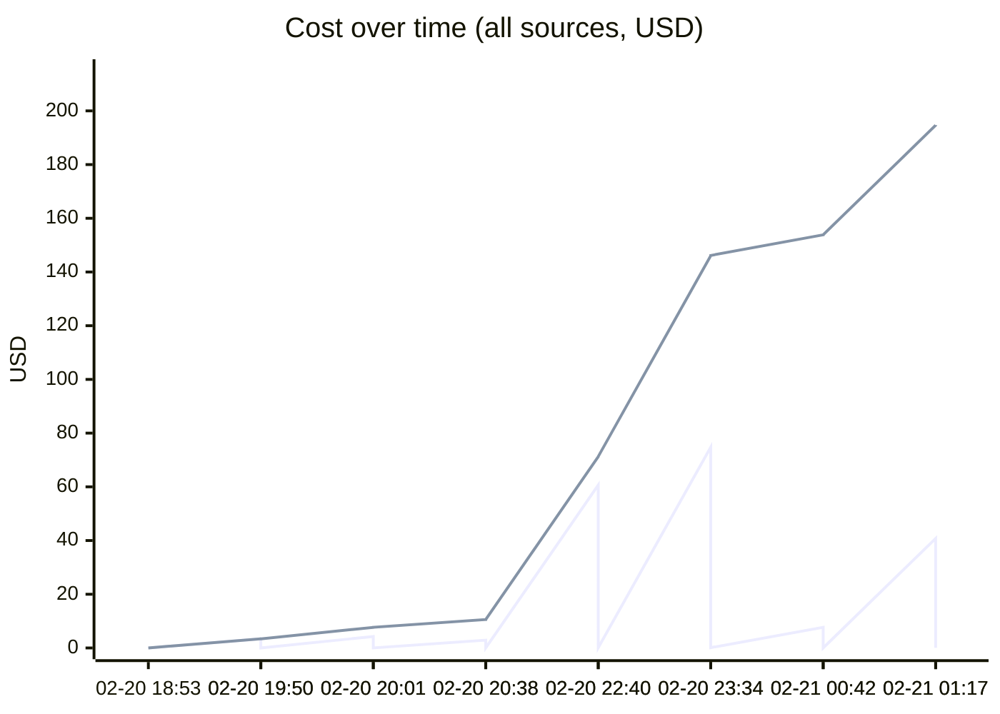
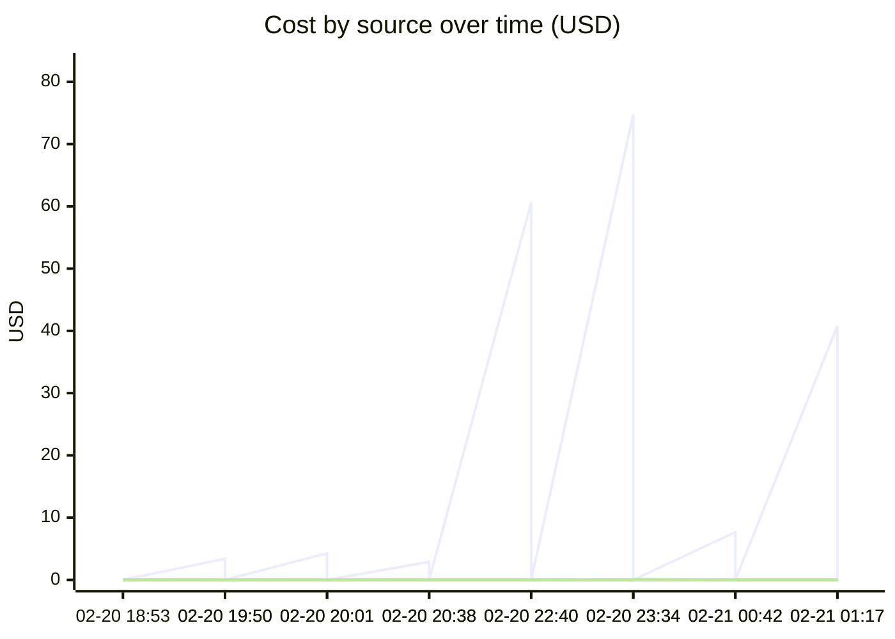

# Unified AI Usage Tracker

> Auto-updated cumulative usage from Claude, Cursor, runtime proxy, scripts, and MCP signals.

## Grand Total

| Metric | Value |
|--------|-------|
| Events | 72 |
| Requests | 2849 |
| Total tokens | 549.08M |
| Input tokens | 160.4k |
| Output tokens | 57.8k |
| Cache read | 530.24M |
| Cache create | 18.62M |
| Estimated cost | $1111.7275 |

## Segmented Totals by Source

| Source | Events | Requests | Total tokens | Input | Output | Cost |
|--------|--------|----------|--------------|-------|--------|------|
| Claude | 36 | 36 | 549.08M | 160.4k | 57.8k | $1110.3210 |
| MCP tools | 36 | 2813 | 0 | 0 | 0 | $1.4065 |

## Estimation Quality

| Source | Exact | Best effort | Unavailable |
|--------|-------|-------------|-------------|
| Claude | 0 | 36 | 0 |
| MCP tools | 0 | 36 | 0 |

## Daily Summary

| Date | Events | Tokens | Cost |
|------|--------|--------|------|
| 2026-02-21 | 14 | 96.64M | $194.6692 |
| 2026-02-20 | 58 | 452.44M | $917.0583 |

## Usage over time

## Recent Events

| Time | Source | Provider | Model | In | Out | Cost | Method |
|------|--------|----------|-------|----|-----|------|--------|
| 2026-02-21 06:17 | MCP tools | claude | mcp-tooling | 0 | 0 | $0.0540 | best_effort |
| 2026-02-21 06:17 | Claude | anthropic | claude-opus-4-6 | 213 | 1.6k | $40.7930 | best_effort |
| 2026-02-21 05:42 | MCP tools | claude | mcp-tooling | 0 | 0 | $0.0110 | best_effort |
| 2026-02-21 05:42 | Claude | anthropic | claude-opus-4-6 | 58 | 378 | $7.6646 | best_effort |
| 2026-02-21 04:34 | MCP tools | claude | mcp-tooling | 0 | 0 | $0.1145 | best_effort |
| 2026-02-21 04:34 | Claude | anthropic | claude-haiku-4-5-20251001,claude-opus-4-6,<synthetic> | 11.3k | 2.3k | $74.7590 | best_effort |
| 2026-02-21 03:40 | MCP tools | claude | mcp-tooling | 0 | 0 | $0.0565 | best_effort |
| 2026-02-21 03:40 | Claude | anthropic | claude-opus-4-6 | 20.9k | 1.9k | $60.6375 | best_effort |
| 2026-02-21 01:38 | MCP tools | claude | mcp-tooling | 0 | 0 | $0.0045 | best_effort |
| 2026-02-21 01:38 | Claude | anthropic | claude-opus-4-6,claude-haiku-4-5-20251001 | 76 | 195 | $2.9062 | best_effort |
| 2026-02-21 01:01 | MCP tools | claude | mcp-tooling | 0 | 0 | $0.0060 | best_effort |
| 2026-02-21 01:01 | Claude | anthropic | claude-opus-4-6 | 36 | 235 | $4.2616 | best_effort |
| 2026-02-21 00:50 | MCP tools | claude | mcp-tooling | 0 | 0 | $0.0005 | best_effort |
| 2026-02-21 00:50 | Claude | anthropic | claude-opus-4-6,claude-haiku-4-5-20251001 | 31 | 45 | $3.4002 | best_effort |
| 2026-02-20 23:53 | MCP tools | claude | mcp-tooling | 0 | 0 | $0.0110 | best_effort |
| 2026-02-20 23:53 | Claude | anthropic | claude-opus-4-6 | 7.0k | 363 | $18.6302 | best_effort |
| 2026-02-20 22:29 | MCP tools | claude | mcp-tooling | 0 | 0 | $0.0460 | best_effort |
| 2026-02-20 22:29 | Claude | anthropic | claude-opus-4-6,<synthetic> | 50.6k | 1.2k | $34.0588 | best_effort |
| 2026-02-20 22:19 | MCP tools | claude | mcp-tooling | 0 | 0 | $0.0050 | best_effort |
| 2026-02-20 22:19 | Claude | anthropic | claude-opus-4-6 | 28 | 114 | $2.8004 | best_effort |

---
*Last updated: 2026-02-21 06:17:09 UTC*
