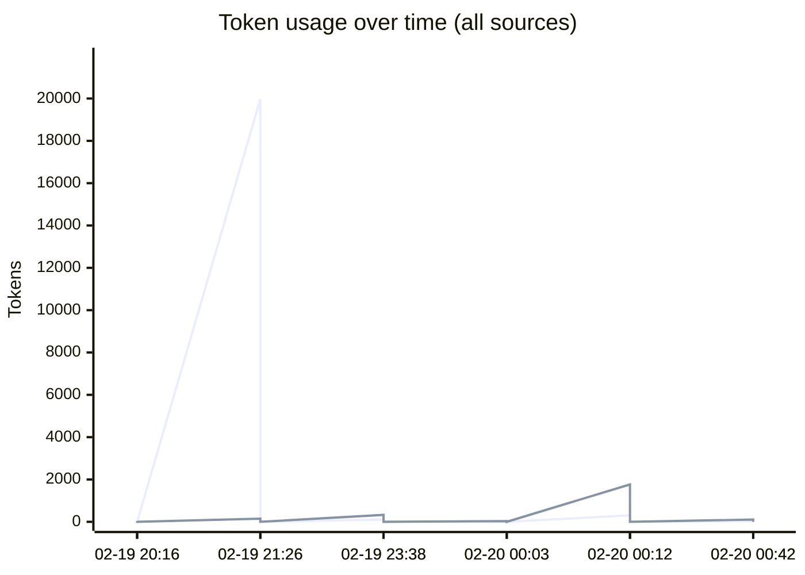
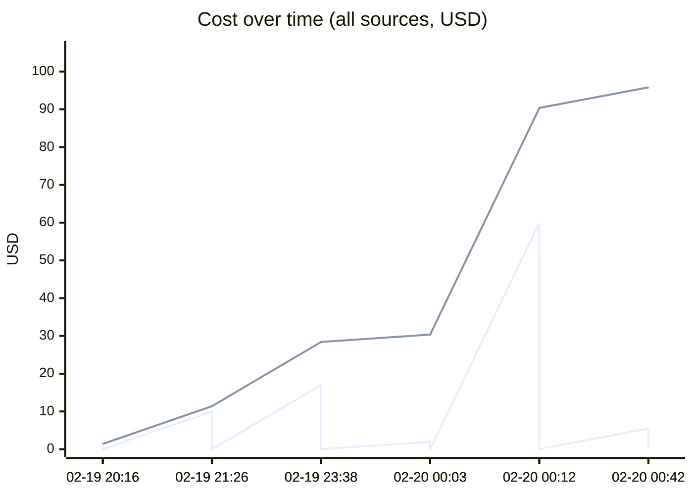
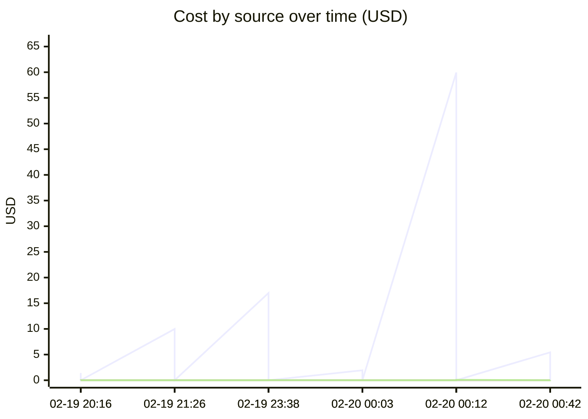

# Unified AI Usage Tracker

> Auto-updated cumulative usage from Claude, Cursor, runtime proxy, scripts, and MCP signals.

## Grand Total

| Metric | Value |
|--------|-------|
| Events | 12 |
| Requests | 266 |
| Total tokens | 44.82M |
| Input tokens | 20.4k |
| Output tokens | 2.4k |
| Cache read | 43.18M |
| Cache create | 1.62M |
| Estimated cost | $95.8311 |

## Segmented Totals by Source

| Source | Events | Requests | Total tokens | Input | Output | Cost |
|--------|--------|----------|--------------|-------|--------|------|
| Claude | 6 | 6 | 44.82M | 20.4k | 2.4k | $95.7011 |
| MCP tools | 6 | 260 | 0 | 0 | 0 | $0.1300 |

## Estimation Quality

| Source | Exact | Best effort | Unavailable |
|--------|-------|-------------|-------------|
| Claude | 0 | 6 | 0 |
| MCP tools | 0 | 6 | 0 |

## Daily Summary

| Date | Events | Tokens | Cost |
|------|--------|--------|------|
| 2026-02-20 | 12 | 44.82M | $95.8311 |

## Usage over time

## Recent Events

| Time | Source | Provider | Model | In | Out | Cost | Method |
|------|--------|----------|-------|----|-----|------|--------|
| 2026-02-20 05:42 | MCP tools | claude | mcp-tooling | 0 | 0 | $0.0085 | best_effort |
| 2026-02-20 05:42 | Claude | anthropic | claude-opus-4-6 | 38 | 106 | $5.4417 | best_effort |
| 2026-02-20 05:12 | MCP tools | claude | mcp-tooling | 0 | 0 | $0.0875 | best_effort |
| 2026-02-20 05:12 | Claude | anthropic | claude-opus-4-6 | 302 | 1.8k | $59.9457 | best_effort |
| 2026-02-20 05:03 | MCP tools | claude | mcp-tooling | 0 | 0 | $0.0015 | best_effort |
| 2026-02-20 05:03 | Claude | anthropic | claude-opus-4-6 | 15 | 36 | $1.9398 | best_effort |
| 2026-02-20 04:38 | MCP tools | claude | mcp-tooling | 0 | 0 | $0.0225 | best_effort |
| 2026-02-20 04:38 | Claude | anthropic | claude-opus-4-6 | 107 | 328 | $16.9902 | best_effort |
| 2026-02-20 02:26 | MCP tools | claude | mcp-tooling | 0 | 0 | $0.0075 | best_effort |
| 2026-02-20 02:26 | Claude | anthropic | claude-opus-4-6 | 20.0k | 146 | $9.9826 | best_effort |
| 2026-02-20 01:16 | MCP tools | claude | mcp-tooling | 0 | 0 | $0.0025 | best_effort |
| 2026-02-20 01:16 | Claude | anthropic | claude-opus-4-6 | 12 | 34 | $1.4010 | best_effort |

---
*Last updated: 2026-02-20 05:42:05 UTC*
