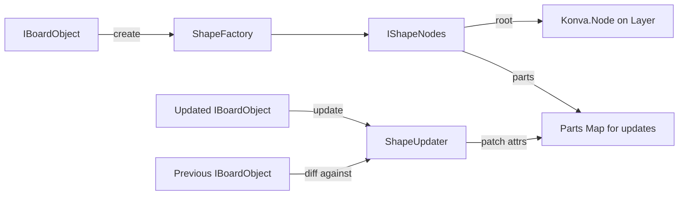
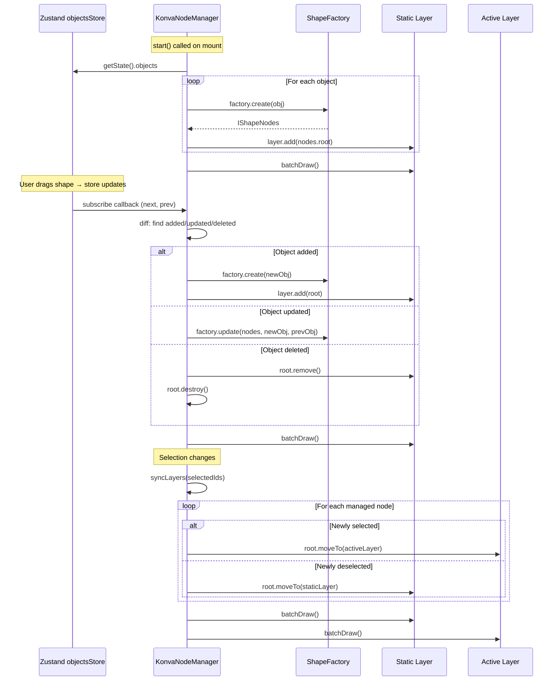
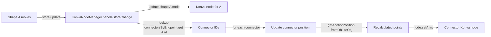
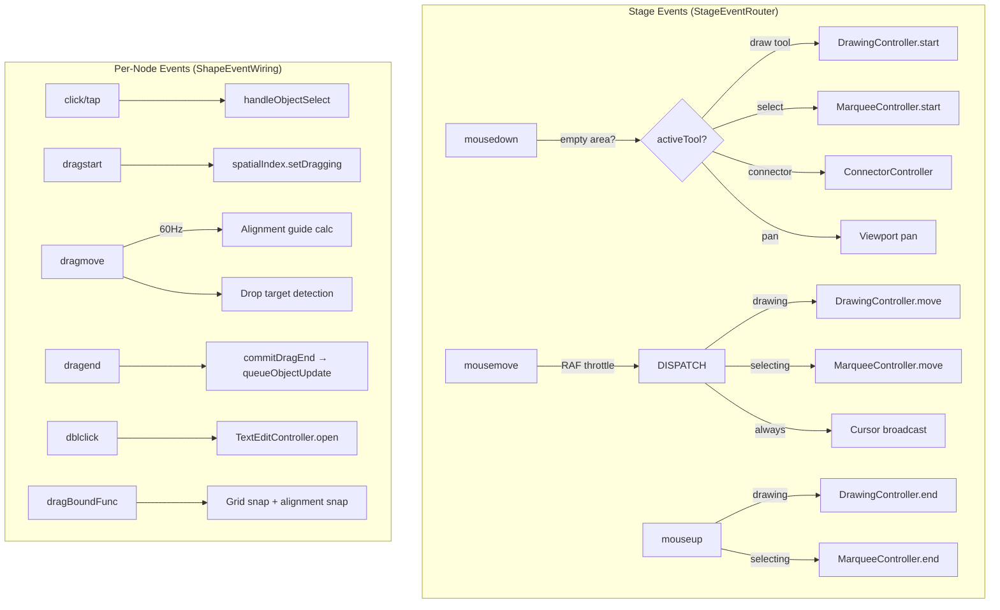
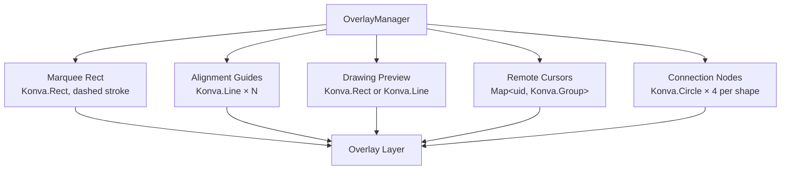
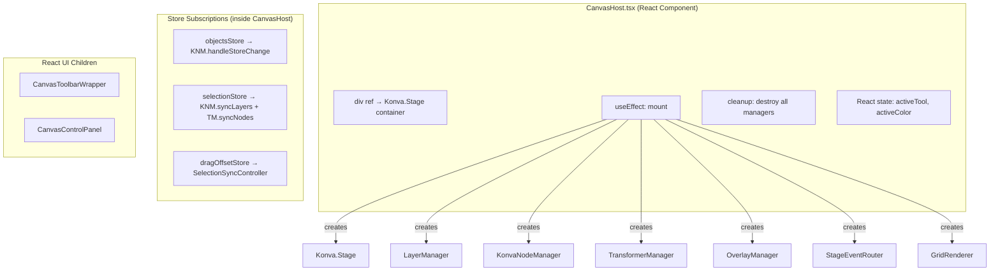
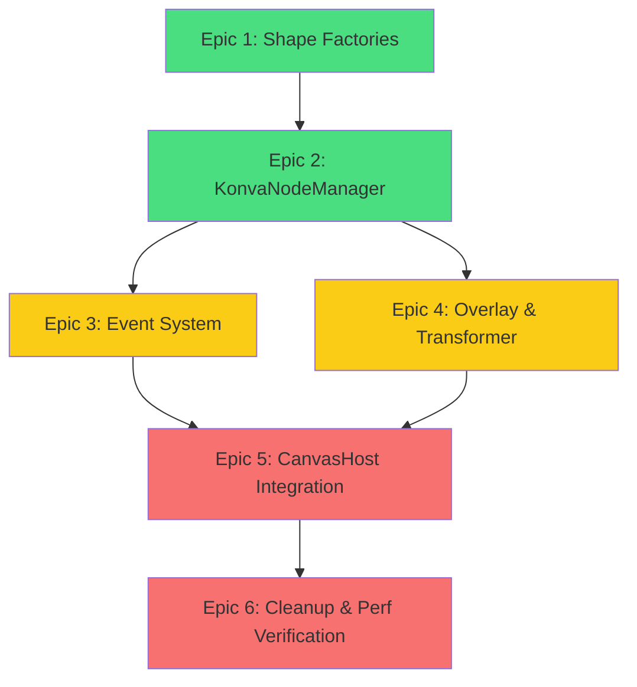

# Imperative Konva Migration Plan: Kill React-Konva, Keep Everything Else

## Context

**Problem:** React-Konva puts React reconciliation in the canvas rendering hot path. Every shape is a React component. Every state change triggers diffing, bridge translation, then Konva redraw — three layers of overhead per frame. No amount of `memo()`, selective subscriptions, or layer partitioning fixes the fundamental architecture: React was designed for DOM trees, not real-time canvas rendering.

**Evidence:** Zero fast whiteboard apps use React-Konva (Excalidraw: raw Canvas 2D, tldraw: custom Canvas 2D, Figma: WebGL+WASM, Miro: custom Canvas 2D). The pattern is universal — React for UI chrome, direct canvas for the board.

**Solution:** Replace the react-konva component tree with imperative Konva node management. The canvas becomes ONE React component (`CanvasHost`) holding a `Konva.Stage` ref. All shapes are Konva nodes created/updated/destroyed by a `KonvaNodeManager` class that subscribes directly to the Zustand store. React never touches canvas internals.

**Outcome:** Eliminate React reconciliation of N shape components from drag/zoom/pan hot paths. Direct `node.setAttrs()` + `layer.batchDraw()` — microseconds, not milliseconds. Zero `memo()` comparisons, zero Zustand selector evaluations per shape per frame.

---

## Architecture Overview

```mermaid
graph TB
    subgraph "React World (UI Chrome)"
        CH[CanvasHost.tsx<br/>Single React Component]
        TB[CanvasToolbarWrapper]
        CP[CanvasControlPanel]
        PI[PropertyInspector]
        AT[AlignToolbar]
    end

    subgraph "Zustand Stores (UNCHANGED)"
        OS[useObjectsStore<br/>objects, indexes]
        SS[useSelectionStore<br/>selectedIds]
        DS[useDragOffsetStore<br/>transient drag state]
        HS[useHistoryStore<br/>undo/redo]
    end

    subgraph "Imperative Canvas (NEW)"
        KNM[KonvaNodeManager<br/>Map&lt;id, IManagedNode&gt;]
        LM[LayerManager<br/>static / active / overlay / selection]
        TM[TransformerManager<br/>Konva.Transformer]
        OM[OverlayManager<br/>marquee, guides, cursors]
        SER[StageEventRouter<br/>mouse dispatch by tool]
        SEW[ShapeEventWiring<br/>per-node click/drag/dblclick]
        SF[Shape Factories<br/>create + update per type]
    end

    subgraph "Persistence (UNCHANGED)"
        WQ[writeQueue.ts<br/>500ms debounce + coalesce]
        OBJ[objectService.ts<br/>Firestore CRUD]
        RT[realtimeService.ts<br/>cursors via RTDB]
    end

    subgraph "Konva Runtime"
        ST[Konva.Stage]
        SL[Layer: static]
        AL[Layer: active]
        OL[Layer: overlay]
        XL[Layer: selection]
    end

    CH -->|ref| ST
    CH -->|instantiates| KNM
    CH -->|instantiates| LM
    CH -->|instantiates| TM
    CH -->|instantiates| OM
    CH -->|instantiates| SER

    OS -.->|subscribe()| KNM
    SS -.->|subscribe()| KNM
    DS -.->|subscribe()| OM

    KNM -->|create/update/destroy| SL
    KNM -->|move selected nodes| AL
    KNM -->|uses| SF
    KNM -->|wires events via| SEW
    TM -->|attaches to| XL
    OM -->|draws on| OL
    SER -->|routes events from| ST
    LM -->|creates| SL
    LM -->|creates| AL
    LM -->|creates| OL
    LM -->|creates| XL

    SEW -->|dragEnd| WQ
    WQ -->|batch write| OBJ
```

---

## What Survives, What Dies, What Transforms

### Survives Unchanged
| Module | Path | Reason |
|--------|------|--------|
| All Zustand stores | `src/stores/*` | KonvaNodeManager subscribes to these directly |
| Spatial index | `src/lib/spatialIndex.ts` | Used by viewport culling and node manager |
| Write queue | `src/lib/writeQueue.ts` | Debounced Firestore writes, unchanged API |
| Object service | `src/modules/sync/objectService.ts` | Firestore CRUD, unchanged |
| Realtime service | `src/modules/sync/realtimeService.ts` | Cursor/presence via RTDB |
| Alignment guides | `src/lib/alignmentGuides.ts` | Pure geometry functions |
| Canvas bounds | `src/lib/canvasBounds.ts` | AABB calculations |
| Snap to grid | `src/lib/snapToGrid.ts` | Pure geometry |
| Line transform | `src/lib/lineTransform.ts` | Connector math |
| Connector anchors | `src/lib/connectorAnchors.ts` | `getAnchorPosition()` |
| Text edit overlay | `src/lib/canvasTextEditOverlay.ts` | DOM textarea pattern |
| Shadow props | `src/lib/shapeShadowProps.ts` | Konva shadow config |
| Stroke patterns | `src/lib/strokePatterns.ts` | Dash array config |
| Board canvas theme | `src/components/canvas/boardCanvasTheme.ts` | CSS var → color |
| Perf timer | `src/lib/perfTimer.ts` | Dev-only measurement |
| All UI components | `CanvasControlPanel`, `Toolbar`, `PropertyInspector`, etc. | React UI chrome |
| All types | `src/types/*` | IBoardObject, IViewportState, etc. |
| Hooks (non-JSX) | `useCanvasViewport`, `useCanvasOperations`, `useCursors`, `useBoardSubscription`, `useCanvasKeyboardShortcuts`, `useVisibleShapeIds` | Pure logic, no rendering |

### Dies (Replaced by Imperative Equivalents)
| File | Lines | Replacement |
|------|-------|-------------|
| `BoardCanvas.tsx` | 973 | `CanvasHost.tsx` (~150 lines) |
| `StoreShapeRenderer.tsx` | 148 | `KonvaNodeManager.ts` |
| `CanvasShapeRenderer.tsx` | 289 | Shape factories + `KonvaNodeManager` |
| `shapes/StickyNote.tsx` | 327 | `factories/createStickyNote.ts` |
| `shapes/Frame.tsx` | 388 | `factories/createFrame.ts` |
| `shapes/TextElement.tsx` | 224 | `factories/createTextElement.ts` |
| `shapes/Connector.tsx` | 191 | `factories/createConnector.ts` |
| `shapes/RectangleShape.tsx` | 85 | `factories/createRectangle.ts` |
| `shapes/CircleShape.tsx` | 93 | `factories/createCircle.ts` |
| `shapes/LineShape.tsx` | 84 | `factories/createLine.ts` |
| `TransformHandler.tsx` | 186 | `TransformerManager.ts` |
| `SelectionLayer.tsx` | 66 | `OverlayManager.ts` |
| `ConnectionNodesLayer.tsx` | 72 | `OverlayManager.ts` |
| `CursorLayer.tsx` | 74 | `OverlayManager.ts` |
| `AlignmentGuidesLayer.tsx` | 67 | `OverlayManager.ts` |
| **react-konva** dependency | — | Removed from package.json |

### Transforms (Logic Extracted, Wiring Changes)
| Hook | Current | New |
|------|---------|-----|
| `useObjectDragHandlers` (761 lines) | Returns React callback props | Core logic extracted to `ShapeEventWiring.ts` + `DragHandlers.ts`; called from Konva events |
| `useShapeDrawing` (.tsx) | Returns JSX preview elements | Returns draw state only; `OverlayManager` renders preview nodes imperatively |
| `useMarqueeSelection` | Returns selection rect state | State unchanged; `OverlayManager` renders the rect |
| `useConnectorCreation` | Returns click handler props | Click handler wired via `ShapeEventWiring` on anchor nodes |

---

## New File Structure

```
src/canvas/                              # NEW top-level module
  CanvasHost.tsx                          # Single React component (div ref + UI chrome)
  KonvaNodeManager.ts                    # Node lifecycle: create/update/destroy/layer-sync
  LayerManager.ts                        # Layer creation + batchDraw scheduling
  TransformerManager.ts                  # Imperative Konva.Transformer
  OverlayManager.ts                      # Marquee, guides, cursors, drawing preview, connector anchors
  SelectionSyncController.ts             # Selection ↔ layer sync + drag offset application
  GridRenderer.ts                        # Grid sceneFunc (port of existing Shape)
  factories/
    types.ts                             # IShapeNodes, ShapeFactory, ShapeUpdater interfaces
    index.ts                             # Registry: Map<ShapeType, IShapeFactoryEntry>
    createStickyNote.ts                  # Sticky note: Group → Rect(bg) + Rect(fold) + Text
    createFrame.ts                       # Frame: Group → Rect(titleBar) + Rect(body) + Text(title) + Text(count)
    createRectangle.ts                   # Rectangle: Rect
    createCircle.ts                      # Circle: Ellipse (center-based)
    createLine.ts                        # Line: Line (points-based)
    createConnector.ts                   # Connector: Arrow | Line | Group(2×Arrow) by arrowhead mode
    createTextElement.ts                 # Text: Text node
  events/
    StageEventRouter.ts                  # Stage mousedown/move/up → tool dispatch
    ShapeEventWiring.ts                  # Per-node: click, drag*, dblclick, dragBoundFunc
    DragHandlers.ts                      # Extracted: drag logic, frame reparenting, alignment
    TextEditController.ts                # dblclick → DOM textarea overlay (reuses canvasTextEditOverlay.ts)
```

---

## Epic 1: Shape Factories & Core Types

**Goal:** Create pure TypeScript factory functions that produce Konva node trees from `IBoardObject` data, with companion updater functions that patch existing nodes.

### Key Types

```typescript
// src/canvas/factories/types.ts

/** The node tree created for a single board object. */
interface IShapeNodes {
  /** Root node added to the layer (Group for compound shapes, Shape for simple ones) */
  root: Konva.Group | Konva.Shape;
  /** Named sub-nodes for targeted attr patches: e.g., { bg: Rect, text: Text } */
  parts: Record<string, Konva.Shape>;
}

/** Creates the initial Konva node tree from object data. */
type ShapeFactory = (obj: IBoardObject) => IShapeNodes;

/** Patches an existing node tree from new vs. previous object data (diff-based). */
type ShapeUpdater = (nodes: IShapeNodes, obj: IBoardObject, prev: IBoardObject) => void;

/** Registry entry binding create + update for a shape type. */
interface IShapeFactoryEntry {
  create: ShapeFactory;
  update: ShapeUpdater;
}
```

### Sub-Tasks

1. **Create `src/canvas/factories/types.ts`** — `IShapeNodes`, `ShapeFactory`, `ShapeUpdater`, `IShapeFactoryEntry`
2. **Create `createRectangle.ts`** — Simplest factory. `create()` → `new Konva.Rect(...)`. `update()` diffs x/y/width/height/fill/stroke/opacity/rotation.
3. **Create `createCircle.ts`** — `new Konva.Ellipse(...)`. Center-based positioning: `x + width/2, y + height/2`, `radiusX: width/2, radiusY: height/2`.
4. **Create `createLine.ts`** — `new Konva.Line({ points, ... })`. Port offset calculation from `useLineLikeShape`.
5. **Create `createConnector.ts`** — Most complex simple factory. Must handle 4 arrowhead modes (none/start/end/both). Port logic from `Connector.tsx` lines 60–186.
6. **Create `createTextElement.ts`** — `new Konva.Text(...)`. Width constraint, wrap, ellipsis.
7. **Create `createStickyNote.ts`** — `new Konva.Group()` with `Rect(bg) + Rect(fold) + Text`. Port shadow config from `StickyNote.tsx`.
8. **Create `createFrame.ts`** — `new Konva.Group()` with `Rect(titleBar) + Rect(body) + Text(title) + Text(childCount) + Text(dropHint)`. Port gradient, child count subscription.
9. **Create `src/canvas/factories/index.ts`** — Registry `Map<ShapeType, IShapeFactoryEntry>`.
10. **Unit tests** — Each factory: `create()` returns correct node types, `update()` patches only changed attrs.

### Factory Design Pattern



Each updater only touches attrs that actually changed (reference equality check on each field). This avoids Konva's internal dirty-flag overhead for unchanged properties.

---

## Epic 2: KonvaNodeManager & LayerManager

**Goal:** Build the central class that bridges Zustand stores to imperative Konva nodes.

### KonvaNodeManager Design



### Internal State

```typescript
interface IManagedNode {
  id: string;
  type: ShapeType;
  nodes: IShapeNodes;
  lastObj: IBoardObject;         // Snapshot for diff-based updates
  currentLayer: 'static' | 'active';
}

class KonvaNodeManager {
  private managed = new Map<string, IManagedNode>();
  private layers: ILayerRefs;
  private registry: Map<ShapeType, IShapeFactoryEntry>;
  private unsubObjects: (() => void) | null = null;
  private unsubSelection: (() => void) | null = null;
}
```

### Critical: Connector Endpoint Reactivity

When shape A moves, connectors linked to A must reposition. The current system handles this via per-connector React subscriptions to `fromObj`/`toObj`. In the imperative model:



Inside `handleStoreChange`, after updating a shape node, check `connectorsByEndpoint` for any connectors referencing that shape and update them too. This replaces the React subscription pattern with a single imperative pass.

### LayerManager

Simple class that creates the 4 layers and provides `scheduleBatchDraw()` (RAF-throttled to 1 draw per frame per layer):

```typescript
class LayerManager {
  readonly layers: ILayerRefs;
  private pendingDraws = new Set<Konva.Layer>();
  private rafId: number | null = null;

  scheduleBatchDraw(layer: Konva.Layer): void;  // Coalesces to 1 RAF
  destroy(): void;
}
```

### Sub-Tasks

1. **Create `LayerManager.ts`** — Creates 4 layers, attaches to stage, RAF-coalesced `batchDraw`.
2. **Create `KonvaNodeManager.ts`** — Core class with `start()`, `destroy()`, `getNode()`, `syncLayers()`.
3. **Implement `handleStoreChange()`** — Diff prev/next objects record. Add/update/remove nodes. Handle connector endpoint reactivity via `connectorsByEndpoint` index.
4. **Implement `syncLayers()`** — Move nodes between static/active based on `selectedIds`. Include frame children when frame is selected.
5. **Implement z-order sorting** — Frames `.moveToBottom()` on static layer. Preserve creation order otherwise.
6. **Integration tests** — Create manager with real Konva (via jsdom), add/update/remove objects through store, verify nodes on correct layers.

---

## Epic 3: Event System & Drag Handlers

**Goal:** Wire Konva events on the stage and per-node to reuse existing drag/select/transform logic.

### Event Flow



### Extraction Strategy for useObjectDragHandlers

The 761-line hook contains pure logic that doesn't depend on React. Extract into standalone functions:

| Current Method | Extracted To | Input Change |
|----------------|-------------|--------------|
| `handleObjectSelect(id)` | `DragHandlers.selectObject()` | Reads from `useSelectionStore.getState()` directly |
| `handleObjectDragEnd(id, x, y)` | `DragHandlers.commitDragEnd()` | Reads stores + spatial index directly |
| `handleDragMove(e)` | `DragHandlers.onDragMove()` | Same signature, Konva event |
| `handleSelectionDragStart/Move/End` | `SelectionSyncController` methods | Direct store reads |
| `handleTransformEnd(id, attrs)` | `TransformerManager.handleTransformEnd()` | Port from `TransformHandler.tsx` lines 52–141 |
| `handleTextChange(id, text)` | `DragHandlers.commitTextChange()` | `queueObjectUpdate(id, { text })` |
| `getSelectHandler(id)` | Closure in `ShapeEventWiring.wireEvents()` | Closure captures `id` |
| `getDragEndHandler(id)` | Closure in `ShapeEventWiring.wireEvents()` | Closure captures `id` |
| `getDragBoundFunc(id, w, h)` | `ShapeEventWiring.createDragBound()` | Pure function |

### TextEditController

Reuses `canvasTextEditOverlay.ts` and `canvasOverlayPosition.ts` unchanged. The controller:
1. Wires `dblclick` on sticky/text/frame nodes
2. On trigger: hides the Konva text node (`node.visible(false)`), creates DOM textarea at node's screen position
3. On blur/Enter: reads textarea value, calls `queueObjectUpdate(id, { text })`, restores Konva text node, destroys textarea

### Sub-Tasks

1. **Create `DragHandlers.ts`** — Extract pure drag logic from `useObjectDragHandlers`. Functions read from stores directly (not closures).
2. **Create `ShapeEventWiring.ts`** — `wireEvents(node, objectId, config)` attaches click/drag/dblclick/dragBound.
3. **Create `StageEventRouter.ts`** — Stage-level event dispatch based on `activeTool`. RAF-throttled mousemove.
4. **Create `TextEditController.ts`** — Port dblclick→textarea pattern. Reuses `canvasTextEditOverlay.ts`.
5. **Create `SelectionSyncController.ts`** — Group drag offset application, selection drag handle rect.
6. **Unit tests** — Mock Konva nodes, verify event wiring, verify drag commit calls `queueObjectUpdate`.

---

## Epic 4: Overlay & Transformer Managers

**Goal:** Imperatively manage all non-shape canvas elements (marquee, guides, cursors, drawing preview, connector anchors, transformer).

### OverlayManager Subsystems



Each subsystem exposes an `update*()` method called from event handlers or store subscriptions:

- **Marquee:** Called from `MarqueeController.onMove()` with `ISelectionRect`
- **Alignment guides:** Called from `DragHandlers.onDragMove()` with `IAlignmentGuides | null`
- **Drawing preview:** Called from `DrawingController.onMove()` with draw state + tool + color
- **Cursors:** Called from `useCursors` subscription with cursor map
- **Connection nodes:** Called when `activeTool === 'connector'` with visible shape IDs

### TransformerManager

Ports `TransformHandler.tsx` (186 lines) to an imperative class:

- Creates `Konva.Transformer` with identical config (anchors, rotation snaps, border style)
- `syncNodes(selectedIds, excludeIds?)` — finds nodes by ID on active layer, calls `transformer.nodes()`
- `handleTransformEnd` — ports shape-aware attr extraction (Group/Ellipse/Line/Rect branches from lines 52–141)

### Sub-Tasks

1. **Create `OverlayManager.ts`** — Class with `updateMarquee()`, `updateGuides()`, `updateDrawingPreview()`, `updateCursors()`, `updateConnectionNodes()`, `destroy()`.
2. **Create `TransformerManager.ts`** — Port `TransformHandler.tsx` entirely. Config identical. `syncNodes()` replaces React `useEffect`.
3. **Create `GridRenderer.ts`** — Port grid `sceneFunc` from `BoardCanvas`. Creates `Konva.Shape` with custom draw.
4. **Create `SelectionDragHandle.ts`** — Imperative `Konva.Rect` for group drag selection, replaces React `SelectionDragHandle` component.
5. **Unit tests** — Overlay methods create/update/hide correct Konva nodes. Transformer attaches to correct nodes.

---

## Epic 5: CanvasHost & Integration

**Goal:** Build the single React component that replaces `BoardCanvas`, wire everything together, and verify feature parity.

### CanvasHost Structure



### What CanvasHost Does NOT Do
- Does NOT render any Konva shapes as React components
- Does NOT use `<Stage>`, `<Layer>`, `<Rect>`, etc. from react-konva
- Does NOT have per-shape subscriptions
- Does NOT re-render during drag/pan/zoom (only on tool/color change)

### Sub-Tasks

1. **Create `CanvasHost.tsx`** — Single React component. Mount: create Stage + all managers. Unmount: destroy all. Render: `<div ref>` + toolbar + control panel.
2. **Wire store subscriptions** — `useObjectsStore.subscribe()`, `useSelectionStore.subscribe()`, `useDragOffsetStore.subscribe()` as vanilla Zustand subscriptions (not React hooks).
3. **Wire hooks that survive** — `useCanvasViewport` (already supports stageRef), `useCanvasKeyboardShortcuts`, `useCanvasOperations`, `useBoardSubscription`, `useCursors`.
4. **Replace `<BoardCanvas>` with `<CanvasHost>`** — Single import swap in the parent route/page component.
5. **Verify all features** — Manual test matrix + E2E.

---

## Epic 6: Cleanup & Performance Verification

**Goal:** Remove dead code, remove react-konva dependency, verify performance improvements.

### Deletion Manifest

| File | Action |
|------|--------|
| `src/components/canvas/BoardCanvas.tsx` | Delete |
| `src/components/canvas/StoreShapeRenderer.tsx` | Delete |
| `src/components/canvas/CanvasShapeRenderer.tsx` | Delete |
| `src/components/canvas/shapes/StickyNote.tsx` | Delete |
| `src/components/canvas/shapes/Frame.tsx` | Delete |
| `src/components/canvas/shapes/TextElement.tsx` | Delete |
| `src/components/canvas/shapes/Connector.tsx` | Delete |
| `src/components/canvas/shapes/RectangleShape.tsx` | Delete |
| `src/components/canvas/shapes/CircleShape.tsx` | Delete |
| `src/components/canvas/shapes/LineShape.tsx` | Delete |
| `src/components/canvas/TransformHandler.tsx` | Delete |
| `src/components/canvas/SelectionLayer.tsx` | Delete |
| `src/components/canvas/ConnectionNodesLayer.tsx` | Delete |
| `src/components/canvas/CursorLayer.tsx` | Delete |
| `src/components/canvas/AlignmentGuidesLayer.tsx` | Delete |
| `src/components/canvas/shapes/index.ts` | Update (keep `STICKY_COLORS`, `StickyColor` exports only) |
| `react-konva` in `package.json` | Remove from dependencies |

### Performance Verification

**Baseline (capture before migration):**
1. `bun run perf:check` — save results
2. Chrome DevTools Performance: profile drag with 500 visible objects
3. React DevTools Profiler: count component re-renders during drag

**Post-migration targets:**
| Metric | Before (estimated) | After (target) |
|--------|-------------------|----------------|
| React components re-rendering during drag | N (visible shapes) | 0 (only UI chrome) |
| Frame time during 500-object drag | ~25–40ms | <10ms |
| Zustand selector evals per frame (shapes) | N per store change | 0 (manager subscription) |
| `memo()` comparisons per frame | N visible | 0 |
| Bundle size (react-konva removal) | ~45KB gzipped | -45KB |

**Verification steps:**
1. `bun run perf:check` — equal or better
2. Chrome DevTools: drag profile, frame times <16.6ms consistently
3. React DevTools: zero canvas component renders during drag/zoom/pan
4. `bun run validate` — all lints, types, tests pass
5. `bun run test:e2e` — full E2E suite passes

### Sub-Tasks

1. Delete all files in the manifest above
2. Remove `react-konva` from `package.json`, run `bun install`
3. Update `shapes/index.ts` — keep only `STICKY_COLORS` and `StickyColor` re-exports
4. Run `bun run validate` — fix any import errors
5. Run performance baselines and comparisons
6. Update E2E tests for any changed `data-testid` selectors
7. Update `CLAUDE.md` component chain documentation

---

## Migration Order (Dependency Graph)



**Green = can build in parallel with existing system (no behavior change)**
**Yellow = builds on green, still no behavior change until wired**
**Red = cut-over point — swap BoardCanvas → CanvasHost**

Epics 1–4 are additive — they create new files alongside the existing system. Nothing breaks until Epic 5 swaps the import. This means we can build and unit-test the entire imperative layer before touching a single existing file.

---

## Risk Assessment

| Risk | Severity | Mitigation |
|------|----------|------------|
| Feature regression on cut-over | **High** | E2E tests for every interaction written BEFORE Epic 5. Run continuously. |
| Connector endpoint lag | **High** | `handleStoreChange` updates connectors when their endpoint shapes change, using `connectorsByEndpoint` index. Unit test specifically. |
| Text edit overlay positioning | **Medium** | `canvasTextEditOverlay.ts` takes `Konva.Stage` + `Konva.Node` — works identically with imperative nodes. Test standalone first. |
| Memory leaks (undestroyed nodes) | **Medium** | `removeNode` calls `node.destroy()`. Add dev-mode leak detection (count nodes on layer vs managed map). |
| Z-order mismatch | **Medium** | `sortZOrder()` moves frames to bottom. Test with overlapping shapes. |
| Frame child count reactivity | **Low** | Frame factory's child count text updated in `handleStoreChange` by reading `frameChildrenIndex` after each change. |
| `useCanvasViewport` compatibility | **Low** | Already supports `stageRef` param. No change needed. |
| Bundle size regression | **Low** | Removing react-konva reduces bundle. No new heavy deps added. |

---

## Critical Files Reference

**Files to read before implementing each epic:**

- **Epic 1:** `src/components/canvas/shapes/*.tsx` (port to factories), `src/lib/shapeShadowProps.ts`, `src/lib/strokePatterns.ts`, `src/lib/connectorAnchors.ts`
- **Epic 2:** `src/stores/objectsStore.ts` (subscription API), `src/stores/selectionStore.ts`, `src/stores/dragOffsetStore.ts`, `src/lib/spatialIndex.ts`
- **Epic 3:** `src/hooks/useObjectDragHandlers.ts` (extract logic), `src/components/canvas/BoardCanvas.tsx` (event dispatch), `src/lib/canvasTextEditOverlay.ts`
- **Epic 4:** `src/components/canvas/TransformHandler.tsx` (port), `src/components/canvas/SelectionLayer.tsx`, `src/components/canvas/CursorLayer.tsx`, `src/components/canvas/ConnectionNodesLayer.tsx`, `src/components/canvas/AlignmentGuidesLayer.tsx`
- **Epic 5:** `src/components/canvas/BoardCanvas.tsx` (replace), `src/hooks/useCanvasViewport.ts`, `src/hooks/useCanvasKeyboardShortcuts.ts`
- **Epic 6:** All deleted files, `package.json`
