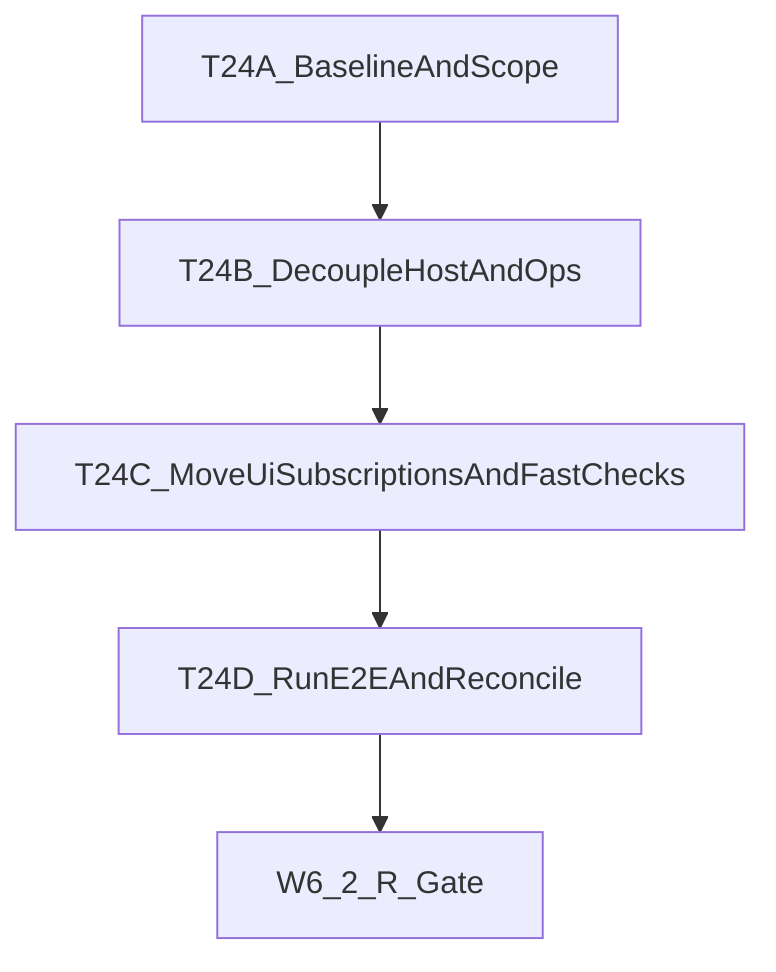

# Imperative Konva Migration V5 — Orchestration Plan

## Context

React-Konva puts React reconciliation in the canvas hot path. Every shape = React component. Every state change = diffing + bridge + Konva redraw. No fast whiteboard uses this pattern. This migration replaces react-konva with imperative Konva node management: one React shell (`CanvasHost`), all shapes managed by `KonvaNodeManager` subscribing directly to Zustand stores. Target: ≥50% drag frame time reduction.

**Base branch:** `spike/react-konva-1`
**Feature branches:** `spike/react-konva-1/<epic>-<name>`, merged back into `spike/react-konva-1`
**Governance:** CONSTITUTION.md (Articles I–XIX existing + XX–XXV, XXVII added in Epic 0)
**Source of truth:** `docs/IMPERATIVE-KONVA-MIGRATION-V5.md`
**Merge/completion rule:** Canonical policy reference: Merge targets and Epic/program completion semantics for this migration are defined in docs/IMPERATIVE-KONVA-MIGRATION-V5.md §0.1 (single source of truth).
**Status/checkbox sync rule:** Every completed task/wave merge must include doc reconciliation in the same PR (update Wave status text here and corresponding checkboxes/status in V5).

---

## SOLID Principles Enforcement

| Principle | How It's Applied |
| ------ | ------ |
| **SRP** | One factory per shape type. One controller per interaction mode. Drag split into 5 modules (commit, alignment, bounds, reparenting, coordinator). |
| **OCP** | Factory registry (`Map<ShapeType, IShapeFactoryEntry>`) — add shapes without modifying KonvaNodeManager. StageEventRouter dispatches by tool without router changes. |
| **LSP** | All factories satisfy `IShapeFactoryEntry`. All shape nodes satisfy `IShapeNodes`. Any factory substitutable in registry. |
| **ISP** | Small interfaces: `IShapeNodes`, `ShapeFactory`, `ShapeUpdater`, `IDragCoordinator`, `IDrawingController`, `IMarqueeController`, `IConnectorController`. No god-interfaces. |
| **DIP** | KonvaNodeManager depends on `IShapeFactoryEntry` abstraction. `useCanvasSetup` injects dependencies via config interfaces. Controllers depend on store abstractions. |

---

## Dependency Graph

```mermaid
E0 (rules+baselines+E2E) → E1 (factories) → E2 (NodeManager) ──┐
                                              └→ E3 (events/drag) ─┤ parallel
                                                                    E4 (overlays) → E5 (cutover) → E6 (cleanup)
```

**Parallel work opportunities:**

- Epic 3 can start after Epic 1 (needs factory types only, not KonvaNodeManager)
- Epic 4 can start after Epic 2 (needs layer references)
- Epics 3 and 4 can proceed in parallel

**Hard dependencies:**

- Epic 0 → Epic 1 (baselines + rules + E2E safety net)
- Epic 1 → Epic 2 (factories are inputs to manager)
- Epics 2 + 3 + 4 → Epic 5 (all modules required for cutover)
- Epic 5 stable → Epic 6 (cleanup gated on stability)

---

## Branching Strategy (INVIOLABLE)

- All feature branches created off `spike/react-konva-1`
- All merges target `spike/react-konva-1` only
- `main` and `development` are NEVER touched until T28 (final merge)
- Before every worktree create: verify HEAD is `spike/react-konva-1`
- Before every merge: verify current branch is `spike/react-konva-1`
- Abort immediately if any branch check fails

---

## WAVE 1: Epic 0 — Foundation (3 parallel agents)

**Status:** Done. Constitution (Articles XX–XXVII) in CONSTITUTION.md. `docs/perf-baselines/pre-migration.json` with automated capture. All 13 E2E specs present; connectorCreation and undoRedoDrag pass on chromium and firefox. Ralph-loop RL0–RL3 complete; merged on spike/react-konva-1.

| Task | Title | Tier | Role | Deps | Branch | Est LOC |
| ------ | ------ | ------ | ------ | ------ | ------ | ------ |
| T1 | Constitutional Amendments (Articles XX–XXV, XXVII) | haiku | quick-fixer | — | epic0-constitution | 120 |
| T2 | Performance Baselines → `docs/perf-baselines/pre-migration.json` | sonnet | architect | — | epic0-perf-baselines | 50 |
| T3 | E2E: marquee, single drag, multi-drag, undo/redo (4 specs) | sonnet | tester | — | epic0-e2e-drag | 400 |
| T4 | E2E: connector creation, endpoint drag, resize, rotate (4 specs) | sonnet | tester | — | epic0-e2e-connector-transform | 400 |
| T5 | E2E: frame reparenting, sticky text, frame title, alignment, drawing (5 specs) | sonnet | tester | — | epic0-e2e-frame-text-draw | 500 |

**Scheduling:** Agent-A=T1, Agent-B=T2, Agent-C=T3→T4→T5
**Review gate W1-R** after all merge: constitution present, baselines captured, 13 new E2E + existing pass.

### T1 — Constitutional Amendments

- **Description:** Add Articles XX–XXV and XXVII to `docs/CONSTITUTION.md`. Exact text in V5 doc §6.1.
- **AC:** All 7 articles present. `bun run validate` passes. No code changes.

### T2 — Performance Baselines

- **Description:** Capture pre-migration metrics. Save to `docs/perf-baselines/pre-migration.json`. Metrics: frame time during 100-obj drag (p50/p95/p99), 500-obj pan, React re-renders during drag, selector evals per drag frame, bundle size (gzipped), `bun run perf:check`, TTI for 1000-object board.
- **AC:** JSON file created with all 7 metrics per V5 doc §6.2.

### T3 — E2E Drag Tests (batch 1/3)

- **Description:** Playwright tests: `marqueeSelection.spec.ts`, `shapeDrag.spec.ts`, `multiSelectDrag.spec.ts`, `undoRedoDrag.spec.ts`. Follow existing pattern from `snapToGridDrag.spec.ts`. All in `tests/e2e/`.
- **AC:** All 4 test files pass against current codebase. Existing E2E still pass.

### T4 — E2E Connector + Transform Tests (batch 2/3)

- **Description:** Playwright tests: `connectorCreation.spec.ts`, `connectorEndpointDrag.spec.ts`, `shapeResize.spec.ts`, `shapeRotate.spec.ts`.
- **AC:** All 4 test files pass against current codebase.

### T5 — E2E Frame + Text + Drawing Tests (batch 3/3)

- **Description:** Playwright tests: `frameReparenting.spec.ts`, `stickyTextEdit.spec.ts`, `frameTitleEdit.spec.ts`, `alignmentGuides.spec.ts`, `drawingTools.spec.ts`. Verify existing `snapToGridDrag.spec.ts` and `textOverlayStability.spec.ts` still pass.
- **AC:** All 5 test files pass. Existing 2 specs still pass.

---

## WAVE 2: Epic 1 — Shape Factories (3 parallel after T6)

**Status:** Done — all 7 factories, types, registry, and unit tests merged to `spike/react-konva-1`. `bun run validate` passes.

| Task | Title | Tier | Role | Deps | Branch | Est LOC | SOLID |
| ------ | ------ | ------ | ------ | ------ | ------ | ------ | ------ |
| T6 | Factory types.ts + registry index.ts + dir scaffold | sonnet | architect | W1-R | epic1-factory-types | 70 | OCP, ISP, DIP |
| T7 | createRectangle + createCircle + createLine + tests | sonnet | architect | T6 | epic1-simple-factories | 250 | SRP, LSP |
| T8 | createStickyNote + createFrame + tests (cacheable=true) | opus | architect | T6 | epic1-complex-factories | 400 | SRP, OCP |
| T9 | createConnector (4 modes) + createTextElement + tests | sonnet | architect | T6 | epic1-connector-text | 300 | SRP, LSP |

**Scheduling:** Agent-A=T6→T7, Agent-B=[wait T6]→T8, Agent-C=[wait T6]→T9
**Review gate W2-R:** all 7 factories + types + registry, getFactory returns correct factory per type.

### T6 — Factory Types + Registry

- **Description:** Create `src/canvas/factories/types.ts` (IShapeNodes, ShapeFactory, ShapeUpdater, IShapeFactoryEntry ~40 LOC) and `src/canvas/factories/index.ts` (Map registry + getFactory ~30 LOC). Create `src/canvas/` directory structure.
- **AC:** Interfaces compile strict TS. `getFactory('rectangle')` returns entry. No existing files modified.

### T7 — Simple Factories

- **Description:** `createRectangle.ts` (~50), `createCircle.ts` (~50), `createLine.ts` (~50). Each has `create(obj) → IShapeNodes` and `update(nodes, obj, prev) → boolean`. Port from RectangleShape.tsx (85), CircleShape.tsx (93), LineShape.tsx (84). Unit tests for each.
- **AC:** create() returns correct Konva node type. update() patches only changed attrs. update() returns true for visual, false for position-only.

### T8 — Complex Factories

- **Description:** `createStickyNote.ts` (~120): Group → bg Rect + fold Rect + Text. `createFrame.ts` (~130): Group → titleBar Rect + body Rect + title Text + dropHint Text. Both `cacheable: true`. Port from StickyNote.tsx (328) and Frame.tsx (389). Unit tests.
- **AC:** Compound Group structure verified. Parts map correct. cacheable=true. update() handles visual props.

### T9 — Connector + TextElement Factories

- **Description:** `createConnector.ts` (~100): 4 arrowhead modes (end→Arrow, start→reversed, both→Group(2×Arrow), none→Line). Port from Connector.tsx (192). `createTextElement.ts` (~60): port from TextElement.tsx (224). Unit tests for all 4 connector modes.
- **AC:** All 4 arrowhead modes produce correct nodes. Connector update recalculates points.

---

## WAVE 3: Epic 2 + Epic 3 Start (3 parallel)

**Status:** Done — LayerManager, KonvaNodeManager, SelectionSyncController, dragCommit/dragBounds/frameDragReparenting, alignmentEngine merged to `spike/react-konva-1`. Unit tests pass. `bun run validate` passes.

| Task | Title | Tier | Role | Deps | Branch | Est LOC | SOLID |
| ------ | ------ | ------ | ------ | ------ | ------ | ------ | ------ |
| T10 | LayerManager (4 layers, RAF batchDraw) | sonnet | architect | W2-R | epic2-layer-manager | 130 | SRP |
| T11 | KonvaNodeManager (O(changed) diff, connector dedup) | opus | architect | T10 | epic2-node-manager | 550 | SRP, OCP, DIP |
| T12 | SelectionSyncController (layer moves, cache lifecycle) | sonnet | architect | T11 | epic2-selection-sync | 250 | SRP |
| T13 | dragCommit + dragBounds + frameDragReparenting | opus | architect | W2-R | epic3-drag-modules | 600 | SRP, OCP |
| T14 | alignmentEngine (wraps existing pure fns) | sonnet | architect | W2-R | epic3-alignment | 250 | SRP, DIP |

**Scheduling:** Agent-A=T10→T11→T12, Agent-B=T13, Agent-C=T14
**Review gate W3-R:** O(changed) diff verified, connector dedup verified, Appendix D items D1–D10, D15–D20 covered.

### T10 — LayerManager

- **Description:** `src/canvas/LayerManager.ts` (~80 LOC). Closure-based. 4 Konva layers (static, active, overlay, selection) in z-order. `scheduleBatchDraw(layer)` coalesces to 1 RAF/frame/layer. `destroy()` cancels RAFs. Unit tests.
- **AC:** 4 layers created and attached. batchDraw coalesces. destroy cancels pending.

### T11 — KonvaNodeManager

- **Description:** `src/canvas/KonvaNodeManager.ts` (~350 LOC). Class: `start()` subscribes to objectsStore, `handleStoreChange(next, prev)` diffs by reference equality O(changed), creates via factory, updates via factory, destroys. Connector dedup via `Set<string>`. Internal `IManagedNode`. `getNode(id)`, `getAllManagedIds()`, `setCacheState()`, `setEditingState()`, `destroy()`. Unit tests (~200 LOC).
- **AC:** Add→created, Update→patched not recreated, Delete→destroyed. Reference-equal skipped (spy). Connector dedup verified. Articles XX, XXI, XXII enforced.

### T12 — SelectionSyncController

- **Description:** `src/canvas/SelectionSyncController.ts` (~120 LOC). Closure-based. Subscribes to selectionStore + dragOffsetStore. Moves nodes between static/active layers. Applies groupDragOffset imperatively. Cache lifecycle per Article XXIII. Unit tests.
- **AC:** Select→active layer. Deselect→static. Cache cleared on select, restored on deselect. Offset applied.

### T13 — Drag Sub-Modules

- **Description:** Three modules:
  - `dragCommit.ts` (~200): selectObject(), commitDragEnd(), handleSelectionDragStart/Move/End(). Reads stores directly.
  - `dragBounds.ts` (~80): createDragBoundFunc() with grid snap.
  - `frameDragReparenting.ts` (~120): findContainingFrame() (center-point, smallest by area), reparentObject(), updateDropTarget() (throttled 100ms). Port from useFrameContainment.ts (139).
  - Unit tests for all three.
- **AC:** Appendix D items D1–D10, D15–D17 covered. selectObject toggles selection. commitDragEnd calls queueObjectUpdate. findContainingFrame picks smallest frame.

### T14 — alignmentEngine

- **Description:** `src/canvas/drag/alignmentEngine.ts` (~150 LOC). Wraps `src/lib/alignmentGuides.ts` pure functions. `onDragMove(e, candidates, overlayManager)` computes guides + snap. `buildGuideCandidates(visibleIds, draggedIds, objects)`. Unit tests.
- **AC:** Appendix D items D18–D20 covered. Guide computation correct. overlayManager.updateGuides called.

---

## WAVE 4: Epic 3 Remaining + Epic 4 Start (3 parallel)

**Status:** Partial — T13–T16 merged. T17, T18 done (T18 dblclick wired in ShapeEventWiring). T19 OverlayManager: done — all 5 subsystems (marquee, guides, drawing preview, cursors, connection anchors) implemented and tested.

| Task | Title | Tier | Role | Deps | Branch | Est LOC | SOLID |
| ------ | ------ | ------ | ------ | ------ | ------ | ------ | ------ |
| T15 | DragCoordinator (thin dispatcher, <50 LOC) | haiku | quick-fixer | T13, T14 | epic3-drag-coordinator | 80 | SRP, DIP |
| T16 | StageEventRouter + ShapeEventWiring | sonnet | architect | T15 | epic3-event-wiring | 400 | SRP, ISP |
| T17 | DrawingController + MarqueeController + ConnectorController | sonnet | architect | W3-R | epic3-controllers | 450 | SRP, ISP |
| T18 | TextEditController (reuses canvasTextEditOverlay.ts) | sonnet | architect | T11 | epic3-text-edit | 160 | SRP, DIP |
| T19 | OverlayManager (5 subsystems) | opus | architect | T10 | epic4-overlay-manager | 400 | SRP, OCP |

**Scheduling:** Agent-A=T15→T16, Agent-B=T17, Agent-C=T18→T19
**Review gate W4-R:** **All Appendix D items verified.** No React state in MarqueeController. canvasTextEditOverlay.ts unchanged.

### T15 — DragCoordinator

- **Description:** `src/canvas/drag/DragCoordinator.ts` (~50 LOC). `createDragCoordinator(config)` returns `IDragCoordinator`. Routes to dragCommit, alignmentEngine, dragBounds, frameDragReparenting. No logic of its own. Unit test.
- **AC:** Each method dispatches to correct sub-module. Config injected. Under 50 LOC.

### T16 — StageEventRouter + ShapeEventWiring

- **Description:** `StageEventRouter.ts` (~120): stage mousedown/mousemove/mouseup/wheel/touch dispatch by activeTool. RAF-throttles mousemove. Returns destroy(). `ShapeEventWiring.ts` (~150): wireEvents(node, id, config) attaches click/drag/dblclick. unwireEvents(node) removes all. Unit tests.
- **AC:** Dispatches to correct controller per tool. RAF throttling works. wireEvents attaches correct events. Article XXV enforced.

### T17 — Controllers (Drawing, Marquee, Connector)

- **Description:** Three closure-based state machines:
  - `DrawingController.ts` (~100): start/move/end, overlayManager preview, min 5px. Replaces useShapeDrawing (250).
  - `MarqueeController.ts` (~80): start/move/end, AABB hit-test, **no React state**. Replaces useMarqueeSelection (127).
  - `ConnectorController.ts` (~70): two-click, first stores from, second creates connector. Replaces useConnectorCreation (98).
  - Unit tests for all three.
- **AC:** State transitions correct. Min size validated. AABB correct. Two-click creates connector.

### T18 — TextEditController

- **Description:** `src/canvas/events/TextEditController.ts` (~80 LOC). open(objectId): get managed node, hide Konva text, create DOM textarea via existing `canvasTextEditOverlay.ts` + `canvasOverlayPosition.ts` (UNCHANGED). On blur/Enter: queueObjectUpdate. nodeManager.setEditingState(). Unit tests.
- **AC:** DOM textarea opens. Existing overlay libs unchanged. Appendix D item D29 covered.

### T19 — OverlayManager

- **Description:** `src/canvas/OverlayManager.ts` (~250 LOC). Class on overlay layer. 5 subsystems: marquee (show/update/hide), alignment guides (updateGuides), drawing preview (show/update/hide), remote cursors (updateCursors), connection anchors (updateConnectionNodes/highlightAnchor/clear). Replaces SelectionLayer (66), ConnectionNodesLayer (72), CursorLayer (74), AlignmentGuidesLayer (67). Unit tests.
- **AC:** All 5 subsystems functional. destroy() cleans up. Under 300 LOC.

---

## WAVE 5: Epic 4 Remaining (2 parallel)

**Status:** Done — T20 (TransformerManager) and T21 (GridRenderer + SelectionDragHandle) implemented and merged; unit tests present. T19 OverlayManager complete — all 5 subsystems implemented (continue-overlay-cursors + connection anchors 2026-02-22); OverlayManager.test.ts 21 tests pass.

| Task | Title | Tier | Role | Deps | Branch | Est LOC | SOLID |
| ------ | ------ | ------ | ------ | ------ | ------ | ------ | ------ |
| T20 | TransformerManager (exact TransformHandler config) | sonnet | architect | W4-R | epic4-transformer | 200 | SRP |
| T21 | GridRenderer + SelectionDragHandle | haiku | quick-fixer | W4-R | epic4-grid-handle | 130 | SRP |

**Scheduling:** Agent-A=T20, Agent-B=T21
**Review gate W5-R:** Transformer config exact match. Grid renders at different zoom levels.

### T20 — TransformerManager

- **Description:** `src/canvas/TransformerManager.ts` (~120 LOC). Class. Konva.Transformer with exact config from TransformHandler.tsx lines 148–181. `syncNodes(selectedIds, activeLayer)`, `handleTransformEnd(callback)` extracts shape-aware attrs. Unit tests.
- **AC:** Config matches exactly. syncNodes correct. Appendix D item D28 covered.

### T21 — GridRenderer + SelectionDragHandle

- **Description:** `GridRenderer.ts` (~40 LOC): grid sceneFunc port. `SelectionDragHandle.ts` (~40 LOC): imperative drag handle. Unit tests.
- **AC:** Grid renders. Drag handle responds to events. Each under 40 LOC.

---

## WAVE 6: Epic 5 — THE CUTOVER (sequential, 1 opus agent)

**Status:** T22, T23, T24 implemented. App uses CanvasHost. E2E run 2026-02-22: 87 passed, 41 failed. Epic 5.1 Readiness Gate is now required before Epic 5 can be marked done or merged.

| Task | Title | Tier | Role | Deps | Branch | Est LOC |
| ------ | ------ | ------ | ------ | ------ | ------ | ------ |
| T22 | useCanvasSetup.ts (DI, subscriptions, cleanup) | opus | architect | W5-R | epic5-integration | 200 |
| T23 | CanvasHost.tsx (React shell, surviving hooks) | opus | architect | T22 | epic5-integration | 250 |
| T24 | Import swap BoardCanvas→CanvasHost + full E2E + manual matrix | opus | architect | T23 | epic5-integration | 60 |

**Scheduling:** T22→T23→T24 strictly sequential.
**Review gate W6-R (opus reviewer):** Implementation cutover complete and wiring validated (under 300 LOC each).
**Follow-up gate W6.1-R (required):** Full E2E pass + manual integration checklist + post-migration perf/decoupling evidence + validate green + reconciliation artifacts.

### T22 — useCanvasSetup.ts

- **Description:** `src/canvas/useCanvasSetup.ts` (~200 LOC). Manager instantiation in DI order. Wire Zustand vanilla subscriptions (objectsStore, selectionStore, dragOffsetStore) per Appendix C. Returns `{ stage, destroy }`. Cleanup destroys all managers + unsubscribes.
- **AC:** All managers instantiated. Subscriptions per Appendix C. destroy() cleans everything. Under 300 LOC.

### T23 — CanvasHost.tsx

- **Description:** `src/canvas/CanvasHost.tsx` (~250 LOC). React shell: tool/color state, surviving hooks (useCanvasViewport, useVisibleShapeIds, useBoardSubscription, useCursors, useCanvasKeyboardShortcuts, useCanvasOperations). Mount effect calls setupCanvas. Renders container div + toolbar + control panel.
- **AC:** All surviving hooks wired. Mount/unmount lifecycle correct. Under 300 LOC.

### T24 — Import Swap + Full Integration

- **Description:** Replace `<BoardCanvas>` import with `<CanvasHost>` in App.tsx. Run full E2E suite (13 new + existing). Verify manual integration checklist (27 items from V5 §11). Capture post-migration baselines.
- **AC:** All E2E pass. Integration checklist verified. Baselines captured. Article XXVII (single atomic cutover).

---

## WAVE 6.2: Epic 5.2 — CanvasHost Decoupling Follow-up (sequential, 1 architect + 1 reviewer)

**Status:** Implementation complete (2026-02-22). CanvasHost no longer subscribes to `objects` or `selectedIds`; `useCanvasOperations` reads store at action time; `CanvasControlPanel` and `CanvasContainerWithSelectionAttr` are subscription islands. `bun run validate` passes. Full E2E run recorded (78 passed, 50 failed); Epic 5.1 gate remains blocked until E2E pass. Evidence: `docs/collab/runs/2026-02-22_epic5-1-readiness/`.

| Task | Title | Tier | Role | Deps | Branch | Est LOC |
| ------ | ------ | ------ | ------ | ------ | ------ | ------ |
| T24A | Baseline evidence + decoupling design lock | sonnet | architect | W6-R | epic5-2-decoupling | 40 |
| T24B | CanvasHost/useCanvasOperations decoupling implementation | opus | architect | T24A | epic5-2-decoupling | 180 |
| T24C | UI subscription-island wiring + fast verification | sonnet | architect | T24B | epic5-2-decoupling | 120 |
| T24D | Full E2E + reconciliation artifacts + closeout | sonnet | architect | T24C | epic5-2-decoupling | 40 |

**Scheduling:** `T24A → T24B → T24C → T24D` strictly sequential.

**Review gate W6.2-R (required):**

- `CanvasHost` does not subscribe directly to `objects`/`selectedIds`.
- React re-renders during drag are limited to UI chrome.
- `bun run validate` passes.
- Full `bun run test:e2e` is run after implementation (T24D), with outcomes documented.

### T24A — Baseline and design lock

- **Description:** Capture pre-change profiler evidence for drag/selection churn; create `docs/collab/runs/<YYYY-MM-DD_HH-mm-ss>/epic5-2-decoupling/`; lock scope and acceptance checks against V5 Epic 5.1 gates.
- **AC:** Baseline artifacts exist; scope/constraints documented; evidence targets clear.

### T24B — Host and operations decoupling

- **Description:** Remove `CanvasHost` selector subscriptions to `objects`/`selectedIds`. Refactor `useCanvasOperations` to use getter/store reads at action time rather than render-time snapshots.
- **AC:** Host no longer re-renders for object/selection churn. Behavior parity maintained for delete/copy/duplicate/paste/keyboard flows.

### T24C — UI subscription islands + fast checks

- **Description:** Move object/selection subscriptions to minimal UI surfaces (control panel and selection-attribute container). Run `bun run validate`, targeted tests, and manual smoke checks.
- **AC:** UI remains correct; fast checks pass; profiler evidence shows expected re-render reduction.

### T24D — Full E2E at end + reconciliation

- **Description:** Run full `bun run test:e2e` only after T24B/T24C are complete. Record results and classify any residual failures. Update reconciliation artifacts and readiness closeout.
- **AC:** Full E2E executed and documented; artifacts map 1:1 to migration/orchestration/tasks status.

### Wave 6.2 Flow



---

## WAVE 7: Epic 6 — Cleanup (sequential, separate PR)

**Blocked until Epic 5.1 Readiness Gate is closed with `proceed_decision=clear`. If Epic 5 regresses, Epic 6 blocked and Epic 5 reverted (Article XXVII.3).**

| Task | Title | Tier | Role | Deps | Branch | Est LOC |
| ------ | ------ | ------ | ------ | ------ | ------ | ------ |
| T25 | Delete 26 dead files + remove react-konva dep | sonnet | architect | W6.1-R | epic6-cleanup | -4907 |
| T26 | Update shapes/index.ts + CLAUDE.md | haiku | quick-fixer | T25 | epic6-cleanup | 10 |
| T27 | Performance verification + `bun run release:gate` | sonnet | architect | T26 | epic6-cleanup | 50 |

**Scheduling:** T25→T26→T27
**Review gate W7-R:** ≥50% drag frame time reduction required. react-konva removed. release:gate passes.

### T25 — Delete Dead Files

- **Description:** Delete all 26 files in Appendix B (15 components ~3,165 LOC + 10 hooks ~1,533 LOC). Remove `react-konva` from package.json. `bun install`. Fix orphaned imports. Evaluate useFrameContainment + useViewportActions: delete if purely canvas-coupled.
- **AC:** All 26 files deleted. react-konva removed. No orphaned imports. `bun run validate` passes.

### T26 — Update shapes/index.ts + CLAUDE.md

- **Description:** Modify shapes/index.ts: keep only STICKY_COLORS + StickyColor. Update CLAUDE.md component chain: `CanvasHost → useCanvasSetup → KonvaNodeManager → Shape Factories`.
- **AC:** shapes/index.ts minimal. CLAUDE.md updated.

### T27 — Performance Verification

- **Description:** Capture final baselines → `docs/perf-baselines/post-migration.json`. Compare pre vs post. Run `bun run release:gate`. Write comparison in PR.
- **AC:** ≥50% drag frame time reduction. 0 shape React re-renders during drag. Bundle ≈-45KB. release:gate passes.

---

## WAVE 8: Final Merge

| Task | Title | Tier | Role | Deps |
| ------ | ------ | ------ | ------ | ------ |
| T28 | Merge `spike/react-konva-1` → `development` | sonnet | architect | W7-R |

### T28 Safety Gate (when merge to `development` is likely safe)

`development` merge is considered likely safe only after **W7-R is fully green** and the following are true:

1. Epic 5 cutover completed and stable (`CanvasHost` active, no cutover regressions)
2. Epic 6 cleanup complete (dead-file deletion + `react-konva` removal)
3. `bun run validate` passes
4. `bun run release:gate` passes
5. Full E2E suite passes, plus two consecutive passes for flaky-prone specs on chromium + firefox:
   - `connectorCreation`
   - `undoRedoDrag`
   - `frameReparenting`
6. Post-migration performance baseline captured and compared with pre-migration:
   - `>=50%` drag p95 frame-time improvement
   - `0` shape-related React re-renders during drag

---

## Summary

| Metric | Value |
| ------ | ------ |
| Total tasks | 32 (+ 8 review gates) |
| Total new code | ~3,290 LOC |
| Total new tests | ~850 LOC |
| Total deleted code | ~4,907 LOC |
| Execution waves | 9 |
| Max concurrent agents | 3 |
| Epics | 7 (E0–E6) |

---

## Risk Mitigations

| Wave | Risk | Mitigation |
| ------ | ------ | ------ |
| W1 | E2E tests flaky against current codebase | Run twice, fix flakes before proceeding |
| W2 | Factory update() misses visual props | Spy-based tests verify every attr |
| W3 | KonvaNodeManager O(n) instead of O(changed) | Unit test with 500 objects, spy on factory.update for unchanged |
| W3 | dragCommit diverges from Appendix D | Checklist verification mandatory in PR |
| W4 | MarqueeController leaks React patterns | Review gate: no useState/useRef in any controller |
| W5 | TransformerManager config drift | Diff comparison in review |
| W6 | Cutover breaks features | All 13 E2E + existing + manual checklist |
| W6.2 | Decoupling change introduces behavior drift | Fast checks before E2E; full E2E only after implementation; reconcile before closeout |
| W7 | Perf target not met | Investigate before merging; do not merge without ≥50% |

---

## Critical Files Reference

| File | Role |
| ------ | ------ |
| `docs/IMPERATIVE-KONVA-MIGRATION-V5.md` | Source of truth. Appendix D behavior checklist. |
| `src/hooks/useObjectDragHandlers.ts` (792 LOC) | Being rewritten → 5 drag modules. Every behavior per Appendix D. |
| `src/components/canvas/BoardCanvas.tsx` (938 LOC) | Being replaced by CanvasHost. Wiring reference for Epic 5. |
| `src/stores/objectsStore.ts` | Subscription contract (Zustand v5 vanilla). connectorsByEndpoint for dedup. |
| `docs/CONSTITUTION.md` | Governance. Articles I–XIX + new XX–XXV, XXVII. |
| `src/lib/alignmentGuides.ts` | Pure geometry — survives, wrapped by alignmentEngine. |
| `src/lib/canvasTextEditOverlay.ts` | Survives unchanged — reused by TextEditController. |

---

## Verification Protocol

**After each wave review gate:**

1. `bun run validate` (format → lint:fix → typecheck → test)
2. All unit tests pass for new modules
3. No existing files modified (Epics 1–4)
4. LOC limits enforced (300/file, 200/drag module)

**After Epic 5 cutover (W6-R):**
5. All 13 new E2E + all existing E2E pass
6. Manual integration checklist (27 items from V5 §11) verified
7. Post-migration baselines captured

**After Epic 5.2 decoupling follow-up (W6.2-R):**
8. Host shell no longer subscribes to object/selection store snapshots
9. Drag profiling shows shape-coupled React churn removed from host path
10. Full E2E run completed at end of the wave and documented

**After Epic 6 cleanup (W7-R):**
11. ≥50% drag frame time reduction vs pre-migration
12. 0 shape-related React re-renders during drag
13. Bundle size reduced ~45KB (react-konva removed)
14. `bun run release:gate` passes

**Before T28 merge to `development`:**
15. Full E2E suite pass + two consecutive passes for flaky-prone specs on chromium + firefox (`connectorCreation`, `undoRedoDrag`, `frameReparenting`)
16. Post-migration baseline file exists and comparison is documented in merge/PR notes
