# CollabBoard — Final Cumulative Optimization Plan

This plan consolidates and de-duplicates all tasks from **OPTIMIZATION-PLAN-1**, **OPTIMIZATION-PLAN-2**, and **OPTIMIZATION-PLAN-3**, ranks them by a weighted priority score, and anchors execution to PRD benchmark guardrails with no regressions. The goal is a **20% improvement** over current benchmarks where feasible while meeting or exceeding all gates.

---

## Benchmark Guardrails (No Regression)

All optimizations must preserve or improve these targets. Any change that regresses a gate must be reverted or fixed before merge.

| Metric | PRD Target | Stretch (20% improvement where applicable) | Verification |
| ------ | ---------- | ------------------------------------------- | ------------ |
| Frame rate | ≥58 FPS during pan/zoom | Aim ≥60 FPS (sustained) | `tests/e2e/benchmark.spec.ts`: "maintains high frame throughput..." |
| Object sync latency | <100 ms | — | `tests/integration/sync.latency.test.ts`: object update |
| Cursor sync latency | <50 ms | — | `tests/integration/sync.latency.test.ts`: cursor write |
| Object capacity | 500+ objects without drops | 500+ at target FPS | `tests/integration/sync.latency.test.ts`: 500-object batch; e2e stress |
| Concurrent users | 5+ without degradation | 5+ stable propagation | `tests/e2e/benchmark.spec.ts`: "supports 5 concurrent users..." |
| AI response | <2 s single-step | — | `tests/e2e/benchmark.spec.ts`: "responds to a single-step AI command..." |

After each execution wave, re-run the full benchmark suite and block promotion on any regression.

---

## De-duplication Summary

### Merged or Consolidated

- **State management (Zustand):** Plan 1 "Decouple Context API" and "Implement Atomic Selectors" are implemented via Plan 2's **Zustand for selection** and **Zustand objects store**. One canonical "Zustand selection" task and one "Zustand objects store" task cover both.
- **Batch operations:** Plan 3 "Fix Delete Performance (Many Objects)" is the only bulk-delete task; it is in the primary list as **Batch delete (Firestore writeBatch + defer redraws)**.
- **Viewport / FPS:** Single canonical task **Viewport off React hot path** (Plan 2.1.1) — no duplicate.

### Not Applicable (Stack Mismatch — Vite, Not Next.js)

This codebase uses **Vite + React** (see `package.json`). The following Plan 1 items are Next.js-specific and are **not** actionable as written:

| Original item | Reason | Alternative in this repo |
| ------------- | ------ | ------------------------- |
| Identify and Promote LCP Images (`next/image` priority) | Next.js API | Optimize critical images via Vite asset pipeline and `loading="eager"` where needed |
| Enforce next/font Adoption | Next.js API | Use local font files + `@font-face` or a Vite-friendly font plugin; preload in index.html |
| Enable Turbopack | Next.js dev server | Vite already provides fast HMR |
| Audit with Bundle Analyzer (`@next/bundle-analyzer`) | Next.js tool | **Bundle audit (Vite)** below: use `rollup-plugin-visualizer` or `vite-bundle-visualizer` |
| Optimize Package Imports (experimental.optimizePackageImports) | Next.js config | Rely on Vite tree-shaking; use named imports for Radix/Lucide |
| Offload Third-Party Scripts (next/script) | Next.js component | Load analytics in a dynamic script after mount or via `import()` |
| Enable Partial Prerendering (PPR) | Next.js experimental | N/A for SPA; no direct equivalent |

### Deferred (Optional / Separate Project)

- **SSE for unidirectional updates:** Plan 1 — possible future improvement; not in current scope.
- **Edge-native databases (Turso/Neon):** Plan 1 — architectural change; defer unless migrating off Firestore.
- **WebSocket / Y.js sync:** Plan 2.2 optional — treat as a separate project; do not block this plan on it.

---

## Scoring Model

Priority is a **weighted percentage** (higher = higher priority), using four criteria in order:

1. **Improvement opportunity** — 40%  
2. **Risk** (higher = safer) — 30%  
3. **Ease of implementation** — 20%  
4. **Wow factor** — 10%  

### Rubric (1–5 per dimension)

#### Improvement opportunity (40%)

- 5: Directly addresses a failing or at-risk benchmark (e.g. FPS, 5-user propagation).
- 4: Improves a passing benchmark by >20% or removes a major bottleneck.
- 3: Meaningful gain on a passing metric or reduces re-renders/load.
- 2: Small measurable gain.
- 1: No measurable benchmark impact.

#### Risk (30%) — higher = safer

- 5: Isolated change, easy rollback, good test coverage.
- 4: Limited surface area, clear tests.
- 3: Moderate dependencies, some test gaps.
- 2: Touches core paths, higher regression risk.
- 1: Major architectural change, high regression risk.

#### Ease of implementation (20%)

- 5: <2 hours, single file, no new deps.
- 4: <4 hours, few files, existing or trivial deps.
- 3: <1 day, several files, minor new deps.
- 2: 1–2 days, cross-cutting change.
- 1: >2 days, large refactor.

#### Wow factor (10%)

- 5: Very visible user impact (e.g. smooth 60 FPS, instant bulk ops).
- 4: Clearly noticeable (faster sync, smoother pan).
- 3: Subtle but measurable.
- 2: Mostly developer experience.
- 1: No user-visible change.

### Formula

`Score = (Improvement × 0.40) + (Risk × 0.30) + (Ease × 0.20) + (Wow × 0.10)`  

**Priority % = (Score / 5) × 100** (max 100%).

---

## Section A: Primary — Benchmark-Impact Optimizations

Ranked by priority % (descending). Each task must satisfy the benchmark guardrails above and must not regress any gate.

| # | Task | Priority % | Improvement | Risk | Ease | Wow | Expected metric impact | Regression risk |
| - | ---- | ---------- | ----------- | ---- | ---- | --- | ---------------------- | --------------- |
| 1 | useBatchDraw + Zustand for selection | **80%** | 4 | 4 | 4 | 4 | FPS +2–4; selection re-renders down ~90%; fewer Konva redraws | Low — isolate to selection path |
| 2 | Fix delete performance (batch + defer redraws) | **80%** | 4 | 4 | 4 | 4 | Bulk delete &lt;300 ms for 20+ objects; less main-thread blocking | Low — batch + UI deferral |
| 3 | Viewport off React hot path | **78%** | 5 | 3 | 3 | 5 | FPS to ≥58 (goal 60, stretch goal 70); no setState on every wheel/drag frame | Medium — viewport/Stage contract |
| 4 | Bundle audit + tree-shaking (Vite) | **74%** | 3 | 5 | 4 | 2 | Smaller initial bundle; faster LCP/TTI | Low — analysis + config |
| 5 | Zustand objects store + per-shape subscription | **70%** | 5 | 2 | 2 | 5 | 500+ objects and 5-user propagation stable; only changed shapes re-render | High — core state/rendering |
| 6 | Cursor throttle during pan | **70%** | 2 | 5 | 5 | 2 | Slightly less work during pan; cursor &lt;50 ms unchanged, stretch goal 30 | Low — single hook/flag |

### A.1 — useBatchDraw + Zustand for selection (80%)

- **Goal:** Fewer redundant Konva redraws and fewer re-renders on selection change.
- **Why it matters:** Today, selection lives in React Context. Any selection change updates the context value and forces every consumer (and their descendants) to re-render. Konva layers may also call `batchDraw()` multiple times per frame when several objects or the selection change. Batching redraws and moving selection to Zustand with atomic selectors limits re-renders to components that actually depend on the changed slice and coalesces Konva updates into one draw per frame.
- **Steps:**  
  - Use `useBatchDraw()` in `BoardCanvas`; call `requestBatchDraw(layerRef)` instead of `layer.batchDraw()` for object/selection-driven redraws.  
  - Add Zustand; create `selectionStore` (`selectedIds`, `setSelectedIds`, `clearSelection`, etc.).  
  - Replace `SelectionProvider` / `SelectionContext` / `useSelection` with the store in `BoardCanvas`, `PropertyInspector`, and any other consumers; remove provider from tree.
- **Files:** `BoardCanvas.tsx`, `SelectionProvider.tsx`, `selectionContext.ts`, `PropertyInspector.tsx`, new `stores/selectionStore.ts`.
- **Done when:** useBatchDraw used for layer redraws; selection fully in Zustand; selection UI and e2e/unit tests pass; no `SelectionContext` in app.
- **Acceptance:** FPS benchmark ≥58; sync latency tests pass; selection behavior unchanged.

#### Flow: before vs after

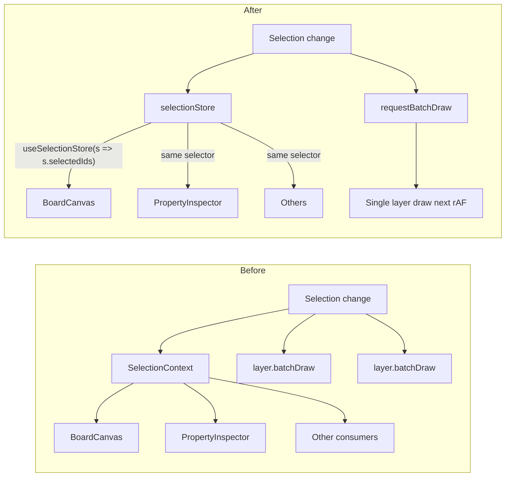

#### Implementation notes

Keep `selectionStore` minimal: only `selectedIds: string[]` and actions. Use `useSelectionStore((s) => s.selectedIds)` so components re-render only when the array reference or contents change. For `useBatchDraw`, collect layer refs that need redraw and invoke one `batchDraw()` per layer in the next `requestAnimationFrame` so multiple updates in one frame result in one paint.

#### Checklist

- [x] (Before) Confirm `tests/e2e/benchmark.spec.ts` and `tests/integration/sync.latency.test.ts` exist and pass.
- [x] (Before) Check whether `useBatchDraw` and selection refactor are already partially done.
- [x] `useBatchDraw()` called in `BoardCanvas`; `requestBatchDraw(layerRef)` used for all object/selection-driven layer redraws.
- [x] Zustand added; `selectionStore` created with `selectedIds`, `setSelectedIds`, `clearSelection`.
- [x] `SelectionProvider` / `SelectionContext` / `useSelection` replaced with store in `BoardCanvas`, `PropertyInspector`, and all other consumers.
- [x] `SelectionProvider` and `selectionContext` removed from app tree; selection behavior (single/multi, clear on empty click) unchanged.
- [ ] Selection UI and unit/e2e tests for selection pass.
- [ ] (After) Run full benchmark suite; FPS ≥58, object sync &lt;100 ms, cursor &lt;50 ms, 500-object and 5-user tests pass.
- [ ] (Stretch) No regression; aim for FPS toward 60 if applicable.

---

### A.2 — Fix delete performance (batch + defer redraws) (80%)

- **Goal:** Deleting 20+ objects feels instant; no sluggishness.
- **Why it matters:** Bulk delete can trigger many separate Firestore deletes and, per delete, a React update and Konva redraw. That blocks the main thread and feels sluggish. One `writeBatch` plus deferring UI updates until the batch commits reduces round-trips and batches DOM/canvas work.
- **Steps:**  
  - Profile bulk delete (Firestore writes vs. React re-renders vs. Konva redraws).  
  - Use a single Firestore `writeBatch` for all deletes.  
  - Defer canvas re-renders until batch resolves.  
  - Optional: loading indicator for operations &gt;300 ms.
- **Files:** Sync/object service (batch delete), component(s) that trigger delete and redraw.
- **Done when:** Bulk delete completes in &lt;300 ms for 20+ objects; no regression in object/sync benchmarks.
- **Acceptance:** 500-object and 5-user benchmarks still pass; bulk delete benchmark added or asserted in e2e.

#### Bulk delete flow

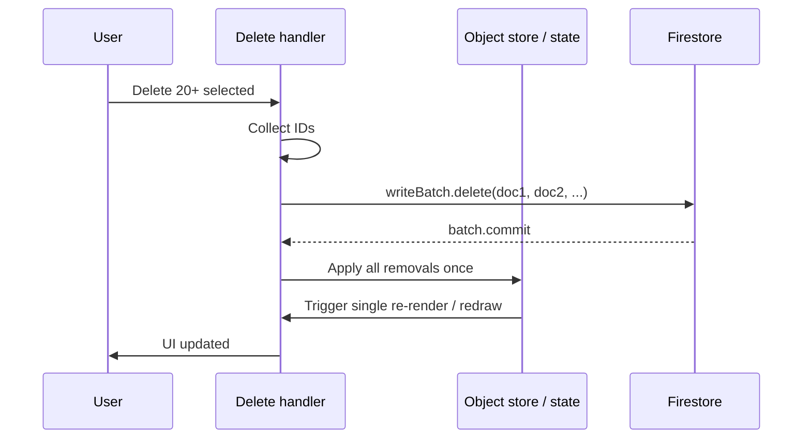

#### Implementation notes

Add or use a `deleteObjectsBatch(boardId, objectIds)` that builds one `writeBatch`, adds a `delete()` per document, then `commit()`. In the UI, only after a successful commit (or on the next tick) update local state and selection so React and Konva see one batched update. If you already have A.5 (objects store), perform the batch delete against the store and optionally optimistically remove from store before commit with rollback on failure.

#### Checklist

- [x] (Before) Confirm `tests/e2e/benchmark.spec.ts` and `tests/integration/sync.latency.test.ts` exist and pass.
- [ ] (Before) Check whether batch delete or defer-redraw logic is already partially done.
- [ ] Bulk delete profiled (Firestore vs. React re-renders vs. Konva redraws); bottleneck identified.
- [x] All deletes in a single Firestore `writeBatch`; canvas re-renders deferred until batch resolves.
- [ ] Bulk delete for 20+ objects completes in &lt;300 ms (measured).
- [ ] Optional: loading indicator for operations &gt;300 ms.
- [ ] 500-object and 5-user benchmarks still pass; bulk-delete assertion or e2e added.
- [ ] (After) Run full benchmark suite; all gates pass.
- [ ] (Stretch) Bulk delete &lt;300 ms; no regression.

---

### A.3 — Viewport off React hot path (78%)

- **Goal:** Eliminate full BoardCanvas re-renders on every pan/zoom so FPS ≥58.
- **Why it matters:** If viewport is in React state and updated on every wheel or drag move, the whole BoardCanvas (and Konva tree) re-renders every frame. That caps FPS and makes pan/zoom feel heavy. Keeping the live viewport in a ref and updating the Stage imperatively (or throttling state to persistence only) avoids re-renders during interaction so the browser can sustain 58+ FPS.
- **Steps:**  
  - In `useCanvasViewport`, keep viewport in a **ref**; update it in `handleWheel`, `handleDragEnd`, and touch handlers; do **not** call `setViewport` during active pan/zoom.  
  - Drive Konva Stage from that ref (e.g. set `stage.x()`, `stage.y()`, `scaleX()`, `scaleY()` in handler or one rAF), or use one throttled `setViewport` (e.g. 200–300 ms) for persistence/UI only, with Stage reading from ref for current frame.  
  - Keep `useVisibleShapes` and hit-testing on same viewport source (ref or throttled state).  
  - Call `setViewport` (or ref → state sync) only on interaction end or on throttle for `handleViewportPersist`.
- **Files:** `useCanvasViewport.ts`, `BoardCanvas.tsx` (Stage props/ref).
- **Done when:** FPS benchmark (pan + zoom 2 s) ≥58 on Chromium; no `setViewport` on every wheel/drag frame.
- **Acceptance:** `tests/e2e/benchmark.spec.ts` "maintains high frame throughput..." passes; no regression in object/cursor latency.

#### Viewport data flow

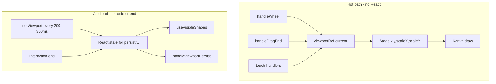

#### Implementation notes

Expose a ref from `useCanvasViewport` that the Stage container or BoardCanvas can read in the same frame as the pointer events. If Stage is controlled by props, pass a ref to the Stage node and in the wheel/drag handler do `stageRef.current.x(...); stageRef.current.y(...); stageRef.current.scaleX(...); stageRef.current.scaleY(...)` (or batch in one rAF). `useVisibleShapes` can read from the ref for hit-testing during drag; for persistence and any UI that shows viewport, use throttled state or sync ref → state on pointer up / wheel end.

#### Checklist

- [x] (Before) Confirm `tests/e2e/benchmark.spec.ts` and `tests/integration/sync.latency.test.ts` exist and pass.
- [x] (Before) Check current `useCanvasViewport` usage (ref vs. state on hot path).
- [x] Viewport held in a ref in `useCanvasViewport`; updated in `handleWheel`, `handleDragEnd`, touch handlers.
- [x] `setViewport` not called during active pan/zoom (only on end or throttle e.g. 200–300 ms).
- [x] Konva Stage driven from ref (or throttled state with ref for current frame).
- [x] `useVisibleShapes` and hit-testing use same viewport source.
- [x] FPS benchmark "maintains high frame throughput during pan and zoom interactions" ≥58 on Chromium.
- [x] Object and cursor latency tests unchanged/passing.
- [x] (After) Run full benchmark suite; FPS ≥58, object &lt;100 ms, cursor &lt;50 ms, 500-object, 5-user pass.
- [x] (Stretch) Aim for ≥60 FPS sustained; no regression.

---

### A.4 — Bundle audit + tree-shaking (Vite) (74%)

- **Goal:** Identify heavy dependencies and reduce bundle size for faster load.
- **Why it matters:** Large or non–tree-shaken dependencies increase parse/compile time and memory, which hurts LCP and TTI. Identifying the heaviest modules and switching to tree-shakable imports or smaller alternatives keeps runtime benchmarks intact while improving load.
- **Steps:**  
  - Add `rollup-plugin-visualizer` (or `vite-bundle-visualizer`) and run build; identify top 3–5 heaviest deps.  
  - Replace or trim non–tree-shakable usage (e.g. moment → date-fns, full lodash → lodash-es or single imports).  
  - Use named imports for Radix UI and Lucide so only used components are bundled.  
  - Optionally tune `build.rollupOptions.manualChunks` in `vite.config` if needed.
- **Files:** `vite.config.ts`, dependency usage across `src`.
- **Done when:** Bundle size reduced or main chunk smaller; no regression in runtime benchmarks.
- **Acceptance:** All benchmark gates still pass; LCP/load time improved or unchanged.

#### Audit workflow

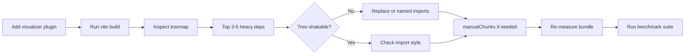

#### Implementation notes

In `vite.config.ts`, add the visualizer to the `plugins` array (build only). After identifying large chunks, search the repo for default or namespace imports (e.g. `import _ from 'lodash'`) and switch to `import { specific } from 'lodash-es'` or per-function imports. For Radix and Lucide, ensure every import is a named import of the specific component or icon; avoid `import *`. Re-run build and benchmarks after each change to confirm no regression.

#### Checklist

- [ ] (Before) Confirm `tests/e2e/benchmark.spec.ts` and `tests/integration/sync.latency.test.ts` exist and pass.
- [ ] (Before) Check current bundle (no visualizer yet vs. existing config).
- [ ] `rollup-plugin-visualizer` or `vite-bundle-visualizer` added; build run; top 3–5 heaviest deps identified.
- [ ] Non–tree-shakable usage replaced or trimmed (e.g. moment → date-fns, lodash → single imports).
- [ ] Named imports for Radix UI and Lucide; only used components bundled.
- [ ] `manualChunks` tuned in `vite.config` if needed.
- [ ] Bundle size reduced or main chunk smaller (measured).
- [ ] (After) Run full benchmark suite; FPS ≥58, object &lt;100 ms, cursor &lt;50 ms, 500-object, 5-user pass.
- [ ] LCP/load time improved or unchanged; no runtime regression.

---

### A.5 — Zustand objects store + per-shape subscription (70%)

- **Goal:** One remote object update re-renders only the affected shape(s); 500+ objects and 5-user propagation stay smooth.
- **Why it matters:** When `objects` is a single prop from the root, any object change replaces the whole array/record and re-renders every shape. With a Zustand store and per-id selectors, only components that subscribe to the changed object re-render, so 500+ objects and 5-user updates stay within FPS and latency targets.
- **Steps:**  
  - Create `objectsStore` (`objects: Record<string, IBoardObject>`, `setObject`, `updateObject`, `deleteObject`, etc.).  
  - Keep Firestore as source of truth: in `useObjects` (or sync hook), subscribe to object changes and push updates into the store; keep optimistic updates and rollback against the store.  
  - Stop passing `objects` from App/BoardView into `BoardCanvas`; derive visible IDs from store + viewport; for each visible id, render a shape that subscribes with `useObjectsStore((s) => s.objects[id])`; use stable callbacks from store actions.  
  - Migrate all `objects`/`objectsById`/`visibleObjects` reads to the store; remove `objects` prop from `BoardCanvas`.
- **Files:** New `stores/objectsStore.ts`, `useObjects.ts`, `App.tsx`, `BoardCanvas.tsx`, shape renderer/parent.
- **Done when:** CRUD and real-time sync unchanged; only changed shapes re-render; 500-object and 5-user benchmarks pass or improve.
- **Acceptance:** FPS ≥58; object &lt;100 ms, cursor &lt;50 ms; 5-user e2e passes; no new regressions.
- **Note:** Do after A.1 and A.3 to avoid overlapping refactors; higher regression risk so run full suite after.

#### Render scope: before vs after

```mermaid
flowchart TB
  subgraph before [Before - one objects prop]
    App[App]
    ObjectsProp["objects: IBoardObject[]"]
    App --> ObjectsProp
    ObjectsProp --> BoardCanvas
    BoardCanvas --> Shape1[Shape 1]
    BoardCanvas --> Shape2[Shape 2]
    BoardCanvas --> ShapeN[Shape N]
    OneChange[One object changes] --> ObjectsProp
    OneChange -.->|"entire tree re-renders"--> Shape1
    OneChange -.-> Shape2
    OneChange -.-> ShapeN
  end
  subgraph after [After - per-shape subscription]
    Firestore[Firestore]
    SyncHook[useObjects sync hook]
    Firestore --> SyncHook
    SyncHook --> objectsStore[objectsStore]
    objectsStore -->|"objects[id1]"| ShapeA[Shape A]
    objectsStore -->|"objects[id2]"| ShapeB[Shape B]
    objectsStore -->|"objects[idN]"| ShapeC[Shape N]
    RemoteChange[Remote update id2] --> objectsStore
    objectsStore -.->|"only Shape B re-renders"--> ShapeB
  end
```

#### Implementation notes

The sync hook (e.g. `useObjects`) should stay at a parent that has board scope; it subscribes to Firestore and calls `objectsStore.getState().setObject(...)` or merge helpers on each change. BoardCanvas (or a wrapper) uses a selector that returns only visible IDs from the store + viewport; it maps over IDs and renders a small wrapper component per ID that does `useObjectsStore((s) => s.objects[id])`. Use shallow compare or a stable selector so unchanged objects do not trigger re-renders. Pass update/delete/create from store actions so callbacks are stable.

#### Checklist

- [ ] (Before) Confirm A.1 and A.3 are stable; benchmark and sync latency tests exist and pass.
- [ ] (Before) Check whether objects are already partially in a store or still only from props.
- [ ] `objectsStore` created with `objects`, `setObject`, `updateObject`, `deleteObject` (and create).
- [ ] Firestore sync hook pushes updates into store; optimistic updates and rollback against store.
- [ ] `BoardCanvas` no longer receives `objects` prop; visible IDs derived from store + viewport.
- [ ] Each visible shape subscribes with `useObjectsStore((s) => s.objects[id])`; stable callbacks from store actions.
- [ ] All `objects`/`objectsById`/`visibleObjects` reads migrated to store; `objects` prop removed from `BoardCanvas`.
- [ ] CRUD and real-time sync behavior unchanged; only changed shapes re-render.
- [ ] (After) Run full benchmark suite; FPS ≥58, object &lt;100 ms, cursor &lt;50 ms, 500-object batch and 5-user e2e pass.
- [ ] (Stretch) 500+ objects and 5-user stable; no regression.

---

### A.6 — Cursor throttle during pan (70%)

- **Goal:** Reduce work during pan; keep cursor sync &lt;50 ms.
- **Why it matters:** While the user is panning, cursor position updates are less useful and can contend with viewport updates for main-thread and network. Skipping or throttling cursor writes during pan reduces work and keeps the cursor latency test valid when not panning.
- **Steps:**  
  - In cursor update path (`useCursors` or Stage `handleMouseMove`), when Stage is in pan mode and user is dragging, skip or heavily throttle cursor writes (e.g. `stage.isDragging()` or `isPanning` flag).  
  - Ensure cursor updates again when pan ends.
- **Files:** `useCursors.ts`, `BoardCanvas.tsx` (pan/drag state).
- **Done when:** Cursor writes skipped/throttled during pan; cursor latency test still &lt;50 ms.
- **Acceptance:** `tests/integration/sync.latency.test.ts` cursor test passes; 5-user e2e unchanged.

#### Cursor write decision

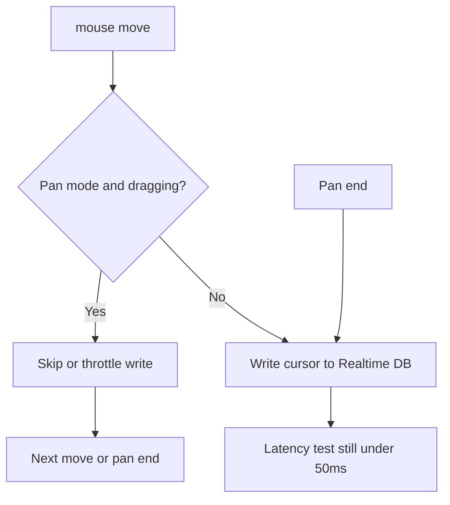

#### Implementation notes

In the same place where you call `updateCursor(...)`, check a flag or `stage.isDragging()` (if the Stage ref is available). When true, either do not call `updateCursor` or call it at most every N ms (e.g. 200–300). On pan end (pointer up or equivalent), send one final cursor update so other users see the correct position. The integration test that asserts cursor write &lt;50 ms should run without panning, so it should still pass.

#### Checklist

- [ ] (Before) Confirm `tests/e2e/benchmark.spec.ts` and `tests/integration/sync.latency.test.ts` exist and pass.
- [ ] (Before) Check cursor update path and where pan/drag state is available.
- [ ] When Stage is in pan mode and user is dragging, cursor writes skipped or heavily throttled.
- [ ] Cursor updates again when pan ends.
- [ ] `tests/integration/sync.latency.test.ts` cursor write test still &lt;50 ms.
- [ ] 5-user e2e unchanged (no new failures).
- [ ] (After) Run full benchmark suite; cursor &lt;50 ms, FPS and other gates pass.
- [ ] No regression in sync or FPS.

---

## Section B: Secondary — UX / Product Optimizations

Ranked by same weighted % (descending). These have lower direct benchmark coupling but improve product quality and polish.

| # | Task | Priority % | Goal summary |
| - | ---- | ---------- | -------------- |
| 1 | Welcome / Landing page | **96%** | Logged-out users get a clear first impression and path to sign up / log in |
| 2 | Board deletion — Owner vs. non-owner | **84%** | Non-owner leaves board; owner gets confirmation before permanent delete |
| 3 | Board name editing — Owner only | **82%** | Only owner can rename; others see read-only name |
| 4 | Fix share link | **80%** | Shared links open the correct board for any recipient |
| 5 | Fix trackpad panning (macOS) | **80%** | Two-finger swipe pans; ctrl+scroll zooms |
| 6 | Move groups of selected objects | **78%** | Multi-select drag moves all with batch Firestore write |
| 7 | Fix text editing (text moves on edit) | **76%** | No position jump when entering text edit (textarea overlay alignment) |
| 8 | Fix light & dark mode | **74%** | All UI respects theme; no hardcoded colors |
| 9 | Increase property panel height | **72%** | More properties visible; resizable panel |
| 10 | Middle mouse button panning | **72%** | Middle-button drag pans canvas |
| 11 | Fix snap-to-grid when dragging | **70%** | Same snap logic for drag as for resize; group bounding box |
| 12 | Expand AI use in app | **68%** | Context-aware AI; shape generation, summarization, layout (scope per initiative) |
| 13 | Fix fast-click spin boxes | **60%** | No erratic values on rapid numeric up/down clicks |
| 14 | Voice input in app | **60%** | Microphone + Web Speech API for AI chat input |
| 15 | Enforce only-export-components ESLint rule | **58%** | Component files export only components; move utils/types out |
| 16 | Refactor components with 3+ useEffects | **50%** | Extract effects into named hooks; no behavior change |
| 17 | Clarify & implement Frames | **40%** | Define Frames (artboards/sections); parenting, layering, UI |

Detailed steps for each secondary task remain as in **OPTIMIZATION-PLAN-3**; use the table above for ordering and the full Plan 3 sections for implementation notes.

### B.1 — Welcome / Landing page (96%)

#### Goal

Give logged-out users a clear first impression and a single path to sign up or log in.

#### Why it matters Without a dedicated landing experience, unauthenticated users may hit the app root and see a login form only. A welcome page sets expectations (real-time collab, AI, infinite canvas), builds trust, and makes CTAs obvious so conversion and onboarding improve

#### Implementation

Add a `/welcome` route. In the router, when the user is not authenticated and path is `/` (or a dedicated `/welcome`), render the welcome view; when authenticated, redirect to board list. The page should include app name, tagline, 2–3 feature bullets, an optional demo image or screenshot, and prominent Log In / Sign Up buttons that navigate to existing auth UI. Use existing design tokens and layout so it feels part of the same product.

#### Route / auth flow

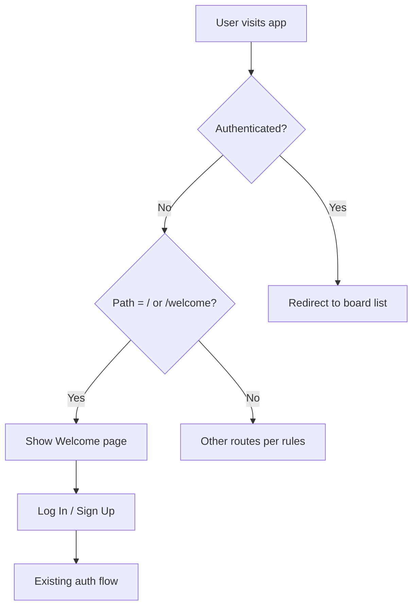

#### Checklist

- [x] (Before) Confirm benchmark/sync tests exist and pass if any auth/routing change could affect them.
- [x] `/welcome` route created; renders only when user is not authenticated.
- [x] App name, tagline, feature highlights (real-time collab, AI tools, infinite canvas), demo/screenshot included.
- [x] Prominent Log In and Sign Up CTAs; auto-redirect authenticated users to board list.
- [x] Responsive; matches existing design system.
- [ ] (After) No regression in auth or benchmark gates.

### B.2 — Board deletion — Owner vs. non-owner (84%)

#### Goal

Non-owners “leave” the board (remove from their list only); only the owner can permanently delete the board for everyone, with confirmation.

#### Why it matters

Letting any member delete the board risks accidents and abuse. Distinguishing “leave” vs “delete” and enforcing it server-side protects shared work and matches user expectations.

#### Implementation

Add or derive `ownerId` on the board document. In the UI, show “Leave Board” for non-owners (removes the current user’s membership reference; board stays for others) and “Delete Board” for owners (after confirmation: “This will permanently delete the board for all members”). Implement leave by updating a members subcollection or the user’s board list; implement delete by removing the board document and associated objects (batch delete). Add Firebase security rules so only the owner can delete the board document and only members can update their own membership.

#### Owner vs non-owner delete flow

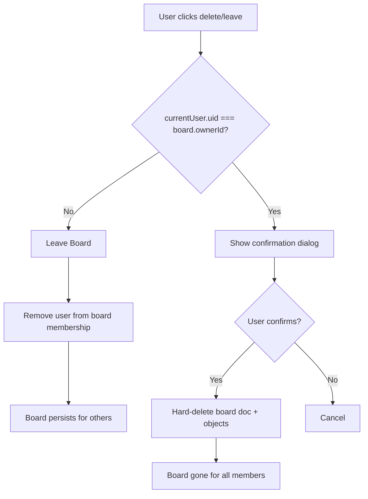

#### Checklist

- [ ] (Before) Confirm Firestore rules and board list flows are understood.
- [x] Non-owner "delete" removes board from their list only (leave board / remove membership); board persists for others.
- [x] Owner delete shows confirmation dialog; hard-deletes Firestore document and associated objects.
- [x] Firebase security rules enforce owner vs. non-owner server-side.
- [x] UI: "Leave Board" for non-owners, "Delete Board" for owners.
- [ ] (After) No regression in 5-user or object sync; board list and permissions correct.

### B.3 — Board name editing — Owner only (82%)

#### Goal

Only the board owner can rename the board; other members see a read-only name.

#### Why it matters Prevents accidental or conflicting renames and clarifies who controls board metadata

#### Implementation

Ensure `ownerId` exists on the board document (same as B.2). In the board list sidebar and board header, render an editable input (with save/cancel or blur-to-save) only when `currentUser.uid === board.ownerId`. For non-owners, render the name as plain text and optionally a tooltip: “Only the board owner can rename this board.” Persist renames via the existing board update path; enforce in Firestore rules that only the owner can update the board name (or the whole document).

#### Checklist

- [x] `ownerId` derived or added on board document.
- [x] Editable name input only when `currentUser.uid === board.ownerId` (sidebar and header).
- [ ] Non-owners see read-only name; tooltip "Only the board owner can rename this board."
- [ ] (After) No regression in board load or sync.

### B.4 — Fix share link (80%)

#### Goal

Shared links open the correct board for any recipient (owner, invited member, or new user), with correct routing and access.

#### Why it matters Broken share links undermine collaboration and trust; fixing URL encoding, routing, and read rules makes sharing reliable

#### Implementation

Reproduce the failure (e.g. incognito, different user). Confirm the share URL includes the board ID (e.g. `/board/:boardId`). Ensure the app reads the board ID from the route and loads that board; fix any redirect or default that overwrites it. Check Firestore read rules: can an invited member or a user following a link read the board document and its objects? Adjust rules so that members (or users with a valid invite token if you use one) can read. Test as owner, as invited member, and as a “stranger” (no access vs. invite flow).

#### Share link resolution

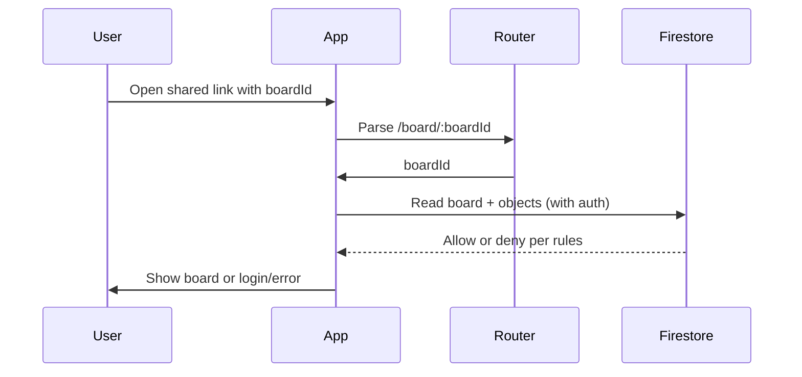

**Checklist:**

- [ ] (Before) Reproduce failure in incognito; audit URL and Firestore read rules.
- [ ] URL encodes board ID correctly; unauthenticated or non-member read rules allow intended access.
- [x] App routes to correct board when shared link is followed (owner, invited member, stranger).
- [ ] (After) Share link opens correct board; no regression in auth or benchmarks.

### B.5 — Fix trackpad panning (macOS) (80%)

#### Goal

On macOS, two-finger swipe pans the canvas and ctrl+scroll zooms; existing scroll-to-zoom and spacebar-pan still work.

#### Why it matters macOS sends wheel events without ctrl for two-finger swipe (pan). If the app only uses wheel for zoom, trackpad users cannot pan. Following the platform convention (ctrl+wheel = zoom, wheel = pan on macOS) fixes that without breaking Windows or mouse users

#### Implementation

In the viewport/wheel handler, branch on `ctrlKey`: when `ctrlKey` is true, treat the event as zoom (scale); when false, treat it as pan (translate). Ensure Windows and mouse users still get the desired behavior (often wheel = zoom, spacebar+drag = pan). Test on macOS trackpad, Windows precision touchpad, and a mouse with a scroll wheel.

#### Wheel handling

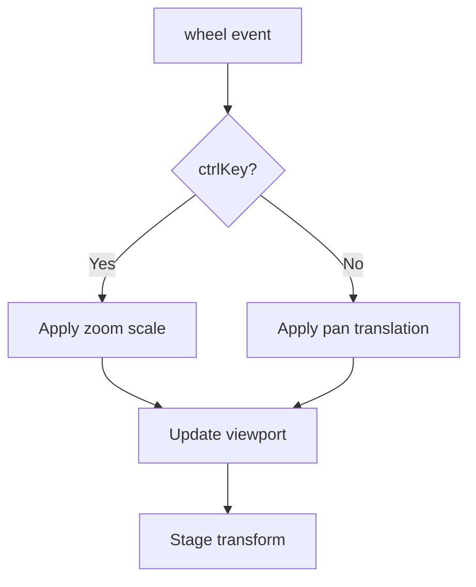

**Checklist:**

- [ ] (Before) Confirm `tests/e2e/benchmark.spec.ts` FPS test exists; check viewport/wheel handling.
- [ ] Wheel: `ctrlKey` → zoom; otherwise → translate viewport (macOS convention).
- [ ] Existing scroll-to-zoom and spacebar-pan unchanged; tested on macOS trackpad, Windows touchpad, mouse wheel.
- [ ] (After) FPS benchmark still ≥58; no regression in pan/zoom.

### B.6 — Move groups of selected objects (78%)

#### Goal

Dragging a multi-selection moves all selected objects together; relative positions preserved; snap-to-grid on the group bounding box; one Firestore batch for all position updates.

#### Why it matters Users expect to move several objects as a group. Doing it in one batch keeps the UI and sync efficient and avoids partial states

#### Implementation

In the drag handler, when the pointer moves with multiple items selected, compute a single delta from the drag start and apply it to every selected object’s position. Preserve relative positions (no drift). On drag end, compute snapped positions for the group’s bounding box (e.g. snap the top-left of the group) and derive each object’s final position from that. Write all updates in one Firestore `writeBatch`. If A.1 (Zustand selection) is done, read `selectedIds` from the store and use store actions for updates.

#### Group drag flow

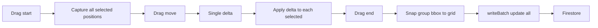

#### Checklist

- [ ] (Before) Confirm selection and drag handlers; check A.1 (Zustand selection) if done.
- [ ] Drag applies delta to all selected objects; relative positions preserved; snap-to-grid on group bounding box.
- [ ] All position updates in single Firestore `writeBatch`.
- [ ] (After) 5-user and object sync pass; no regression in FPS or selection.

### B.7 — Fix text editing (text moves on edit) (76%)

#### Goal

Entering text edit mode (e.g. double-click on sticky or text) does not visually shift the element; the DOM textarea overlay stays aligned with the canvas shape at all zoom and pan levels.

#### Why it matters A jumping or misaligned overlay confuses users and makes editing feel broken. Correct screen-space mapping fixes that

#### Implementation

Reproduce the jump at several zoom levels and pan positions. The issue is usually that the overlay position is derived from canvas coordinates without fully accounting for the Stage transform (pan + scale) or that the transform is applied twice. Use the Stage container bounds and the node’s absolute transformed position (e.g. `node.getAbsoluteTransform()` and the stage’s scale/position) to compute the overlay’s screen position once. Ensure the overlay updates live when the stage is panned/zoomed during edit (existing listener or viewport subscription). Regression-test at multiple zoom levels and pan offsets.

#### Overlay alignment

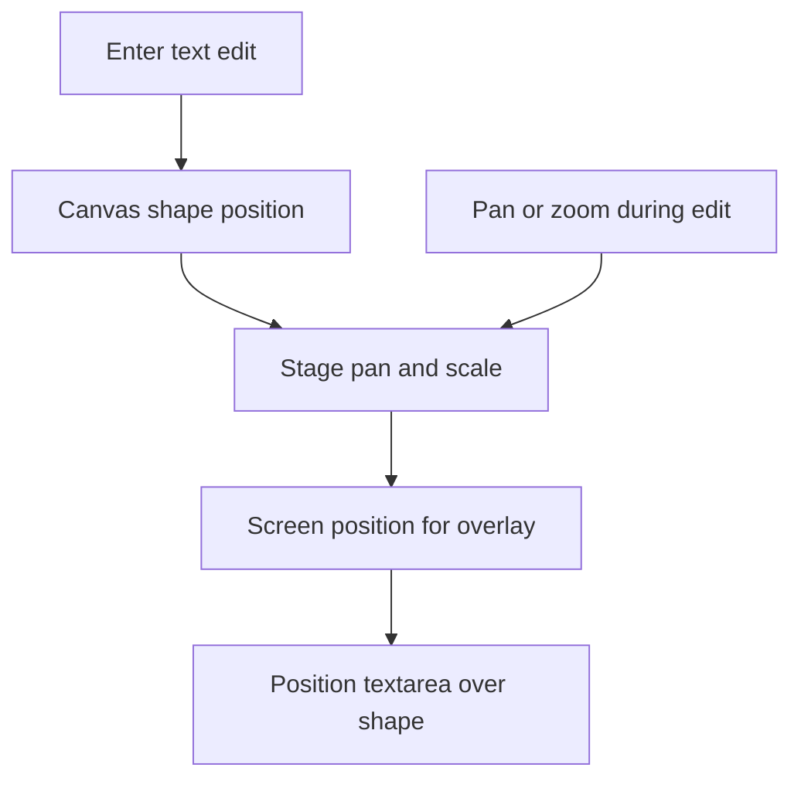

#### Checklist

- [ ] (Before) Reproduce position jump at multiple zoom/pan levels.
- [ ] Konva Text → DOM textarea overlay coordinate transform accounts for zoom and pan; textarea aligned over canvas element.
- [ ] Regression test at multiple zoom levels and pan offsets.
- [ ] (After) No regression in FPS or object sync.

### B.8 — Fix light & dark mode (74%)

#### Goal

All UI (canvas, sidebars, modals, property panel) respects the selected theme; no hardcoded colors; theme preference persists across sessions.

#### Why it matters Inconsistent or broken dark mode reduces usability and looks unpolished. A full pass ensures one source of truth (theme variables / Tailwind dark classes)

#### Implementation

Audit components for hex/rgb or fixed color names that should come from theme or Tailwind (e.g. `bg-white`, `text-gray-900` in dark mode). Use CSS variables or Tailwind’s `dark:` variants and a single theme toggle (e.g. `useTheme`). Persist the choice in localStorage or user preferences and apply on load. Do a full visual pass in both modes and fix canvas background, borders, and any Konva fill/stroke that should follow theme.

#### Checklist

- [ ] Audit components for hardcoded colors; theme variables used.
- [ ] `useTheme` and Tailwind dark-mode classes consistent (canvas, sidebars, modals, property panel).
- [ ] Theme preference persists across sessions.
- [ ] Full visual QA in both modes.
- [ ] (After) No regression in benchmarks or layout.

### B.9 — Increase property panel height (72%)

#### Goal

More properties visible without excessive scrolling; panel is resizable by the user via a drag handle.

#### Why it matters

A cramped property panel slows down iteration; a taller default plus resizing gives users control.

#### Implementation

Review the property panel container’s height (CSS or Tailwind). Increase the default min-height or height so common properties (e.g. position, size, fill) are visible without scrolling. Add a drag handle on the top or bottom edge and implement resize (e.g. state for height, mouse move/up listeners, or a small layout library). Ensure no overflow or clipping on small viewports and that the panel still works when collapsed or at min size.

#### Checklist

- [ ] Height constraints reviewed; default height increased so common properties visible.
- [ ] Drag handle added for resizable panel; no overflow/clipping on small screens.
- [ ] (After) No regression in layout or benchmarks.

### B.10 — Middle mouse button panning (72%)

#### Goal

Middle mouse button (button === 1) drag pans the canvas; behavior coexists with spacebar-drag and trackpad pan.

#### Why it matters

Many design/CAD users expect middle-drag to pan; supporting it improves familiarity and reduces reliance on the spacebar.

#### Implementation

On `mousedown` with `event.button === 1`, set a flag (e.g. `middleButtonPanMode`) and prevent default to avoid browser autoscroll. On `mousemove`, if the flag is set, translate the viewport by the delta. On `mouseup`, clear the flag. Ensure the same viewport update path is used as for spacebar-pan (and trackpad pan if applicable) so FPS and A.3 behavior are unchanged. Test alongside spacebar and trackpad.

#### Checklist

- [ ] (Before) Confirm viewport/pan handling; check FPS benchmark.
- [ ] `mousedown` with `button === 1` enters temporary pan mode; `mousemove` translates viewport; `mouseup` exits.
- [ ] Default middle-button autoscroll prevented; coexists with spacebar-pan and trackpad-pan.
- [ ] (After) FPS benchmark still ≥58; no regression.

### B.11 — Fix snap-to-grid when dragging (70%)

#### Goal

Snap-to-grid applies to drag end the same way it does to resize; when multiple objects are selected, snap the group’s bounding box.

#### Why it matters

Inconsistent snap (resize yes, drag no) is confusing and makes alignment harder.

#### Implementation

Find where resize applies `snapToGrid` (or equivalent) and where drag sets the final position. Apply the same snap logic in the drag-end handler: compute the intended position(s), run them through the snap utility, then write to state/Firestore. For multi-select, compute the selection’s bounding box, snap the box origin (e.g. top-left), then apply the same offset to all selected items so relative positions are preserved. Test single drag, multi-select drag, and frame drag.

#### Checklist

- [ ] Snap logic applied to drag move/end (same as resize); group bounding box when multi-select.
- [ ] Tested: single drag, multi-select drag, frame drag.
- [ ] (After) No regression in selection or object sync.

### B.12 — Expand AI use in app (68%)

#### Goal

AI is first-class and context-aware: e.g. shape generation from description, summarization of stickies, layout suggestions, and a panel that knows the current selection. Scope each initiative separately; keep AI response under 2 s.

#### Why it matters Moving AI from a side panel to context-aware actions (e.g. “arrange these”, “summarize selected”) increases usefulness without sacrificing performance

#### Implementation

Define one initiative at a time (e.g. “AI shape generation”, “summarize selected stickies”, “auto-arrange selection”, “contextual AI panel”). For each: specify the prompt/context (e.g. selected object IDs, board state), the tool calls or response shape, and how results are applied (create objects, update text, move positions). Ensure the existing AI proxy and tool schema support the new flows. Run the AI response benchmark after each change; keep single-step commands under 2 s. Coordinate with 5-user and object sync so AI-generated changes propagate correctly.

#### Context-aware AI flow

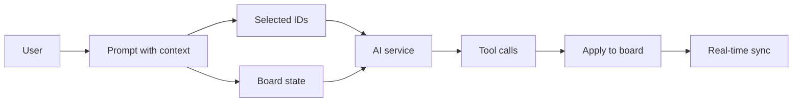

#### Checklist

- [ ] (Before) Scope each initiative; confirm AI response benchmark &lt;2 s.
- [ ] Context-aware AI; scope per initiative (shape generation, summarization, layout, contextual panel).
- [ ] (After) AI response benchmark still &lt;2 s; 5-user and object sync pass; no regression.

### B.13 — Fix fast-click spin boxes (60%)

#### Goal

Rapidly clicking the up/down controls on numeric inputs in the property panel does not produce erratic or wrong values.

#### Why it matters Race conditions or naive state updates can make spin boxes jump or revert when clicked quickly; fixing that makes property editing reliable

#### Implementation

Reproduce the issue (rapid clicks on a spin control). Check whether multiple state updates or commits are racing (e.g. each click schedules an update that overwrites the previous). Fix by debouncing the commit to the store/Firestore, or by using a fully controlled pattern where the displayed value is derived from state and each click applies a deterministic delta (e.g. current + step) so order is well-defined. Verify on all numeric property fields (position, size, rotation, etc.).

#### Checklist

- [ ] Reproduce erratic values on rapid up/down; fix race/batching; debounce or controlled pattern.
- [ ] Verified on all numeric property fields.
- [ ] (After) No regression in property panel or benchmarks.

### B.14 — Voice input in app (60%)

#### Goal

Users can speak into the AI chat via a microphone (or hotkey); speech is transcribed and placed in the prompt field for review before sending.

#### Why it matters Voice input improves accessibility and speed for users who prefer speaking; it extends the existing AI panel without changing its contract

#### Implementation

Add a microphone button to the AI chat input (or a global hotkey). Use the Web Speech API (`SpeechRecognition`) when available; start recognition on click, stream or finalize results into the prompt input field. Let the user edit the text before submitting. On unsupported browsers (e.g. Firefox, older Safari), show a clear fallback message and hide or disable the mic button. Ensure no regression in AI response time or benchmark.

#### Checklist

- [ ] Microphone button (or hotkey) on AI chat input; Web Speech API where available.
- [ ] Transcribed text populates prompt; user can review before submit; fallback message on unsupported browsers.
- [ ] (After) No regression in AI or benchmarks.

### B.15 — Enforce only-export-components ESLint rule (58%)

#### Goal

Component files export only React components; utilities, constants, and types live in dedicated files so the codebase stays consistent and tree-shaking is predictable.

#### Why it matters Mixing component and non-component exports in one file can confuse tooling and reviewers; the rule enforces a clear boundary

#### Implementation

Run ESLint with the rule (or add it); list all violations (files that export both components and non-components). For each file, move the non-component exports to a sibling or shared module (e.g. `utils`, `constants`, `types`). Update imports across the repo. Enable the rule as `error` in `eslint.config.js` and ensure CI passes with zero violations. Behavior and benchmarks should be unchanged.

#### Checklist

- [ ] ESLint run; violations identified; utils/constants/types moved to dedicated files.
- [ ] Rule enabled as `error` in `eslint.config.js`; CI passes with zero violations.
- [ ] (After) No behavior change; benchmarks still pass.

### B.16 — Refactor components with 3+ useEffects (50%)

#### Goal

Components with three or more `useEffect` calls are refactored so that related effects live in named custom hooks with a single responsibility; behavior is unchanged.

#### Why it matters Many effects in one component are hard to reason about and test; extracting them into hooks (e.g. `usePresenceSync`, `useCanvasEvents`) improves maintainability and testability

#### Prevention strategy

Before adding a new `useEffect`, ask: Can this be computed during render? Handled in an event handler? Derived from props/state without a side effect? Use `useEffect` only for true side effects (subscriptions, cleanup, external sync). When a component reaches 2 effects, consider grouping related logic into a custom hook. See `docs/Optimization/USE-EFFECT-CENSUS.md` for the per-file census and `local/max-use-effect-count` ESLint rule (warn at 2+ per file).

#### Implementation

Audit the codebase for components that have 3+ `useEffect` hooks. For each, group effects by concern (e.g. subscription, sync, event wiring). Extract each group into a custom hook with a clear name and document what it does. Update the component to call the new hooks. Add or update unit tests that target the hooks directly. Do not change observable behavior; run the full benchmark suite to confirm.

**Checklist:**

- [ ] Components with 3+ `useEffect` flagged; effects extracted into named hooks (e.g. `usePresenceSync`, `useCanvasEvents`).
- [ ] Unit tests updated or added for new hooks; behavior unchanged.
- [ ] (After) No regression; full benchmark suite passes.

### B.17 — Clarify & implement Frames (40%)

#### Goal

Frames are defined as named, bounded regions (artboards/sections) that group and move their children; objects dragged into a frame become children and move with it; layering and UI are coherent.

#### Why it matters Frames support structure (slides, export regions, sections) and need a clear contract: parenting, coordinate system, and render order so they don’t regress 500-object or 5-user behavior

#### Implementation

Define the data model: frame as an object type with bounds and optional `childIds` or parent-child links in Firestore. When an object is dropped inside a frame’s bounds, set its parent to the frame (and update frame’s child list if stored). When the frame moves, apply the same delta to all children. Layering: frame background layer below its children, children below objects outside the frame. Add frame-specific UI: editable label, resize handles, optional background color. Document intended use (e.g. tooltip or short onboarding). Run 500-object and 5-user benchmarks after implementation to ensure no regression.

#### Frame hierarchy

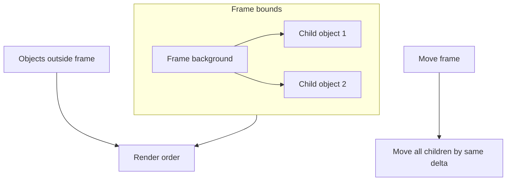

#### Checklist

- [ ] (Before) Confirm object/store and 500-object benchmark; Frames may touch object tree.
- [ ] Frames defined (named bounded regions, artboards/sections); frame-child parenting in Firestore.
- [ ] Layering: frame background below children, children below objects outside frame; editable label, resize, optional background.
- [ ] Tooltip or onboarding documents intended use.
- [ ] (After) 500-object and 5-user benchmarks pass; no regression in FPS or sync.

---

## Execution Waves

- **Wave 1 — Fast wins (no regression):**  
  A.1 (useBatchDraw + Zustand selection), A.2 (batch delete), A.6 (cursor throttle).  
  Run benchmark suite after Wave 1; block merge on any regression.

- **Wave 2 — Structural (higher risk):**  
  A.3 (viewport off hot path), A.4 (bundle audit).  
  Then A.5 (Zustand objects store) after A.1 and A.3 are stable.  
  Full benchmark + e2e after each task.

- **Wave 3 — Optional / future:**  
  SSE, edge DB, WebSocket/Y.js — scoped as separate projects; not part of this plan’s gates.

- **Secondary:**  
  Schedule UX/product tasks (Section B) as capacity allows; order by priority % or dependency (e.g. fix share link and board deletion early for trust/safety).

### Wave and task dependency

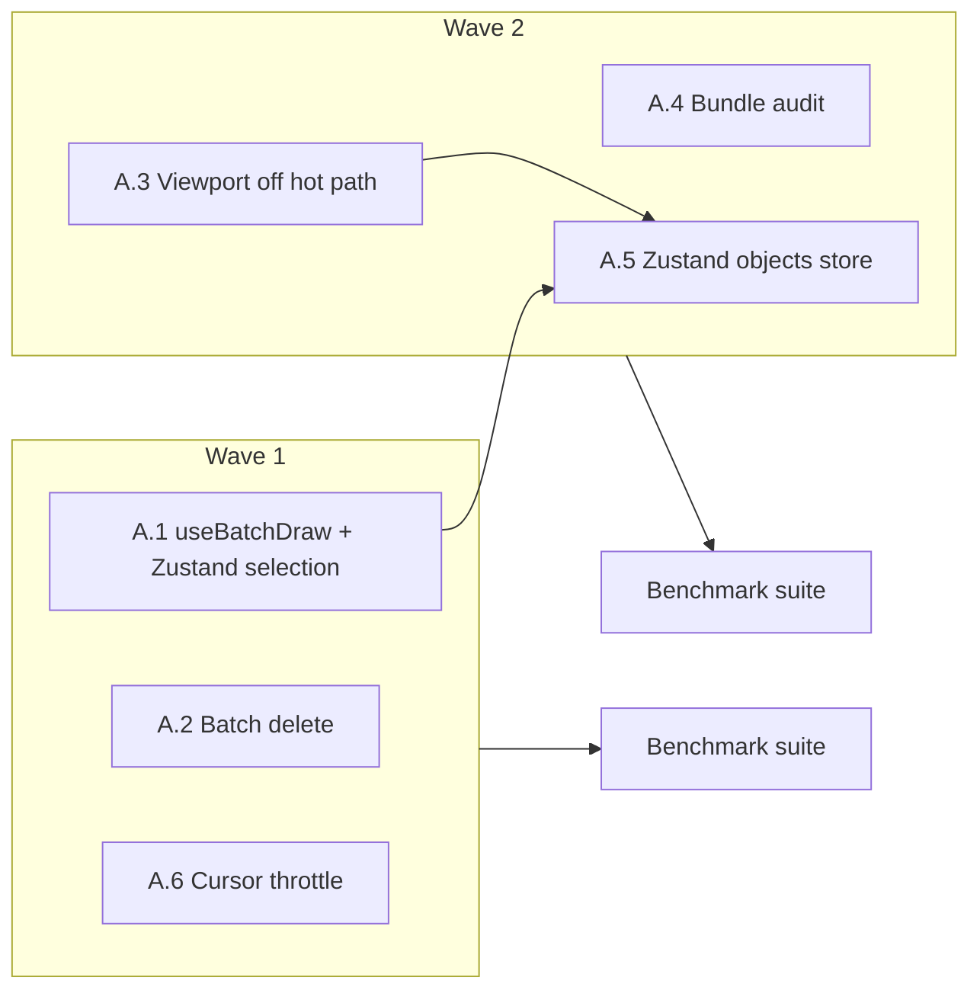

### Parallel-safe work (near-zero cross-task risk)

Tasks below can be developed **in parallel** with minimal risk that one will break or block the other. Criteria: **no shared files** (or strictly non-overlapping areas) and **no dependency** of one task on the other’s output. If in doubt, run sequentially.

#### Primary (Section A)

| Task | Touches | Safe to run in parallel with | Do not run in parallel with |
| ---- | ------- | ---------------------------- | --------------------------- |
| A.4 Bundle audit | `vite.config.ts`, import style across `src` | **All other tasks** — build/config only, no runtime overlap | — |
| A.2 Batch delete | Sync/object service, delete UI | A.4, A.6, A.3; and A.1 if “delete selected” uses selection API only (e.g. `useSelection()`), not context internals | A.5 (A.5 changes object flow) |
| A.6 Cursor throttle | `useCursors.ts`, BoardCanvas pan flag | A.4, A.2 | A.1, A.3 (shared BoardCanvas / event path) |
| A.1 Selection + useBatchDraw | BoardCanvas, SelectionProvider, selectionContext, PropertyInspector, selectionStore | A.4, A.2 (if delete uses selection API) | A.3, A.6 (shared BoardCanvas); A.5 (A.5 after A.1) |
| A.3 Viewport off hot path | `useCanvasViewport.ts`, BoardCanvas Stage/viewport | A.4, A.2 | A.1, A.6 (shared BoardCanvas); A.5 (A.5 after A.3) |
| A.5 Objects store | objectsStore, useObjects, App, BoardCanvas, shapes | — | Run **after** A.1 and A.3; do not parallel with them |

#### Secondary (Section B)

Most B tasks are independent (different features/files). Safe to run in parallel with each other and with primary tasks, except: B.6 (move groups) should run after or in sync with A.1 if selection is in Zustand; B.12 (AI) may touch shared AI path — run one AI change at a time.

#### Parallel-safe lanes (diagram)

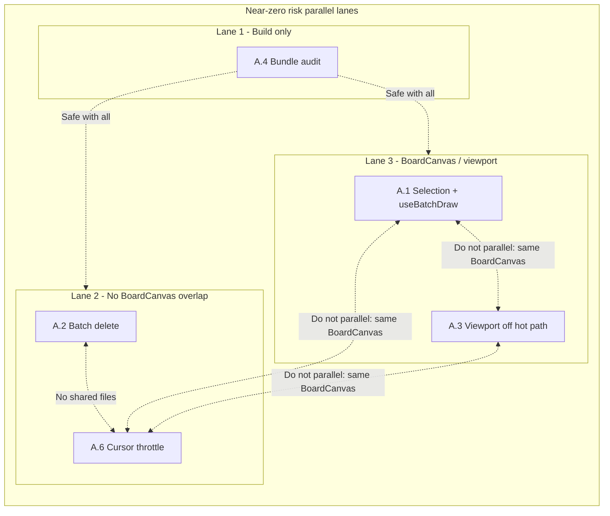

#### Summary

- **Always parallel-safe with everything:** A.4 (bundle audit) — config and imports only.
- **Safe to run together:** A.2 (batch delete) and A.6 (cursor throttle) — different modules, no shared files.
- **Do not run in parallel (same critical path / file):** A.1, A.3, A.6 — all touch BoardCanvas or viewport/selection/cursor flow; do one at a time (e.g. A.1 then A.3 then A.6, or A.3 then A.1 then A.6).
- **Strictly sequential:** A.5 after A.1 and A.3; no parallel with A.5 until those are merged and stable.

---

## Verification Checklist

Before starting a wave:

- [ ] Confirm benchmark and sync latency tests exist and pass: `tests/e2e/benchmark.spec.ts`, `tests/integration/sync.latency.test.ts`.
- [ ] Check whether the optimization is already partially done (e.g. `useBatchDraw` / `useCanvasViewport` usage) to avoid duplicate work.

After each wave (or after each task in Wave 2):

- [ ] Run full benchmark suite (e2e + integration).
- [ ] Confirm: FPS ≥58, object sync &lt;100 ms, cursor &lt;50 ms, 500-object batch and 5-user propagation pass.
- [ ] If any gate regresses: revert or fix before merging; do not ship regression for “wow factor.”

Stretch:

- [ ] Where applicable, aim for ~20% improvement over current baselines (e.g. FPS toward 60, bulk delete &lt;300 ms) while still meeting all PRD gates.

---

## References

- [docs/PRD.md](../PRD.md) — Success metrics, benchmark gates, feature context.
- [docs/G4 Week 1 - CollabBoard.pdf](../G4%20Week%201%20-%20CollabBoard.pdf) — Performance targets and MVP criteria.
- [docs/Optimization/OPTIMIZATION-PLAN-1.md](OPTIMIZATION-PLAN-1.md) — Original asset/bundle and architectural ideas (Next.js-oriented).
- [docs/Optimization/OPTIMIZATION-PLAN-2.md](OPTIMIZATION-PLAN-2.md) — Canvas/viewport and Zustand performance plan.
- [docs/Optimization/OPTIMIZATION-PLAN-3.md](OPTIMIZATION-PLAN-3.md) — Full UX/product task list and steps.
