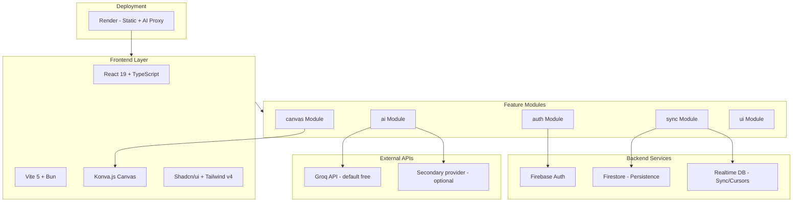
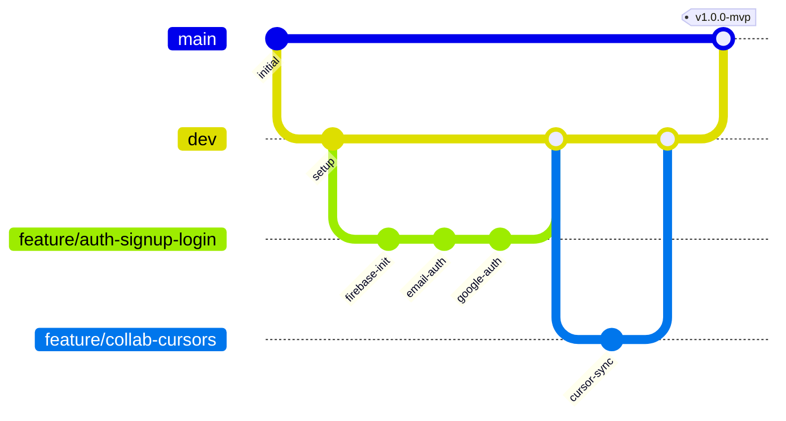
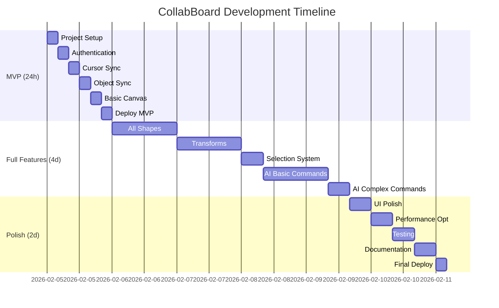
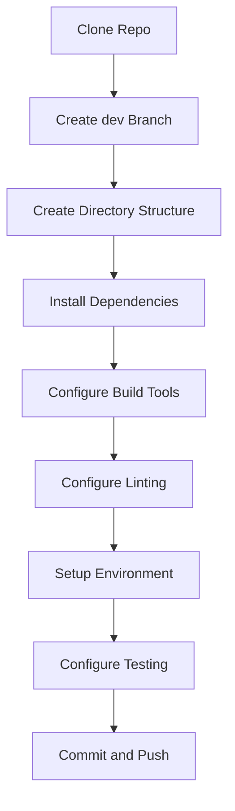
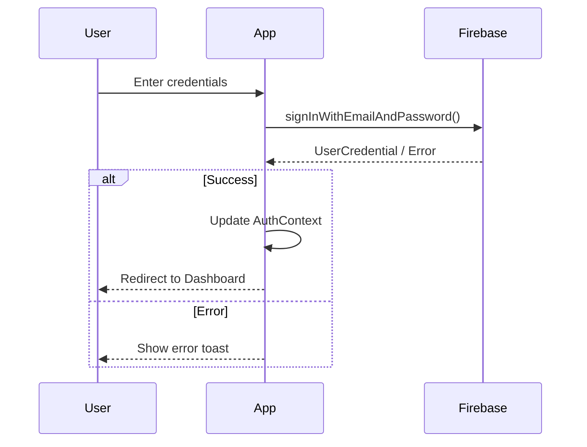
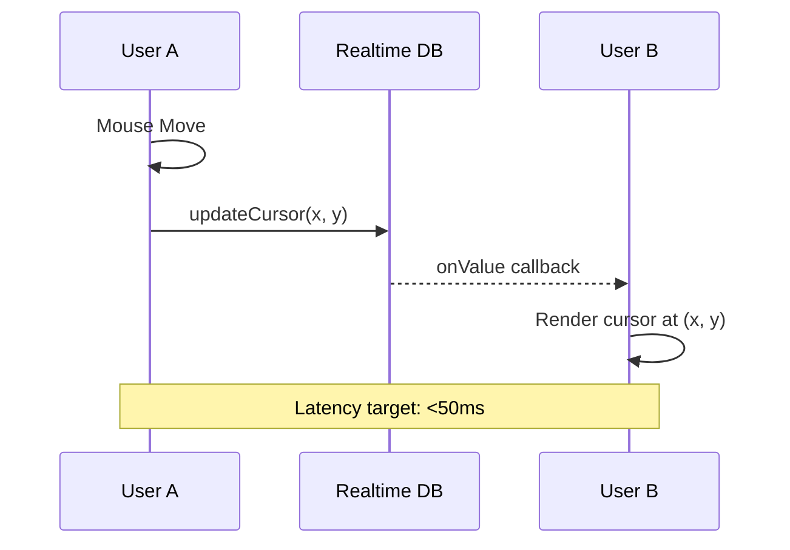
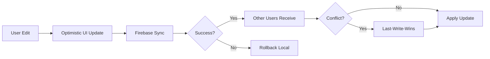
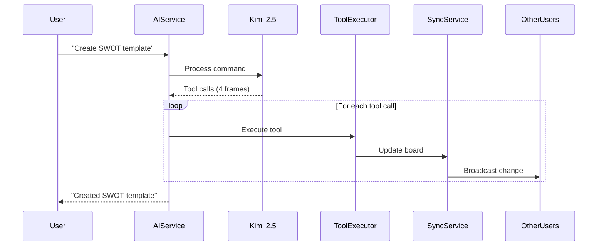

<!-- ## Summary

The root Product Requirements Document is the main product and technical spec for CollabBoard. It defines the project (real-time collaborative whiteboard, AI-powered, Miro-inspired), MVP and success metrics, tech stack and architecture, SOLID application, naming, and detailed requirements (features, collaboration, AI, testing, appendices). It is the source of truth for scope and rationale so that implementation and prioritization stay aligned and can be explained from one document. -->

# CollabBoard Product Requirements Document (PRD)

## Executive Summary

### Project Overview

CollabBoard is a production-scale, real-time collaborative whiteboard
application inspired by Miro. It enables multiple users to brainstorm, map
ideas, and run workshops simultaneously on an infinite canvas. The application
features AI-powered board manipulation through natural language commands, making
it a showcase of AI-first development methodology.

**Project Deadline**: 1-week sprint with three checkpoints:

| Checkpoint       | Deadline           | Focus                             |
| ---------------- | ------------------ | --------------------------------- |
| MVP              | Tuesday (24 hours) | Collaborative infrastructure      |
| Early Submission | Friday (4 days)    | Full feature set                  |
| Final            | Sunday (7 days)    | Polish, documentation, deployment |

### MVP Requirements (24-Hour Gate)

All items required to pass:

- [x] Infinite board with pan/zoom
- [x] Sticky notes with editable text
- [x] At least one shape type (rectangle, circle, or line)
- [x] Create, move, and edit objects
- [x] Real-time sync between 2+ users
- [x] Multiplayer cursors with name labels
- [x] Presence awareness (who's online)
- [x] User authentication
- [x] Deployed and publicly accessible

> **Critical**: A simple whiteboard with bulletproof multiplayer beats a
> feature-rich board with broken sync.

### Success Metrics

| Metric              | Target                                       |
| ------------------- | -------------------------------------------- |
| Frame Rate          | 60 FPS during pan, zoom, object manipulation |
| Object Sync Latency | <100ms                                       |
| Cursor Sync Latency | <50ms                                        |
| Object Capacity     | 500+ objects without performance drops       |
| Concurrent Users    | 5+ without degradation                       |
| AI Response Time    | <2s for single-step commands                 |
| AI Command Types    | 6+ distinct command categories               |

---

## Tech Stack and Architecture

### Technology Stack



### Stack Rationale

| Layer          | Technology                            | Rationale                                                                                 |
| -------------- | ------------------------------------- | ----------------------------------------------------------------------------------------- |
| **Backend**    | Firebase                              | Mature real-time sync, offline support, Google integration, quick prototyping             |
| **Frontend**   | React 19 + Vite + Bun                 | Fast dev (Vite HMR, Bun speed), type safety (TS), modern React features                   |
| **Canvas**     | Konva.js                              | High performance (60fps with 1000+ objects), layered structure, React integration         |
| **UI**         | Shadcn/ui + Tailwind v4               | Customizable components, CSS-first approach, accessible by default                        |
| **AI**         | Groq (default) or secondary provider  | Groq: free tier, Llama 3.3 70B; secondary (e.g. NVIDIA): OpenAI-compatible, function calling |
| **Deployment** | Render + Firebase                     | Render: static site and/or Web Service for AI proxy; Firebase: auth, persistence, realtime |

### SOLID Principles Application

#### Single Responsibility Principle (SRP)

Each module handles one concern:

```text
src/modules/
├── auth/          # Authentication only
├── sync/          # Real-time synchronization only
├── canvas/        # Canvas rendering and interactions only
├── ai/            # AI command processing only
└── ui/            # UI utilities and theming only
```

#### Open-Closed Principle (OCP)

Extend via interfaces without modifying core:

```typescript
// Base shape interface - open for extension
interface IShape extends ISize {
  id: string;
  type: ShapeType;
  render(): ReactElement;
}

// New shapes extend without modifying existing code
class StickyNote implements IShape {
  /* ... */
}
class Rectangle implements IShape {
  /* ... */
}
class Circle implements IShape {
  /* ... */
}
```

#### Liskov Substitution Principle (LSP)

Substitutable shape objects:

```typescript
// Any shape can be used where IShape is expected
const renderShape = (shape: IShape): ReactElement => shape.render();

// All shapes work identically
renderShape(new StickyNote(props));
renderShape(new Rectangle(props));
```

#### Interface Segregation Principle (ISP)

Minimal, focused interfaces:

```typescript
interface ITransformable {
  move(x: number, y: number): void;
  resize(width: number, height: number): void;
  rotate(angle: number): void;
}

interface ISelectable {
  select(): void;
  deselect(): void;
  isSelected: boolean;
}

interface IEditable {
  startEdit(): void;
  endEdit(): void;
  updateContent(content: string): void;
}

// Shapes implement only what they need
class StickyNote implements ITransformable, ISelectable, IEditable {
  /* ... */
}
class Line implements ITransformable, ISelectable {
  /* no IEditable */
}
```

#### Dependency Inversion Principle (DIP)

Depend on abstractions, inject dependencies:

```typescript
// Abstract service interface
interface ISyncService {
  subscribe(
    boardId: string,
    callback: (objects: IBoardObject[]) => void
  ): Unsubscribe;
  updateObject(
    boardId: string,
    objectId: string,
    data: Partial<IBoardObject>
  ): Promise<void>;
}

// Concrete implementation
class FirestoreSyncService implements ISyncService {
  /* ... */
}

// AI Service depends on abstraction
class AIService {
  constructor(
    private syncService: ISyncService,
    private toolExecutor: IToolExecutor
  ) {}
}
```

### Project Structure

```text
CollabBoard/
├── docs/
│   ├── guides/              # Technology guides
│   ├── research/            # Design documents
│   └── PRD.md               # This document
├── public/                  # Static assets
├── src/
│   ├── components/          # React components
│   │   ├── ui/              # Shadcn/ui components
│   │   ├── canvas/          # Canvas-related components
│   │   ├── board/           # Board UI components
│   │   └── presence/        # Presence/collaboration UI
│   ├── modules/             # Feature modules
│   │   ├── auth/            # Authentication
│   │   │   ├── authService.ts
│   │   │   ├── useAuth.ts
│   │   │   └── index.ts
│   │   ├── sync/            # Real-time sync
│   │   │   ├── firestoreService.ts
│   │   │   ├── realtimeService.ts
│   │   │   ├── usePresence.ts
│   │   │   └── index.ts
│   │   ├── canvas/          # Canvas logic
│   │   │   ├── shapes/
│   │   │   ├── useCanvas.ts
│   │   │   └── index.ts
│   │   ├── ai/              # AI integration
│   │   │   ├── aiService.ts
│   │   │   ├── toolExecutor.ts
│   │   │   ├── tools.ts
│   │   │   └── index.ts
│   │   └── ui/              # UI utilities
│   ├── lib/                 # Utility functions
│   │   ├── firebase.ts
│   │   ├── ai.ts
│   │   ├── utils.ts
│   │   └── env.ts
│   ├── types/               # TypeScript definitions
│   │   ├── board.ts
│   │   ├── user.ts
│   │   └── index.ts
│   ├── hooks/               # Custom React hooks
│   ├── App.tsx              # Root component
│   ├── main.tsx             # Entry point
│   └── index.css            # Global styles
├── tests/
│   ├── unit/                # Unit tests
│   ├── integration/         # Integration tests
│   └── e2e/                 # End-to-end tests
├── .env.example             # Environment template
├── .gitignore
├── eslint.config.js
├── .prettierrc
├── index.html
├── package.json
├── tsconfig.json
├── vite.config.ts
├── vitest.config.ts
└── playwright.config.ts
```

### Naming Conventions

| Type                | Convention       | Example                       |
| ------------------- | ---------------- | ----------------------------- |
| Variables/Functions | camelCase        | `boardState`, `updateObject`  |
| Classes/Components  | PascalCase       | `StickyNote`, `BoardCanvas`   |
| Types/Enums         | PascalCase       | `ShapeType`, `UserRole`       |
| Interfaces          | IPascalCase      | `IBoardObject`, `IAuthResult` |
| Constants           | UPPER_SNAKE_CASE | `MAX_OBJECTS`, `API_BASE_URL` |
| Files (components)  | PascalCase       | `StickyNote.tsx`              |
| Files (modules)     | camelCase        | `authService.ts`              |

---

## Git Workflow

### Branch Strategy



### Branch Naming

| Type    | Pattern                        | Example                     |
| ------- | ------------------------------ | --------------------------- |
| Feature | `feature/<epic>-<description>` | `feature/auth-signup-login` |
| Bugfix  | `bugfix/<issue>-<description>` | `bugfix/123-cursor-flicker` |
| Hotfix  | `hotfix/<description>`         | `hotfix/auth-token-refresh` |
| Release | `release/<version>`            | `release/1.0.0`             |

### Commit Message Format

Follow Conventional Commits:

```text
<type>(<scope>): <description>

[optional body]

[optional footer]
```

**Types**:

- `feat`: New feature
- `fix`: Bug fix
- `docs`: Documentation
- `style`: Formatting (no code change)
- `refactor`: Code restructuring
- `test`: Adding tests
- `chore`: Maintenance tasks

**Examples**:

```text
feat(auth): add Google OAuth sign-in
fix(sync): resolve cursor position drift
docs(readme): update deployment instructions
test(canvas): add sticky note creation tests
```

### Pull Request Guidelines

1. **Title**: Follow commit message format
2. **Description**: Include:
   - What changes were made
   - Why changes were needed
   - How to test
   - Screenshots (for UI changes)
3. **Checklist**:
   - [ ] Tests pass locally
   - [ ] Linting passes
   - [ ] No console.log statements
   - [ ] Types are correct (no `any`)
4. **Review**: At least self-review before merge

### CI/CD Pipeline

```yaml
# netlify.toml
[build]
  command = "bun run build"
  publish = "dist"

[build.environment]
  NODE_VERSION = "20"
  BUN_VERSION = "1.0"

[[redirects]]
  from = "/*"
  to = "/index.html"
  status = 200
```

---

## Project Timeline



---

## Epic 0: Project Setup and Configuration

### Intent

Standardize the development environment, establish coding rules for AI-first
development (Cursor, Context7 MCP for docs), configure linting, and set up
environment variables.

**Epic 0 completion**:

- [x] Directory structure (modules, components, lib, types, hooks, tests)
- [x] Build and tooling config (Vite, TypeScript, ESLint, Prettier)
- [x] Environment template (.env.example)
- [x] Testing setup (Vitest, Playwright, tests/setup.ts)

### Story 0.1: Repository and Rules Setup

**Features**: Repository initialization, dependencies, testing framework,
.cursor/rules for AI-first development.

**Branch**: `feature/setup-repo-rules`

#### Commit 1: Initialize Development Structure

- **Subtask 1**: Create and checkout `dev` branch

  ```bash
  git checkout -b dev
  ```

- **Subtask 2**: Create module directories

  ```bash
  mkdir -p src/modules/{auth,sync,canvas,ai,ui}
  mkdir -p src/components/{ui,canvas,board,presence}
  mkdir -p src/{lib,types,hooks}
  mkdir -p tests/{unit,integration,e2e}
  ```

- **Subtask 3**: Update `.gitignore`

  ```gitignore
  # Dependencies
  node_modules/

  # Build outputs
  dist/

  # Environment files
  .env
  .env.local
  .env.*.local

  # IDE
  .idea/
  .vscode/*
  !.vscode/extensions.json
  !.vscode/settings.json

  # Logs
  *.log

  # Testing
  coverage/

  # Bun
  bun.lockb

  # Playwright
  /test-results/
  /playwright-report/
  ```

#### Commit 2: Install Dependencies

- **Subtask 1**: Initialize with Bun

  ```bash
  bun init
  ```

- **Subtask 2**: Install core dependencies

  ```bash
  bun add react@19 react-dom@19 firebase konva react-konva
  bun add clsx tailwind-merge class-variance-authority
  bun add openai  # For Kimi 2.5 API
  ```

- **Subtask 3**: Install dev dependencies

  ```bash
  bun add -d typescript @types/react @types/react-dom
  bun add -d vite @vitejs/plugin-react
  bun add -d tailwindcss @tailwindcss/vite
  bun add -d eslint prettier eslint-config-prettier
  bun add -d vitest @vitest/coverage-v8 @testing-library/react @testing-library/jest-dom
  bun add -d playwright @playwright/test
  bun add -d jsdom
  ```

#### Commit 3: Configure Vite and TypeScript

- **Subtask 1**: Create `vite.config.ts`

  ```typescript
  import { defineConfig } from 'vite';
  import react from '@vitejs/plugin-react';
  import tailwindcss from '@tailwindcss/vite';
  import path from 'path';

  export default defineConfig({
    plugins: [react(), tailwindcss()],
    resolve: {
      alias: {
        '@': path.resolve(__dirname, './src'),
      },
    },
    server: {
      port: 5173,
      strictPort: true,
      host: true,
      open: true,
    },
    build: {
      outDir: 'dist',
      sourcemap: true,
      minify: 'esbuild',
      target: 'es2020',
      rollupOptions: {
        output: {
          manualChunks: {
            vendor: ['react', 'react-dom'],
            firebase: [
              'firebase/app',
              'firebase/auth',
              'firebase/firestore',
              'firebase/database',
            ],
            konva: ['konva', 'react-konva'],
          },
        },
      },
    },
    envPrefix: 'VITE_',
  });
  ```

- **Subtask 2**: Create `tsconfig.json`

  ```json
  {
    "compilerOptions": {
      "target": "ES2020",
      "lib": ["ES2020", "DOM", "DOM.Iterable"],
      "jsx": "react-jsx",
      "module": "ESNext",
      "moduleResolution": "bundler",
      "resolveJsonModule": true,
      "allowImportingTsExtensions": true,
      "baseUrl": ".",
      "paths": {
        "@/*": ["./src/*"]
      },
      "strict": true,
      "noUnusedLocals": true,
      "noUnusedParameters": true,
      "noFallthroughCasesInSwitch": true,
      "noUncheckedIndexedAccess": true,
      "noEmit": true,
      "isolatedModules": true,
      "esModuleInterop": true,
      "allowSyntheticDefaultImports": true,
      "forceConsistentCasingInFileNames": true,
      "skipLibCheck": true,
      "types": ["vite/client", "vitest/globals"]
    },
    "include": ["src", "tests"],
    "exclude": ["node_modules", "dist"]
  }
  ```

#### Commit 4: Configure ESLint and Prettier

- **Subtask 1**: Create `eslint.config.js`
- **Subtask 2**: Create `.prettierrc`

  ```json
  {
    "semi": true,
    "singleQuote": false,
    "tabWidth": 2,
    "trailingComma": "es5",
    "printWidth": 100,
    "bracketSpacing": true,
    "arrowParens": "always",
    "endOfLine": "lf"
  }
  ```

#### Commit 5: Create Environment Template

- **Subtask 1**: Create `.env.example`

  ```env
  # Firebase Configuration
  VITE_FIREBASE_API_KEY=your_api_key_here
  VITE_FIREBASE_AUTH_DOMAIN=your-project.firebaseapp.com
  VITE_FIREBASE_PROJECT_ID=your-project-id
  VITE_FIREBASE_STORAGE_BUCKET=your-project.appspot.com
  VITE_FIREBASE_MESSAGING_SENDER_ID=123456789
  VITE_FIREBASE_APP_ID=1:123456789:web:abc123
  VITE_FIREBASE_DATABASE_URL=https://your-project.firebaseio.com

  # AI: Groq (free) or NVIDIA/Kimi 2.5. Production: set GROQ_API_KEY or NVIDIA_API_KEY on the AI proxy (e.g. Render).
  VITE_AI_PROVIDER=groq
  VITE_GROQ_API_KEY=gsk_xxxx
  VITE_NVIDIA_API_KEY=nvapi-xxxx-xxxx-xxxx

  # App Configuration
  VITE_APP_NAME=CollabBoard
  ```

#### Commit 6: Setup Testing Configuration

- **Subtask 1**: Create `vitest.config.ts`
- **Subtask 2**: Create `playwright.config.ts`
- **Subtask 3**: Create `tests/setup.ts`



---

## Epic 1: User Authentication and Access

### Intent for Epic 1

Implement secure authentication with Firebase Auth supporting email/password and
Google OAuth. Add role-based access control (RBAC) for board collaboration with
viewer/editor/owner roles.

### Story 1.1: Sign Up and Login

**As a user**, I can sign up and login with email or Google, so I can access my
boards securely.

**Acceptance Criteria**:

- [x] Email/password registration with validation
- [x] Email/password login
- [x] Google OAuth sign-in
- [x] Session persistence across page refreshes
- [x] Logout functionality
- [x] Error handling with user feedback

**Branch**: `feature/auth-signup-login`

#### Commit 1: Firebase Auth Module Setup

- **Subtask 1**: Create Firebase console project and enable Auth
- **Subtask 2**: Add Firebase config to `.env`
- **Subtask 3**: Create `src/lib/firebase.ts`

  ```typescript
  import { initializeApp, FirebaseApp } from 'firebase/app';
  import { getAuth, Auth } from 'firebase/auth';
  import { getFirestore, Firestore } from 'firebase/firestore';
  import { getDatabase, Database } from 'firebase/database';

  interface IFirebaseConfig {
    apiKey: string;
    authDomain: string;
    projectId: string;
    storageBucket: string;
    messagingSenderId: string;
    appId: string;
    databaseURL: string;
  }

  const firebaseConfig: IFirebaseConfig = {
    apiKey: import.meta.env.VITE_FIREBASE_API_KEY,
    authDomain: import.meta.env.VITE_FIREBASE_AUTH_DOMAIN,
    projectId: import.meta.env.VITE_FIREBASE_PROJECT_ID,
    storageBucket: import.meta.env.VITE_FIREBASE_STORAGE_BUCKET,
    messagingSenderId: import.meta.env.VITE_FIREBASE_MESSAGING_SENDER_ID,
    appId: import.meta.env.VITE_FIREBASE_APP_ID,
    databaseURL: import.meta.env.VITE_FIREBASE_DATABASE_URL,
  };

  const app: FirebaseApp = initializeApp(firebaseConfig);

  export const auth: Auth = getAuth(app);
  export const firestore: Firestore = getFirestore(app);
  export const realtimeDb: Database = getDatabase(app);

  export { app };
  ```

#### Commit 2: Email Authentication

- **Subtask 1**: Create `src/modules/auth/authService.ts`

  ```typescript
  import {
    createUserWithEmailAndPassword,
    signInWithEmailAndPassword,
    signInWithPopup,
    GoogleAuthProvider,
    signOut,
    onAuthStateChanged,
    User,
    UserCredential,
  } from 'firebase/auth';
  import { auth } from '@/lib/firebase';

  export interface IAuthResult {
    user: User | null;
    error: string | null;
  }

  export const signUpWithEmail = async (
    email: string,
    password: string
  ): Promise<IAuthResult> => {
    try {
      const credential: UserCredential = await createUserWithEmailAndPassword(
        auth,
        email,
        password
      );
      return { user: credential.user, error: null };
    } catch (error) {
      return { user: null, error: (error as Error).message };
    }
  };

  export const signInWithEmail = async (
    email: string,
    password: string
  ): Promise<IAuthResult> => {
    try {
      const credential: UserCredential = await signInWithEmailAndPassword(
        auth,
        email,
        password
      );
      return { user: credential.user, error: null };
    } catch (error) {
      return { user: null, error: (error as Error).message };
    }
  };

  export const signInWithGoogle = async (): Promise<IAuthResult> => {
    try {
      const provider = new GoogleAuthProvider();
      const credential: UserCredential = await signInWithPopup(auth, provider);
      return { user: credential.user, error: null };
    } catch (error) {
      return { user: null, error: (error as Error).message };
    }
  };

  export const logOut = async (): Promise<void> => {
    await signOut(auth);
  };

  export const subscribeToAuthChanges = (
    callback: (user: User | null) => void
  ): (() => void) => {
    return onAuthStateChanged(auth, callback);
  };
  ```

- **Subtask 2**: Create Shadcn Form components for login/signup
- **Subtask 3**: Add error toast notifications

#### Commit 3: Google OAuth

- **Subtask 1**: Enable Google provider in Firebase Console
- **Subtask 2**: Add Google sign-in button to auth forms

#### Commit 4: Auth Context and Hook

- **Subtask 1**: Create `src/modules/auth/useAuth.ts`

  ```typescript
  import { useState, useEffect, useCallback } from 'react';
  import { User } from 'firebase/auth';
  import {
    subscribeToAuthChanges,
    signUpWithEmail,
    signInWithEmail,
    signInWithGoogle,
    logOut,
    IAuthResult,
  } from './authService';

  interface IUseAuthReturn {
    user: User | null;
    loading: boolean;
    error: string | null;
    signUp: (email: string, password: string) => Promise<IAuthResult>;
    signIn: (email: string, password: string) => Promise<IAuthResult>;
    signInGoogle: () => Promise<IAuthResult>;
    signOut: () => Promise<void>;
    clearError: () => void;
  }

  export const useAuth = (): IUseAuthReturn => {
    const [user, setUser] = useState<User | null>(null);
    const [loading, setLoading] = useState<boolean>(true);
    const [error, setError] = useState<string | null>(null);

    useEffect(() => {
      const unsubscribe = subscribeToAuthChanges((authUser) => {
        setUser(authUser);
        setLoading(false);
      });
      return () => unsubscribe();
    }, []);

    // ... rest of implementation
  };
  ```

#### Commit 5: Auth Tests

- **Subtask 1**: Unit tests for auth service with mocked Firebase
- **Subtask 2**: E2E test for login flow



### Story 1.2: Role-Based Access Control

**As a user**, I can share boards with specific roles (viewer/editor/owner), so
collaboration is secure.

**Acceptance Criteria**:

- [x] Owner can invite users with viewer/editor roles
- [x] Viewers can only view, not edit
- [x] Editors can create/edit/delete objects
- [x] Owners can manage roles and delete board
- [x] Role badges displayed in presence list

#### Non-owner delete becomes leave board

For non-owners, the action that removes a board from their view is "Leave board", not delete. Only the owner can permanently delete the board.

**Expected behaviour**:

- **Owner:** Can permanently delete the board (document removed from Firestore; board disappears for all members).
- **Non-owner:** Only "Leave board" — removes the current user from `members` and from their board list, recent, and favorites; the board is not deleted and remains for other members.
- **UI:** Owner sees "Delete board" in the board list sidebar and Share dialog; non-owner sees "Leave board" in both places.

**Verification (do not check until confirmed in browser or via E2E)**:

- [x] Non-owner "Leave board" (sidebar or Share dialog) removes the board from their list and navigates away if it was the current board.
- [x] Owner "Delete board" permanently deletes the board (board is gone for all members).

#### Only owners can rename board names

Only the board owner can rename the board. Viewers and editors cannot see or use rename controls; the service rejects rename from non-owners with a clear error.

**Expected behaviour**:

- **Owner:** Can rename the board from the board list sidebar and from the header when viewing the board.
- **Viewer/editor:** Do not see rename control in the sidebar or in the header; the service rejects rename with "Only the board owner can rename the board" if called (e.g. via another client or devtools).

**Verification (do not check until confirmed in browser or via E2E)**:

- [x] Viewer/editor do not see rename control in sidebar or header.
- [x] Owner can rename from sidebar and from header.
- [x] Calling rename as non-owner (e.g. via service with another user id) returns an error and does not change the name.

#### Share links and deep-linking

Share links allow opening a specific board by URL. Deep-linking must work when the user is logged in or when they sign in after opening the link.

**Expected behaviour**:

- Share link format is `{origin}/board/{boardId}` (e.g. `https://app.example.com/board/abc123`).
- Opening that URL when authenticated loads that board; if the user is not a member, they are added as a viewer.
- Opening that URL when not authenticated shows the auth page; after sign-in, the user lands on that board (URL preserved).
- Copying the link from the Share dialog and pasting it in a new tab or window opens the same board.

**Verification (do not check until confirmed in browser or via E2E)**:

- [x] Opening `{origin}/board/{boardId}` while logged in loads that board.
- [x] Opening `{origin}/board/{boardId}` while logged out shows auth; after login, user is on that board.
- [x] Copy link from Share dialog and open in new tab/window; same board is shown.

#### Board routing and active board

Share link format remains `{origin}/board/{boardId}`; deep-link and post-login behaviour unchanged. In addition:

- Each user has an **active** board: the board they **own** that they were on last; if none, the last board they visited (any role); if none, the first board they own; if they have no boards, a new board is created and they are taken to it.
- No default board id (e.g. `dev-board-001`) in the app; all boards have unique ids (e.g. Firestore-generated).
- Visiting `{origin}/` when authenticated resolves to the active board and redirects to `/board/{activeBoardId}`.
- Refreshing the browser on a board URL keeps the user on that board; this requires the deployment to serve the SPA for all routes (e.g. Render: Rewrite `/*` → `/index.html`). See [DEPLOYMENT.md](DEPLOYMENT.md).

**Verification (do not check until confirmed in browser or via E2E)**:

- [x] Refreshing the browser on `{origin}/board/{boardId}` keeps the user on that board (no "Not Found").
- [x] Visiting `{origin}/` when authenticated lands the user on their active board (last-visited owned, or last-visited, or first owned, or a newly created board).
- [x] "Leave board" sends the user to `/` and they land on their active board.
- [x] No hardcoded default board id in code; new boards get unique ids.

**Branch**: `feature/auth-rbac`

#### Commit 1: Role Types and Schema

- **Subtask 1**: Create `src/types/user.ts`

  ```typescript
  export type UserRole = 'owner' | 'editor' | 'viewer';

  export interface IUser {
    uid: string;
    email: string | null;
    displayName: string | null;
    photoURL: string | null;
  }

  export interface IBoardMember {
    uid: string;
    role: UserRole;
    joinedAt: number;
  }
  ```

- **Subtask 2**: Update Firestore schema for boards collection

#### Commit 2: Invite System

- **Subtask 1**: Create share dialog UI component
- **Subtask 2**: Generate shareable UUID links
- **Subtask 3**: Implement join handler

#### Commit 3: Role Enforcement

- **Subtask 1**: Create role guard hook `useCanEdit`
- **Subtask 2**: Disable editing controls for viewers
- **Subtask 3**: Add role badges to presence avatars

#### Commit 4: Security Rules

- **Subtask 1**: Firestore security rules

  ```javascript
  rules_version = '2';
  service cloud.firestore {
    match /databases/{database}/documents {
      function isAuthenticated() {
        return request.auth != null;
      }

      function isBoardMember(boardId) {
        let board = get(/databases/$(database)/documents/boards/$(boardId));
        return board != null && request.auth.uid in board.data.members;
      }

      function canEdit(boardId) {
        let board = get(/databases/$(database)/documents/boards/$(boardId));
        let role = board.data.members[request.auth.uid];
        return role == 'owner' || role == 'editor';
      }

      match /boards/{boardId} {
        allow read: if isAuthenticated() && isBoardMember(boardId);
        allow create: if isAuthenticated();
        allow update, delete: if isAuthenticated() && canEdit(boardId);

        match /objects/{objectId} {
          allow read: if isAuthenticated() && isBoardMember(boardId);
          allow write: if isAuthenticated() && canEdit(boardId);
        }
      }
    }
  }
  ```

- **Subtask 2**: Realtime Database rules

  ```json
  {
    "rules": {
      "boards": {
        "$boardId": {
          "cursors": {
            ".read": "auth != null",
            ".write": "auth != null"
          },
          "presence": {
            ".read": "auth != null",
            ".write": "auth != null"
          }
        }
      }
    }
  }
  ```

#### Commit 5: RBAC Tests

- **Subtask 1**: Unit tests for role checks
- **Subtask 2**: E2E test for viewer restrictions

---

## Epic 2: Real-Time Collaboration

### Intent for Epic 2

Implement bulletproof real-time synchronization with cursor tracking (<50ms),
object sync (<100ms), presence awareness, and graceful offline handling. This is
the hardest part - start here.

### Story 2.1: Real-Time Cursors

**As a user**, I can see other users' cursor positions with their names in
real-time (<50ms latency).

**Acceptance Criteria**:

- [x] Cursor position updates broadcast to all users
- [x] Cursor displays user name label
- [x] Cursor has unique color per user
- [x] Cursors disappear when user leaves
- [x] Latency under 50ms (typical on local/LAN; depends on network)

**Branch**: `feature/collab-cursors`

#### Commit 1: Presence Database Setup

- **Subtask 1**: Create Realtime DB path structure

  ```text
  /boards/{boardId}/cursors/{uid}
    - uid: string
    - x: number
    - y: number
    - displayName: string
    - color: string
    - lastUpdated: number
  ```

- **Subtask 2**: Set up onConnect handler

#### Commit 2: Cursor Sync Service

- **Subtask 1**: Create `src/modules/sync/realtimeService.ts`

  ```typescript
  import {
    ref,
    set,
    onValue,
    onDisconnect,
    remove,
    DatabaseReference,
    Unsubscribe,
  } from 'firebase/database';
  import { realtimeDb } from '@/lib/firebase';

  export interface ICursorData {
    uid: string;
    x: number;
    y: number;
    displayName: string;
    color: string;
    lastUpdated: number;
  }

  export const updateCursor = async (
    boardId: string,
    uid: string,
    x: number,
    y: number,
    displayName: string,
    color: string
  ): Promise<void> => {
    const cursorRef = ref(realtimeDb, `boards/${boardId}/cursors/${uid}`);
    await set(cursorRef, {
      uid,
      x,
      y,
      displayName,
      color,
      lastUpdated: Date.now(),
    });
  };

  export const subscribeToCursors = (
    boardId: string,
    callback: (cursors: Cursors) => void
  ): Unsubscribe => {
    const cursorsRef = ref(realtimeDb, `boards/${boardId}/cursors`);
    return onValue(cursorsRef, (snapshot) => {
      callback(snapshot.val() || {});
    });
  };

  export const removeCursor = async (
    boardId: string,
    uid: string
  ): Promise<void> => {
    const cursorRef = ref(realtimeDb, `boards/${boardId}/cursors/${uid}`);
    await remove(cursorRef);
  };
  ```

- **Subtask 2**: Add debounced mouse move handler (16ms for 60fps)
- **Subtask 3**: Subscribe to other users' cursors

#### Commit 3: Cursor Rendering Layer

- **Subtask 1**: Create `src/components/canvas/CursorLayer.tsx`

  ```typescript
  import { Layer, Circle, Text, Group } from 'react-konva';
  import { ReactElement } from 'react';
  import { ICursorData } from '@/modules/sync/realtimeService';

  interface CursorLayerProps {
    cursors: Cursors;
    currentUid: string;
  }

  export const CursorLayer = ({
    cursors,
    currentUid,
  }: CursorLayerProps): ReactElement => {
    const otherCursors = Object.values(cursors).filter(
      (c) => c.uid !== currentUid
    );

    return (
      <Layer listening={false}>
        {otherCursors.map((cursor) => (
          <Group key={cursor.uid} x={cursor.x} y={cursor.y}>
            <Circle
              radius={6}
              fill={cursor.color}
              stroke="#fff"
              strokeWidth={2}
            />
            <Text
              text={cursor.displayName}
              x={10}
              y={-5}
              fontSize={12}
              fill={cursor.color}
              fontFamily="Inter, sans-serif"
            />
          </Group>
        ))}
      </Layer>
    );
  };
  ```

- **Subtask 2**: Optimize rendering for 60fps

#### Commit 4: Disconnect Handling

- **Subtask 1**: Set up onDisconnect to remove cursor

  ```typescript
  const cursorRef = ref(realtimeDb, `boards/${boardId}/cursors/${uid}`);
  onDisconnect(cursorRef).remove();
  ```

- **Subtask 2**: Handle reconnection

#### Commit 5: Cursor Tests

- **Subtask 1**: Unit test cursor sync
- **Subtask 2**: E2E multi-browser cursor test



### Story 2.2: Online Presence

**As a user**, I can see who is currently online on the board.

**Acceptance Criteria**:

- [x] List of online users with avatars
- [x] Real-time updates when users join/leave
- [x] User color assignment for cursor/selection

**Branch**: `feature/collab-presence`

#### Commit 1: Presence Sync

- **Subtask 1**: Create presence data structure

  ```text
  /boards/{boardId}/presence/{uid}
    - uid: string
    - displayName: string
    - online: boolean
    - lastSeen: number
  ```

- **Subtask 2**: Create `src/modules/sync/usePresence.ts` hook

#### Commit 2: Presence UI

- **Subtask 1**: Create `src/components/presence/PresenceAvatars.tsx`
- **Subtask 2**: Add to board header

#### Commit 3: Presence Tests

- **Subtask 1**: Unit test presence updates
- **Subtask 2**: Integration test join/leave

### Story 2.3: Object Sync

**As a user**, I can see changes made by other users instantly (<100ms), with
conflicts resolved via last-write-wins.

**Acceptance Criteria**:

- [x] Object creation syncs to all users
- [x] Object updates sync to all users
- [x] Object deletion syncs to all users
- [x] Conflicts resolved with last-write-wins
- [x] Latency under 100ms (typical on local/LAN; depends on network)

**Branch**: `feature/collab-sync`

#### Commit 1: Firestore Object Schema

- **Subtask 1**: Create `src/types/board.ts`

  ```typescript
  import { Timestamp } from 'firebase/firestore';

  export type ShapeType =
    | 'sticky'
    | 'rectangle'
    | 'circle'
    | 'line'
    | 'text'
    | 'frame'
    | 'connector';

  export interface IBoardObject {
    id: string;
    type: ShapeType;
    x: number;
    y: number;
    width: number;
    height: number;
    rotation: number;
    fill: string;
    stroke?: string;
    strokeWidth?: number;
    text?: string;
    fontSize?: number;
    createdBy: string;
    createdAt: Timestamp;
    updatedAt: Timestamp;
  }

  export interface IBoard {
    id: string;
    name: string;
    ownerId: string;
    members: Record<string, UserRole>;
    createdAt: Timestamp;
    updatedAt: Timestamp;
  }
  ```

- **Subtask 2**: Create `src/modules/sync/firestoreService.ts`

#### Commit 2: Optimistic Updates

- **Subtask 1**: Implement local-first update pattern

  ```typescript
  const handleObjectUpdate = async (
    objectId: string,
    updates: Partial<IBoardObject>
  ) => {
    // 1. Optimistic local update
    setObjects((prev) =>
      prev.map((obj) => (obj.id === objectId ? { ...obj, ...updates } : obj))
    );

    // 2. Sync to Firebase
    try {
      await updateObject(boardId, objectId, updates);
    } catch (error) {
      // 3. Rollback on failure
      rollbackUpdate(objectId);
    }
  };
  ```

- **Subtask 2**: Implement rollback on failure

#### Commit 3: Conflict Resolution

- **Subtask 1**: Implement last-write-wins logic

  ```typescript
  export const mergeObjectUpdates = (
    local: IBoardObject,
    remote: IBoardObject
  ): IBoardObject => {
    const localTime = local.updatedAt?.toMillis() || 0;
    const remoteTime = remote.updatedAt?.toMillis() || 0;
    return remoteTime > localTime ? remote : local;
  };
  ```

- **Subtask 2**: Document conflict resolution in README

#### Commit 4: Sync Tests

- **Subtask 1**: Conflict simulation tests
- **Subtask 2**: Performance measurement tests



### Story 2.4: Disconnect/Reconnect Handling

**As a user**, the board handles network issues gracefully, with offline work
syncing on reconnection.

**Acceptance Criteria**:

- [x] Board remains usable during disconnection
- [x] Changes queue locally during offline
- [x] Changes sync when connection restored
- [x] User notified of connection status

**Branch**: `feature/collab-resilience`

#### Commit 1: Enable Offline Persistence

- **Subtask 1**: Enable Firestore persistence

  ```typescript
  import { enableIndexedDbPersistence } from 'firebase/firestore';

  export const enableOfflineSupport = async (db: Firestore): Promise<void> => {
    try {
      await enableIndexedDbPersistence(db);
    } catch (err) {
      if ((err as { code: string }).code === 'failed-precondition') {
        console.warn('Offline persistence unavailable: multiple tabs open');
      }
    }
  };
  ```

- **Subtask 2**: Set up local cache

#### Commit 2: Reconnection Handling

- **Subtask 1**: Monitor connection state

  ```typescript
  const connectedRef = ref(realtimeDb, '.info/connected');
  onValue(connectedRef, (snapshot) => {
    if (snapshot.val() === true) {
      // Connected - sync queued changes
    } else {
      // Disconnected - show notification
    }
  });
  ```

- **Subtask 2**: Queue and replay changes

#### Commit 3: Resilience Tests

- **Subtask 1**: Network throttle simulation
- **Subtask 2**: E2E recovery test

### Story 2.5: State Persistence

**As a user**, the board state survives all users leaving and returning.

**Acceptance Criteria**:

- [x] Board state persists in Firestore
- [x] State loads correctly on return
- [x] No data loss on page refresh

**Branch**: `feature/collab-persistence`

#### Commit 1: Firestore Persistence

- **Subtask 1**: Save snapshots on changes
- **Subtask 2**: Load initial state on board open

#### Commit 2: Persistence Tests

- **Subtask 1**: Refresh mid-edit test
- **Subtask 2**: Leave/return test

---

## Epic 3: Canvas Editing and Board Features

### Intent for Epic 3

Build an infinite canvas with all required shapes, transforms, and operations
while maintaining 60 FPS with 500+ objects.

### Story 3.1: Pan and Zoom

**As a user**, I can pan and zoom an infinite board smoothly at 60 FPS.

**Acceptance Criteria**:

- [x] Mouse wheel zoom centered on cursor
- [x] Drag to pan (middle mouse or spacebar+drag)
- [x] Pinch-to-zoom on touch devices
- [x] Zoom limits (0.1x to 10x)
- [x] 60 FPS maintained

**Branch**: `feature/canvas-pan-zoom`

#### Commit 1: Konva Stage Setup

- **Subtask 1**: Create `src/components/canvas/BoardCanvas.tsx`

  ```typescript
  import { Stage, Layer } from 'react-konva';
  import { useState, useCallback, ReactElement } from 'react';
  import Konva from 'konva';

  const SCALE_BY = 1.05;
  const MIN_SCALE = 0.1;
  const MAX_SCALE = 10;

  export const BoardCanvas = (): ReactElement => {
    const [stagePosition, setStagePosition] = useState<IPosition>({ x: 0, y: 0 });
    const [stageScale, setStageScale] = useState<IPosition>({ x: 1, y: 1 });

    const handleWheel = useCallback(
      (e: Konva.KonvaEventObject<WheelEvent>) => {
        e.evt.preventDefault();
        const stage = e.target.getStage();
        if (!stage) return;

        const oldScale = stageScale.x;
        const pointer = stage.getPointerPosition();
        if (!pointer) return;

        const mousePointTo = {
          x: (pointer.x - stagePosition.x) / oldScale,
          y: (pointer.y - stagePosition.y) / oldScale,
        };

        const direction = e.evt.deltaY > 0 ? -1 : 1;
        const newScale = Math.min(
          MAX_SCALE,
          Math.max(MIN_SCALE, direction > 0 ? oldScale * SCALE_BY : oldScale / SCALE_BY)
        );

        setStageScale({ x: newScale, y: newScale });
        setStagePosition({
          x: pointer.x - mousePointTo.x * newScale,
          y: pointer.y - mousePointTo.y * newScale,
        });
      },
      [stagePosition, stageScale]
    );

    return (
      <Stage
        width={window.innerWidth}
        height={window.innerHeight}
        x={stagePosition.x}
        y={stagePosition.y}
        scaleX={stageScale.x}
        scaleY={stageScale.y}
        draggable
        onWheel={handleWheel}
      >
        <Layer>{/* Objects layer */}</Layer>
        <Layer>{/* Cursors layer */}</Layer>
        <Layer>{/* Selection layer */}</Layer>
      </Stage>
    );
  };
  ```

- **Subtask 2**: Configure infinite bounds

#### Commit 2: Pan/Zoom Handlers

- **Subtask 1**: Wheel zoom implementation
- **Subtask 2**: Drag pan implementation
- **Subtask 3**: Touch pinch-to-zoom

#### Commit 3: Pan/Zoom Tests

- **Subtask 1**: Render snapshot tests
- **Subtask 2**: Event simulation tests

### Story 3.2: Sticky Notes

**As a user**, I can create and edit sticky notes with text and colors.

**Acceptance Criteria**:

- [x] Create sticky note from toolbar
- [x] Double-click to edit text
- [x] Change background color
- [x] Drag to move
- [x] Resize with handles
- [x] Change sticky note text **Font color** from the property inspector
- [ ] Keep sticky note text editor overlay aligned inside the note while pan/zoom/rotation is active (implementation: overlay repositions on stage/node transform changes; verify in browser/E2E before checking)
- Note (Feb 2026): Root cause was double-applying stage pan/zoom in overlay mapping (`getAbsoluteTransform()` already included ancestor transforms). Fix computes overlay coordinates from stage container bounds + absolute transformed points only, and keeps live stage/node listener updates during edit.

**Branch**: `feature/canvas-sticky-notes`

#### Commit 1: Sticky Note Component

- **Subtask 1**: Create `src/components/canvas/StickyNote.tsx`

  ```typescript
  import { Group, Rect, Text } from 'react-konva';
  import { forwardRef, ReactElement } from 'react';
  import Konva from 'konva';

  interface StickyNoteProps {
    id: string;
    x: number;
    y: number;
    width: number;
    height: number;
    text: string;
    fill: string;
    isSelected: boolean;
    onSelect: () => void;
    onDragEnd: (x: number, y: number) => void;
    onTextChange: (text: string) => void;
  }

  export const StickyNote = forwardRef<Konva.Group, StickyNoteProps>(
    (
      {
        id,
        x,
        y,
        width,
        height,
        text,
        fill,
        isSelected,
        onSelect,
        onDragEnd,
        onTextChange,
      },
      ref
    ): ReactElement => {
      return (
        <Group
          ref={ref}
          id={id}
          x={x}
          y={y}
          draggable
          onClick={onSelect}
          onDragEnd={(e) => onDragEnd(e.target.x(), e.target.y())}
        >
          <Rect
            width={width}
            height={height}
            fill={fill}
            shadowColor="black"
            shadowBlur={10}
            shadowOpacity={0.2}
            shadowOffsetX={5}
            shadowOffsetY={5}
            cornerRadius={4}
            stroke={isSelected ? '#0096ff' : undefined}
            strokeWidth={isSelected ? 2 : 0}
          />
          <Text
            text={text}
            width={width - 16}
            height={height - 16}
            x={8}
            y={8}
            fontSize={14}
            fontFamily="Inter, sans-serif"
            fill="#333"
            wrap="word"
            ellipsis
          />
        </Group>
      );
    }
  );

  StickyNote.displayName = 'StickyNote';
  ```

#### Commit 2: Sticky Note Editing

- **Subtask 1**: Add to toolbar
- **Subtask 2**: Double-click text editing
- **Subtask 3**: Color picker integration

#### Commit 3: Sync Integration

- **Subtask 1**: Connect to sync module

#### Commit 4: Sticky Note Tests

- **Subtask 1**: Create/edit tests

### Story 3.3: Shapes (Rectangles, Circles, Lines)

**As a user**, I can create shapes with colors.

**Branch**: `feature/canvas-shapes`

#### Commit 1: Shape Components

- **Subtask 1**: Create `src/components/canvas/shapes/RectangleShape.tsx`
- **Subtask 2**: Create `src/components/canvas/shapes/CircleShape.tsx`
- **Subtask 3**: Create `src/components/canvas/shapes/LineShape.tsx`

#### Commit 2: Shape Toolbar

- **Subtask 1**: Add shape buttons to toolbar
- **Subtask 2**: Implement draw mode

#### Commit 3: Shape Sync

- **Subtask 1**: Connect shapes to sync module

#### Commit 4: Shape Tests

#### Line resize and rotation

Lines are resizable **only along their length** (not in the perpendicular "width" direction). Lines are **rotatable** via the Transformer rotation handle; rotation is persisted. **Line tool:** Property Inspector shows **stroke only** (no fill control) when a line is selected. **Minimum stroke width** is 1 for lines and all stroke-supporting shapes. **Marquee selection:** Lines are selected when the selection rectangle intersects their bounds (bounds computed from points for line/connector). **Rotation:** Lines (and connectors) rotate around their **center** (pivot); rotation is persisted.

**Verification (do not check until confirmed in browser or E2E):**

- [x] Resizing a line (dragging Transformer handles) changes only its length; the line does not gain "width."
- [x] Rotating a line (Transformer rotation handle) works and the angle is persisted.
- [x] Property Inspector shows only stroke (no fill) when a line is selected.
- [x] Stroke width cannot be set below 1 for lines (and/or all stroke shapes).
- [x] Marquee select selects a line when the marquee overlaps the line.
- [x] Rotating a line uses the line center as pivot and persists correctly.
- [x] Dragging a line (including after marquee select) does not jump on mouse up; position persists correctly.

### Story 3.4: Connectors

**As a user**, I can create connector lines/arrows between objects.

**Branch**: `feature/canvas-connectors`

#### Commit 1: Connector Component

- **Subtask 1**: Create `src/components/canvas/Connector.tsx`

  ```typescript
  import { Line, Arrow } from 'react-konva';
  import { ReactElement } from 'react';

  interface ConnectorProps {
    id: string;
    points: number[];
    stroke: string;
    strokeWidth?: number;
    hasArrow?: boolean;
    onClick?: () => void;
  }

  export const Connector = ({
    id,
    points,
    stroke,
    strokeWidth = 2,
    hasArrow = false,
    onClick,
  }: ConnectorProps): ReactElement => {
    const Component = hasArrow ? Arrow : Line;

    return (
      <Component
        id={id}
        points={points}
        stroke={stroke}
        strokeWidth={strokeWidth}
        lineCap="round"
        lineJoin="round"
        hitStrokeWidth={10}
        onClick={onClick}
      />
    );
  };
  ```

#### Commit 2-4: Draw, Sync, Tests

### Story 3.5: Text Elements

**As a user**, I can add standalone text labels.

**Acceptance Criteria**:

- [x] Change text element **Font color** from the property inspector
- [ ] Keep text element editor overlay aligned with text bounds while pan/zoom/rotation is active (implementation: overlay repositions on stage/node transform changes; verify in browser/E2E before checking)
- Note (Feb 2026): Same root cause/fix as sticky notes. Overlay mapping no longer double-applies stage transform, and editing overlay repositions continuously on pan/zoom/rotation.

**Branch**: `feature/canvas-text`

### Story 3.6: Frames

**As a user**, I can create frames to group content.

- [ ] Keep frame title editor overlay aligned with the title bar while pan/zoom/rotation is active (implementation: overlay repositions on stage/node transform changes; verify in browser/E2E before checking)
- Note (Feb 2026): Same root cause/fix as sticky notes and text elements. Frame title input overlay uses corrected coordinate mapping plus live transform listeners.

**Branch**: `feature/canvas-frames`

### Canvas object appearance (visual consistency)

All canvas objects (sticky notes, rectangles, circles, lines, connectors, frames, text elements) display a consistent slight shadow so objects are visually distinct from the canvas background.

**Expected behavior:**

- [x] All canvas object types (sticky note, rectangle, circle, line, connector, frame, text) render with a consistent slight shadow.

### Property Inspector number inputs (spin box rapid-click)

Number inputs in the Property Inspector (e.g. stroke width, font size) use local display state and debounced commit so that rapid increment/decrement (native spinner or keyboard) does not stutter or trigger many writes. The value commits to the board after a short pause or on blur.

**Expected behaviour:**

- Rapid increment/decrement (native spinner or keyboard) does not stutter or visually glitch; the displayed value updates smoothly.
- The value commits to the board after a short pause (debounce) or when the field loses focus (blur).
- When selection changes or external sync updates the property, the displayed number updates to the new object(s) value.

**Verification (do not check until confirmed in browser or E2E):**

- [x] Rapidly clicking stroke width or font size spinner updates the display smoothly and commits the final value without stutter.
- [x] Changing selection or external sync updates the displayed number to the new object(s) value.

### Text editing overlay stability (Task 7)

While editing text in place (sticky note, text element, or frame title), the HTML overlay stays aligned with the canvas shape when the user pans or zooms. Rotation is accounted for.

**Root cause and fix note (Feb 2026):**

- Root cause: overlay screen-coordinate mapping double-applied stage pan/zoom. The code used `node.getAbsoluteTransform()` (already includes ancestor transforms) and then also multiplied by stage scale and added stage position again, which produced drift/jumps while editing.
- Fix: compute screen coordinates from `stage.container().getBoundingClientRect()` plus the absolute transformed points only; keep continuous overlay reposition listeners for stage/node transform events during active editing.
- Regression guard: added unit coverage for the "no double-apply stage transform" case and E2E assertions that check pan delta/zoom scale behavior (not just overlay visibility).

**Verification (check only after confirming in browser or E2E):**

- [ ] Sticky note: while the textarea overlay is open, pan and zoom keep the overlay aligned with the note; no visible jump or drift.
- [ ] Text element: while the textarea overlay is open, pan and zoom keep the overlay aligned with the text bounds; no visible jump or drift.
- [ ] Frame title: while the title input overlay is open, pan and zoom keep the overlay aligned with the title bar; no visible jump or drift.

### Story 3.7: Transforms (Move, Resize, Rotate)

**As a user**, I can move, resize, and rotate objects.

**Branch**: `feature/canvas-transforms`

#### Snap-to-grid behavior

Snap-to-grid uses the same 20px grid for both **drag** and **resize**. When "Snap to grid" is enabled in board settings:

- **Drag:** Position is constrained to the grid **during** drag (via `dragBoundFunc` and `onDragMove`, so the node stays on grid lines while moving) and snapped again on drag end.
- **Resize:** On transform end, the edge being dragged snaps to the nearest grid line; the opposite edge stays fixed (e.g. dragging the right edge snaps only the right edge; top-left of the bounding box can stay put).

**Verification (do not check until confirmed in browser or via E2E):**

- [x] With "Snap to grid" on, dragging an object keeps its position on grid lines during drag and on release.
- [x] With "Snap to grid" on, resizing an object leaves position and size grid-aligned on release.
- [x] Drag and resize show identical snap behavior to the grid when the option is enabled.

#### Commit 1: Transformer Setup

- **Subtask 1**: Create transform handler

  ```typescript
  import { Transformer } from 'react-konva';
  import { useRef, useEffect, ReactElement } from 'react';
  import Konva from 'konva';

  interface TransformHandlerProps {
    selectedIds: string[];
    layerRef: React.RefObject<Konva.Layer>;
    onTransformEnd: (id: string, attrs: TransformAttrs) => void;
  }

  export const TransformHandler = ({
    selectedIds,
    layerRef,
    onTransformEnd,
  }: TransformHandlerProps): ReactElement => {
    const transformerRef = useRef<Konva.Transformer>(null);

    useEffect(() => {
      if (!transformerRef.current || !layerRef.current) return;

      const nodes = selectedIds
        .map((id) => layerRef.current?.findOne(`#${id}`))
        .filter(Boolean) as Konva.Node[];

      transformerRef.current.nodes(nodes);
    }, [selectedIds, layerRef]);

    return (
      <Transformer
        ref={transformerRef}
        flipEnabled={false}
        boundBoxFunc={(oldBox, newBox) => {
          if (Math.abs(newBox.width) < 5 || Math.abs(newBox.height) < 5) {
            return oldBox;
          }
          return newBox;
        }}
      />
    );
  };
  ```

### Story 3.8: Selection System

**As a user**, I can select single or multiple objects.

**Branch**: `feature/canvas-selection`

#### Commit 1: Selection Layer

- **Subtask 1**: Create selection rectangle component
- **Subtask 2**: Implement drag-to-select

#### Commit 2: Multi-Select

- **Subtask 1**: Shift-click to add to selection
- **Subtask 2**: Ctrl/Cmd-click to toggle

#### Commit 3: Batch Operations

- **Subtask 1**: Move multiple selected objects
- **Subtask 2**: Delete multiple selected objects

#### Move groups of selected objects

When multiple objects are selected, the user can move them as a group in two ways:

1. **Drag any selected object**: Dragging one of the selected shapes applies the same position delta to all selected objects on drag end (relative positions preserved). A single batch write is used for sync.
2. **Click anywhere in the selection marquee and drag**: Clicking on empty space inside the selection bounds (the axis-aligned box around all selected objects) and dragging moves the whole group; all selected objects update together during drag and are committed in one batch on release.

Snap-to-grid, when enabled, applies to each moved object. Lines and connectors move by updating their `x`/`y`; points are relative so they stay correct.

**Verification (do not check until confirmed in browser or E2E):**

- [x] With 2+ objects selected, dragging one object moves all by the same delta on release.
- [ ] With 2+ objects selected, clicking inside the selection marquee (empty space) and dragging moves the whole group; cursor shows grabbing during drag.
- [x] Snap-to-grid applies to every moved object when the option is enabled.
- [x] Moving a group uses a single batch write (e.g. verified by unit tests for useObjects.updateObjects and objectService.updateObjectsBatch).

### Story 3.9: Operations (Delete, Duplicate, Copy/Paste)

**As a user**, I can delete, duplicate, and copy/paste objects.

**Branch**: `feature/canvas-operations`

#### Commit 1: Delete

- **Subtask 1**: Delete key handler
- **Subtask 2**: Context menu delete

#### Bulk delete performance

Multi-select delete uses a single batched Firestore write (not N sequential deletes). The UI updates optimistically; one batch commit is performed; rollback on failure. Deleting 50+ objects remains responsive.

**Verification (do not check until confirmed in browser or via tests)**:

- [x] Deleting 50+ selected objects completes in a short time and the UI stays responsive.
- [x] Multi-select delete results in a single batch write (verified by unit tests for objectService, useObjects, and useCanvasOperations).

#### Commit 2: Duplicate

- **Subtask 1**: Ctrl/Cmd+D handler
- **Subtask 2**: Offset duplicated objects

#### Commit 3: Copy/Paste

- **Subtask 1**: Clipboard integration
- **Subtask 2**: Cross-board paste support

### Story 3.10: Performance Optimization

**As a user**, the board handles 500+ objects at 60 FPS with 5+ users.

**Branch**: `feature/canvas-performance`

#### Commit 1: Batch Updates

- **Subtask 1**: Implement `batchDraw()` pattern

  ```typescript
  const useBatchDraw = () => {
    const pendingRef = useRef(false);
    const layerRef = useRef<Konva.Layer>(null);

    const batchDraw = useCallback(() => {
      if (pendingRef.current || !layerRef.current) return;

      pendingRef.current = true;
      requestAnimationFrame(() => {
        layerRef.current?.batchDraw();
        pendingRef.current = false;
      });
    }, []);

    return { layerRef, batchDraw };
  };
  ```

#### Commit 2: Virtual Rendering

- **Subtask 1**: Implement viewport culling

  ```typescript
  export const useVisibleShapes = (
    shapes: Shape[],
    viewport: Viewport,
    padding: number = 100
  ): Shape[] => {
    return useMemo(() => {
      const viewportBounds = {
        left: -viewport.x / viewport.scale - padding,
        top: -viewport.y / viewport.scale - padding,
        right: (-viewport.x + viewport.width) / viewport.scale + padding,
        bottom: (-viewport.y + viewport.height) / viewport.scale + padding,
      };

      return shapes.filter((shape) => {
        return (
          shape.x + shape.width > viewportBounds.left &&
          shape.x < viewportBounds.right &&
          shape.y + shape.height > viewportBounds.top &&
          shape.y < viewportBounds.bottom
        );
      });
    }, [shapes, viewport, padding]);
  };
  ```

#### Commit 3: Stress Tests

- **Subtask 1**: 500+ object benchmark
- **Subtask 2**: 5+ user simulation

**Expected behaviour (performance baseline and regressions):**

- Context-driven selection and viewport actions do not trigger avoidable downstream rerenders when data is unchanged.
- Firestore object subscriptions apply incremental updates and preserve unchanged object identities where possible to reduce render churn.
- Drag alignment guides remain responsive under medium/high object density and stay within interactive latency budgets.
- Presence subscriptions do not tear down and recreate listeners for profile-only field changes.
- Benchmark gates remain enforced: FPS, sync latency, and multi-user propagation checks run as part of validation.

**Verification (do not check until confirmed in benchmark runs):**

- [ ] Chromium benchmark `maintains high frame throughput during pan and zoom interactions` meets the PRD target (`>=58 FPS`).
- [ ] Multi-user benchmark `supports 5 concurrent users with shared object propagation` passes reliably in repeated runs.
- [ ] Sync latency integration benchmarks remain within target envelopes (`<50ms` cursor write, `<100ms` object update).
- [x] Incremental object sync preserves unchanged object references in unit regression tests.
- [x] Presence and context regression tests confirm no unnecessary subscription churn or rerender cascades.

---

## Epic 4: AI Integration and Board Agent

### Intent for Epic 4

Implement an AI agent using Kimi 2.5 that can manipulate the board through
natural language commands. Support 6+ command types, multi-step operations, and
shared real-time results.

### Story 4.1: AI Service Setup

**As a developer**, I can connect to Kimi 2.5 API for AI commands.

**Branch**: `feature/ai-setup`

#### Commit 1: API Client Setup

- **Subtask 1**: Create `src/lib/ai.ts`

  ```typescript
  import OpenAI from 'openai';

  const NVIDIA_API_BASE = 'https://integrate.api.nvidia.com/v1';

  export const createAIClient = (): OpenAI => {
    const apiKey = import.meta.env.VITE_NVIDIA_API_KEY;

    if (!apiKey) {
      throw new Error('VITE_NVIDIA_API_KEY is not configured');
    }

    return new OpenAI({
      apiKey,
      baseURL: NVIDIA_API_BASE,
      dangerouslyAllowBrowser: true,
    });
  };

  export const aiClient = createAIClient();

  export const AI_CONFIG = {
    model: 'moonshotai/kimi-k2.5',
    maxTokens: 4096,
    temperature: 0.7,
    topP: 0.9,
  } as const;
  ```

### Story 4.2: Tool Schema Definition

**As a developer**, I have defined tool schemas for board manipulation.

**Branch**: `feature/ai-tools`

#### Commit 1: Tool Definitions

- **Subtask 1**: Create `src/modules/ai/tools.ts`

  ```typescript
  import type { ChatCompletionTool } from 'openai/resources/chat/completions';

  export const boardTools: ChatCompletionTool[] = [
    // Creation tools
    {
      type: 'function',
      function: {
        name: 'createStickyNote',
        description: 'Creates a new sticky note on the board',
        parameters: {
          type: 'object',
          properties: {
            text: { type: 'string', description: 'Text content' },
            x: { type: 'number', description: 'X coordinate' },
            y: { type: 'number', description: 'Y coordinate' },
            color: {
              type: 'string',
              enum: [
                '#fef08a',
                '#fda4af',
                '#93c5fd',
                '#86efac',
                '#c4b5fd',
                '#fed7aa',
              ],
            },
          },
          required: ['text', 'x', 'y'],
        },
      },
    },
    {
      type: 'function',
      function: {
        name: 'createShape',
        description: 'Creates a shape (rectangle, circle, or line)',
        parameters: {
          type: 'object',
          properties: {
            type: { type: 'string', enum: ['rectangle', 'circle', 'line'] },
            x: { type: 'number' },
            y: { type: 'number' },
            width: { type: 'number' },
            height: { type: 'number' },
            color: { type: 'string' },
          },
          required: ['type', 'x', 'y', 'width', 'height'],
        },
      },
    },
    {
      type: 'function',
      function: {
        name: 'createFrame',
        description: 'Creates a frame to group content',
        parameters: {
          type: 'object',
          properties: {
            title: { type: 'string' },
            x: { type: 'number' },
            y: { type: 'number' },
            width: { type: 'number' },
            height: { type: 'number' },
          },
          required: ['title', 'x', 'y', 'width', 'height'],
        },
      },
    },
    // Manipulation tools
    {
      type: 'function',
      function: {
        name: 'moveObject',
        description: 'Moves an object to a new position',
        parameters: {
          type: 'object',
          properties: {
            objectId: { type: 'string' },
            x: { type: 'number' },
            y: { type: 'number' },
          },
          required: ['objectId', 'x', 'y'],
        },
      },
    },
    {
      type: 'function',
      function: {
        name: 'changeColor',
        description: 'Changes the color of an object',
        parameters: {
          type: 'object',
          properties: {
            objectId: { type: 'string' },
            color: { type: 'string' },
          },
          required: ['objectId', 'color'],
        },
      },
    },
    {
      type: 'function',
      function: {
        name: 'deleteObject',
        description: 'Deletes an object from the board',
        parameters: {
          type: 'object',
          properties: {
            objectId: { type: 'string' },
          },
          required: ['objectId'],
        },
      },
    },
    // Query tools
    {
      type: 'function',
      function: {
        name: 'getBoardState',
        description: 'Gets current board state for context',
        parameters: {
          type: 'object',
          properties: {
            includeDetails: { type: 'boolean' },
          },
        },
      },
    },
    {
      type: 'function',
      function: {
        name: 'findObjects',
        description: 'Finds objects matching criteria',
        parameters: {
          type: 'object',
          properties: {
            type: {
              type: 'string',
              enum: ['sticky', 'rectangle', 'circle', 'line', 'text', 'frame'],
            },
            color: { type: 'string' },
            textContains: { type: 'string' },
          },
        },
      },
    },
    // Layout tools
    {
      type: 'function',
      function: {
        name: 'arrangeInGrid',
        description: 'Arranges objects in a grid layout',
        parameters: {
          type: 'object',
          properties: {
            objectIds: { type: 'array', items: { type: 'string' } },
            columns: { type: 'number' },
            spacing: { type: 'number' },
          },
          required: ['objectIds', 'columns'],
        },
      },
    },
    {
      type: 'function',
      function: {
        name: 'alignObjects',
        description: 'Aligns objects horizontally or vertically',
        parameters: {
          type: 'object',
          properties: {
            objectIds: { type: 'array', items: { type: 'string' } },
            alignment: {
              type: 'string',
              enum: ['left', 'center', 'right', 'top', 'middle', 'bottom'],
            },
          },
          required: ['objectIds', 'alignment'],
        },
      },
    },
  ];
  ```

### Story 4.3: AI Service Implementation

**As a user**, I can issue natural language commands to manipulate the board.

**Branch**: `feature/ai-service`

#### Commit 1: AI Service Class

- **Subtask 1**: Create `src/modules/ai/aiService.ts`

  ```typescript
  import OpenAI from 'openai';
  import type { ChatCompletionMessageParam } from 'openai/resources/chat/completions';
  import { aiClient, AI_CONFIG } from '@/lib/ai';
  import { boardTools, IToolCall } from './tools';
  import type { IBoardObject } from '@/types';

  const SYSTEM_PROMPT = `You are an AI assistant for CollabBoard, a collaborative whiteboard.
  Your role is to help users manipulate the board through natural language commands.
  
  You can:
  - Create sticky notes, shapes, frames, connectors, and text
  - Move, resize, and modify existing objects
  - Arrange objects in grids or align them
  - Query the board state
  
  Guidelines:
  1. Place objects at reasonable positions (avoid edges, overlap)
  2. Query board state if needed to find objects
  3. For templates (like SWOT), create organized layouts
  4. Use appropriate colors
  5. Maintain consistent spacing (20-50 pixels)`;

  export class AIService {
    private context: {
      messages: ChatCompletionMessageParam[];
      boardState: IBoardObject[];
    } = { messages: [], boardState: [] };

    constructor(private onToolExecute: (tool: IToolCall) => Promise<unknown>) {}

    updateBoardState(objects: IBoardObject[]): void {
      this.context.boardState = objects;
    }

    async processCommand(userMessage: string): Promise<string> {
      const messages: ChatCompletionMessageParam[] = [
        { role: 'system', content: SYSTEM_PROMPT },
        {
          role: 'system',
          content: `Current board state (${this.context.boardState.length} objects):\n${JSON.stringify(
            this.context.boardState.map((obj) => ({
              id: obj.id,
              type: obj.type,
              x: obj.x,
              y: obj.y,
              text: obj.text,
              fill: obj.fill,
            })),
            null,
            2
          )}`,
        },
        ...this.context.messages,
        { role: 'user', content: userMessage },
      ];

      const response = await aiClient.chat.completions.create({
        model: AI_CONFIG.model,
        messages,
        tools: boardTools,
        tool_choice: 'auto',
        max_tokens: AI_CONFIG.maxTokens,
        temperature: AI_CONFIG.temperature,
      });

      const assistantMessage = response.choices[0]?.message;
      if (!assistantMessage) throw new Error('No response from AI');

      if (assistantMessage.tool_calls?.length) {
        return await this.handleToolCalls(messages, assistantMessage);
      }

      return assistantMessage.content || "I'm not sure how to help with that.";
    }

    private async handleToolCalls(
      messages: ChatCompletionMessageParam[],
      assistantMessage: OpenAI.Chat.Completions.ChatCompletionMessage
    ): Promise<string> {
      const toolCalls = assistantMessage.tool_calls!;
      const toolResults: Array<{
        tool_call_id: string;
        role: 'tool';
        content: string;
      }> = [];

      for (const toolCall of toolCalls) {
        try {
          const result = await this.onToolExecute({
            name: toolCall.function.name,
            arguments: JSON.parse(toolCall.function.arguments),
          });
          toolResults.push({
            tool_call_id: toolCall.id,
            role: 'tool',
            content: JSON.stringify(result),
          });
        } catch (error) {
          toolResults.push({
            tool_call_id: toolCall.id,
            role: 'tool',
            content: JSON.stringify({ error: (error as Error).message }),
          });
        }
      }

      const followUpResponse = await aiClient.chat.completions.create({
        model: AI_CONFIG.model,
        messages: [...messages, assistantMessage, ...toolResults],
        max_tokens: AI_CONFIG.maxTokens,
      });

      return followUpResponse.choices[0]?.message?.content || '';
    }
  }
  ```

### Story 4.4: Tool Executor

**As a developer**, I have a tool executor that applies AI commands to the
board.

**Branch**: `feature/ai-executor`

#### Commit 1: Tool Executor

- **Subtask 1**: Create `src/modules/ai/toolExecutor.ts` (implementation per
  AI-INTEGRATION-GUIDE.md)

### Story 4.5: Complex Commands

**As a user**, I can issue complex commands like "Create a SWOT analysis
template".

**Branch**: `feature/ai-complex`

#### Commit 1: Multi-Step Planning

- **Subtask 1**: AI generates multiple tool calls for templates
- **Subtask 2**: Sequential execution with state updates

**Example Command Flow**:

```text
User: "Create a SWOT analysis template"

AI generates:
1. createFrame("Strengths", 100, 100, 300, 300)
2. createFrame("Weaknesses", 420, 100, 300, 300)
3. createFrame("Opportunities", 100, 420, 300, 300)
4. createFrame("Threats", 420, 420, 300, 300)
```

### Story 4.6: AI Performance and Reliability

**As a user**, AI responses are under 2 seconds with 6+ command types.

**Branch**: `feature/ai-performance`

#### Commit 1: Rate Limiting

- **Subtask 1**: Implement request throttling
- **Subtask 2**: Add retry logic with exponential backoff

#### Commit 2: Error Handling

- **Subtask 1**: Create `AIError` class
- **Subtask 2**: Handle API errors gracefully

### Story 4.7: Shared AI State

**As a user**, AI-generated changes sync to all users in real-time.

**Branch**: `feature/ai-shared`

#### Commit 1: AI to Sync Integration

- **Subtask 1**: Route AI changes through sync module
- **Subtask 2**: Handle simultaneous AI commands



### Epic 4: Tasks to complete

- [x] Story 4.1: AI Service Setup – API client (`src/lib/ai.ts`) and config
- [x] Story 4.2: Tool Schema Definition – `src/modules/ai/tools.ts` with board
      tools
- [x] Story 4.3: AI Service Implementation – `src/modules/ai/aiService.ts` with
      command processing
- [x] Story 4.4: Tool Executor – `src/modules/ai/toolExecutor.ts` wiring tools
      to board
- [x] Story 4.5: Complex Commands – multi-step planning (e.g. SWOT template)
- [x] Story 4.6: AI Performance and Reliability – rate limiting, retry, AIError
      handling
- [x] Story 4.7: Shared AI State – AI changes routed through sync, real-time for
      all users

### Epic 4: Test

- [x] AI client connects with valid API key and rejects when missing
- [x] Natural language command creates/updates board objects via tools
- [x] Multi-step command (e.g. SWOT) produces expected layout
- [x] Response time under 2s for single-step commands
- [x] 6+ command types supported
- [x] AI-generated changes sync to other users in real time
- [x] Error handling and retries behave correctly

---

## Epic 5: UI, Deployment, and Polish

### Intent for Epic 5

Create a responsive, modern UI with Shadcn/ui components, deploy to Render (and Firebase), and
document the AI development process.

### Story 5.1: UI Components

**As a user**, I see a modern, responsive UI.

**Branch**: `feature/ui-components`

#### Commit 1: Toolbar Component

- **Subtask 1**: Create responsive toolbar with tool buttons
- **Subtask 2**: Add color picker
- **Subtask 3**: Mobile-friendly bottom sheet for tools

#### Commit 2: Sidebar Components

- **Subtask 1**: Board list sidebar
- **Subtask 2**: AI chat panel

#### Commit 3: Theme Support

- **Subtask 1**: Implement dark mode toggle
- **Subtask 2**: CSS variables for theming

**Expected behaviour (theme):**

- Manual light/dark toggle must produce a visible full-app background and text color change (e.g. `html`, `body`, and `#root` use theme tokens so the viewport reflects the chosen theme in all supported browsers).
- App theme must take precedence over browser or system preference: when the user has set a stored preference (localStorage), that preference applies regardless of `prefers-color-scheme` or browser settings.

**Verification (do not check until confirmed in browser):**

- [ ] Toggling theme in Edge, Chrome, and Brave changes the visible background and chrome; no “no visible change” behaviour.
- [ ] With a stored dark or light preference, the app does not revert to system/browser theme on load or refresh.

**Expected behaviour (right panel collapse):**

- The right panel (Boards, Properties, AI) can be collapsed to a slim icon rail; it does not disappear entirely.
- Collapsed state shows vertically stacked icon buttons for Boards, Properties, and AI; the active tab is visually indicated.
- A control (e.g. chevron or panel icon) collapses the panel to the rail and expands it back to full width.
- Collapse state is persisted per board (e.g. in localStorage) and restored on reload or when switching boards.

**Verification (do not check until confirmed in browser):**

- [ ] Collapsing the right panel shows the icon rail; expanding restores the full panel with the correct active tab.
- [ ] After collapsing and refreshing the page, the panel remains collapsed (persisted state).
- [ ] Switching to another board and back restores that board's collapse state.

### Story 5.2: Production Deployment (Render + Firebase)

**As a developer**, the app is deployed to Render with Firebase for auth and persistence. AI commands require a server-side proxy (API key must not be in the client).

**Branch**: `feature/deploy-render` (or equivalent)

#### Deployment scope

- **Frontend**: Build `bun run build`; publish `dist/` as a Render Static Site (or serve from a Web Service).
- **AI proxy**: Must run server-side. Options: (1) Same origin: serve static and proxy at `/api/ai/v1` from one Render Web Service; (2) Separate service: run `bun run proxy` (see `server/index.ts`) as a second Web Service and set `VITE_AI_PROXY_URL` on the frontend to that service base URL (e.g. `https://your-proxy.onrender.com/api/ai/v1`).
- **Environment variables**: Firebase `VITE_*` on frontend; `GROQ_API_KEY` or `NVIDIA_API_KEY` (and optionally `AI_PROVIDER`) on the proxy service. Optional frontend: `VITE_AI_PROXY_URL`, `VITE_AI_PROXY_PATH`, `VITE_AI_PROVIDER`.

#### Expected behaviour (verify before checking)

- [ ] **AI proxy in production:** With the proxy correctly configured (URL or path) and API keys set on the server, AI commands (e.g. "add a sticky note") complete successfully on the deployed site.
- [ ] **Malformed AI response:** If the AI endpoint returns a response without a valid `choices` array, the app shows a clear error message and does not throw "Cannot read properties of undefined (reading '0')".

(Check the boxes only after manual verification on Render and after tests pass.)

#### Optional: Netlify

- **Subtask 1**: Create `netlify.toml` (if using Netlify)

  ```toml
  [build]
    command = "bun run build"
    publish = "dist"

  [build.environment]
    NODE_VERSION = "20"

  [[redirects]]
    from = "/*"
    to = "/index.html"
    status = 200

  [[headers]]
    for = "/*"
    [headers.values]
      X-Frame-Options = "DENY"
      X-Content-Type-Options = "nosniff"
  ```

- **Subtask 2**: Link GitHub repository
- **Subtask 3**: Configure environment variables (including `VITE_AI_PROXY_PATH=/.netlify/functions/ai-chat/v1` for production AI)

### Story 5.3: Documentation

**As a developer**, I have documented the AI development process and costs.

**Branch**: `feature/docs`

#### Commit 1: AI Development Log

Template:

```markdown
# AI Development Log

## Tools & Workflow

- Cursor with Context7 MCP
- Claude/GPT for code generation

## MCP Usage

- Context7 for Konva.js documentation
- Firebase documentation queries

## Effective Prompts

1. "Implement Konva real-time sync with Firebase"
2. "Create optimistic update pattern for object sync"
3. ...

## Code Analysis

- AI-generated: ~70%
- Hand-written: ~30%

## Strengths & Limitations

- Strengths: Boilerplate, patterns, documentation
- Limitations: Complex state management, edge cases

## Key Learnings

- ...
```

#### Commit 2: Cost Analysis

Template:

```markdown
# AI Cost Analysis

## Development Costs

- LLM API costs: $X.XX
- Total tokens: XXX,XXX
- API calls: XXX

## Production Projections

| Users   | Commands/User/Month | Est. Monthly Cost   |
| ------- | ------------------- | ------------------- |
| 100     | 10                  | $0.50 - $2.00       |
| 1,000   | 10                  | $5.00 - $20.00      |
| 10,000  | 10                  | $50.00 - $200.00    |
| 100,000 | 10                  | $500.00 - $2,000.00 |

## Assumptions

- Average 1,000 input tokens per command
- Average 300 output tokens per command
- Mix: 60% simple, 30% medium, 10% complex
```

### Epic 5: Tasks to complete

- [x] Story 5.1: UI Components – toolbar, sidebar (board list, AI chat),
      theme/dark mode
- [x] Story 5.2: Production Deployment (Render + Firebase) – build, AI proxy, env vars
- [x] Story 5.3: Documentation – AI development log, cost analysis

### Epic 5: Test

- [x] Toolbar and sidebar render and work on desktop and mobile
- [x] Dark mode toggle and theme persist
- [x] Build passes and app deploys to Render
- [x] Environment variables configured in Render (and AI proxy service if separate)
- [x] AI development log and cost analysis docs present

---

## Testing Strategy

### Testing Pyramid

```text
        /\
       /E2E\        <- 5-10 critical user flows
      /______\
     /        \
    /Integration\ <- 20-30 module interaction tests
   /______________\
  /                \
 /    Unit Tests    \ <- 50+ pure function tests
/____________________\
```

### Test Categories

| Category    | Tool                     | Focus                     | Target    |
| ----------- | ------------------------ | ------------------------- | --------- |
| Unit        | Vitest                   | Pure functions, utilities | 50+ tests |
| Component   | Vitest + Testing Library | React components          | 30+ tests |
| Integration | Vitest                   | Module interactions       | 20+ tests |
| E2E         | Playwright               | User flows                | 10+ tests |

### Critical E2E Scenarios

1. **Multi-user sync**: 2 users editing simultaneously
2. **Refresh persistence**: User refreshes mid-edit
3. **Rapid operations**: Quick create/move/delete
4. **Network resilience**: Throttle/disconnect/reconnect
5. **AI commands**: Issue and verify AI changes

### Vitest Configuration

```typescript
// vitest.config.ts
import { defineConfig } from 'vitest/config';
import react from '@vitejs/plugin-react';
import path from 'path';

export default defineConfig({
  plugins: [react()],
  test: {
    environment: 'jsdom',
    globals: true,
    setupFiles: ['./tests/setup.ts'],
    include: ['src/**/*.test.{ts,tsx}', 'tests/**/*.test.ts'],
    exclude: ['node_modules', 'dist', 'tests/e2e'],
    coverage: {
      provider: 'v8',
      reporter: ['text', 'json', 'html'],
      thresholds: {
        statements: 80,
        branches: 80,
        functions: 80,
        lines: 80,
      },
    },
  },
  resolve: {
    alias: {
      '@': path.resolve(__dirname, './src'),
    },
  },
});
```

### Playwright Configuration

```typescript
// playwright.config.ts
import { defineConfig, devices } from '@playwright/test';

export default defineConfig({
  testDir: './tests/e2e',
  fullyParallel: true,
  forbidOnly: !!process.env.CI,
  retries: process.env.CI ? 2 : 0,
  workers: process.env.CI ? 1 : undefined,
  reporter: 'html',
  use: {
    baseURL: 'http://localhost:5173',
    trace: 'on-first-retry',
  },
  projects: [
    { name: 'chromium', use: { ...devices['Desktop Chrome'] } },
    { name: 'firefox', use: { ...devices['Desktop Firefox'] } },
  ],
  webServer: {
    command: 'bun run dev',
    url: 'http://localhost:5173',
    reuseExistingServer: !process.env.CI,
  },
});
```

---

## Appendices

### Appendix A: Firebase Collections Schema

```typescript
// /boards/{boardId}
interface IBoard {
  id: string;
  name: string;
  ownerId: string;
  members: Record<string, UserRole>;
  createdAt: Timestamp;
  updatedAt: Timestamp;
}

// /boards/{boardId}/objects/{objectId}
interface IBoardObject {
  id: string;
  type:
    | 'sticky'
    | 'rectangle'
    | 'circle'
    | 'line'
    | 'text'
    | 'frame'
    | 'connector';
  x: number;
  y: number;
  width: number;
  height: number;
  rotation: number;
  fill: string;
  stroke?: string;
  strokeWidth?: number;
  text?: string;
  fontSize?: number;
  createdBy: string;
  createdAt: Timestamp;
  updatedAt: Timestamp;
}

// Realtime DB: /boards/{boardId}/cursors/{uid}
interface ICursorData {
  uid: string;
  x: number;
  y: number;
  displayName: string;
  color: string;
  lastUpdated: number;
}

// Realtime DB: /boards/{boardId}/presence/{uid}
interface IPresenceData {
  uid: string;
  displayName: string;
  online: boolean;
  lastSeen: number;
}
```

### Appendix B: AI Tool Functions

| Function            | Category     | Parameters                       |
| ------------------- | ------------ | -------------------------------- |
| `createStickyNote`  | Creation     | text, x, y, color                |
| `createShape`       | Creation     | type, x, y, width, height, color |
| `createFrame`       | Creation     | title, x, y, width, height       |
| `createConnector`   | Creation     | fromId, toId, style              |
| `createText`        | Creation     | text, x, y, fontSize, color      |
| `moveObject`        | Manipulation | objectId, x, y                   |
| `resizeObject`      | Manipulation | objectId, width, height          |
| `updateText`        | Manipulation | objectId, newText                |
| `changeColor`       | Manipulation | objectId, color                  |
| `deleteObject`      | Manipulation | objectId                         |
| `getBoardState`     | Query        | includeDetails                   |
| `findObjects`       | Query        | type, color, textContains        |
| `arrangeInGrid`     | Layout       | objectIds, columns, spacing      |
| `alignObjects`      | Layout       | objectIds, alignment             |
| `distributeObjects` | Layout       | objectIds, direction             |

### Appendix C: Environment Variables

| Variable                            | Required    | Description                             |
| ----------------------------------- | ----------- | --------------------------------------- |
| `VITE_FIREBASE_API_KEY`             | Yes         | Firebase API key                        |
| `VITE_FIREBASE_AUTH_DOMAIN`         | Yes         | Firebase auth domain                    |
| `VITE_FIREBASE_PROJECT_ID`          | Yes         | Firebase project ID                     |
| `VITE_FIREBASE_STORAGE_BUCKET`      | Yes         | Firebase storage bucket                 |
| `VITE_FIREBASE_MESSAGING_SENDER_ID` | Yes         | Firebase messaging sender ID            |
| `VITE_FIREBASE_APP_ID`              | Yes         | Firebase app ID                         |
| `VITE_FIREBASE_DATABASE_URL`        | Yes         | Realtime Database URL                   |
| `VITE_AI_PROVIDER`                  | No          | `groq` (default) or `nvidia`            |
| `VITE_AI_PROXY_URL`                 | No (prod)   | Full URL of AI proxy when on another host (e.g. Render Web Service) |
| `VITE_AI_PROXY_PATH`                | No (prod)   | Path on same origin (default `/api/ai/v1`); e.g. `/.netlify/functions/ai-chat/v1` for Netlify |
| `VITE_GROQ_API_KEY`                 | Yes (Groq, dev) | Groq API key (dev); production uses server-side `GROQ_API_KEY` on proxy |
| `VITE_NVIDIA_API_KEY`               | No (Nvidia) | Nvidia API key for Kimi 2.5 (dev); production uses server-side `NVIDIA_API_KEY` on proxy |

### Appendix D: Deployment Checklist

- [ ] Environment variables configured in Render (and, if applicable, AI proxy service)
- [ ] AI proxy URL/path and API keys configured for production (so AI commands work on deployed site)
- [ ] Firebase security rules deployed
- [ ] Realtime Database rules deployed
- [ ] Build passes locally
- [ ] All tests pass
- [ ] No console.log statements
- [ ] No TypeScript errors
- [ ] Performance targets met
- [ ] Multi-user testing completed
- [ ] AI commands tested
- [ ] Mobile responsiveness verified

### Appendix E: AI Cost Projections

**Kimi 2.5 Pricing**:

- Input: $0.60 per 1M tokens
- Output: $3.00 per 1M tokens

**Per Command Estimate**:

- Simple command: ~500 input, ~200 output = $0.0009
- Medium command: ~1,000 input, ~400 output = $0.0018
- Complex command: ~2,000 input, ~800 output = $0.0036

**Monthly Projections** (10 commands/user/month):

| Users   | Simple (60%) | Medium (30%) | Complex (10%) | Total     |
| ------- | ------------ | ------------ | ------------- | --------- |
| 100     | $0.54        | $0.54        | $0.36         | $1.44     |
| 1,000   | $5.40        | $5.40        | $3.60         | $14.40    |
| 10,000  | $54.00       | $54.00       | $36.00        | $144.00   |
| 100,000 | $540.00      | $540.00      | $360.00       | $1,440.00 |

---

## References

- [Firebase Documentation](https://firebase.google.com/docs)
- [Konva.js Documentation](https://konvajs.org/docs)
- [React Documentation](https://react.dev/)
- [Tailwind CSS v4 Documentation](https://tailwindcss.com/docs)
- [Shadcn/ui Documentation](https://ui.shadcn.com/docs)
- [Vite Documentation](https://vitejs.dev/guide/)
- [Kimi 2.5 API (Nvidia)](https://build.nvidia.com/moonshotai/kimi-k2.5)
- [Vitest Documentation](https://vitest.dev/)
- [Playwright Documentation](https://playwright.dev/)

---

_Document Version: 1.0.0_ _Last Updated: February 2026_ _Author: CollabBoard
Team_
