# AI Tool Expansion Plan — CollabBoard

> **Status:** Draft — awaiting approval
> **Date:** 2026-02-20
> **Scope:** Expand the AI tool system from 27 atomic tools to ~39 tools (12 new), including 4 compound template tools that reduce complex operations from 7-25 LLM round-trips to 1.

---

## Table of Contents

1. [Problem Statement](#1-problem-statement)
2. [Current State](#2-current-state)
3. [Design Principles](#3-design-principles)
4. [Architecture Overview](#4-architecture-overview)
5. [Phase 1: Batch Operations & Missing Atomics](#5-phase-1-batch-operations--missing-atomics)
6. [Phase 2: Compound Template Tools](#6-phase-2-compound-template-tools)
7. [Phase 3: System Prompt Enhancement](#7-phase-3-system-prompt-enhancement)
8. [Detailed Tool Specifications](#8-detailed-tool-specifications)
9. [Layout Engine Design](#9-layout-engine-design)
10. [Testing Strategy](#10-testing-strategy)
11. [Implementation Roadmap](#11-implementation-roadmap)
12. [Risk Assessment](#12-risk-assessment)

---

## 1. Problem Statement

When the AI builds complex whiteboard templates (SWOT analysis, flowcharts, kanban boards), the naive approach requires **7-25+ LLM round-trips**:

```text
User: "Create a SWOT analysis for my startup"

Current approach (7+ round-trips):
  1. createFrame("SWOT Analysis")           → LLM call
  2. createText("Strengths")                → LLM call
  3. createText("Weaknesses")               → LLM call
  4. createText("Opportunities")            → LLM call
  5. createText("Threats")                  → LLM call
  6. createStickyNote("Strong brand")       → LLM call
  7. createStickyNote("Loyal customers")    → LLM call
  ... repeat for each sticky note ...
  N. arrangeInGrid([...])                   → LLM call
```

Each round-trip adds **~1-2s latency**, re-sends the full system prompt + board state (**~2,500+ tokens**), and risks partial failure (half the diagram exists if step 4 errors).

**Target:** Complex templates complete in **1 LLM round-trip** (~2-3s total).

---

## 2. Current State

### 2.1 Existing Tools (27 total)

| Category | Tools | Count |
| -------- | ----- | ----- |
| **Creation** | `createStickyNote`, `createShape`, `createFrame`, `createConnector`, `createText` | 5 |
| **Manipulation** | `moveObject`, `resizeObject`, `updateText`, `changeColor`, `setFontSize`, `setFontColor`, `setStroke`, `setStrokeWidth`, `setOpacity` | 9 |
| **Deletion** | `deleteObject`, `deleteObjects`, `duplicateObject` | 3 |
| **Query** | `getBoardState`, `findObjects` | 2 |
| **Layout** | `arrangeInGrid`, `alignObjects`, `distributeObjects` | 3 |
| **Viewport** | `zoomToFitAll`, `zoomToSelection`, `setZoomLevel` | 3 |
| **Export** | `exportBoardAsImage` | 1 |
| **Board Mgmt** | `getRecentBoards`, `getFavoriteBoards`, `toggleBoardFavorite` | 3 |

### 2.2 Existing Infrastructure (key assets)

- **`createObjectsBatch(boardId, objects[])`** — Atomic Firestore batch creation (already exists in `objectService.ts`)
- **`updateObjectsBatch(boardId, updates[])`** — Atomic Firestore batch updates (already exists)
- **`deleteObjectsBatch(boardId, objectIds[])`** — Atomic batch delete (already wired)
- **`parentFrameId`** on `IBoardObject` — Frame grouping via center-point containment
- **`computeAlignUpdates()` / `computeDistributeUpdates()`** — Layout primitives in `alignDistribute.ts`
- **`getAnchorPosition()`** — Connector anchor geometry in `connectorAnchors.ts`
- **`STICKY_COLORS`** — Named color map (yellow, pink, blue, green, purple, orange, red)

### 2.3 Gaps

| Gap | Impact |
| --- | ------ |
| No compound creation tools | 7-25x more round-trips for templates |
| No batch create/update exposed to AI | Each object = separate tool call |
| No auto-layout algorithm (dagre/elk) | AI must manually compute x/y for flowcharts |
| Missing atomic tools (rotation, arrowheads, stroke style) | Can't fully control connectors/shapes |
| No `groupIntoFrame` tool | Can't frame-group existing objects |
| No `connectSequence` tool | Must call `createConnector` N-1 times for a chain |
| System prompt unaware of compound tools | AI doesn't know about templates |

---

## 3. Design Principles

1. **One call, one template.** Compound tools create all elements atomically in a single Firestore batch. No partial failures.
2. **Declarative intent, computed layout.** The LLM specifies *what* (items, labels, structure), the server computes *where* (positions, sizes, spacing).
3. **Existing primitives first.** Compound tools compose from `createObjectsBatch`, `getAnchorPosition`, `computeAlignUpdates` — no new persistence layer.
4. **Backward compatible.** All existing 27 tools remain unchanged. New tools are additive.
5. **Lazy dependencies.** Layout libraries (dagre) loaded via dynamic `import()` only when flowchart tools are called.

---

## 4. Architecture Overview

### 4.1 Tool Execution Flow

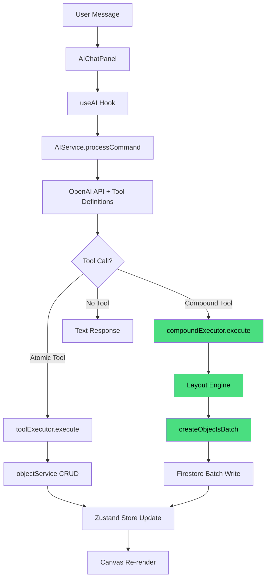

### 4.2 New Files

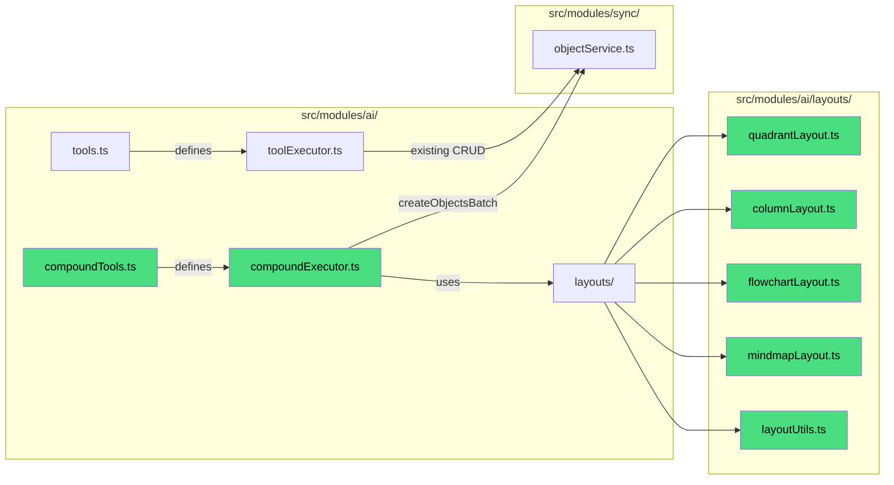

### 4.3 Tool Count After Expansion

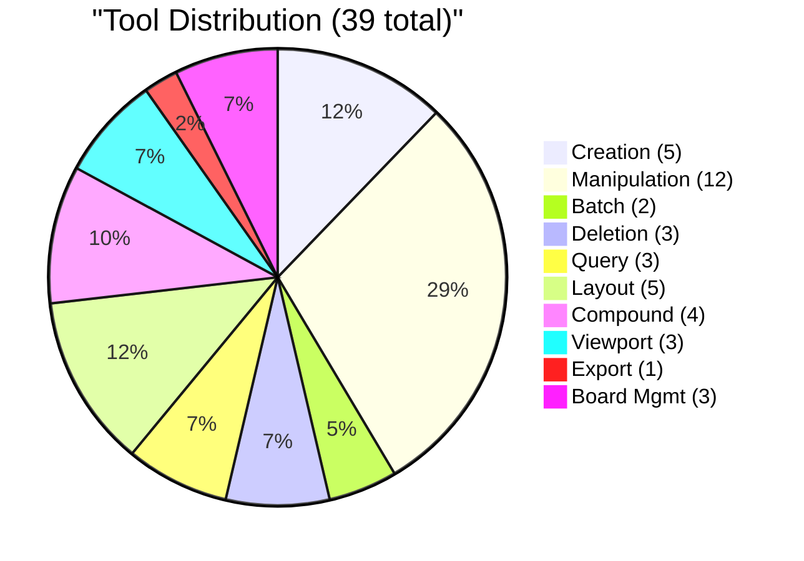

---

## 5. Phase 1: Batch Operations & Missing Atomics

### 5.1 New Batch Tools

#### `batchCreate`

Create multiple objects in a single atomic Firestore transaction. Wires directly to `createObjectsBatch`.

**Round-trip savings:** N create calls → 1 call.

```typescript
// Tool call
{
  name: "batchCreate",
  arguments: {
    objects: [
      { type: "sticky", x: 100, y: 100, text: "Item 1", color: "yellow" },
      { type: "sticky", x: 320, y: 100, text: "Item 2", color: "pink" },
      { type: "rectangle", x: 100, y: 300, width: 150, height: 80, color: "#93c5fd" }
    ]
  }
}
// Returns: { ids: ["id1", "id2", "id3"], success: true, message: "Created 3 objects" }
```

#### `batchUpdate`

Update multiple objects at once. Wires to `updateObjectsBatch`.

```typescript
{
  name: "batchUpdate",
  arguments: {
    updates: [
      { objectId: "abc", changes: { fill: "#fda4af", opacity: 0.8 } },
      { objectId: "def", changes: { x: 200, y: 300 } }
    ]
  }
}
```

### 5.2 New Composite Tools

#### `groupIntoFrame`

Create a frame around existing objects and set their `parentFrameId`.

```typescript
{
  name: "groupIntoFrame",
  arguments: {
    objectIds: ["id1", "id2", "id3"],
    title: "My Group",
    padding: 30  // optional, default 30
  }
}
// Computes bounding box of objects, creates frame with padding, sets parentFrameId on all children
```

#### `connectSequence`

Connect a chain of objects sequentially with connectors.

```typescript
{
  name: "connectSequence",
  arguments: {
    objectIds: ["step1", "step2", "step3", "step4"],
    style: "arrow",          // line | arrow | dashed
    direction: "horizontal"  // horizontal | vertical (determines anchor selection)
  }
}
// Creates N-1 connectors: step1→step2, step2→step3, step3→step4
```

### 5.3 New Atomic Tools

#### `setArrowheads`

```typescript
{ name: "setArrowheads", arguments: { objectId: "conn1", arrowheads: "end" } }
// "none" | "start" | "end" | "both"
```

#### `setStrokeStyle`

```typescript
{ name: "setStrokeStyle", arguments: { objectId: "conn1", strokeStyle: "dashed" } }
// "solid" | "dashed" | "dotted"
```

#### `setRotation`

```typescript
{ name: "setRotation", arguments: { objectId: "rect1", rotation: 45 } }
// degrees, 0-360
```

#### `getObjectDetails`

Returns full details of a specific object (more than findObjects which only returns id/type/text/x/y).

```typescript
{ name: "getObjectDetails", arguments: { objectId: "abc123" } }
// Returns: { id, type, x, y, width, height, fill, text, fontSize, opacity, stroke, ... }
```

---

## 6. Phase 2: Compound Template Tools

### 6.1 Overview

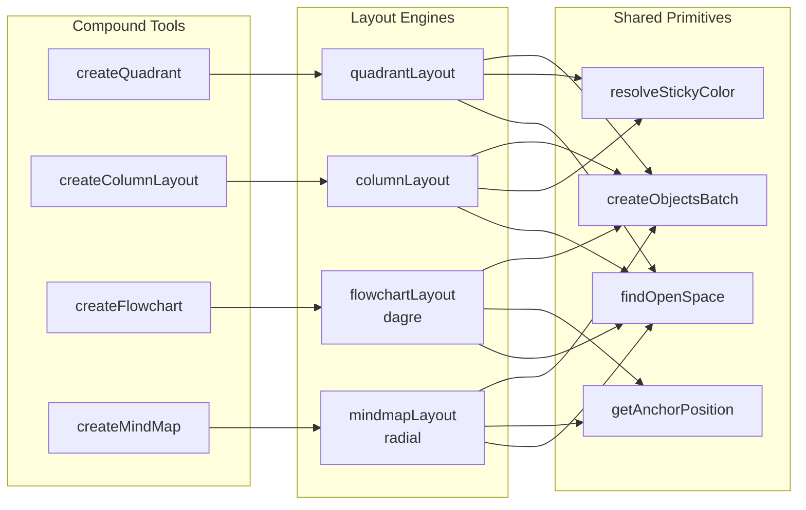

### 6.2 `createQuadrant`

**Use cases:** SWOT analysis, Eisenhower matrix, Impact/Effort grid, Risk matrix, BCG matrix

**What it creates in one call:**

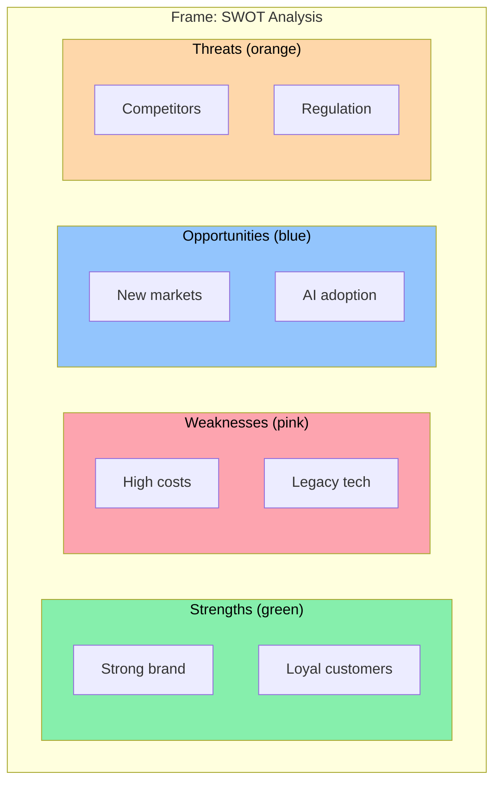

**Elements created per call:** Frame + 2 axis lines + 4 axis labels + 4 quadrant titles + N sticky notes = ~15-20 objects.

**Tool schema:**

```typescript
{
  name: "createQuadrant",
  arguments: {
    title: "SWOT Analysis",
    xAxisLabel: "Internal ← → External",     // optional
    yAxisLabel: "Positive ← → Negative",     // optional
    quadrants: {
      topLeft:     { label: "Strengths",      color: "green",  items: ["Strong brand", "Loyal customers"] },
      topRight:    { label: "Weaknesses",     color: "pink",   items: ["High costs", "Legacy tech"] },
      bottomLeft:  { label: "Opportunities",  color: "blue",   items: ["New markets", "AI adoption"] },
      bottomRight: { label: "Threats",        color: "orange",  items: ["Competitors", "Regulation"] }
    },
    x: 100,   // optional, auto-finds open space if omitted
    y: 100    // optional
  }
}
```

**Return value:**

```typescript
{
  success: true,
  frameId: "frame_abc",
  objectIds: ["id1", "id2", ...],  // all created object IDs
  message: "Created SWOT Analysis with 4 quadrants and 8 items"
}
```

### 6.3 `createColumnLayout`

**Use cases:** Kanban board, retrospective (Start/Stop/Continue), user journey map, pro/con list, priority lanes

**Visual:**

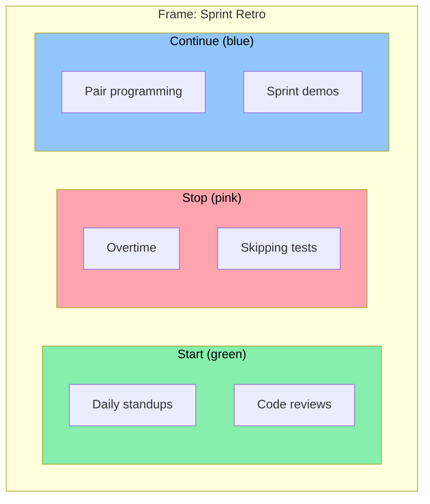

**Tool schema:**

```typescript
{
  name: "createColumnLayout",
  arguments: {
    title: "Sprint Retrospective",
    columns: [
      { heading: "Start",    color: "green", items: ["Daily standups", "Code reviews"] },
      { heading: "Stop",     color: "pink",  items: ["Overtime", "Skipping tests"] },
      { heading: "Continue", color: "blue",  items: ["Pair programming", "Sprint demos"] }
    ],
    x: 100,  // optional
    y: 100   // optional
  }
}
```

### 6.4 `createFlowchart`

**Use cases:** Process flows, decision trees, org charts, state machines, deployment pipelines

**Visual:**

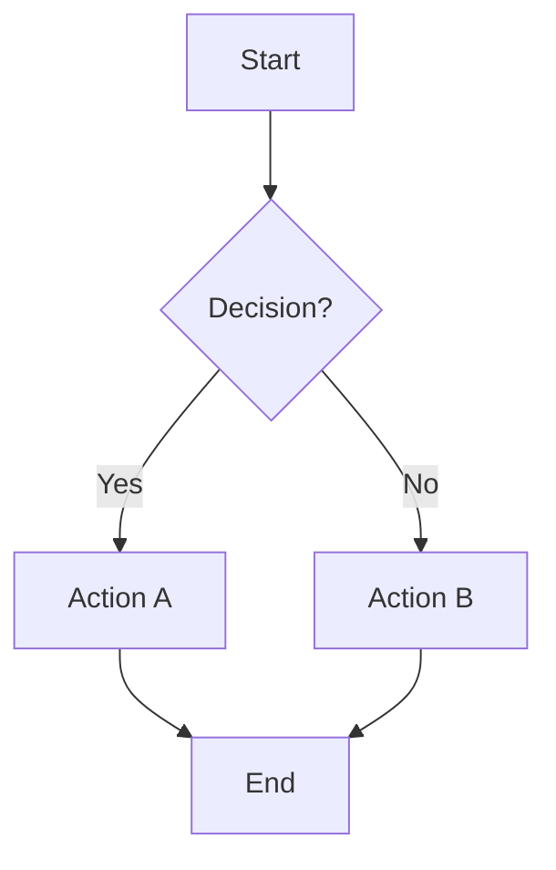

**Tool schema:**

```typescript
{
  name: "createFlowchart",
  arguments: {
    title: "User Registration Flow",        // optional frame title
    direction: "top-to-bottom",             // top-to-bottom | left-to-right
    nodes: [
      { id: "start", label: "Start",       shape: "circle",    color: "green" },
      { id: "input", label: "Enter Email",  shape: "rectangle" },
      { id: "check", label: "Valid?",       shape: "circle",    color: "yellow" },
      { id: "save",  label: "Save User",    shape: "rectangle" },
      { id: "error", label: "Show Error",   shape: "rectangle", color: "pink" },
      { id: "end",   label: "Done",         shape: "circle",    color: "blue" }
    ],
    edges: [
      { from: "start", to: "input" },
      { from: "input", to: "check" },
      { from: "check", to: "save",  label: "Yes" },
      { from: "check", to: "error", label: "No" },
      { from: "save",  to: "end" },
      { from: "error", to: "input" }
    ],
    x: 100,  // optional
    y: 100   // optional
  }
}
```

**Layout algorithm:** Dagre (hierarchical DAG layout). ~30KB dependency, loaded lazily via `await import('@dagrejs/dagre')`.

### 6.5 `createMindMap`

**Use cases:** Brainstorming, concept mapping, topic exploration, feature planning

**Visual:**

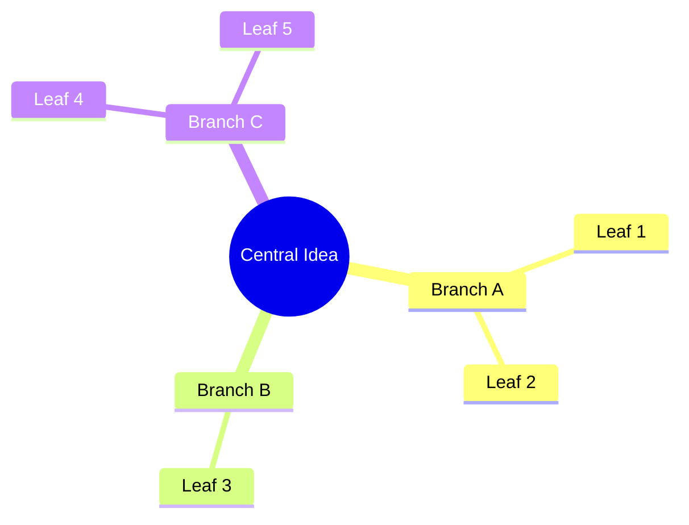

**Tool schema:**

```typescript
{
  name: "createMindMap",
  arguments: {
    centralTopic: "Product Strategy",
    branches: [
      {
        label: "Growth",
        color: "green",
        children: ["SEO", "Partnerships", "Content Marketing"]
      },
      {
        label: "Product",
        color: "blue",
        children: ["Mobile App", "API", "Integrations"]
      },
      {
        label: "Revenue",
        color: "purple",
        children: ["Pricing", "Enterprise", "Freemium"]
      }
    ],
    x: 400,  // optional, center position
    y: 400   // optional
  }
}
```

**Layout algorithm:** Custom radial layout — distribute branches evenly around center at increasing radii per depth level.

---

## 7. Phase 3: System Prompt Enhancement

### Current Prompt (abbreviated)
>
> "You can create sticky notes, shapes, frames, connectors, and text..."

### Enhanced Prompt

```text
You are an AI assistant for CollabBoard, a collaborative whiteboard application.

## Capabilities

### Atomic Tools
- Create: sticky notes, shapes (rectangles, circles, lines), frames, connectors, text
- Modify: move, resize, color, font, stroke, opacity, rotation, arrowheads
- Organize: align, distribute, arrange in grid, group into frames
- Query: board state, find objects, object details
- Batch: create/update multiple objects atomically

### Compound Templates (use these for complex requests)
- **createQuadrant**: SWOT analysis, 2x2 matrices, impact/effort grids
- **createColumnLayout**: Kanban boards, retrospectives, pro/con lists, journey maps
- **createFlowchart**: Process flows, decision trees, org charts, pipelines
- **createMindMap**: Brainstorming, concept maps, topic exploration

**Always prefer compound tools over multiple atomic calls** when the user requests
a template, diagram, or structured layout.

## Guidelines
1. Place objects at reasonable positions; use findOpenSpace logic for compound tools
2. For manipulation, query board state first if needed
3. Colors: yellow=general, pink=important/negative, blue=questions/neutral,
   green=positive/done, purple=ideas, orange=warnings
4. Spacing: 20-50px between objects, 30px frame padding
5. Use connectSequence for chains instead of individual createConnector calls
6. Use batchCreate/batchUpdate for bulk operations instead of individual calls

## Response Style
- Brief, natural confirmation of what you did
- Never include JSON, object IDs, or technical state
- For templates: mention the structure created (e.g. "4 quadrants with 8 items")
```

---

## 8. Detailed Tool Specifications

### 8.1 Layout Engine: `findOpenSpace`

All compound tools need to auto-place if x/y not specified. Scan existing objects to find a clear rectangle.

```typescript
// src/modules/ai/layouts/layoutUtils.ts

interface IOpenSpaceResult {
  x: number;
  y: number;
}

/**
 * Finds open canvas space for a rectangle of given dimensions.
 * Scans right of existing content first, then below.
 * Returns top-left corner of the clear area.
 */
function findOpenSpace(
  objects: IBoardObject[],
  width: number,
  height: number,
  padding?: number     // default 60
): IOpenSpaceResult;
```

### 8.2 Quadrant Layout Engine

```typescript
// src/modules/ai/layouts/quadrantLayout.ts

interface IQuadrantConfig {
  title: string;
  xAxisLabel?: string;
  yAxisLabel?: string;
  quadrants: {
    topLeft:     { label: string; color?: string; items: string[] };
    topRight:    { label: string; color?: string; items: string[] };
    bottomLeft:  { label: string; color?: string; items: string[] };
    bottomRight: { label: string; color?: string; items: string[] };
  };
  x?: number;
  y?: number;
}

interface ILayoutResult {
  objects: ICreateObjectParams[];  // ready for createObjectsBatch
  frameIndex: number;              // index of frame in the array
}

function computeQuadrantLayout(
  config: IQuadrantConfig,
  createdBy: string
): ILayoutResult;
```

**Layout algorithm:**

1. Compute grid: 2x2 cells, each cell = max(items.length * stickyH + spacing, minCellSize)
2. Place frame covering entire grid + padding
3. Place axis lines (horizontal + vertical through center)
4. Place axis endpoint labels at line ends
5. Place quadrant title labels (top-left of each cell)
6. Place sticky notes in a vertical stack within each cell
7. Assign `parentFrameId` = frame.id on all children

### 8.3 Column Layout Engine

```typescript
// src/modules/ai/layouts/columnLayout.ts

interface IColumnConfig {
  title: string;
  columns: Array<{
    heading: string;
    color?: string;
    items: string[];
  }>;
  x?: number;
  y?: number;
}

function computeColumnLayout(
  config: IColumnConfig,
  createdBy: string
): ILayoutResult;
```

**Layout algorithm:**

1. Column width = max(heading text width, DEFAULT_STICKY_WIDTH) + padding
2. Column height = max items across columns * (stickyH + spacing) + header
3. Place frame covering all columns
4. Place heading text elements at top of each column
5. Place sticky notes vertically within each column
6. Assign `parentFrameId` on all children

### 8.4 Flowchart Layout Engine (Dagre)

```typescript
// src/modules/ai/layouts/flowchartLayout.ts

interface IFlowchartConfig {
  title?: string;
  direction: 'top-to-bottom' | 'left-to-right';
  nodes: Array<{
    id: string;
    label: string;
    shape?: 'rectangle' | 'circle';
    color?: string;
  }>;
  edges: Array<{
    from: string;
    to: string;
    label?: string;
  }>;
  x?: number;
  y?: number;
}

async function computeFlowchartLayout(
  config: IFlowchartConfig,
  createdBy: string
): Promise<ILayoutResult>;
```

**Layout algorithm:**

1. Build dagre graph from nodes + edges
2. Run dagre layout (rankdir based on direction)
3. Map dagre positions to board coordinates
4. Create shape objects at computed positions
5. Create connectors between connected nodes using `getAnchorPosition`
6. Optionally create edge labels as text objects
7. Create frame around all elements

**Dependency:** `@dagrejs/dagre` (~30KB). Loaded lazily:

```typescript
const dagre = await import('@dagrejs/dagre');
```

### 8.5 Mind Map Layout Engine (Radial)

```typescript
// src/modules/ai/layouts/mindmapLayout.ts

interface IMindMapConfig {
  centralTopic: string;
  branches: Array<{
    label: string;
    color?: string;
    children: string[];
  }>;
  x?: number;
  y?: number;
}

function computeMindMapLayout(
  config: IMindMapConfig,
  createdBy: string
): ILayoutResult;
```

**Layout algorithm:**

1. Place central topic as a sticky note at center
2. Distribute branches evenly around center at radius R1 (e.g., 250px)
3. For each branch, distribute children around the branch at radius R2 (e.g., 180px) within a limited arc
4. Create connectors from center → branches → children
5. Optional frame around everything

---

## 9. Layout Engine Design

### 9.1 Shared Layout Utilities

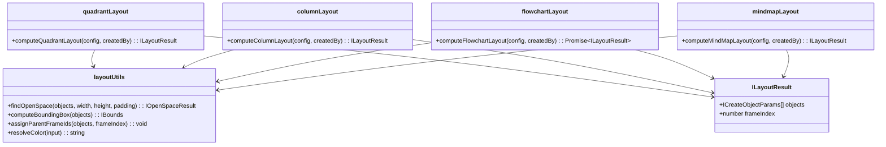

### 9.2 Compound Executor Integration

The compound executor sits alongside the existing `toolExecutor` and shares the same context:

```typescript
// src/modules/ai/compoundExecutor.ts

export interface ICompoundExecutorContext {
  boardId: string;
  createdBy: string;
  getObjects: () => IBoardObject[];
  createObjectsBatch: (boardId: string, objects: ICreateObjectParams[]) => Promise<IBoardObject[]>;
}

export const createCompoundExecutor = (ctx: ICompoundExecutorContext) => {
  const execute = async (tool: IToolCall): Promise<unknown> => {
    switch (tool.name) {
      case 'createQuadrant': { /* ... */ }
      case 'createColumnLayout': { /* ... */ }
      case 'createFlowchart': { /* ... */ }
      case 'createMindMap': { /* ... */ }
      default: return null; // not a compound tool
    }
  };
  return { execute };
};
```

The main `toolExecutor` delegates to `compoundExecutor` for compound tool names:

```typescript
// In toolExecutor.ts execute():
const compoundResult = await compoundExecutor.execute(tool);
if (compoundResult !== null) return compoundResult;
// ... existing switch/case for atomic tools
```

---

## 10. Testing Strategy

### 10.1 Unit Tests (per layout engine)

Each layout engine gets a test file validating:

- Correct number of objects created
- Positions within expected bounds
- Frame encompasses all children
- `parentFrameId` set correctly on all non-frame objects
- Color resolution works (named → hex)
- Edge cases: empty items, single quadrant, 0 columns, etc.

```text
tests/unit/
  ai/
    layouts/
      quadrantLayout.test.ts
      columnLayout.test.ts
      flowchartLayout.test.ts
      mindmapLayout.test.ts
      layoutUtils.test.ts
    compoundExecutor.test.ts
    toolExecutor.batchTools.test.ts
```

### 10.2 Integration Tests

- End-to-end compound tool execution through `toolExecutor` → `objectService` (mocked Firestore)
- Verify batch creation produces correct Firestore writes
- Verify connector anchors resolve correctly for auto-laid-out nodes

### 10.3 Coverage Target

Maintain existing 80% thresholds across statements, branches, functions, lines.

---

## 11. Implementation Roadmap

### Phase 1: Batch & Atomics (~3-4 hours)

```mermaid
gantt
    title Phase 1: Batch & Atomics
    dateFormat X
    axisFormat %s

    section Tool Definitions
    batchCreate + batchUpdate schemas     :a1, 0, 1
    groupIntoFrame + connectSequence      :a2, 0, 1
    setArrowheads + setStrokeStyle + setRotation :a3, 0, 1
    getObjectDetails                      :a4, 0, 1

    section Executor
    Wire batch tools to objectService     :b1, 1, 2
    Implement groupIntoFrame logic        :b2, 1, 2
    Implement connectSequence logic       :b3, 1, 2
    Wire atomic tools                     :b4, 1, 2

    section Tests
    Unit tests for all new tools          :c1, 2, 3
    Integration tests                     :c2, 2, 3

    section Validation
    bun run validate                      :d1, 3, 4
```

**Files touched:**

- `src/modules/ai/tools.ts` — Add 8 tool definitions
- `src/modules/ai/toolExecutor.ts` — Add 8 case handlers
- `tests/unit/ai/toolExecutor.test.ts` — Add test cases

### Phase 2: Compound Tools (~6-8 hours)

```mermaid
gantt
    title Phase 2: Compound Tools
    dateFormat X
    axisFormat %s

    section Layout Engines
    layoutUtils (findOpenSpace, shared)       :a1, 0, 2
    quadrantLayout                            :a2, 0, 2
    columnLayout                              :a3, 0, 2

    section Dagre Integration
    Install @dagrejs/dagre                    :b1, 2, 3
    flowchartLayout                           :b2, 2, 4

    section Mind Map
    mindmapLayout (radial)                    :c1, 2, 4

    section Executor
    compoundExecutor.ts                       :d1, 4, 5
    Wire into toolExecutor                    :d2, 4, 5
    Compound tool definitions in tools.ts     :d3, 4, 5

    section Tests
    Layout engine unit tests                  :e1, 5, 7
    Compound executor integration tests       :e2, 5, 7

    section Validation
    bun run validate                          :f1, 7, 8
```

**New files:**

- `src/modules/ai/layouts/layoutUtils.ts`
- `src/modules/ai/layouts/quadrantLayout.ts`
- `src/modules/ai/layouts/columnLayout.ts`
- `src/modules/ai/layouts/flowchartLayout.ts`
- `src/modules/ai/layouts/mindmapLayout.ts`
- `src/modules/ai/compoundExecutor.ts`
- `src/modules/ai/compoundTools.ts`
- `tests/unit/ai/layouts/*.test.ts`
- `tests/unit/ai/compoundExecutor.test.ts`

**New dependency:** `@dagrejs/dagre` (dev + prod, ~30KB)

### Phase 3: System Prompt (~1 hour)

**Files touched:**

- `src/modules/ai/aiService.ts` — Enhanced SYSTEM_PROMPT

### Summary

| Phase | New Tools | New Files | Effort |
| --- | ------ | ------ | ------ |
| Phase 1 | 8 atomic/batch | 0 new (edits to existing) | 3-4 hrs |
| Phase 2 | 4 compound | 7 new files + tests | 6-8 hrs |
| Phase 3 | 0 | 1 edit | 1 hr |
| **Total** | **12 new tools** | **7 new files** | **10-13 hrs** |

---

## 12. Risk Assessment

| Risk | Likelihood | Impact | Mitigation |
| --- | ------ | ------ | ------ |
| Dagre adds too much bundle size | Low | Medium | Lazy `import()`, tree-shaking, measure before/after |
| LLM generates invalid compound tool args | Medium | Low | Validate all inputs, return clear error messages |
| Compound tools create too many objects | Low | Medium | Cap items per quadrant/column at 20, total objects at 100 |
| Auto-placement collides with existing objects | Medium | Low | `findOpenSpace` scans board bounds, places right/below |
| Flowchart layout takes too long for large graphs | Low | Low | Cap nodes at 50, dagre handles 100+ nodes in <100ms |

---

## Appendix: Round-Trip Savings Matrix

| User Request | Before (Calls) | After (Calls) | Savings |
| --- | ------ | ------ | ------ |
| "Create a SWOT analysis" | 15-20 | 1 | **15-20x** |
| "Make a kanban board" | 10-15 | 1 | **10-15x** |
| "Draw a flowchart for user auth" | 8-15 | 1 | **8-15x** |
| "Brainstorm product strategy" | 10-20 | 1 | **10-20x** |
| "Color all sticky notes pink" | N | 1 | **Nx** |
| "Create 10 sticky notes about X" | 10 | 1 | **10x** |
| "Connect these 5 items in order" | 4 | 1 | **4x** |
| "Group these items in a frame" | 2-3 | 1 | **2-3x** |
