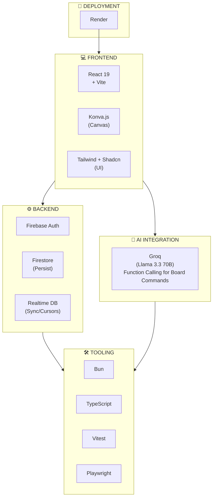
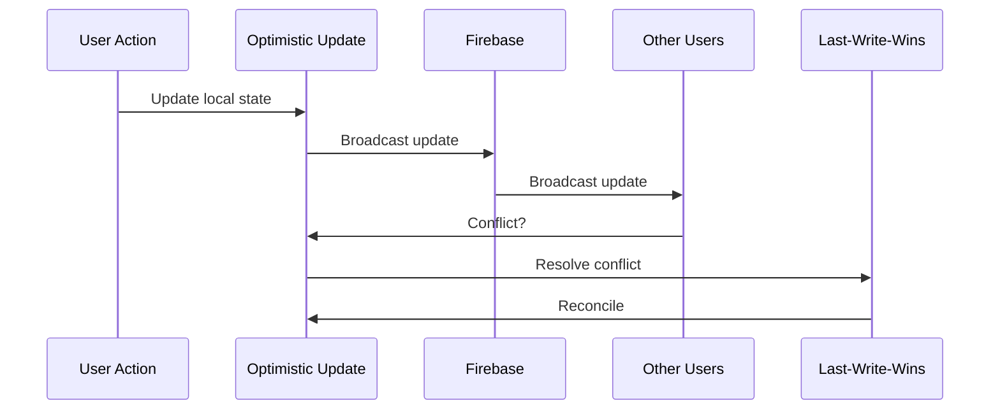
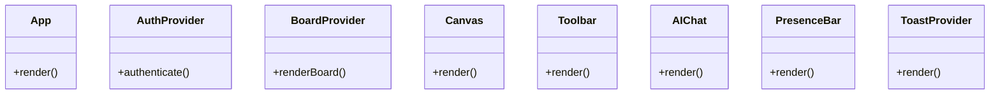

# CollabBoard Technology Guides

## Overview

This directory contains comprehensive technical guides for each technology in the CollabBoard stack. These documents are designed to help developers understand, implement, and troubleshoot the various systems that power CollabBoard.

---

## Guide Index

| Guide | Description | Key Topics |
| ------- | ------------- | ------------ |
| [Firebase Guide](./FIREBASE-GUIDE.md) | Backend infrastructure | Auth, Firestore, Realtime DB, Presence, Security Rules |
| [Konva + React Guide](./KONVA-REACT-GUIDE.md) | Canvas rendering | Shapes, Events, Transforms, Selection, Pan/Zoom |
| [Tailwind + Shadcn Guide](./TAILWIND-SHADCN-GUIDE.md) | UI styling | Theming, Components, Dark Mode, Animations |
| [Dev Environment Guide](./DEVELOPMENT-ENVIRONMENT-GUIDE.md) | Project setup | Vite, Bun, TypeScript, ESLint, Git |
| [Testing Guide](./TESTING-GUIDE.md) | Test strategy | Vitest, Playwright, Mocking, Coverage |
| [AI Integration Guide](./AI-INTEGRATION-GUIDE.md) | AI commands | Groq, Function Calling, Tool Schema |

---

## Quick Start

### 1. Environment Setup

Start with the [Development Environment Guide](./DEVELOPMENT-ENVIRONMENT-GUIDE.md) to set up:

- Bun runtime
- Vite configuration
- TypeScript setup
- ESLint/Prettier

### 2. Backend Services

Follow the [Firebase Guide](./FIREBASE-GUIDE.md) to configure:

- Firebase project creation
- Authentication providers
- Database schemas
- Security rules

### 3. Frontend Development

Use these guides together:

- [Konva + React Guide](./KONVA-REACT-GUIDE.md) for canvas
- [Tailwind + Shadcn Guide](./TAILWIND-SHADCN-GUIDE.md) for UI

### 4. AI Features

Implement AI commands with the [AI Integration Guide](./AI-INTEGRATION-GUIDE.md):

- API setup
- Tool definitions
- Command handling

### 5. Quality Assurance

Ensure quality with the [Testing Guide](./TESTING-GUIDE.md):

- Unit tests with Vitest
- E2E tests with Playwright
- Coverage targets

---

## Tech Stack Summary

---

## Key Patterns

### Real-Time Sync Pattern

### Component Architecture

---

## Performance Targets

| Metric | Target | Guide Reference |
| ------- | ------- | --------------- |
| Frame Rate | 60 FPS | Konva Guide - Performance |
| Object Sync | <100ms | Firebase Guide - Realtime |
| Cursor Sync | <50ms | Firebase Guide - Presence |
| AI Response | <2s | AI Guide - Optimization |
| Object Capacity | 500+ | Konva Guide - Virtual Rendering |
| Concurrent Users | 5+ | Firebase Guide - Security Rules |

---

## Related Documents

- [Design Document](../research/DESIGN-DOCUMENT.md) - Architecture overview
- [PRD](../research/PRD-V2.md) - Product requirements
- [Tech Stack Options](../research/TECH-STACK-OPTIONS-V2.md) - Stack decisions
- [Architecture Decisions](../research/RECORD-ARCHITECTURE-DECISIONS-V2.md) - ADRs
- [Tradeoffs](../research/IDENTIFY-TRADEOFFS-V2.md) - Technology tradeoffs

---

## Contributing

When updating these guides:

1. Keep examples practical and copy-paste ready
2. Include TypeScript types for all code
3. Reference official documentation
4. Update the index when adding new guides
5. Test all code examples before committing
