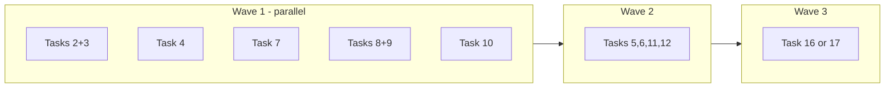
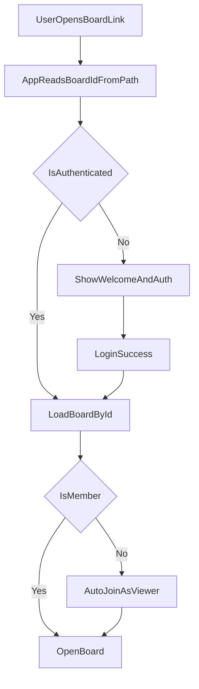

# UI/UX Improvement Plan

## Requirement Check (First Principles)

- Requirement in one sentence: improve core collaboration UX reliability first, then add high-value product polish and new interaction capabilities.
- Done criteria: each item has a concrete behavior change and a verification step (manual + targeted tests where practical).
- Non-breaking policy: keep current auth/data model working; use additive changes and guarded migrations only.

## Decisions Locked From Your Answers

- Prioritization model: **balanced scoring** (not strict single-axis ordering).
- Broad initiatives (`expand AI use`, `voice input`, `frames/layering`) use **discovery/spec first**, then implementation.
- Share links: opening as non-member should **auto-add as viewer**.
- Non-owner “delete” should mean **leave membership** (remove from members list + from user lists).

## Prioritization Method (Balanced)

- Each item is ranked by combined impact across:
  - Ease of implementation
  - Usefulness
  - App need
  - Risk (lower risk ranks higher)
  - Speed to implement
  - Wow factor
- Tie-breakers: ship-risk reduction and user-facing unblockers first.
- Scores at the end of each task: 1–10 per criterion; Risk is inverted (10 = low risk). Overall = average of the six.

## Ordered Delivery Plan

### P0 - Immediate UX unblockers (highest combined value)

1. [x] **Fix share links (currently broken deep-linking)**

- Why now: high usefulness/app need; currently blocks collaboration entry.
- What to change:
  - Read board ID from URL path (`/board/:boardId`) and route app state from URL.
  - Keep login gate, then open intended board after auth.
  - Preserve auto-join behavior as **viewer** for non-members.
- Primary files:
  - [src/App.tsx](src/App.tsx)
  - [src/components/board/ShareDialog.tsx](src/components/board/ShareDialog.tsx)
  - [netlify.toml](netlify.toml)
- Verify:
  - Copy link from share dialog -> paste in new browser -> lands on same board.
  - Logged-out flow redirects to auth, then returns to target board.
- **Scores (1–10):** Ease `5` · Usefulness `9` · App need `9` · Risk `5` · Speed `5` · Wow `6` → **Overall `7`**

2. [x] **Non-owner “delete” becomes “leave board”**

- Why now: correctness + trust; current behavior conflicts with expected semantics.
- What to change:
  - If owner: true delete allowed.
  - If non-owner: remove current user from `members` and hide from lists/recent.
  - Rename UI action text for non-owners to avoid confusion (`Leave board`).
- Primary files:
  - [src/modules/sync/boardService.ts](src/modules/sync/boardService.ts)
  - [src/components/board/BoardListSidebar.tsx](src/components/board/BoardListSidebar.tsx)
  - [src/components/board/ShareDialog.tsx](src/components/board/ShareDialog.tsx)
- Verify:
  - Non-owner action removes board from their sidebar.
  - Owner still can permanently delete board.
- **Scores (1–10):** Ease `6` · Usefulness `8` · App need `8` · Risk `6` · Speed `6` · Wow `4` → **Overall `6`**

3. [x] **Only owners can rename board names**

- Why now: permissions clarity and data integrity.
- What to change:
  - UI gate rename controls by owner role only.
  - Backend-side guard alignment (if missing).
- Primary files:
  - [src/components/board/BoardListSidebar.tsx](src/components/board/BoardListSidebar.tsx)
  - [src/modules/sync/boardService.ts](src/modules/sync/boardService.ts)
- Verify:
  - Viewer/editor cannot edit board title; owner can.
- **Scores (1–10):** Ease `7` · Usefulness `7` · App need `8` · Risk `7` · Speed `7` · Wow `3` → **Overall `7`**

4. [x] **Bulk delete performance fix**

- Why now: high speed-to-value and low risk; clear user pain.
- What to change:
  - Replace per-object delete loop with batched delete path for multi-select.
- Primary files:
  - [src/hooks/useCanvasOperations.ts](src/hooks/useCanvasOperations.ts)
  - [src/modules/sync/objectService.ts](src/modules/sync/objectService.ts)
- Verify:
  - Deleting 50+ objects is significantly faster and UI remains responsive.
- **Scores (1–10):** Ease `6` · Usefulness `8` · App need `8` · Risk `8` · Speed `7` · Wow `5` → **Overall `7`**

5. [x] **Snap-to-grid parity for drag (not only resize)**

- Why now: predictable editing behavior; medium effort, high UX consistency.
- What to change:
  - Apply snap during drag interaction (not just end), aligned with resize snap rules.
- Primary files:
  - [src/components/canvas/BoardCanvas.tsx](src/components/canvas/BoardCanvas.tsx)
  - [src/lib/snapToGrid.ts](src/lib/snapToGrid.ts)
- Verify:
  - Drag and resize both show identical snap behavior to grid.
- **Scores (1–10):** Ease `6` · Usefulness `7` · App need `7` · Risk `8` · Speed `6` · Wow `5` → **Overall `7`**

6. [x] **Panning reliability pass (middle mouse + Mac trackpad)**

- Why now: navigation reliability is foundational.
- What to change:
  - Harden wheel/gesture detection: distinguish pan vs pinch-zoom.
  - Ensure middle-mouse pan consistently captures and prevents conflicting browser behavior.
- Primary files:
  - [src/components/canvas/BoardCanvas.tsx](src/components/canvas/BoardCanvas.tsx)
  - [src/hooks/useCanvasViewport.ts](src/hooks/useCanvasViewport.ts)
- Verify:
  - Windows mouse and Mac trackpad can pan without workaround.
- **Scores (1–10):** Ease `5` · Usefulness `8` · App need `8` · Risk `7` · Speed `5` · Wow `6` → **Overall `7`**

7. [x] **Text editing overlay stability (“text moves” bug)**

- Why now: direct content editing must feel stable.
- What to change:
  - Recompute overlay position when viewport/canvas transforms change while editing.
  - Make sure to consider if note is rotated.
  - Check if same problem exists in text tool.
- Primary files:
  - [src/components/canvas/shapes/TextElement.tsx](src/components/canvas/shapes/TextElement.tsx)
  - [src/components/canvas/shapes/StickyNote.tsx](src/components/canvas/shapes/StickyNote.tsx)
  - [src/lib/canvasOverlayPosition.ts](src/lib/canvasOverlayPosition.ts)
- Verify:
  - While editing text, pan/zoom does not cause visible text jump/drift.
- **Implementation (fix/task-7-overlay-stability):** Added src/lib/canvasTextEditOverlay.ts to attach stage and node change listeners during edit; overlay position/styles recompute on pan/zoom/rotation. Wired into StickyNote, TextElement, and Frame title editor. Unit tests for lifecycle and cleanup; E2E spec in tests/e2e/textOverlayStability.spec.ts. PRD verification checkboxes remain unchecked until confirmed in browser or E2E.
- **Scores (1–10):** Ease `5` · Usefulness `8` · App need `8` · Risk `8` · Speed `5` · Wow `5` → **Overall `7`**

9. [x] **Spin box rapid-click polish**

- Why now: small polish item, low risk.
- What to change:
  - Smooth number input updates under rapid increment/decrement.
- Primary files:
  - [src/components/canvas/PropertyInspector.tsx](src/components/canvas/PropertyInspector.tsx)
- Verify:
  - Rapid clicking does not stutter or visually glitch.
- **Implementation (Task 9):** Added [src/hooks/useDebouncedNumberField.ts](src/hooks/useDebouncedNumberField.ts) for local display state and debounced commit; PropertyInspector stroke width and font size use it. PRD subsection and unit tests added. Check the box above only after confirming in browser or E2E.
- **Scores (1–10):** Ease `8` · Usefulness `5` · App need `5` · Risk `9` · Speed `9` · Wow `3` → **Overall `7`**

### P1 - Product UX and maintainability improvements

10. [x] **Welcome page for logged-out users**

- Why now: strong first impression + conversion utility.
- What to change:
  - Replace bare auth-only entry with welcome/feature value proposition + login/signup CTA.
  - Keep auth tabs available from welcome CTA.
- Primary files:
  - [src/components/auth/AuthPage.tsx](src/components/auth/AuthPage.tsx)
  - [src/App.tsx](src/App.tsx)
- Verify:
  - Logged-out users see welcome content + clear auth actions.
- **Scores (1–10):** Ease `7` · Usefulness `8` · App need `7` · Risk `8` · Speed `7` · Wow `8` → **Overall `8`**

11. [ ] **Light/dark mode fix and consistency audit**

- Why now: broad perceived quality impact; likely moderate effort.
- What to change:
  - Audit token usage and canvas/system theme transitions for mismatches.
- Primary files:
  - [src/hooks/useTheme.ts](src/hooks/useTheme.ts)
  - [src/index.css](src/index.css)
  - [src/components/canvas/BoardCanvas.tsx](src/components/canvas/BoardCanvas.tsx)
- Verify:
  - No low-contrast/mismatched backgrounds when toggling themes.
- **Scores (1–10):** Ease `5` · Usefulness `7` · App need `7` · Risk `8` · Speed `5` · Wow `6` → **Overall `6`**

12. [x] **Move groups of selected objects**

- Why now: high usefulness, moderate complexity.
- What to change:
  - Delta-based multi-drag for selected set, preserving relative positions.
  - Two interactions: (1) Drag any selected object → all move together on release; (2) Click anywhere inside the selection marquee (empty space within selection bounds) and drag → whole group moves during drag, committed in one batch on release.
- Primary files:
  - [src/components/canvas/BoardCanvas.tsx](src/components/canvas/BoardCanvas.tsx)
  - [src/hooks/useObjects.ts](src/hooks/useObjects.ts)
  - [src/components/canvas/CanvasShapeRenderer.tsx](src/components/canvas/CanvasShapeRenderer.tsx)
  - [src/lib/canvasBounds.ts](src/lib/canvasBounds.ts)
- Verify (check only after confirming in browser or E2E):
  - Multi-selected objects move together when dragging one of them.
  - Clicking inside the selection marquee and dragging moves the whole group with live feedback (grabbing cursor, all shapes move during drag).
- **Scores (1–10):** Ease `5` · Usefulness `9` · App need `8` · Risk `7` · Speed `5` · Wow `7` → **Overall `7`**

13. [ ] **Address `only-export-components` violations**

- Why now: cleaner architecture, lower lint debt.
- What to change:
  - Move non-component exports (constants/helpers) out of component files where needed.
- Primary files:
  - [eslint.config.js](eslint.config.js)
  - `src/components/**` affected files
- Verify:
  - Lint warnings are resolved for targeted files without behavior change.
- **Scores (1–10):** Ease `7` · Usefulness `5` · App need `5` · Risk `9` · Speed `6` · Wow `2` → **Overall `6`**

14. [ ] **Refactor files with >2 useEffects into custom hooks**

- Why now: maintainability + reduced side-effect complexity.
- What to change:
  - Start with highest-effect files (`BoardCanvas`, `App`) and extract coherent hooks.
- Primary files:
  - [src/components/canvas/BoardCanvas.tsx](src/components/canvas/BoardCanvas.tsx)
  - [src/App.tsx](src/App.tsx)
  - [src/hooks](src/hooks)
- Verify:
  - Effect count per component reduced; behavior unchanged.
- **Scores (1–10):** Ease `4` · Usefulness `6` · App need `6` · Risk `7` · Speed `4` · Wow `2` → **Overall `5`**

### P2 - Discovery then implementation (higher uncertainty, higher potential wow)

15. [ ] **Frames: purpose + layering model (discovery first)**

- Discovery outputs:
  - Define frame UX intent (grouping, containment, layout aid, export regions, etc.).
  - Define layering rules and interaction model.
- Then implement in phases if approved:
  - Data model support, drag-in/out semantics, rendering order, selection behavior.
- Primary files:
  - [src/components/canvas/shapes/Frame.tsx](src/components/canvas/shapes/Frame.tsx)
  - [src/components/canvas/BoardCanvas.tsx](src/components/canvas/BoardCanvas.tsx)
  - [src/types](src/types)
- **Scores (1–10):** Ease `3` · Usefulness `8` · App need `7` · Risk `4` · Speed `3` · Wow `8` → **Overall `6`**

16. [ ] **Expand AI use in app (discovery first)**

- Discovery outputs:
  - Highest-value AI actions not already covered by existing tools.
  - Safety/latency boundaries and measurable success criteria.
- Then implement focused increments:
  - Add 1-2 high-impact capabilities in chat/workflow.
- Primary files:
  - [src/modules/ai/aiService.ts](src/modules/ai/aiService.ts)
  - [src/modules/ai/tools.ts](src/modules/ai/tools.ts)
  - [src/components/ai/AIChatPanel.tsx](src/components/ai/AIChatPanel.tsx)
- **Scores (1–10):** Ease `3` · Usefulness `8` · App need `7` · Risk `4` · Speed `3` · Wow `9` → **Overall `6`**

17. [ ] **Voice input (discovery first, then pilot)**

- Discovery outputs:
  - Browser support constraints and fallback UX.
  - Scope (dictation to AI prompt first, then command mapping).
- Pilot implementation:
  - Mic capture -> transcript -> AI input box -> submit flow.
- Primary files:
  - [src/components/ai/AIChatPanel.tsx](src/components/ai/AIChatPanel.tsx)
  - [src/hooks](src/hooks)
- **Scores (1–10):** Ease `3` · Usefulness `7` · App need `6` · Risk `5` · Speed `3` · Wow `9` → **Overall `6`**

## Execution Sequence (Modular / SOLID)

- Track A (Permissions + Routing): items 1-3.
- Track B (Canvas interactions + perf): items 4-9 + 12.
- Track C (UX shell + quality): items 10-11 + 13-14.
- Track D (Discovery epics): items 15-17.

## Parallel execution (multi-agent safe)

- **Purpose:** Allow multiple agents or contributors to work in parallel without editing the same files.
- **Rule:** Two tasks can run in parallel only if their primary file sets are disjoint.
- **Coupled tasks (same files — one agent or sequential):**
  - **2 + 3:** `boardService.ts`, `BoardListSidebar.tsx`, `ShareDialog.tsx` (2 only for ShareDialog).
  - **8 + 9:** `PropertyInspector.tsx` (and `RightSidebar.tsx` for 8).
  - **5, 6, 11, 12:** All touch `BoardCanvas.tsx` plus related hooks/libs — treat as one "canvas interaction" lane.
  - **16 + 17:** Both touch `AIChatPanel.tsx`.
- **Sequencing constraints:**
  - **Task 13** (only-export-components): touches many `src/components/**`; run alone or after other component work to reduce merge conflicts.
  - **Task 14** (refactor useEffects): touches `BoardCanvas.tsx` and `App.tsx` — run after the canvas lane (5,6,11,12) and after task 10 if 10 touches `App.tsx`.
  - **Task 15** (Frames): touches `BoardCanvas.tsx` — after canvas lane.

### Parallel waves (safe to run in tandem)

- **Wave 1 (no shared files — up to 5 agents):**
  - Agent 1: **Tasks 2 + 3** (permissions: leave board + owner-only rename).
  - Agent 2: **Task 4** (bulk delete performance).
  - Agent 3: **Task 7** (text editing overlay stability).
  - Agent 4: **Tasks 8 + 9** (properties panel height + spin box polish).
  - Agent 5: **Task 10** (welcome page).
- **Wave 2 (one agent):** **Tasks 5, 6, 11, 12** (snap-to-grid, panning, theme audit, move groups) — all BoardCanvas-related.
- **Wave 3 (one agent):** **Task 16 or 17** (expand AI or voice input — same file AIChatPanel).
- **Standalone / after waves:** Task 13 (lint); Task 14 (after Wave 2 and after 10); Task 15 (after Wave 2).

### File conflict reference

| Tasks | Primary files | Conflict with |
|-------|---------------|---------------|
| 2, 3 | boardService, BoardListSidebar, ShareDialog (2 only) | Each other |
| 4 | useCanvasOperations, objectService | — |
| 5, 6, 11, 12 | BoardCanvas + snapToGrid, useCanvasViewport, useTheme/index.css, useShapeDragHandler | Each other; 14; 15 |
| 7 | TextElement, StickyNote, canvasOverlayPosition | — |
| 8, 9 | PropertyInspector, RightSidebar (8 only) | Each other |
| 10 | AuthPage, App | 14 |
| 13 | eslint.config, src/components/** | Run alone |
| 14 | BoardCanvas, App, hooks | 5–6–11–12, 10, 15 |
| 15 | Frame, BoardCanvas, types | 5–6–11–12, 14 |
| 16, 17 | AIChatPanel (16: aiService, tools) | Each other |

## Verification Matrix (Minimum)

- Unit/integration tests for permission/routing/service logic changes.
- Manual QA checklist for canvas interactions (drag, pan, snap, text edit, bulk delete).
- Cross-theme visual pass (light/dark) and auth flow pass (logged out/in/deep link).

## Architecture Flow (share-link + auth + board open)

## Out of Scope for First Pass

- Large schema migrations without discovery sign-off.
- Replacing core canvas engine or introducing heavy new dependencies unless clearly required.
