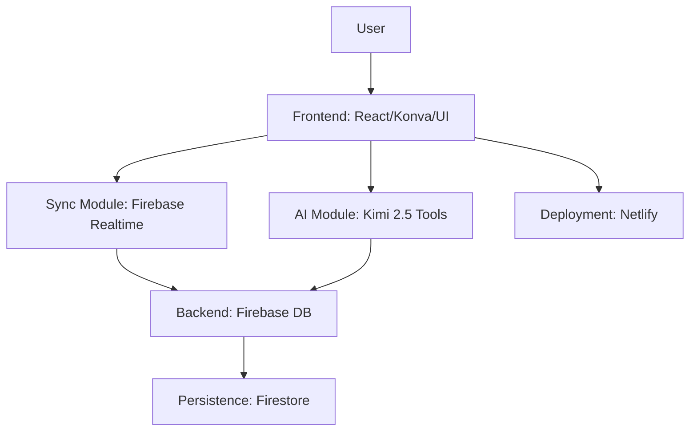
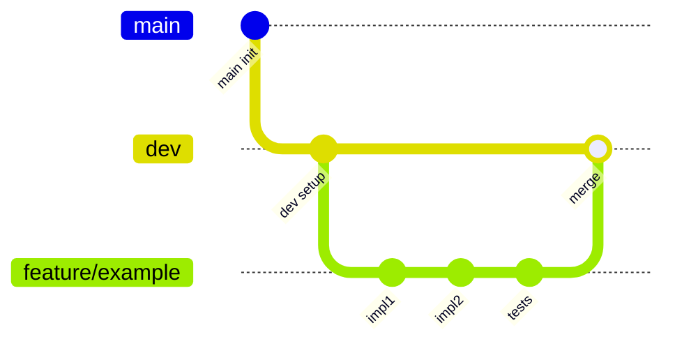

## Summary

The initial PRD that turned the design doc and research into an executable plan. It states tech stack, architecture, Git workflow, .cursor rules, and an agile breakdown (epics, stories, features, branches, commits). It is the first version of "how we will build CollabBoard" and the basis for later PRD expansions.

---

# CollabBoard Initial Product Requirements Document (PRD)

## Overview

CollabBoard is a real-time collaborative whiteboard app for brainstorming, idea mapping, and workshops. Features include infinite canvas, object editing, real-time sync, multiplayer cursors, presence, and AI agent for natural language board manipulation. Meets PDF hard requirements: MVP in 24 hours, core features, collaboration, performance targets, AI capabilities, AI-first dev with log/cost analysis, submissions. Repo: <https://github.com/MichaelHabermas/CollabBoard> (currently minimal: .gitignore, LICENSE, empty README.md, DESIGN-DOCUMENT.md). Incorporates pre-search, tech stack report, tradeoffs, architecture decisions, design doc. AI-first: Use Cursor, MCPs (e.g., Context7 for docs). 1-week sprint, vertical builds, prioritize sync. Modular design, SOLID principles throughout.

## Tech Stack

- Backend: Firebase (Realtime DB/Firestore/Auth) - [Docs](https://firebase.google.com/docs)
- Frontend: React + Vite + Bun + TypeScript + Shadcn + Konva.js + Tailwind v4 - Links in design doc
- AI: Kimi 2.5 (Nvidia API) - [Docs](https://build.nvidia.com/moonshotai/kimi-k2.5)
- Deployment: Netlify - [Docs](https://docs.netlify.com/)
- Testing: Vitest (unit/integration), Playwright (e2e), 80% coverage
- Tooling: ESLint/Prettier

## Architecture

Modular: Modules for auth, sync, canvas, ai, ui. SOLID: Single responsibility (one concern per class), Open-closed (extend via interfaces), Liskov (substitutable), Interface segregation (minimal), Dependency inversion (inject). Monorepo structure from design doc. Conflicts: Last-write-wins, optimistic UI. Naming: camelCase vars, PascalCase classes, etc. (per design doc).

## Git Workflow

- Main: Protected, releases only.
- Dev: Main development branch.
- Feature branches: From dev, named feature/epic-story-feature (e.g., feature/auth-signup).
- Process: Create branch -> Commits (granular) -> Write tests -> Run tests (fix if fail) -> PR to dev -> Merge.
- Use AI for code gen, test with multi-browser/network throttle.

## .cursor/rules

Create .cursor/rules.md with:

- Tech stack specifics: Use React hooks, Konva layers, Firebase listeners, Kimi function calls.
- SOLID: Enforce in prompts (e.g., "Design class with single responsibility").
- Modular: Separate concerns, interfaces for extensibility.
- Git: Follow workflow above; commit messages: "feat: add X", "test: cover Y".
- Docs: Always use Context7 MCP for latest stable docs (e.g., "Get Konva v9 docs via Context7").
- AI: Prompts like "Implement modular, SOLID-compliant code for Z using stack".

## Agile Breakdown

Epics > Stories > Features > Branch > Commits > Subtasks. Prioritize per PDF: Cursor sync first.

### Epic 0: Project Setup and Rules

Intent: Establish dev environment, .cursor/rules for consistent AI-first coding.

#### Story 0.1: As a dev, setup repo and rules, so development is standardized

Features:

- Repo init with branches, tooling.
- .cursor/rules file.

Branch: feature/setup-repo-rules

Commit 1: Init dev branch and basic structure.

- Subtask 1: git checkout -b dev
- Subtask 2: Create /src, /modules folders.
- Subtask 3: Add .gitignore for node_modules, etc.

Commit 2: Install dependencies (Bun, Vite, etc.).

- Subtask 1: bun init
- Subtask 2: bun add react vite typescript shadcn konva tailwindcss@4
- Subtask 3: Configure vite.config.ts for React.

Commit 3: Setup testing/linting.

- Subtask 1: bun add -d vitest playwright eslint prettier
- Subtask 2: Configure eslint.config.js, vitest.config.ts.
- Subtask 3: Add .prettierrc.

Commit 4: Create .cursor/rules.md with rules.

- Subtask 1: Write tech stack section.
- Subtask 2: Add SOLID/modular guidelines.
- Subtask 3: Include git workflow and Context7 MCP rule.

Commit 5: Write initial tests for setup.

- Subtask 1: Test package.json dependencies.
- Subtask 2: Run bun test, fix fails.

### Epic 1: User Authentication and Access

#### Story 1.1: As a user, sign up/login with email/Google via Firebase Auth

Features:

- Email/password signup/login.
- Google OAuth.
- Session management.

Branch: feature/auth-signup-login

Commit 1: Setup Firebase project and auth module.

- Subtask 1: Create Firebase app in console.
- Subtask 2: Add firebase config to env.
- Subtask 3: Create modules/auth/index.ts with initAuth.

Commit 2: Implement email signup/login.

- Subtask 1: Add Signup component with Shadcn form.
- Subtask 2: Use createUserWithEmailAndPassword.
- Subtask 3: Handle errors, UI feedback.

Commit 3: Add Google login.

- Subtask 1: Enable Google in Firebase.
- Subtask 2: Use signInWithPopup with GoogleAuthProvider.
- Subtask 3: Integrate into Login component.

Commit 4: Session handling with context.

- Subtask 1: Create AuthContext with useAuthState.
- Subtask 2: Protect routes with auth check.
- Subtask 3: Logout function.

Commit 5: Tests for auth.

- Subtask 1: Mock Firebase, test signup.
- Subtask 2: Integration test login flow.
- Subtask 3: Run tests, fix.

#### Story 1.2: As a user, access shared canvases with RBAC

Features:

- Role assignment (owner/editor/viewer).
- Canvas invite/share.
- Permission checks.

Branch: feature/auth-rbac

Commit 1: Define roles in types.

- Subtask 1: Create types/roles.ts with enums.
- Subtask 2: Add to Firestore user schema.

Commit 2: Implement invite system.

- Subtask 1: Add share button UI.
- Subtask 2: Generate invite link.
- Subtask 3: Handle join via link.

Commit 3: Permission enforcement.

- Subtask 1: Check roles in sync module.
- Subtask 2: Disable edits for viewers.
- Subtask 3: UI indicators for roles.

Commit 4: Tests for RBAC.

- Subtask 1: Unit test role checks.
- Subtask 2: E2e test access denial.
- Subtask 3: Run/fix.

### Epic 2: Real-Time Collaboration

#### Story 2.1: As a user, see real-time cursors with names (<50ms)

Features:

- Cursor tracking via mouse events.
- Sync positions/names.
- Render cursors on Konva layer.

Branch: feature/collab-cursors

Commit 1: Setup presence in Firebase.

- Subtask 1: Create Realtime DB path for users.
- Subtask 2: On connect, set user presence.

Commit 2: Track and sync cursor.

- Subtask 3: Add mouse move listener.
- Subtask 1: Update DB with position/name.
- Subtask 2: Listen for others' cursors.

Commit 3: Render cursors in Konva.

- Subtask 1: Add cursor layer.
- Subtask 2: Draw labeled pointers.
- Subtask 3: Optimize for 60fps.

Commit 4: Handle latency/throttle.

- Subtask 1: Debounce updates.
- Subtask 2: Test with network sim.

Commit 5: Tests for cursors.

- Subtask 1: Mock DB, test sync.
- Subtask 2: E2e multi-browser.
- Subtask 3: Run/fix.

#### Story 2.2: As a user, see online presence

Features:

- List online users.
- Indicators (e.g., avatars).

Branch: feature/collab-presence

Commit 1: Sync presence list.

- Subtask 1: DB listener for online users.
- Subtask 2: Update state.

Commit 2: UI for presence.

- Subtask 1: Shadcn list component.
- Subtask 2: Show names/avatars.

Commit 3: Tests.

- Subtask 1: Unit test list update.
- Subtask 2: Integration test.

#### Story 2.3: As a user, changes sync instantly (<100ms), last-write-wins

Features:

- Object change events.
- Optimistic updates.
- Conflict resolution doc.

Branch: feature/collab-sync

Commit 1: Setup object DB path.

- Subtask 1: Define schema.
- Subtask 2: Init listener.

Commit 2: Optimistic sync.

- Subtask 1: Local update first.
- Subtask 2: Push to DB.

Commit 3: Handle conflicts.

- Subtask 1: Last-write-wins logic.
- Subtask 2: Doc approach in README.

Commit 4: Tests.

- Subtask 1: Simulate conflicts.
- Subtask 2: Performance check.

#### Story 2.4: As a user, handle disconnect/reconnect, offline sync

Features:

- Firebase offline support.
- Auto-reconnect.

Branch: feature/collab-resilience

Commit 1: Enable offline persistence.

- Subtask 1: Firebase config.
- Subtask 2: Local cache.

Commit 2: Reconnect logic.

- Subtask 1: On disconnect event.
- Subtask 2: Sync queue.

Commit 3: Tests.

- Subtask 1: Network throttle.
- Subtask 2: E2e recovery.

#### Story 2.5: As a user, state persists on refresh/leave

Features:

- Firestore for long-term.
- Load on join.

Branch: feature/collab-persistence

Commit 1: Migrate to Firestore.

- Subtask 1: Save snapshots.
- Subtask 2: Load on init.

Commit 2: Tests.

- Subtask 1: Refresh sim.
- Subtask 2: Multi-user leave.

### Epic 3: Canvas Editing and Board Features

#### Story 3.1: As a user, pan/zoom infinite board at 60 FPS

Features:

- Konva stage setup.
- Wheel/mouse pan.

Branch: feature/canvas-pan-zoom

Commit 1: Init Konva canvas.

- Subtask 1: Add <Canvas> component.
- Subtask 2: Infinite setup.

Commit 2: Pan/zoom handlers.

- Subtask 1: Mouse events.
- Subtask 2: Optimize perf.

Commit 3: Tests.

- Subtask 1: Snapshot render.
- Subtask 2: Event sim.

#### Story 3.2: As a user, create/edit sticky notes with text/colors

Features:

- Add note button.
- Editable text.
- Color picker.

Branch: feature/canvas-sticky-notes

Commit 1: Note class/interface.

- Subtask 1: ShapeInterface extend.
- Subtask 2: Konva rect/text.

Commit 2: Create/edit UI.

- Subtask 1: Toolbar button.
- Subtask 2: Double-click edit.

Commit 3: Sync integration.

- Subtask 1: Tie to sync module.

Commit 4: Tests.

(Continue similarly for other stories in Epic 3: shapes, connectors, text, frames, transforms, selection, operations, performance.)

### Epic 4: AI Integration and Board Agent

#### Story 4.1: As a user, creation commands via AI

Features:

- Chat input.
- Parse/execute createStickyNote etc.

Branch: feature/ai-creation

Commit 1: Setup Kimi API.

- Subtask 1: Env key.
- Subtask 2: Client init.

Commit 2: Tool schema.

- Subtask 1: Define functions.
- Subtask 2: Function calling.

Commit 3: Integrate with canvas.

- Subtask 1: Execute on board.

Commit 4: Tests.

(Continue for manipulation, layout, complex, performance, shared state.)

### Epic 5: UI, Deployment, and Polish

#### Story 5.1: As a dev, deploy to Netlify

Features:

- CI/CD setup.
- Serverless AI.

Branch: feature/deploy-netlify

Commit 1: Netlify config.

- Subtask 1: netlify.toml.
- Subtask 2: Build script.

Commit 2: Deploy.

- Subtask 1: git push.
- Subtask 2: Test public.

#### Story 5.2: As a user, responsive UI

Features:

- Shadcn toolbar/sidebar.
- Tailwind responsive.

Branch: feature/ui-responsive

(Commits similar.)

#### Story 5.3: As a dev, document AI log/costs

Features:

- Log template.
- Cost calc.

Branch: feature/docs-ai-log

(Commits: Write files.)
