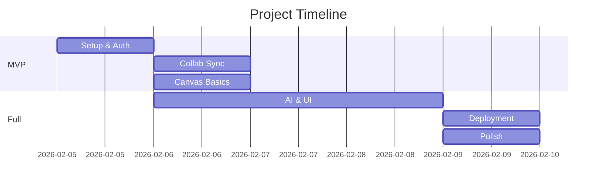
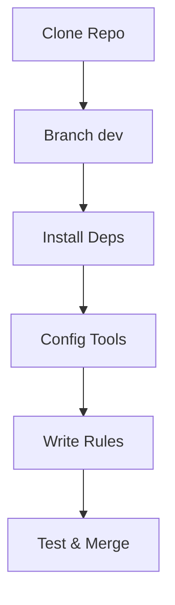
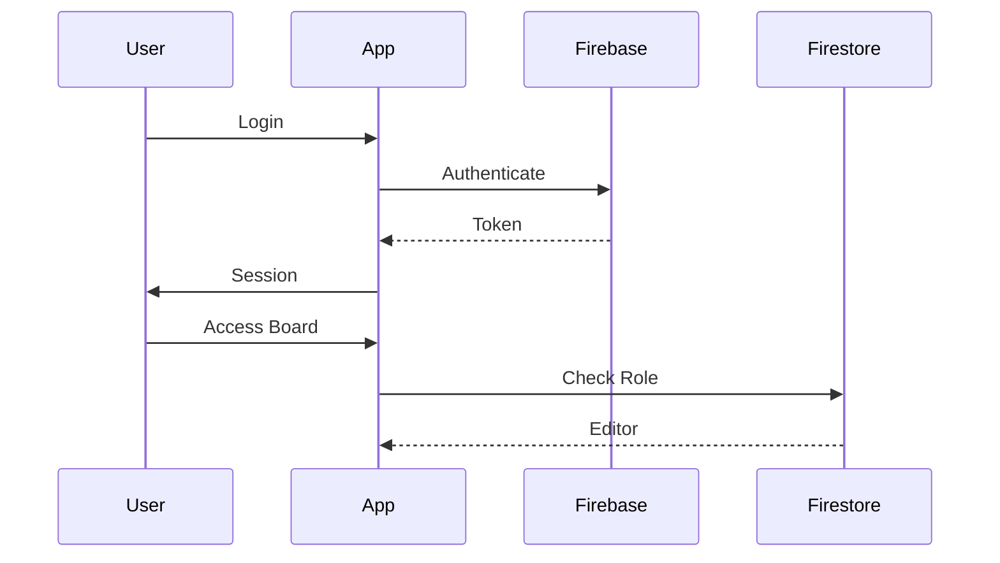
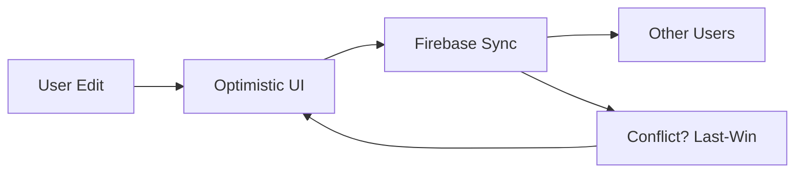
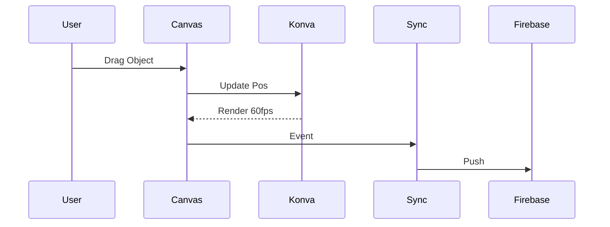
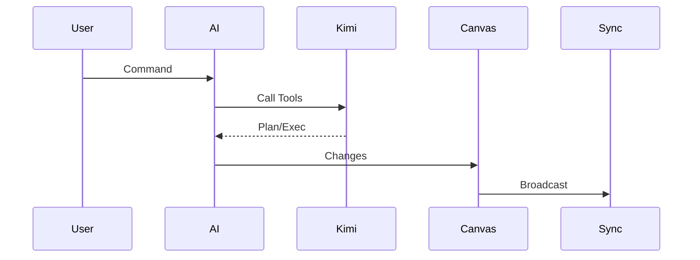
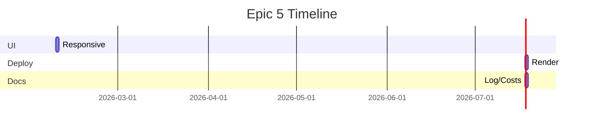

## Summary

An expanded PRD that adds more detail to epics (e.g. timelines, subtasks, Mermaid diagrams) while keeping the same stack, architecture, and workflow. It bridges the initial PRD and the final root PRD by showing how scope and process were refined without losing the original intent.

---

# CollabBoard Initial PRD (Expanded)

## Overview

Expanded epics with detailed stories, features, branches, commits, subtasks. Added Mermaid diagrams for flows, sequences, timelines. Modular, SOLID, git workflow maintained. Prioritize sync per PDF.

## Tech Stack/Architecture/Git/.cursor/rules

Unchanged from prior.

### Epic 0: Project Setup and Rules (Expanded)

Intent: Standardize env, rules for AI-first (Cursor, Context7 MCP for docs). Add linting, env vars.

#### Story 0.1: Setup repo/rules

Features: Repo init, deps, testing, .cursor/rules (stack, SOLID, git, Context7: "Use Context7 for Konva docs").

Branch: feature/setup-repo-rules

Commit 1: Init dev/structure.

- Subtask 1: git checkout -b dev
- Subtask 2: mkdir src/modules
- Subtask 3: Update .gitignore

Commit 2: Install deps.

- Subtask 1: bun init
- Subtask 2: bun add react@18 vite@5 bun typescript@5 shadcn-ui konva@9 tailwindcss@4
- Subtask 3: bun add -d vitest@1 playwright@1 eslint@8 prettier@3
- Subtask 4: Configure tailwind.config.js with v4

Commit 3: Setup testing/linting.

- Subtask 1: eslint --init
- Subtask 2: vitest config
- Subtask 3: prettier setup

Commit 4: .cursor/rules.md.

- Subtask 1: Write stack/SOLID sections.
- Subtask 2: Add git workflow.
- Subtask 3: Context7 rule for docs.

Commit 5: Tests.

- Subtask 1: Test deps.
- Subtask 2: bun test --fix

### Epic 1: User Authentication and Access (Expanded)

Intent: Secure access, RBAC for boards. Add token refresh, error handling.

#### Story 1.1: Sign up/login email/Google

Features: Forms, OAuth, sessions, UI feedback.

Branch: feature/auth-signup-login

Commit 1: Firebase auth module.

- Subtask 1: Create Firebase console app.
- Subtask 2: .env with keys.
- Subtask 3: initFirebase in auth/index.ts

Commit 2: Email auth.

- Subtask 1: Shadcn Form component.
- Subtask 2: createUserWithEmailAndPassword
- Subtask 3: Error toasts

Commit 3: Google auth.

- Subtask 1: Enable provider.
- Subtask 2: signInWithPopup
- Subtask 3: Button integration

Commit 4: Context/sessions.

- Subtask 1: AuthContext Provider
- Subtask 2: useAuth hook
- Subtask 3: Logout, token refresh

Commit 5: Tests.

- Subtask 1: Mock auth, test flows.
- Subtask 2: E2e browser login.

#### Story 1.2: Shared canvases RBAC

Features: Roles (enum), invites, checks.

Branch: feature/auth-rbac

Commit 1: Roles/types.

- Subtask 1: types/roles.ts
- Subtask 2: Firestore users collection

Commit 2: Invites.

- Subtask 1: Share UI button
- Subtask 2: Generate UUID link
- Subtask 3: Join handler

Commit 3: Enforcement.

- Subtask 1: Role guards in canvas
- Subtask 2: Disable for viewers
- Subtask 3: Role badges

Commit 4: Tests.

- Subtask 1: Unit role checks
- Subtask 2: E2e deny edits

### Epic 2: Real-Time Collaboration (Expanded)

Intent: Bulletproof sync, presence. Add throttling tests, optimistic rollback.

#### Story 2.1: Real-time cursors <50ms

Features: Mouse track, sync, render.

Branch: feature/collab-cursors

Commit 1: Presence DB.

- Subtask 1: DB/users path
- Subtask 2: onConnect set

Commit 2: Cursor sync.

- Subtask 1: onMouseMove
- Subtask 2: DB update debounce
- Subtask 3: Listen others

Commit 3: Konva render.

- Subtask 1: CursorLayer
- Subtask 2: Draw with names
- Subtask 3: 60fps opt

Commit 4: Latency handle.

- Subtask 1: Throttle sim
- Subtask 2: Adjust debounce

Commit 5: Tests.

- Subtask 1: Mock DB sync
- Subtask 2: Multi-browser e2e

#### Story 2.2: Online presence

Features: List, avatars.

Branch: feature/collab-presence

Commit 1: Sync list.

- Subtask 1: DB listener
- Subtask 2: State update

Commit 2: UI.

- Subtask 1: Shadcn Avatar list
- Subtask 2: Real-time refresh

Commit 3: Tests.

- Subtask 1: Unit update
- Subtask 2: Integration

#### Story 2.3: Instant sync <100ms, last-write-wins

Features: Events, optimistic, doc.

Branch: feature/collab-sync

Commit 1: Objects DB.

- Subtask 1: Schema types
- Subtask 2: Listener init

Commit 2: Optimistic.

- Subtask 1: Local first
- Subtask 2: DB push
- Subtask 3: Rollback on fail

Commit 3: Conflicts.

- Subtask 1: Last-write logic
- Subtask 2: README doc

Commit 4: Tests.

- Subtask 1: Conflict sim
- Subtask 2: Perf measure

#### Story 2.4: Disconnect/reconnect, offline

Features: Persistence, queue.

Branch: feature/collab-resilience

Commit 1: Offline enable.

- Subtask 1: Firebase persist
- Subtask 2: Local cache

Commit 2: Reconnect.

- Subtask 1: onDisconnect
- Subtask 2: Queue changes

Commit 3: Tests.

- Subtask 1: Throttle
- Subtask 2: E2e recover

#### Story 2.5: State persistence

Features: Firestore backup.

Branch: feature/collab-persistence

Commit 1: Firestore migrate.

- Subtask 1: Snapshots save
- Subtask 2: Load init

Commit 2: Tests.

- Subtask 1: Refresh
- Subtask 2: Leave/return

### Epic 3: Canvas Editing and Board Features (Expanded)

Intent: Infinite board, objects per PDF. Add undo/redo, grouping.

#### Story 3.1: Pan/zoom 60 FPS

Features: Stage, events.

Branch: feature/canvas-pan-zoom

Commit 1: Konva init.

- Subtask 1: Canvas comp
- Subtask 2: Infinite bounds

Commit 2: Handlers.

- Subtask 1: Wheel zoom
- Subtask 2: Drag pan
- Subtask 3: Perf opt

Commit 3: Tests.

- Subtask 1: Render snap
- Subtask 2: Event sim

#### Story 3.2: Sticky notes text/colors

Features: Create, edit, color.

Branch: feature/canvas-sticky-notes

Commit 1: Note class.

- Subtask 1: Interface extend
- Subtask 2: Konva rect/text

Commit 2: UI edit.

- Subtask 1: Toolbar add
- Subtask 2: Double-click
- Subtask 3: Color picker

Commit 3: Sync tie.

- Subtask 1: To sync module

Commit 4: Tests.

- Subtask 1: Create/edit

#### Story 3.3: Shapes rectangles/circles/lines

Features: Draw tools, colors.

Branch: feature/canvas-shapes

Commit 1: Shape classes.

- Subtask 1: BaseShape
- Subtask 2: Konva impl

Commit 2: Toolbar.

- Subtask 1: Shape buttons
- Subtask 2: Draw mode

Commit 3: Sync.

- Subtask 1: Events

Commit 4: Tests.

#### Story 3.4: Connectors lines/arrows

Features: From/to, styles.

Branch: feature/canvas-connectors

Commit 1: Connector class.

- Subtask 1: Konva line

Commit 2: Draw.

- Subtask 1: Click connect
- Subtask 2: Arrow opt

Commit 3: Sync.

Commit 4: Tests.

#### Story 3.5: Standalone text

Features: Add, edit.

Branch: feature/canvas-text

Commit 1: Text class.

Commit 2: UI.

Commit 3: Sync.

Commit 4: Tests.

#### Story 3.6: Frames grouping

Features: Create, organize.

Branch: feature/canvas-frames

Commit 1: Frame class.

Commit 2: Group drag.

Commit 3: Sync.

Commit 4: Tests.

#### Story 3.7: Transforms move/resize/rotate

Features: Handles, gestures.

Branch: feature/canvas-transforms

Commit 1: Transformer Konva.

Commit 2: Events.

Commit 3: Sync.

Commit 4: Tests.

#### Story 3.8: Selection single/multi

Features: Shift/drag.

Branch: feature/canvas-selection

Commit 1: Selection layer.

Commit 2: Multi select.

Commit 3: Batch ops.

Commit 4: Tests.

#### Story 3.9: Operations delete/duplicate/copy

Features: Keys, menu.

Branch: feature/canvas-operations

Commit 1: Delete.

Commit 2: Duplicate.

Commit 3: Copy/paste.

Commit 4: Tests.

#### Story 3.10: 500+ objects, 5+ users 60 FPS

Features: Opt (batching, virtual).

Branch: feature/canvas-performance

Commit 1: Batch updates.

Commit 2: Virtual render.

Commit 3: Stress tests.

Commit 4: Fix perf.

### Epic 4: AI Integration and Board Agent (Expanded)

Intent: 6+ commands, multi-step, shared. Add agent planning, error retry.

#### Story 4.1: Creation commands

Features: Parse, execute createStickyNote etc.

Branch: feature/ai-creation

Commit 1: Kimi setup.

- Subtask 1: .env key
- Subtask 2: Client

Commit 2: Tools schema.

- Subtask 1: Functions define
- Subtask 2: Call handling

Commit 3: Canvas exec.

- Subtask 1: getBoardState
- Subtask 2: Apply changes

Commit 4: Tests.

#### Story 4.2: Manipulation commands

Features: Move, resize, color.

Branch: feature/ai-manipulation

Commit 1: Add tools.

Commit 2: Parse NL.

Commit 3: Exec.

Commit 4: Tests.

#### Story 4.3: Layout commands

Features: Grid, space.

Branch: feature/ai-layout

Commit 1: Layout tools.

Commit 2: Algorithms.

Commit 3: Exec.

Commit 4: Tests.

#### Story 4.4: Complex commands

Features: Templates (SWOT, journey).

Branch: feature/ai-complex

Commit 1: Multi-step plan.

Commit 2: Sequential exec.

Commit 3: Templates.

Commit 4: Tests.

#### Story 4.5: <2s response, 6+ types

Features: Opt calls, cache.

Branch: feature/ai-performance

Commit 1: Async opt.

Commit 2: Rate handle.

Commit 3: Tests latency.

#### Story 4.6: Shared real-time, no conflict

Features: Sync AI changes, locks.

Branch: feature/ai-shared

Commit 1: AI to sync.

Commit 2: Multi-user queue.

Commit 3: Tests simultaneous.

### Epic 5: UI, Deployment, Polish (Expanded)

Intent: Responsive, deploy, docs. Add accessibility, i18n prep.

#### Story 5.1: Deploy Render

Features: CI, proxy.

Branch: feature/deploy-render

Commit 1: Config.

- Subtask 1: render.yaml / proxy server
- Subtask 2: Build

Commit 2: Deploy.

- Subtask 1: Link repo
- Subtask 2: Test URL

#### Story 5.2: Responsive UI

Features: Mobile, Shadcn/Tailwind.

Branch: feature/ui-responsive

Commit 1: Components.

- Subtask 1: Toolbar
- Subtask 2: Sidebar

Commit 2: Responsive classes.

Commit 3: Tests.

#### Story 5.3: AI log/costs

Features: Template fill.

Branch: feature/docs-ai-log

Commit 1: Log.md.

- Subtask 1: Tools/prompts

Commit 2: Costs calc.

- Subtask 1: Dev spend
- Subtask 2: Projections

