## Summary

This is the final v2 Product Requirements Document. It is the single source for v2 execution: EPICs, user stories, features, feature branches, commits, and subtasks. It extends the root PRD and aligns with DESIGN-DOCUMENT, FEATURES, and INITIAL-RESEARCH. Its role is to be the authoritative v2 spec so that scope, workflow, and traceability are clear in one place.

---

# CollabBoard v2 — Final PRD

**Purpose:** This document is the **final Product Requirements Document** for CollabBoard version 2. It is the single source for execution: EPICs → User Stories → Features → Feature Branches → Commits → Subtasks. It extends the main product scope, tech stack, and structure defined in the root [PRD](../product/PRD.md) and elaborates all v2 specs with SOLID-aligned, modular design.

**Scope:** 20 features across 8 EPICs; modular, SOLID-aligned design; git workflow with `development` branch and feature branches only (never merge to `main`).

## References

- **Repository:** [https://github.com/MichaelHabermas/CollabBoard](https://github.com/MichaelHabermas/CollabBoard)
- [PRD](../product/PRD.md) — Existing scope, tech stack, SOLID application, project structure, naming, appendices
- [DESIGN-DOCUMENT.md](./DESIGN-DOCUMENT.md) — EPICs and user stories (agile breakdown), design principles, architecture context
- [FEATURES.md](./FEATURES.md) — Feature descriptions, acceptance criteria, technical notes, deferred list
- [INITIAL-RESEARCH.md](./INITIAL-RESEARCH.md) — Build order and rationale
- [PRD-V2.md](./PRD-V2.md) — Expanded execution spec (source for this document)
- [AI-DEVELOPMENT-LOG.md](../planning/AI-DEVELOPMENT-LOG.md) — Tools, MCP usage, effective prompts, learnings
- [DEPLOYMENT.md](../operations/DEPLOYMENT.md) — Render and environment variables
- **Technology guides:** [docs/guides/README.md](../guides/README.md) — [Firebase](../guides/FIREBASE-GUIDE.md), [Konva + React](../guides/KONVA-REACT-GUIDE.md), [Tailwind + Shadcn](../guides/TAILWIND-SHADCN-GUIDE.md), [AI Integration](../guides/AI-INTEGRATION-GUIDE.md), [Testing](../guides/TESTING-GUIDE.md), [Development Environment](../guides/DEVELOPMENT-ENVIRONMENT-GUIDE.md)

---

## Git workflow (branching and merge strategy)

- **Development branch:** All development happens on `development`. Do **not** push directly to `main`.
- **Never merge to main.** Feature and fix branches must be merged into `development` only. Do not merge into `main` or push merge commits to `origin/main`.
- **Feature flow:** Create a feature branch from `development` → implement over several commits → write tests → run tests → fix until all pass → merge the feature branch into `development` → move to the next feature.
- **Checklist:** Branch from `development` only; implement; test; ensure tests pass; merge into `development` only (never into `main`).

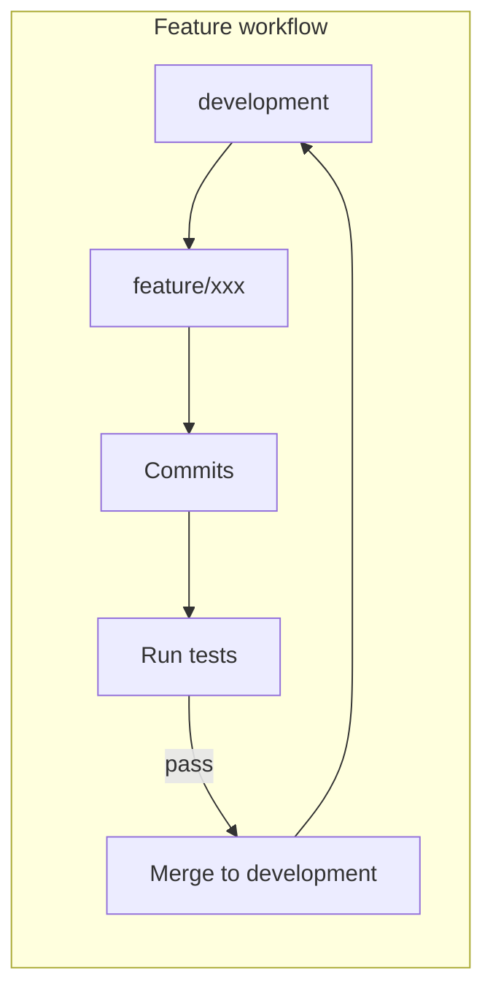

---

## Design principles (recap)

### Modular design

v2 work is organized by existing modules: `auth`, `sync`, `canvas`, `ai`, and `ui`. New behavior is added via new components, hooks, or services within these modules. v2 introduces: **Property inspector** (UI sidebar; depends on canvas selection and object update API), **Viewport / zoom** (canvas layer; shared by zoom-to-selection, zoom-to-fit-all, zoom presets), **User preferences** (sync or dedicated service; recent boards and favorites per user). Each area has single ownership for testability and maintainability.

### SOLID principles

- **SRP:** One concern per module and component (e.g. property inspector only edits object properties; viewport only handles pan/zoom).
- **OCP:** Extend via interfaces and new components without changing core logic (new connector styles, AI prompts, inspector controls).
- **LSP:** Board objects remain substitutable; new fields (e.g. `opacity`, connector `arrowheads`) are optional and backward-compatible.
- **ISP:** Focused interfaces (e.g. `ITransformable`, `ISelectable`) so inspector, align toolbar, and export depend on a narrow surface.
- **DIP:** Depend on abstractions (sync service, AI service interfaces); inject implementations for testability and future backends.

---

## Epic → User Story → Feature mapping

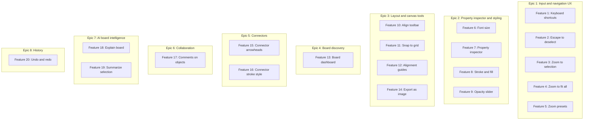

| Epic ID | Epic name | User story IDs | Feature numbers | Feature branch pattern |
|---------|-----------|----------------|-----------------|------------------------|
| 1 | Input and navigation UX | US 1.1–1.5 | 1–5 | `feature/keyboard-shortcuts`, `feature/escape-to-deselect`, `feature/zoom-to-selection`, `feature/zoom-to-fit-all`, `feature/zoom-presets` |
| 2 | Property inspector and styling | US 2.1–2.4 | 6–9 | `feature/font-size-control`, `feature/property-inspector`, `feature/stroke-and-fill-inspector`, `feature/opacity-slider` |
| 3 | Layout and canvas tools | US 3.1–3.4 | 10, 11, 12, 14 | `feature/align-toolbar`, `feature/snap-to-grid`, `feature/alignment-guides`, `feature/export-as-image` |
| 4 | Board discovery and preferences | US 4.1–4.3 | 13 | `feature/board-dashboard` |
| 5 | Connectors and diagramming | US 5.1–5.2 | 15–16 | `feature/connector-arrowheads`, `feature/connector-stroke-style` |
| 6 | Collaboration and comments | US 6.1–6.3 | 17 | `feature/comments-on-objects` |
| 7 | AI board intelligence | US 7.1–7.2 | 18–19 | `feature/ai-explain-board`, `feature/ai-summarize-selection` |
| 8 | History and consistency | US 8.1–8.2 | 20 | `feature/undo-redo` |

---

## Epic 1: Input and navigation UX

**Objective:** Improve daily input and navigation with keyboard shortcuts, consistent Escape behavior, and zoom actions so users can work quickly and navigate large boards without relying only on the toolbar.

**See also:** [KONVA-REACT-GUIDE.md](../guides/KONVA-REACT-GUIDE.md) for viewport, pan/zoom, and stage scale/position patterns.

### Success criteria (epic)

- Keyboard shortcuts (Copy, Paste, Delete, Duplicate, Escape) work when canvas has focus and do not fire when focus is in an input or text-edit field.
- Zoom to selection, zoom to fit all, and zoom presets share one viewport/zoom state; no conflicting or lost zoom.
- Escape consistently clears selection and exits text-edit mode without side effects.

### Out of scope

- Custom shortcut remapping or user-defined key bindings in v2.
- Syncing viewport/pan/zoom across users (viewport remains local per user).

### Risks and dependencies

- Features 3, 4, 5 must share the same viewport/zoom state and Konva stage scale/position; implement or refactor viewport layer first if not already unified.
- Escape handling must integrate with the same keydown layer as other shortcuts to avoid duplicate or missed handling.

### Stakeholder value

Power users and facilitators benefit from faster navigation and less context switching; zoom and shortcuts reduce reliance on toolbar and mouse.

### User flow (Epic 1)

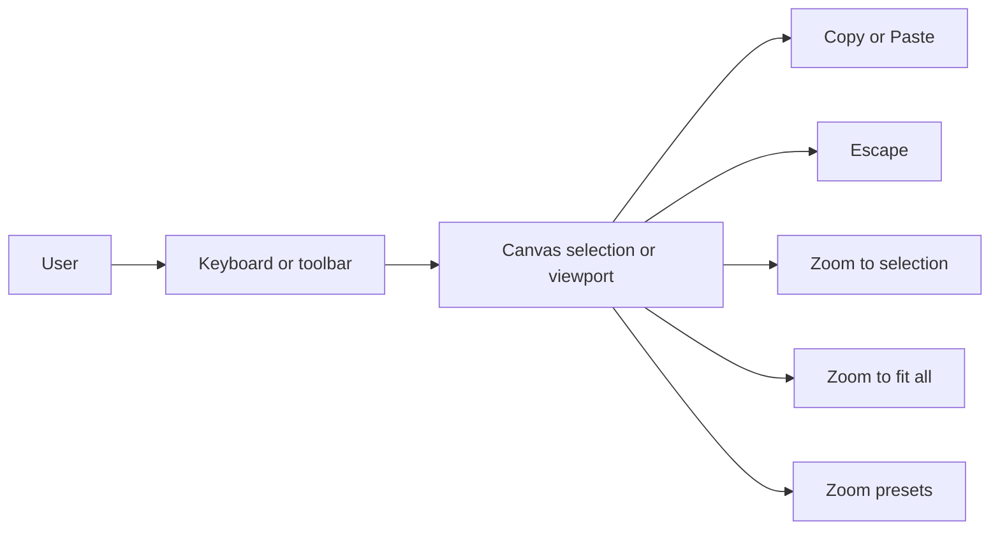

### User stories

| ID | User story | Done |
|----|------------|------|
| US 1.1 | As a user, I want to use keyboard shortcuts (Copy, Paste, Delete, Duplicate, Escape) so that I can work quickly without the toolbar. | [x] |
| US 1.2 | As a user, I want Escape to clear selection and exit text-edit mode so that I am not stuck in edit state. | [x] |
| US 1.3 | As a user, I want to zoom to the current selection so that I can focus on part of a large board. | [x] |
| US 1.4 | As a user, I want to zoom to fit all board content so that I can see the full canvas at once. | [x] |
| US 1.5 | As a user, I want zoom presets (e.g. 50%, 100%, 200%) so that I can jump to a known zoom level. | [x] |

### Feature 1: Keyboard shortcuts

- **Branch:** `feature/keyboard-shortcuts`
- **PR title:** `feat: keyboard shortcuts (Copy, Paste, Delete, Duplicate, Escape)`
- **Module:** canvas / board container

**Edge cases / UX notes**

- Paste when clipboard is empty: no-op or show a short toast; do not create empty objects.
- Duplicate with no selection: no-op or disable shortcut.

**Acceptance criteria**

- [x] Ctrl/Cmd+C copies the current selection to an internal clipboard.
- [x] Ctrl/Cmd+V pastes from clipboard onto the board (with a small offset to avoid overlap).
- [x] Delete or Backspace deletes the selected object(s).
- [x] Ctrl/Cmd+D duplicates the selected object(s).
- [x] Escape clears selection and exits text-edit mode (see feature 2).
- [x] Shortcuts are disabled when focus is in an input or text-edit field.
- [x] A shortcuts reference is documented (e.g. in-app help or README).

**Commits and subtasks**

1. **Commit:** `feat: add keyboard shortcut hook and keydown listener`
   - [x] Add `useKeyboardShortcuts` hook (or equivalent) in canvas/board layer.
   - [x] Attach global keydown listener with `useEffect`; use `metaKey`/`ctrlKey` for cross-platform.
   - [x] Guard: do not fire when focus is in input/textarea (check `document.activeElement`).
2. **Commit:** `feat: wire Copy and Paste to keyboard shortcuts`
   - [x] Wire Ctrl/Cmd+C to existing copy selection to clipboard logic.
   - [x] Wire Ctrl/Cmd+V to paste from clipboard with small offset; reuse existing paste handler.
3. **Commit:** `feat: wire Delete and Duplicate to keyboard shortcuts`
   - [x] Wire Delete/Backspace to existing delete selected objects handler.
   - [x] Wire Ctrl/Cmd+D to existing duplicate selected objects handler.
4. **Commit:** `docs: add keyboard shortcuts reference`
   - [x] Document shortcuts in README or in-app help (e.g. tooltip or menu).

**Test plan**

- [x] Unit or component test: keydown triggers copy/paste/delete/duplicate when selection exists and focus not in input.
- [x] Test that shortcuts are ignored when focus is in an input or text-edit field.
- [x] Run tests; fix until pass.

**Merge**

- [x] Merge `feature/keyboard-shortcuts` into `development`.

---

### Feature 2: Escape to deselect

- **Branch:** `feature/escape-to-deselect`
- **PR title:** `feat: Escape clears selection and exits text-edit mode`
- **Module:** canvas / board container

**Edge cases / UX notes**

- When in text-edit mode, Escape **cancels** the edit (does not commit); blur or Enter commits. Implemented in StickyNote, TextElement, and Frame.

**Acceptance criteria**

- [x] Pressing Escape when one or more objects are selected clears the selection.
- [x] Pressing Escape when editing text inside a sticky or text element commits or cancels the edit and exits text-edit mode, then clears selection if appropriate.
- [x] Escape does not trigger other actions when selection/edit is active (document modal behavior separately if needed).

**Commits and subtasks**

1. **Commit:** `feat: add Escape handler to clear selection`
   - [x] Add Escape keydown handler that calls deselect (clear selection).
   - [x] Ensure handler runs in same layer as keyboard shortcuts (e.g. in `useKeyboardShortcuts` or board container).
2. **Commit:** `feat: Escape exits text-edit mode`
   - [x] When editing text (sticky or text element), Escape calls endTextEdit (commit or cancel per product).
   - [x] After exiting text-edit, clear selection if appropriate.
3. **Commit:** `test: Escape deselect and exit text-edit`
   - [x] Test Escape clears selection when objects selected.
   - [x] Test Escape exits text-edit when editing sticky/text.

**Test plan**

- [x] Run tests; fix until pass.

**Merge**

- [x] Merge `feature/escape-to-deselect` into `development`.

---

### Feature 3: Zoom to selection

- **Branch:** `feature/zoom-to-selection`
- **PR title:** `feat: zoom to selection`
- **Module:** canvas (viewport/zoom)

**Edge cases / UX notes**

- Zoom to selection with a single very small (e.g. one-pixel) object: apply a minimum zoom cap to avoid extreme zoom-in.

**Acceptance criteria**

- [x] When one or more objects are selected, "Zoom to selection" action adjusts viewport so selection bounding box is visible and centered (or nearly so).
- [x] Zoom level set so selection fills a reasonable portion of viewport (e.g. with padding).
- [x] When nothing is selected, action is disabled or does nothing.
- [x] Pan and zoom state updated; viewport is local (other users not affected).

**Commits and subtasks**

1. **Commit:** `feat: compute selection bounding box helper`
   - [x] Add helper to compute bounding box from selected object positions/sizes.
   - [x] Use existing selection state from canvas/board context.
2. **Commit:** `feat: zoom viewport to selection`
   - [x] Add action that sets scale and position so selection box fits in view with padding.
   - [x] Update Konva stage scale and position; use existing viewport/zoom state.
3. **Commit:** `feat: expose Zoom to selection in toolbar or shortcut`
   - [x] Add toolbar button or shortcut for "Zoom to selection"; disable when no selection.
4. **Commit:** `test: zoom to selection`
   - [x] Test that with selection, action fits selection in view; with no selection, disabled or no-op.

**Test plan**

- [x] Run tests; fix until pass.

**Merge**

- [x] Merge `feature/zoom-to-selection` into `development`.

---

### Feature 4: Zoom to fit all

- **Branch:** `feature/zoom-to-fit-all`
- **PR title:** `feat: zoom to fit all board content`
- **Module:** canvas (viewport/zoom)

**Acceptance criteria**

- [x] "Zoom to fit all" (or "Fit board") computes bounding box of all board objects and sets zoom/pan so it fits in viewport with optional padding.
- [x] If board is empty, action does nothing or resets to default zoom (e.g. 100%) and center.
- [x] Works from toolbar or shortcut; viewport is local.

**Commits and subtasks**

1. **Commit:** `feat: compute full board bounding box`
   - [x] Add helper to compute global bounds from all board objects (or cached bounds).
   - [x] Handle empty board (return default or no-op).
2. **Commit:** `feat: zoom viewport to fit all`
   - [x] Add action that sets scale and position so full board fits in view with padding.
   - [x] Reuse same viewport/zoom layer as feature 3.
3. **Commit:** `feat: expose Zoom to fit all in toolbar or shortcut`
   - [x] Add toolbar button or shortcut for "Zoom to fit all" / "Fit board".
4. **Commit:** `test: zoom to fit all`
   - [x] Test fit-all with content and empty board.

**Test plan**

- [x] Run tests; fix until pass.

**Merge**

- [x] Merge `feature/zoom-to-fit-all` into `development`.

---

### Feature 5: Zoom presets

- **Branch:** `feature/zoom-presets`
- **PR title:** `feat: zoom presets (50%, 100%, 200%)`
- **Module:** canvas (viewport/zoom)

**Acceptance criteria**

- [x] At least three preset zoom levels (e.g. 50%, 100%, 200%).
- [x] Presets accessible via toolbar buttons and/or keyboard shortcuts.
- [x] Selecting a preset sets viewport scale to that value; center or anchor product-defined.
- [x] Current zoom level indicated in UI (e.g. percentage label near zoom controls).

**Commits and subtasks**

1. **Commit:** `feat: add zoom preset constants and setScale action`
   - [x] Define preset scale values (e.g. 0.5, 1, 2); add action to set viewport scale to a value.
   - [x] Use existing viewport scale state; map Konva stage scale to percentage.
2. **Commit:** `feat: zoom preset toolbar buttons`
   - [x] Add toolbar buttons for 50%, 100%, 200% (or product-defined presets).
   - [x] Each button sets scale to corresponding value.
3. **Commit:** `feat: show current zoom level in UI`
   - [x] Add percentage label or control near zoom controls showing current zoom.
4. **Commit:** `test: zoom presets`
   - [x] Test selecting each preset updates scale and UI.

**Test plan**

- [x] Run tests; fix until pass.

**Merge**

- [x] Merge `feature/zoom-presets` into `development`.

---

**Epic 1 completion:** [x] Epic 1: Input and navigation UX — Done

---

## Epic 2: Property inspector and styling

**Objective:** Provide a single place to edit object properties (fill, stroke, stroke width, font size, opacity) when one or more objects are selected, meeting expectations from tools like Figma and Miro.

**See also:** [TAILWIND-SHADCN-GUIDE.md](../guides/TAILWIND-SHADCN-GUIDE.md) for UI components and theming; [KONVA-REACT-GUIDE.md](../guides/KONVA-REACT-GUIDE.md) for binding object properties to Konva nodes.

### Success criteria (epic)

- Property inspector updates selected object(s) within 2 seconds of a change and syncs to backend; other clients see updates.
- Multi-selection shows "mixed" for differing values where applicable; applying a value updates all selected objects that support that property.
- Inspector visibility is tied to selection only; no stale or wrong object data when selection changes.

### Out of scope

- Bulk style presets or style libraries in v2.
- Per-object or per-layer lock/visibility toggles in the inspector for v2.

### Risks and dependencies

- Feature 7 (Property inspector) is the host for features 6, 8, 9; build the inspector panel first, then add font size, stroke/fill, and opacity controls.
- Inspector must subscribe to the same selection and update APIs as the canvas to avoid drift.

### Stakeholder value

Designers and facilitators get a single, predictable place to style objects (fill, stroke, font, opacity) without hunting through context menus or AI; aligns with Figma/Miro mental models.

### Data flow (Epic 2)

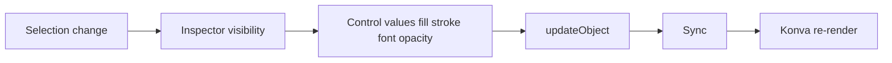

### User stories

| ID | User story | Done |
|----|------------|------|
| US 2.1 | As a user, I want to change font size for selected text and sticky elements so that I can control readability. | [x] |
| US 2.2 | As a user, I want a property inspector when objects are selected so that I can edit fill, stroke, and stroke width in one place. | [x] |
| US 2.3 | As a user, I want to edit stroke color, stroke width, and fill color in the inspector so that I can style shapes and stickies. | [x] |
| US 2.4 | As a user, I want to set opacity for selected objects in the inspector so that I can create layered visuals. | [x] |

### Feature 6: Font size control

- **Branch:** `feature/font-size-control`
- **PR title:** `feat: font size control for sticky notes and text`
- **Module:** ui (toolbar or property inspector)

**Edge cases / UX notes**

- Multi-selection with mixed font sizes: show "mixed" in the control or apply to all; document product choice.

**Acceptance criteria**

- [x] When a sticky note or text object is selected, user can change font size via a control (slider or dropdown) in toolbar or property inspector.
- [x] Chosen size persisted in object's `fontSize` field and synced; other users see updated size.
- [x] Control shows current font size; range or presets product-defined (e.g. 10–24 px or Small/Medium/Large).
- [x] Changing font size applies to selected object(s) that support text; multi-selection can apply same size to all.

**Commits and subtasks**

1. **Commit:** `feat: add font size control component`
   - [x] Create font size control (slider or dropdown) that reads/writes numeric or preset value.
   - [x] Bind to existing `fontSize` on `IBoardObject` via existing update path.
2. **Commit:** `feat: wire font size control to selection`
   - [x] Show control when sticky or text object is selected; hide or disable when not applicable.
   - [x] For multi-selection, apply same size to all or show "mixed" when values differ.
3. **Commit:** `feat: persist and sync fontSize`
   - [x] Ensure update path syncs `fontSize` to backend; Konva text reflects fontSize on render.
4. **Commit:** `test: font size control`
   - [x] Test changing font size updates object and syncs; test multi-selection.

**Test plan**

- [x] Run tests; fix until pass.

**Merge**

- [x] Merge `feature/font-size-control` into `development`.

---

### Feature 7: Property inspector

- **Branch:** `feature/property-inspector`
- **PR title:** `feat: property inspector panel for selected objects`
- **Module:** ui (sidebar/panel); depends on canvas selection and object update API

**Acceptance criteria**

- [x] When at least one object is selected, property inspector panel is visible (e.g. right or left side); when nothing selected, panel hidden or neutral state.
- [x] Inspector shows controls for fill color, stroke color, stroke width; for text/sticky, font size (see feature 6).
- [x] Opacity shown when data model supports it (feature 9).
- [x] Changes in inspector update selected object(s) immediately and sync to backend.
- [x] Multi-selection: controls apply to all where applicable, or show "mixed" when values differ.

**Commits and subtasks**

1. **Commit:** `feat: add PropertyInspector sidebar component`
   - [x] Create sidebar/panel component that subscribes to selection state.
   - [x] Show panel when selection length >= 1; hide or show placeholder when selection empty.
2. **Commit:** `feat: bind inspector visibility to selection`
   - [x] Connect to canvas/board selection context; re-render when selection changes.
   - [x] Position panel (right or left) per layout.
3. **Commit:** `feat: add inspector layout and placeholder controls`
   - [x] Add sections for fill, stroke, stroke width; reserve space for font size and opacity.
   - [x] Wire to existing `updateObject` (or equivalent) with partial updates.
4. **Commit:** `test: property inspector visibility and updates`
   - [x] Test panel shows when object selected, hides when none; test updates sync.

**Test plan**

- [x] Run tests; fix until pass.

**Merge**

- [x] Merge `feature/property-inspector` into `development`.

---

### Feature 8: Stroke and fill in inspector

- **Branch:** `feature/stroke-and-fill-inspector`
- **PR title:** `feat: stroke and fill controls in property inspector`
- **Module:** ui (property inspector)

**Acceptance criteria**

- [x] Fill color control (e.g. color picker) updates `fill` for selected object(s).
- [x] Stroke color control updates `stroke`; stroke width control (number input or slider) updates `strokeWidth`.
- [x] Controls visible for object types that support stroke/fill (shapes, stickies, text as applicable).
- [x] Values persisted and synced; Konva reflects on next render.

**Commits and subtasks**

1. **Commit:** `feat: add fill color picker to inspector`
   - [x] Add color picker control bound to `fill`; call updateObject with partial `{ fill }`.
   - [x] Show for shapes, stickies; hide for types that do not support fill.
2. **Commit:** `feat: add stroke color and stroke width to inspector`
   - [x] Add stroke color picker bound to `stroke`; add stroke width input/slider bound to `strokeWidth`.
   - [x] Visibility by object type; multi-selection apply to all or show mixed.
3. **Commit:** `test: stroke and fill inspector`
   - [x] Test changing fill/stroke/strokeWidth updates object and syncs.

**Test plan**

- [x] Run tests; fix until pass.

**Merge**

- [x] Merge `feature/stroke-and-fill-inspector` into `development`.

---

### Feature 9: Opacity slider

- **Branch:** `feature/opacity-slider`
- **PR title:** `feat: opacity control in property inspector`
- **Module:** ui (property inspector); schema change in types/sync

**Acceptance criteria**

- [x] Each board object has an opacity value (default e.g. 1 or 100%).
- [x] Property inspector shows opacity control (slider or number) when one or more objects selected; changing it updates selected object(s).
- [x] Opacity persisted and synced; all clients render same opacity.
- [x] Opacity applied in canvas (Konva) so object is visually transparent per value.

**Commits and subtasks**

1. **Commit:** `feat: add opacity to IBoardObject and sync`
   - [x] Add optional `opacity?: number` (0–1) to `IBoardObject`; default 1 if undefined for backward compatibility.
   - [x] Include `opacity` in Firestore object documents when present; read in sync layer.
2. **Commit:** `feat: apply opacity in Konva rendering`
   - [x] Apply `opacity` on Konva shape/node for each object type (shape, sticky, text, etc.).
3. **Commit:** `feat: add opacity slider to property inspector`
   - [x] Add opacity slider (0–100% or 0–1) in inspector when object(s) selected.
   - [x] Update selected object(s) via existing update path; persist and sync.
4. **Commit:** `test: opacity slider and sync`
   - [x] Test opacity value persists, syncs, and renders correctly in Konva.

**Test plan**

- [x] Run tests; fix until pass.

**Merge**

- [x] Merge `feature/opacity-slider` into `development`.

---

**Epic 2 completion:** [x] Epic 2: Property inspector and styling — Done

---

## Epic 3: Layout and canvas tools

**Objective:** Enable precise layout via align/distribute toolbar, snap-to-grid, and alignment guides, and allow exporting the board or viewport as an image for sharing.

**See also:** [KONVA-REACT-GUIDE.md](../guides/KONVA-REACT-GUIDE.md) for canvas layers, transforms, and stage export (e.g. `toDataURL`); [TESTING-GUIDE.md](../guides/TESTING-GUIDE.md) for test strategy.

### Success criteria (epic)

- Align and distribute actions update positions and sync to backend; no desync with multi-user edits.
- Snap-to-grid and alignment guides do not block or corrupt sync (final positions are written once).
- Export produces a valid image file (viewport or full board) with no cursors or sensitive UI.

### Out of scope

- Custom grid spacing or grid origin configuration in v2 (fixed spacing e.g. 20 px acceptable).
- Export to PDF or vector format in v2; PNG/JPEG only.

### Risks and dependencies

- Align toolbar reuses existing AI layout tools (`alignObjects`, `distributeObjects`); ensure same logic and sync path.
- Alignment guides need a performance strategy (e.g. limit to visible or nearby objects) when many objects exist.

### Stakeholder value

Facilitators and diagrammers can align and distribute objects without AI, snap to grid for neat layouts, and export boards for sharing or documentation.

### Align and snap flow (Epic 3)

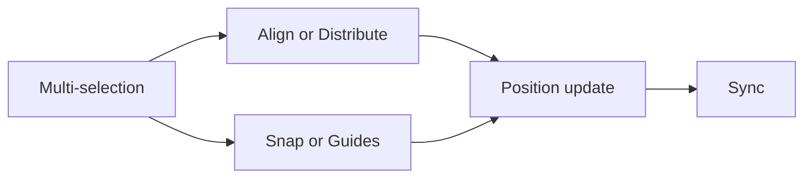

### Export flow (Epic 3)

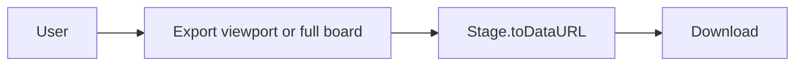

### User stories

| ID | User story | Done |
|----|------------|------|
| US 3.1 | As a user, I want to align and distribute selected objects via toolbar buttons so that I can arrange layout without using AI. | [x] |
| US 3.2 | As a user, I want to enable snap-to-grid when moving and resizing so that objects line up neatly. | [x] |
| US 3.3 | As a user, I want to see alignment guides while dragging so that I can align to other objects. | [x] |
| US 3.4 | As a user, I want to export the board or viewport as an image so that I can share or document the board. | [x] |

### Feature 10: Align toolbar

- **Branch:** `feature/align-toolbar`
- **PR title:** `feat: align and distribute toolbar`
- **Module:** canvas or ui (toolbar); reuses ai layout tools

**Acceptance criteria**

- [x] When two or more objects selected, align/distribute toolbar or button group available (toolbar or context menu).
- [x] Align options: align left, center, right; align top, middle, bottom; each moves selected objects to align on specified edge or center.
- [x] Distribute options: distribute horizontally, distribute vertically; spacing between objects equal along chosen axis.
- [x] Actions update object positions and sync to backend; call same logic as AI tools (`alignObjects`, `distributeObjects` with current selection IDs).

**Commits and subtasks**

1. **Commit:** `feat: add align toolbar button group`
   - [x] Add toolbar or button group with align left, center, right, top, middle, bottom.
   - [x] Show only when two or more objects selected; disable otherwise.
2. **Commit:** `feat: wire align buttons to alignObjects`
   - [x] Call existing `alignObjects` (or internal logic) with selected object IDs and chosen alignment (left/center/right/top/middle/bottom).
   - [x] Ensure positions sync to backend via existing update path.
3. **Commit:** `feat: add distribute buttons and wire to distributeObjects`
   - [x] Add distribute horizontally and distribute vertically buttons.
   - [x] Call existing `distributeObjects` with selected IDs and axis; sync results.
4. **Commit:** `test: align and distribute toolbar`
   - [x] Test each align and distribute option updates positions and syncs.

**Test plan**

- [x] Run tests; fix until pass.

**Merge**

- [x] Merge `feature/align-toolbar` into `development`.

---

### Feature 11: Snap to grid

- **Branch:** `feature/snap-to-grid`
- **PR title:** `feat: snap to grid when moving and resizing`
- **Module:** canvas

**Acceptance criteria**

- [x] User can enable/disable grid overlay on canvas (dot or line grid); grid spacing configurable or fixed (e.g. 20 px).
- [x] When grid snap enabled, moving an object snaps position (e.g. top-left or center) to grid; resizing may snap width/height to grid increments.
- [x] Grid and snap state local (user preference) or per-board; no requirement to sync snap state.
- [x] Snapping does not break multi-user sync (final positions written to backend).

**Commits and subtasks**

1. **Commit:** `feat: add grid overlay layer`
   - [x] Add Konva layer or pattern for grid (dot or line); grid spacing constant (e.g. 20 px).
   - [x] Store grid visibility in local state or user preference; toggle on/off.
2. **Commit:** `feat: snap position to grid on move`
   - [x] When grid snap enabled, during drag round position (e.g. top-left or center) to grid before committing.
   - [x] Apply in same layer that handles transform updates; commit final position to backend.
3. **Commit:** `feat: snap size to grid on resize`
   - [x] When grid snap enabled, round width/height to grid increments on resize where applicable.
4. **Commit:** `test: snap to grid`
   - [x] Test move and resize snap to grid when enabled; final state syncs.

**Test plan**

- [x] Run tests; fix until pass.

**Merge**

- [x] Merge `feature/snap-to-grid` into `development`.

---

### Feature 12: Alignment guides (smart guides)

- **Branch:** `feature/alignment-guides`
- **PR title:** `feat: alignment guides while dragging`
- **Module:** canvas

**Acceptance criteria**

- [x] During drag, system computes alignment of dragged object edges and center with other objects' edges and centers.
- [x] When alignment detected, temporary guide lines drawn (horizontal/vertical dashed lines); dragged object can optionally snap to that alignment.
- [x] Guides disappear when drag ends; not persisted.
- [x] Performance acceptable with many objects (e.g. limit checks to visible or nearby objects if needed).

**Commits and subtasks**

1. **Commit:** `feat: compute alignment with other objects during drag`
   - [x] On drag, compute bounding boxes of dragged object and other objects (visible or nearby).
   - [x] Detect coincident edges and centers within small threshold; return alignment lines (position and orientation).
2. **Commit:** `feat: draw temporary guide lines on canvas`
   - [x] Add temporary Konva layer for guides; draw horizontal/vertical dashed lines when alignment detected.
   - [x] Remove guides when drag ends.
3. **Commit:** `feat: optional snap to alignment`
   - [x] When alignment detected, optionally adjust drag position to snap to guide (product-defined).
4. **Commit:** `test: alignment guides`
   - [x] Test guides appear during drag when aligned; disappear on drop; performance with many objects.

**Test plan**

- [x] Run tests; fix until pass.

**Merge**

- [x] Merge `feature/alignment-guides` into `development`.

---

### Feature 14: Export as image

- **Branch:** `feature/export-as-image`
- **PR title:** `feat: export board or viewport as image`
- **Module:** canvas (Konva stage)

**Acceptance criteria**

- [x] User can trigger "Export as image" from menu or toolbar (e.g. File or board actions).
- [x] Option to export current viewport or full board (entire content); product may choose one or both.
- [x] Output format PNG or JPEG; file downloaded with sensible name (e.g. board name + timestamp).
- [x] Export includes visible board content (objects, connectors) at reasonable resolution; no sensitive UI (e.g. cursors).

**Commits and subtasks**

1. **Commit:** `feat: export current viewport to data URL`
   - [x] Use Konva `stage.toDataURL()` for current viewport area; trigger download via blob URL.
   - [x] Filename: board name + timestamp; format PNG or JPEG.
2. **Commit:** `feat: export full board option`
   - [x] Compute bounding box of all objects; export that region via stage export API (expand export area).
   - [x] Optionally scale for resolution (e.g. pixel ratio 2 for retina).
3. **Commit:** `feat: add Export menu or toolbar action`
   - [x] Add "Export as image" to File menu or board actions; offer viewport vs full board if both supported.
4. **Commit:** `test: export as image`
   - [x] Test viewport and full board export produce valid image file download.

**Test plan**

- [x] Run tests; fix until pass.

**Merge**

- [x] Merge `feature/export-as-image` into `development`.

---

**Epic 3 completion:** [x] Epic 3: Layout and canvas tools — Done

---

## Epic 4: Board discovery and preferences

**Objective:** Help users find and return to boards quickly by adding Recent and Favorites to the board list (or dashboard).

**See also:** [FIREBASE-GUIDE.md](../guides/FIREBASE-GUIDE.md) for Firestore schema and security rules; user preferences live in `users/{uid}/preferences`.

### Success criteria (epic)

- Opening a board updates Recent within one session; Recent section shows last 5–10 boards in last-opened order.
- Star/unstar updates Favorites immediately and persists per user; Favorites section reflects current user's list.
- Board list sections (All, Recent, Favorites) navigate to the same board correctly from any section.

### Out of scope

- Shared or team-wide favorites in v2; favorites are per user only.
- Board sorting or filtering by name/date in the list beyond the three sections.

### Risks and dependencies

- User preferences (Firestore `users/{uid}/preferences`) must be created and secured; extend sync or auth layer.
- Board list UI must load metadata for recent/favorite board IDs (names, etc.) for display.

### Stakeholder value

Users who work across many boards can quickly return to recent work and pin important boards without scrolling the full list.

### Preferences flow (Epic 4)

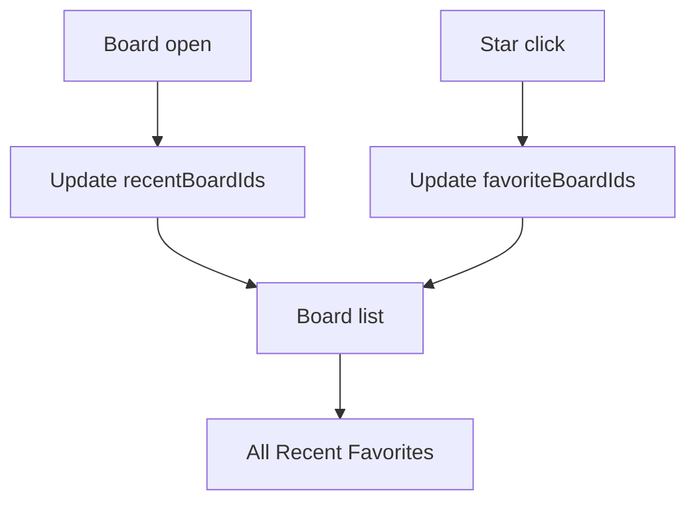

### User stories

| ID | User story | Done |
|----|------------|------|
| US 4.1 | As a user, I want to see recently opened boards so that I can return to recent work quickly. | [x] |
| US 4.2 | As a user, I want to star boards as favorites and see them in a Favorites section so that I can access important boards easily. | [x] |
| US 4.3 | As a user, I want the board list to show All boards, Recent, and Favorites so that I can navigate boards by context. | [x] |

### Feature 13: Board dashboard (Recent + Favorites)

- **Branch:** `feature/board-dashboard`
- **PR title:** `feat: board dashboard with Recent and Favorites`
- **Module:** sync (user preferences); ui (board list)

**Acceptance criteria**

- [x] Recent: section shows recently opened boards (e.g. last 5–10), ordered by last opened time; opening a board updates "last opened" for current user.
- [x] Favorites: users can star/unstar a board; favorited boards appear in "Favorites" section (or pinned at top); star state per user and persisted.
- [x] Board list or dashboard shows at least "All boards", "Recent", and "Favorites" sections; navigation to board works from any section.
- [x] Data stored in user preferences (e.g. Firestore `users/{uid}/preferences`); no change to board document schema.

**Commits and subtasks**

1. **Commit:** `feat: user preferences schema and service`
   - [x] Define Firestore structure e.g. `users/{uid}/preferences` with `recentBoardIds: string[]` and `favoriteBoardIds: string[]`.
   - [x] Add service or sync layer to read/write preferences; update recent on board open (append and trim to max e.g. 10).
2. **Commit:** `feat: update recent boards on board open`
   - [x] When user opens a board, append board id to recent and trim to last 5–10; persist to user preferences.
3. **Commit:** `feat: star/unstar board and favorites list`
   - [x] Add star toggle (per board) that updates `favoriteBoardIds` in user preferences.
   - [x] Load favorites for current user; display in Favorites section.
4. **Commit:** `feat: board list sections All, Recent, Favorites`
   - [x] Extend existing board list UI with sections: All boards (or equivalent), Recent, Favorites.
   - [x] Recent shows boards from `recentBoardIds` in last-opened order; Favorites from `favoriteBoardIds`; navigation from any section.
5. **Commit:** `test: board dashboard and preferences`
   - [x] Test opening board updates recent; star/unstar updates favorites; sections display and navigate correctly.

**Test plan**

- [x] Run tests; fix until pass.

**Merge**

- [x] Merge `feature/board-dashboard` into `development`.

---

**Epic 4 completion:** [x] Epic 4: Board discovery and preferences — Done

---

## Epic 5: Connectors and diagramming

**Objective:** Improve diagram clarity by supporting connector arrowheads and dashed (or dotted) stroke style, persisted and synced like other object properties.

**See also:** [KONVA-REACT-GUIDE.md](../guides/KONVA-REACT-GUIDE.md) for Konva Line/Arrow and `dash`/pointer options in the Connector component.

### Success criteria (epic)

- Arrowhead and stroke style options persist and sync; all clients render the same connector appearance.
- Property inspector shows connector-specific controls when a connector is selected; changes apply immediately.

### Out of scope

- Custom arrowhead shapes or curved connector paths in v2.
- Connector routing (e.g. orthogonal or avoid obstacles) in v2.

### Risks and dependencies

- Features 15 and 16 both extend the connector object type and the Connector component; can be implemented together or in sequence; ensure schema is backward-compatible (optional fields).

### Stakeholder value

Diagrammers and facilitators can indicate direction with arrowheads and distinguish connector types with dashed/dotted lines, improving readability of flowcharts and diagrams.

### Connector styling flow (Epic 5)

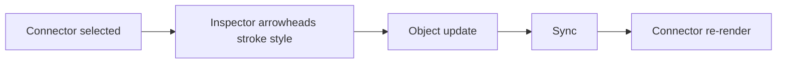

### User stories

| ID | User story | Done |
|----|------------|------|
| US 5.1 | As a user, I want connectors to show arrowheads (none, start, end, or both) so that I can indicate direction in diagrams. | [ ] |
| US 5.2 | As a user, I want to set connector stroke style (e.g. solid, dashed, dotted) so that I can distinguish diagram elements. | [ ] |

### Feature 15: Connector arrowheads

- **Branch:** `feature/connector-arrowheads`
- **PR title:** `feat: connector arrowheads (none, start, end, both)`
- **Module:** canvas (Connector component); types/sync

**Acceptance criteria**

- [ ] Connectors support arrowhead style: none, end only, start only, or both; default "end" or "none" per product.
- [ ] Style persisted in connector object and synced; all clients render the same.
- [ ] Arrowheads render correctly at connector endpoints; arrow size/style consistent and readable.

**Commits and subtasks**

1. **Commit:** `feat: add arrowheads field to connector type and schema`
   - [ ] Add optional `arrowheads?: 'none' | 'start' | 'end' | 'both'` to connector object type.
   - [ ] Include in Firestore connector documents; read in sync.
2. **Commit:** `feat: render arrowheads in Connector component`
   - [ ] In Connector (Konva), use Line/Arrow or pointerLength/pointerWidth per `arrowheads` value.
   - [ ] Render at start and/or end as specified; default when undefined.
3. **Commit:** `feat: arrowheads control in property inspector`
   - [ ] When connector selected, show arrowheads control (dropdown or buttons) in property inspector; update and sync.
4. **Commit:** `test: connector arrowheads`
   - [ ] Test each arrowhead option persists, syncs, and renders correctly.

**Test plan**

- [ ] Run tests; fix until pass.

**Merge**

- [ ] Merge `feature/connector-arrowheads` into `development`.

---

### Feature 16: Connector stroke style (dashed)

- **Branch:** `feature/connector-stroke-style`
- **PR title:** `feat: connector stroke style (solid, dashed, dotted)`
- **Module:** canvas (Connector component); types/sync

**Acceptance criteria**

- [ ] Connectors support stroke dash option (e.g. solid, dashed, dotted); value persisted and synced.
- [ ] Dashed/dotted connectors render correctly in canvas; dash pattern visible and consistent across clients.
- [ ] UI to set style (e.g. property inspector when connector selected, or connector creation options).

**Commits and subtasks**

1. **Commit:** `feat: add strokeDash/strokeStyle to connector type and schema`
   - [ ] Add optional field e.g. `strokeDash?: number[]` (Konva-style) or `strokeStyle?: 'solid' | 'dashed' | 'dotted'`.
   - [ ] Persist in Firestore for connector objects; read in sync.
2. **Commit:** `feat: apply stroke dash in Connector component`
   - [ ] Konva Line supports `dash` array; map strokeStyle or strokeDash to Konva dash; apply in Connector component.
3. **Commit:** `feat: stroke style control in property inspector`
   - [ ] When connector selected, add stroke style control (dropdown or buttons) in inspector; update and sync.
4. **Commit:** `test: connector stroke style`
   - [ ] Test solid, dashed, dotted persist, sync, and render correctly.

**Test plan**

- [ ] Run tests; fix until pass.

**Merge**

- [ ] Merge `feature/connector-stroke-style` into `development`.

---

**Epic 5 completion:** [ ] Epic 5: Connectors and diagramming — Done

---

## Epic 6: Collaboration and comments

**Objective:** Enable threaded comments on board objects so that collaborators can discuss specific content in context, with real-time sync and clear indicators.

**See also:** [FIREBASE-GUIDE.md](../guides/FIREBASE-GUIDE.md) for Firestore collections, security rules, and real-time listeners; align comment structure and RBAC with existing board access.

### Success criteria (epic)

- Adding a comment or reply persists and appears for other users in real time (within normal sync latency).
- Comment indicator on objects reflects presence of comments; clicking opens the thread for that object.
- Only authenticated users with board access can read and write comments; RBAC enforced.

### Out of scope

- Per-comment or per-thread resolution status in v2 (e.g. "resolved").
- @mentions or rich text in comments in v2; plain text only.

### Risks and dependencies

- Comments collection and security rules must align with existing board access; reuse auth/sync patterns.
- Real-time listeners on comments can increase read load; scope subscriptions to current board or visible threads if needed.

### Stakeholder value

Collaborators can discuss specific objects in context without leaving the board; threaded replies keep discussions organized and discoverable via object indicators.

### Comments sequence (Epic 6)

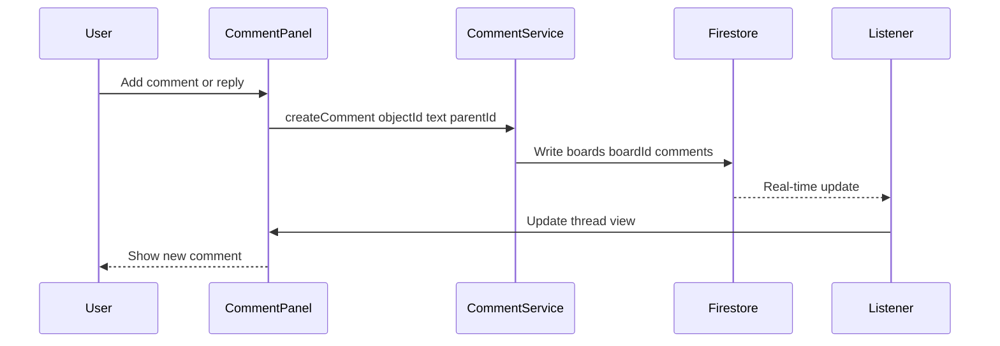

### User stories

| ID | User story | Done |
|----|------------|------|
| US 6.1 | As a user, I want to add comments to a board object so that I can discuss specific content with collaborators. | [ ] |
| US 6.2 | As a user, I want to see comment threads in a sidebar or popover and add replies so that I can have threaded discussions. | [ ] |
| US 6.3 | As a user, I want to see an indicator on objects that have comments so that I can find and open discussions quickly. | [ ] |

### Feature 17: Comments on objects

- **Branch:** `feature/comments-on-objects`
- **PR title:** `feat: comments on board objects with real-time sync`
- **Module:** sync (comments collection); ui (comment panel, indicator); auth (permissions)

**Acceptance criteria**

- [ ] User can add a comment to a board object (e.g. right-click or comment button when object selected); thread created for that object.
- [ ] Comments displayed in sidebar or popover; thread identified by object id; new replies can be added and sync in real time.
- [ ] Indicator on or near object (e.g. icon or count) shows that comments exist; clicking opens thread.
- [ ] Comments stored in structure that associates them with object (e.g. subcollection or collection with `objectId`); real-time listeners keep UI in sync.
- [ ] Only authenticated users with board access can read/write comments (align with existing RBAC).

**Commits and subtasks**

1. **Commit:** `feat: comments schema and Firestore structure`
   - [ ] Define collection/subcollection e.g. `boards/{boardId}/comments` with `objectId`, `authorId`, `text`, `createdAt`, optional `parentId` for replies.
   - [ ] Security rules: read/write only for authenticated users with board access.
2. **Commit:** `feat: comment service and real-time listeners`
   - [ ] Add service to create comment, add reply; subscribe to comments for board or per-object; real-time updates.
3. **Commit:** `feat: comment panel UI and thread view`
   - [ ] Add sidebar or popover component for comment thread; list comments for selected object; form to add comment/reply.
   - [ ] Wire to comment service; show thread identified by object id.
4. **Commit:** `feat: add comment action and object comment indicator`
   - [ ] Add "Add comment" (e.g. right-click or comment button when object selected); create thread and open panel.
   - [ ] Render indicator (icon or count) on or near objects that have comments; click opens thread.
5. **Commit:** `test: comments on objects`
   - [ ] Test add comment, add reply, real-time sync, indicator, permissions.

**Test plan**

- [ ] Run tests; fix until pass.

**Merge**

- [ ] Merge `feature/comments-on-objects` into `development`.

---

**Epic 6 completion:** [ ] Epic 6: Collaboration and comments — Done

---

## Epic 7: AI board intelligence

**Objective:** Add two AI commands that use existing tools and the LLM: "Explain this board" (board-level summary) and "Summarize selection" (selection-based summary), both shown in the AI chat.

**See also:** [AI-INTEGRATION-GUIDE.md](../guides/AI-INTEGRATION-GUIDE.md) for tool schema, getBoardState, and chat flow; [AI-DEVELOPMENT-LOG.md](../planning/AI-DEVELOPMENT-LOG.md) for effective prompts and MCP usage.

### Success criteria (epic)

- "Explain this board" returns a concise summary reflecting current board content (object types, counts, text if included).
- "Summarize selection" returns a summary of selected objects' content only; when nothing selected, command is disabled or user is prompted.
- Both responses appear in the existing AI chat UI; no new tools or parameters required beyond getBoardState and selection.

### Out of scope

- AI-driven layout or auto-arrange in v2 for this epic; only read-only summary commands.
- Custom prompts or model selection for these two commands in v2.

### Risks and dependencies

- Depends on existing `getBoardState` (and optionally `findObjects`); ensure board and selection state are available to AI layer.
- Token usage for large boards; consider truncating or sampling content if needed for prompt size.

### Stakeholder value

Users can quickly understand board content or selected content via natural-language summaries without manually reading every sticky or shape; supports onboarding and handoffs.

### AI command flow (Epic 7)

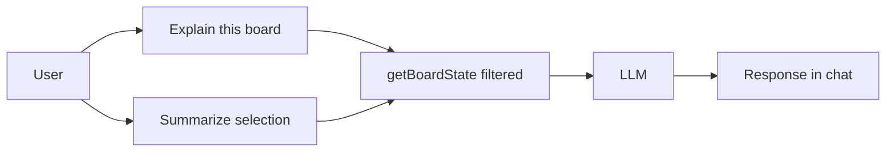

### User stories

| ID | User story | Done |
|----|------------|------|
| US 7.1 | As a user, I want an AI command to explain the board so that I can get a short summary of the board content. | [ ] |
| US 7.2 | As a user, I want an AI command to summarize the current selection so that I can get a concise summary of selected text and stickies. | [ ] |

### Feature 18: AI "Explain this board"

- **Branch:** `feature/ai-explain-board`
- **PR title:** `feat: AI command Explain this board`
- **Module:** ai

**Acceptance criteria**

- [ ] User can invoke "Explain this board" (e.g. via AI chat prompt or dedicated button).
- [ ] System retrieves board state (and optionally object details) via existing `getBoardState`; result passed to LLM with prompt asking for concise summary.
- [ ] LLM response displayed in AI chat; no new AI tools or parameters required.
- [ ] Summary reflects current board content (object types, counts, text snippets if included) in readable form.

**Commits and subtasks**

1. **Commit:** `feat: Explain this board command handler`
   - [ ] Add handler or prompt path for "Explain this board"; call `getBoardState` (and optionally `findObjects`).
   - [ ] Include board state in user or system message; prompt model for concise summary.
2. **Commit:** `feat: expose Explain this board in AI chat`
   - [ ] Add dedicated button or suggested prompt in AI chat to invoke "Explain this board".
   - [ ] Stream or return response in existing chat UI.
3. **Commit:** `test: Explain this board`
   - [ ] Test command returns summary reflecting board content; response shown in chat.

**Test plan**

- [ ] Run tests; fix until pass.

**Merge**

- [ ] Merge `feature/ai-explain-board` into `development`.

---

### Feature 19: AI "Summarize selection"

- **Branch:** `feature/ai-summarize-selection`
- **PR title:** `feat: AI command Summarize selection`
- **Module:** ai

**Acceptance criteria**

- [ ] User can invoke "Summarize selection" (e.g. from AI chat or context menu) when at least one object selected.
- [ ] System collects selected objects (IDs and content, e.g. text) and sends to LLM with prompt for short summary.
- [ ] Summary shown in AI chat; reflects only selected objects' content.
- [ ] When nothing selected, command disabled or UI prompts user to select something.

**Commits and subtasks**

1. **Commit:** `feat: Summarize selection command handler`
   - [ ] Add handler that reads selection state; get selected object IDs and their content (e.g. text) via `getBoardState` filtered by IDs or local state.
   - [ ] Pass to LLM with prompt for short summary; stream or return as in existing chat.
2. **Commit:** `feat: expose Summarize selection in AI chat`
   - [ ] Add button or prompt in AI chat for "Summarize selection"; disable or prompt when no selection.
   - [ ] Show summary in chat.
3. **Commit:** `test: Summarize selection`
   - [ ] Test with selection returns summary of selected content; test disabled or prompt when no selection.

**Test plan**

- [ ] Run tests; fix until pass.

**Merge**

- [ ] Merge `feature/ai-summarize-selection` into `development`.

---

**Epic 7 completion:** [ ] Epic 7: AI board intelligence — Done

---

## Epic 8: History and consistency

**Objective:** Provide global undo and redo for object operations (create, delete, move, resize, property changes) so users can correct mistakes and experiment safely, with a defined sync strategy.

**See also:** [TESTING-GUIDE.md](../guides/TESTING-GUIDE.md) for test strategy; ensure all mutation paths are covered by tests after history is wired.

### Success criteria (epic)

- Undo reverts the last local operation; redo reapplies the last undone operation; board state and backend stay consistent after undo/redo.
- All mutation types (create, delete, move, resize, property change) are recorded and undoable; history is bounded (e.g. 50 operations).
- Shortcuts Ctrl/Cmd+Z and Ctrl/Cmd+Shift+Z (or Ctrl/Cmd+Y) work when focus is not in an input field.

### Out of scope

- Cross-user undo (undoing another user's change) in v2; undo is local to the current user's operations.
- Undo/redo for comments or connector endpoint moves in v2 unless explicitly scoped in; document separately if added later.

### Risks and dependencies

- Feature 20 depends on all object mutation paths (create, delete, move, resize, property); build last so every path can push commands.
- Sync after undo/redo must use the same update/delete/create APIs so other users eventually see the reverted state (last-write-wins with inverse).

### Stakeholder value

Users can correct mistakes and experiment without fear; undo/redo is expected in creative tools and reduces friction.

### Command stack (Epic 8)

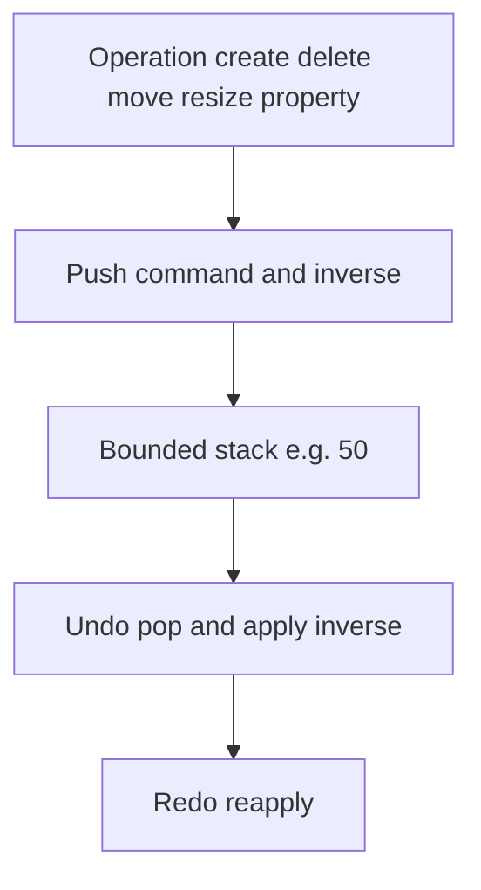

### User stories

| ID | User story | Done |
|----|------------|------|
| US 8.1 | As a user, I want to undo and redo object operations so that I can correct mistakes and experiment safely. | [ ] |
| US 8.2 | As a user, I want undo and redo to work for create, delete, move, resize, and property changes so that my workflow is consistent. | [ ] |

### Feature 20: Undo / redo

- **Branch:** `feature/undo-redo`
- **PR title:** `feat: global undo and redo for object operations`
- **Module:** new history service or command stack; consumed by canvas/sync

**Acceptance criteria**

- [ ] Undo reverts the last local operation(s) that affected board objects; Redo reapplies the most recently undone operation.
- [ ] Operations undoable: create object, delete object, move object, resize object, change properties (fill, stroke, opacity, text); connector endpoints and comments scoped separately if needed.
- [ ] Shortcuts: Ctrl/Cmd+Z undo, Ctrl/Cmd+Shift+Z or Ctrl/Cmd+Y redo; optional toolbar buttons.
- [ ] After undo/redo, board state consistent and synced to backend; other users eventually see same state (e.g. last-write-wins with inverse update).
- [ ] History bounded (e.g. last 50 operations) to avoid unbounded memory.

**Commits and subtasks**

1. **Commit:** `feat: history service and command pattern`
   - [ ] Add history service or command stack (operation type + params + inverse); push on create, delete, move, resize, property change.
   - [ ] Bounded stack (e.g. last 50); undo pops and applies inverse; redo stack for reapplying.
2. **Commit:** `feat: record create and delete in history`
   - [ ] On create object, push command with inverse (delete with id); on delete, push command with inverse (recreate object).
   - [ ] Undo/redo apply inverse via existing updateObject/delete/create APIs and sync.
3. **Commit:** `feat: record move and resize in history`
   - [ ] On move/resize end, push command with previous and new position/size; inverse restores previous.
   - [ ] Undo/redo apply via updateObject and sync.
4. **Commit:** `feat: record property changes in history`
   - [ ] On property change (fill, stroke, opacity, text, etc.), push command with previous and new values; inverse restores previous.
   - [ ] Undo/redo apply via updateObject and sync.
5. **Commit:** `feat: undo/redo shortcuts and toolbar`
   - [ ] Wire Ctrl/Cmd+Z to undo and Ctrl/Cmd+Shift+Z (or Ctrl/Cmd+Y) to redo; optional toolbar buttons.
   - [ ] Integrate with same keydown layer as other shortcuts; respect focus in input.
6. **Commit:** `test: undo and redo`
   - [ ] Test undo/redo for create, delete, move, resize, property change; test history bound; test sync after undo/redo.

**Test plan**

- [ ] Run tests; fix until pass.

**Merge**

- [ ] Merge `feature/undo-redo` into `development`.

---

**Epic 8 completion:** [ ] Epic 8: History and consistency — Done

---

## Cross-cutting behaviors

### Selection and edit state

Selection and text-edit state affect keyboard shortcuts (Escape, Copy/Paste), property inspector visibility, and zoom-to-selection. The following state diagram summarizes the flow:

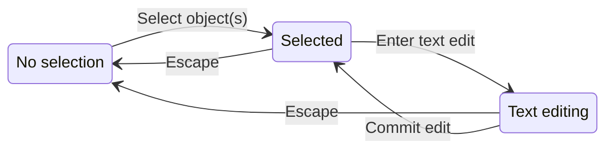

---

## Dependency and build order

Key dependencies between features (build in order where one feature depends on another):

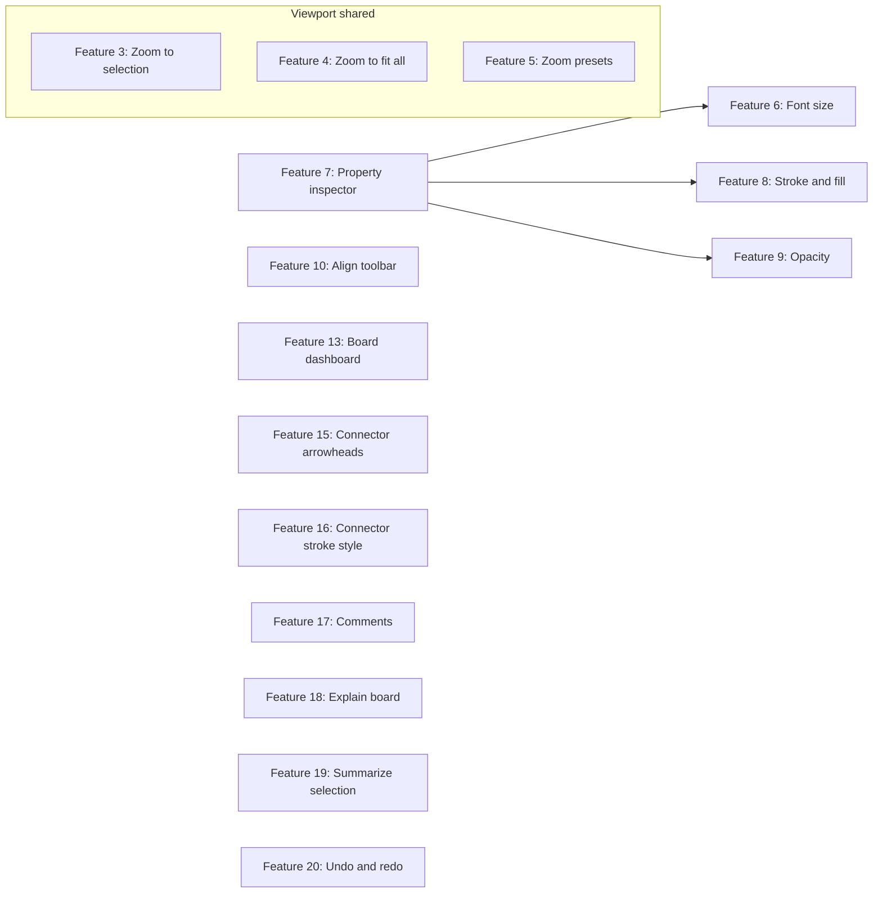

- **Features 3, 4, 5** share the same viewport/zoom state; can be built in any order after viewport layer is in place.
- **Feature 7 (Property inspector)** is the natural home for features **6, 8, 9**; build inspector first, then add font size, stroke/fill, and opacity controls (or in parallel once panel exists).
- **Feature 10 (Align toolbar)** reuses existing AI layout tools (`alignObjects`, `distributeObjects`); no dependency on other v2 features.
- **Feature 13** extends board list and user preferences (sync + auth).
- **Features 15 and 16** both extend the connector model; can be implemented together or in sequence.
- **Feature 20 (Undo/redo)** depends on all object mutation paths; build last.

---

## Deferred (out of scope for v2)

The following are **not** in the Top 20 for v2 but were in the full brainstorm (Section A of [INITIAL-RESEARCH.md](./INITIAL-RESEARCH.md)). They are deferred to a later phase or backlog. This PRD does not define EPICs or user stories for these items.

- **Font family picker** (3), **Tool panel** (6), **Connector waypoints** (9), **Shape stroke dash** (10), **Richer text styling** (11), **Snap to objects** (14), **Board search** (22), **Board thumbnails** (23), **Comments on board** (25), **Export as PDF** (27), **Copy selection as image** (28), **Paste in place** (30), **Group/ungroup** (31), **Lock object** (32), **Bring forward/send backward** (33), **Distribute spacing** (35) as a separate control, **AI: Suggest layout** (37), **AI: Generate from prompt** (38), **AI: Change style** (40), **AI: Create template** (41), **AI: connector from description** (42), **AI: bulk edit** (43), **Contextual AI suggestions** (44), **Minimap** (45), **Ruler/coordinate display** (46), **Grid overlay toggle** (47), **Frame collapse/expand** (48), **Sticky note size presets** (49).

Undo/redo (20) is **in** scope but last due to complexity; items such as **Export as PDF**, **Group/ungroup**, and **Paste in place** are high value but explicitly deferred to keep v2 scope focused.

---

## Summary and checklist

### Epic completion

- [x] **Epic 1:** Input and navigation UX — Done
- [x] **Epic 2:** Property inspector and styling — Done
- [x] **Epic 3:** Layout and canvas tools — Done
- [x] **Epic 4:** Board discovery and preferences — Done
- [ ] **Epic 5:** Connectors and diagramming — Done
- [ ] **Epic 6:** Collaboration and comments — Done
- [ ] **Epic 7:** AI board intelligence — Done
- [ ] **Epic 8:** History and consistency — Done

### Feature completion

- [x] Feature 1: Keyboard shortcuts
- [x] Feature 2: Escape to deselect
- [x] Feature 3: Zoom to selection
- [x] Feature 4: Zoom to fit all
- [x] Feature 5: Zoom presets
- [x] Feature 6: Font size control
- [x] Feature 7: Property inspector
- [x] Feature 8: Stroke and fill in inspector
- [x] Feature 9: Opacity slider
- [x] Feature 10: Align toolbar
- [x] Feature 11: Snap to grid
- [x] Feature 12: Alignment guides
- [x] Feature 13: Board dashboard (Recent + Favorites)
- [x] Feature 14: Export as image
- [ ] Feature 15: Connector arrowheads
- [ ] Feature 16: Connector stroke style
- [ ] Feature 17: Comments on objects
- [ ] Feature 18: AI "Explain this board"
- [ ] Feature 19: AI "Summarize selection"
- [ ] Feature 20: Undo / redo

### Quality gates (reference)

- Tests pass before merging each feature branch into `development`.
- **Never merge to `main`;** merge only to `development`.
- Preserve SOLID and modular design: one concern per feature branch/module; extend via new components/hooks; depend on abstractions.

---

## LBI alignment

This PRD is the **planning artifact** that feeds the LBI (Lets-Build-It) Spec-Driven Development workflow. When starting implementation for a feature:

- Use **`/lbi.request`** (or lite **`/lbi.lite.request`**) with this PRD as context. One request per feature is typical.
- Optionally run **`/lbi.pm.prd`** or **`/lbi.pm.stories`** to align LBI artifacts with this PRD.

Do not jump to implementation without a plan; follow the command chain (e.g. specify → clarify → plan → tasks → analyze → implement → tests → review → push) as defined in the LBI workflow.

---

## References (full list)

- [PRD](../product/PRD.md) — Existing scope, tech stack, SOLID, project structure, appendices
- [DESIGN-DOCUMENT.md](./DESIGN-DOCUMENT.md) — EPICs, user stories, design principles
- [FEATURES.md](./FEATURES.md) — Feature elaboration, deferred list
- [INITIAL-RESEARCH.md](./INITIAL-RESEARCH.md) — Build order and rationale
- [PRD-V2.md](./PRD-V2.md) — Expanded execution spec (source for this document)
- [AI-DEVELOPMENT-LOG.md](../planning/AI-DEVELOPMENT-LOG.md) — Tools, MCP, prompts, learnings
- [DEPLOYMENT.md](../operations/DEPLOYMENT.md) — Render, environment variables
- [docs/guides/README.md](../guides/README.md) — Technology guides index
- [FIREBASE-GUIDE.md](../guides/FIREBASE-GUIDE.md) — Auth, Firestore, Realtime DB, security
- [KONVA-REACT-GUIDE.md](../guides/KONVA-REACT-GUIDE.md) — Canvas, shapes, viewport, export
- [TAILWIND-SHADCN-GUIDE.md](../guides/TAILWIND-SHADCN-GUIDE.md) — UI, theming, dark mode
- [AI-INTEGRATION-GUIDE.md](../guides/AI-INTEGRATION-GUIDE.md) — AI commands, tools, chat
- [TESTING-GUIDE.md](../guides/TESTING-GUIDE.md) — Vitest, Playwright, coverage
- [DEVELOPMENT-ENVIRONMENT-GUIDE.md](../guides/DEVELOPMENT-ENVIRONMENT-GUIDE.md) — Vite, Bun, TypeScript, ESLint

---

## Appendix A: Schema changes (v2)

| Area | Change | Notes |
|------|--------|--------|
| **IBoardObject** | Optional `opacity?: number` (0–1) | Default 1 if undefined; backward-compatible. |
| **Connector object** | Optional `arrowheads?: 'none' \| 'start' \| 'end' \| 'both'` | Persist in Firestore; render in Connector component. |
| **Connector object** | Optional `strokeDash?: number[]` or `strokeStyle?: 'solid' \| 'dashed' \| 'dotted'` | Konva `dash` array; persist in Firestore. |
| **User preferences** | `users/{uid}/preferences` with `recentBoardIds: string[]`, `favoriteBoardIds: string[]` | Firestore; secure per user. |
| **Comments** | e.g. `boards/{boardId}/comments` with `objectId`, `authorId`, `text`, `createdAt`, optional `parentId` | Or subcollection; real-time listeners; RBAC. |

---

## Appendix B: Deployment and environment

v2 does not introduce new deployment targets. Continue using Render per [DEPLOYMENT.md](../operations/DEPLOYMENT.md). Environment variables remain as in the main PRD; if v2 adds server-side or client-side env vars, document them in [DEPLOYMENT.md](../operations/DEPLOYMENT.md) and in `.env.example`.

---

_Document version: 1.0 (Final PRD v2)_  
_Last updated: February 2026_
